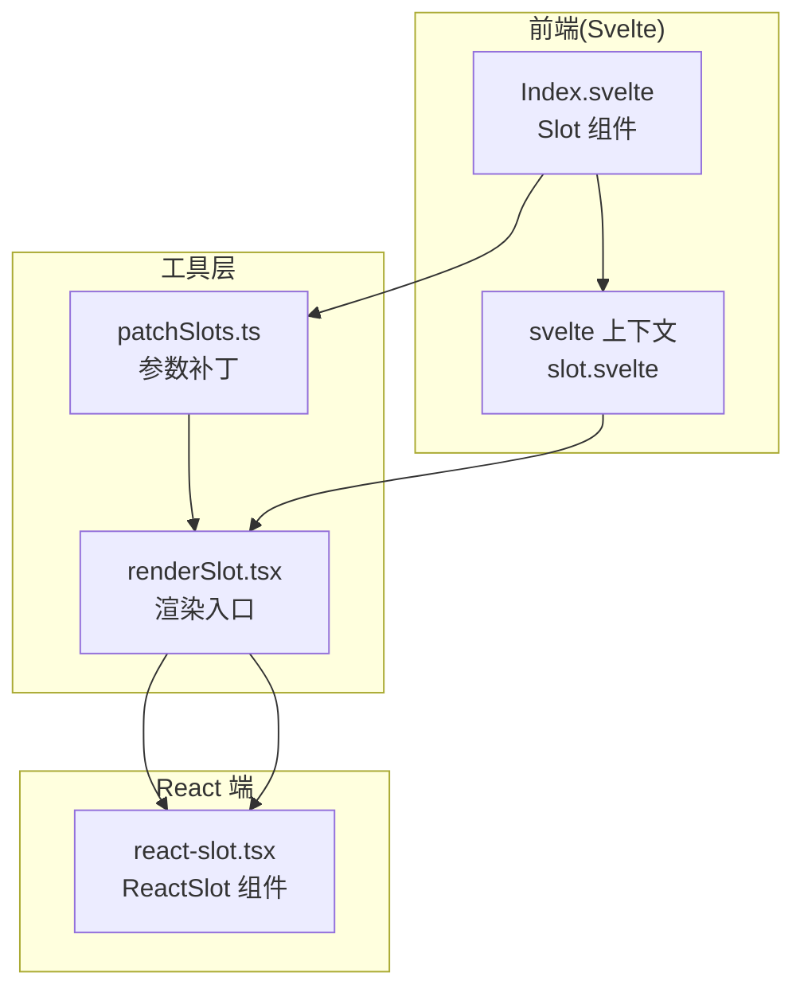
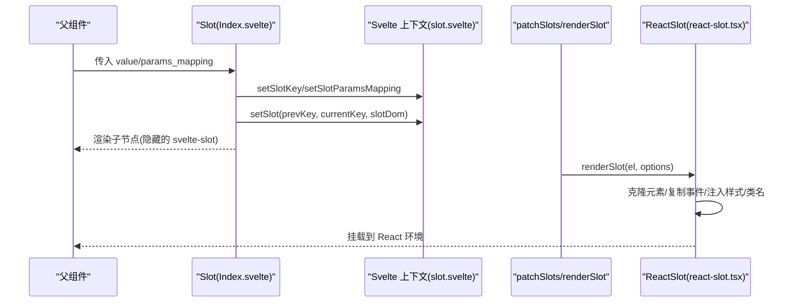
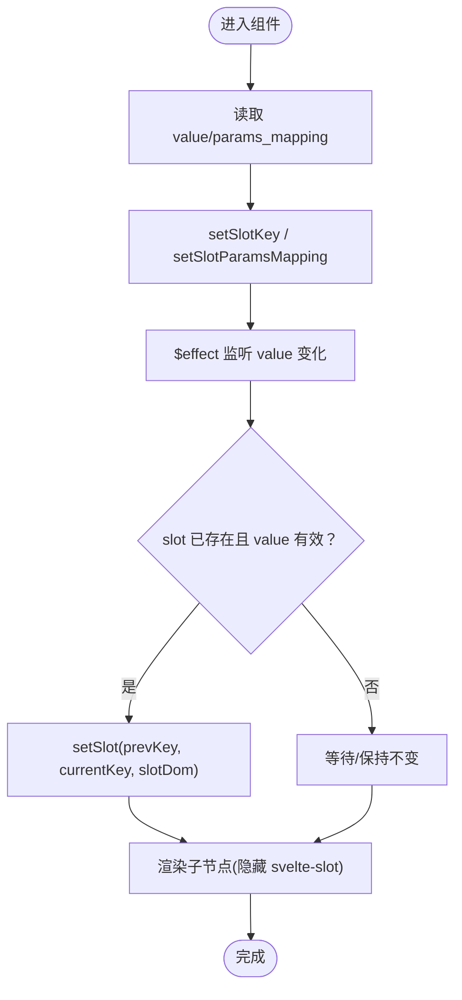
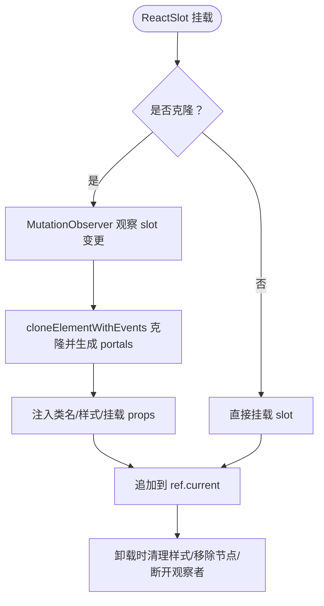
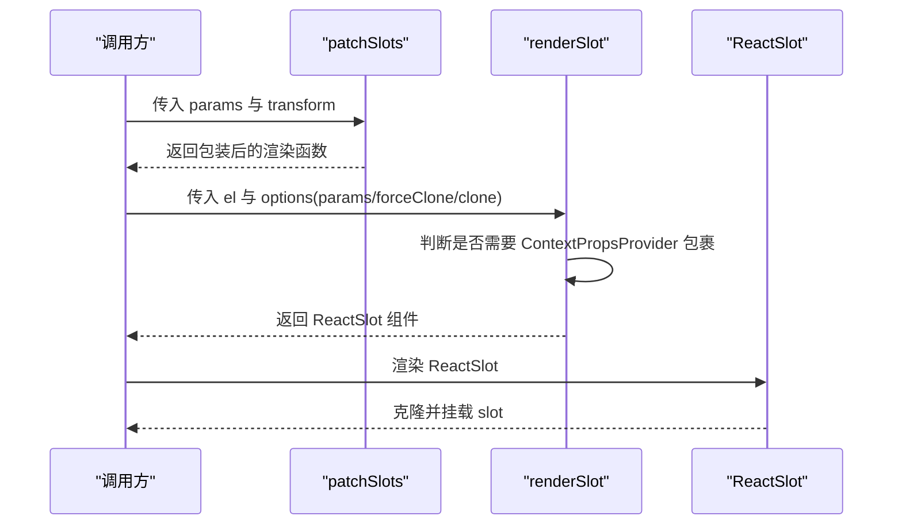
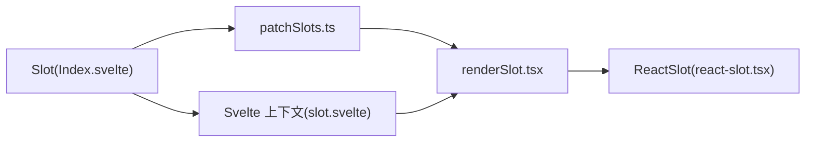

# Slot 组件

<cite>
**本文引用的文件**
- [frontend/base/slot/Index.svelte](file://frontend/base/slot/Index.svelte)
- [frontend/svelte-preprocess-react/react-slot.tsx](file://frontend/svelte-preprocess-react/react-slot.tsx)
- [frontend/utils/renderSlot.tsx](file://frontend/utils/renderSlot.tsx)
- [frontend/utils/patchSlots.ts](file://frontend/utils/patchSlots.ts)
- [docs/components/base/slot/README.md](file://docs/components/base/slot/README.md)
- [docs/components/base/slot/README-zh_CN.md](file://docs/components/base/slot/README-zh_CN.md)
- [docs/components/base/slot/demos/basic.py](file://docs/components/base/slot/demos/basic.py)
</cite>

## 目录

1. [简介](#简介)
2. [项目结构](#项目结构)
3. [核心组件](#核心组件)
4. [架构总览](#架构总览)
5. [详细组件分析](#详细组件分析)
6. [依赖关系分析](#依赖关系分析)
7. [性能考量](#性能考量)
8. [故障排查指南](#故障排查指南)
9. [结论](#结论)
10. [附录](#附录)

## 简介

本文件围绕 Slot 插槽组件进行系统化说明，涵盖设计理念、内容分发机制、动态插入与自定义渲染、插槽类型与作用域、参数传递与数据绑定、与父组件的通信方式、使用示例、最佳实践、性能优化建议、与模板系统的差异与优势，以及调试技巧与常见问题解决方案。本文以仓库中的 Slot 组件实现与文档为基础，结合前端渲染管线与上下文机制，帮助读者从原理到实践全面掌握插槽系统。

## 项目结构

Slot 组件在前端采用 Svelte 实现，负责收集子树并将其注册到父组件的插槽上下文中；在渲染阶段，ReactSlot 将 Svelte 渲染出的 DOM 结构克隆并挂载到 React 环境中，实现跨框架的内容分发与动态更新。

图表来源

- [frontend/base/slot/Index.svelte:1-68](file://frontend/base/slot/Index.svelte#L1-L68)
- [frontend/utils/patchSlots.ts:1-32](file://frontend/utils/patchSlots.ts#L1-L32)
- [frontend/utils/renderSlot.tsx:1-29](file://frontend/utils/renderSlot.tsx#L1-L29)
- [frontend/svelte-preprocess-react/react-slot.tsx:1-224](file://frontend/svelte-preprocess-react/react-slot.tsx#L1-L224)

章节来源

- [frontend/base/slot/Index.svelte:1-68](file://frontend/base/slot/Index.svelte#L1-L68)
- [frontend/utils/renderSlot.tsx:1-29](file://frontend/utils/renderSlot.tsx#L1-L29)
- [frontend/utils/patchSlots.ts:1-32](file://frontend/utils/patchSlots.ts#L1-L32)
- [frontend/svelte-preprocess-react/react-slot.tsx:1-224](file://frontend/svelte-preprocess-react/react-slot.tsx#L1-L224)

## 核心组件

- Slot（Svelte）：负责接收父组件传入的插槽名与可选的参数映射函数，将自身作为“插槽容器”注册到上下文，并在可见性允许时渲染子节点。
- ReactSlot（React）：在 React 环境中接收 Svelte 生成的 DOM 片段，支持克隆、事件复制、样式与类名注入、MutationObserver 观察变化并动态重渲染。
- renderSlot：提供统一的渲染入口，支持强制克隆、参数透传与上下文包裹。
- patchSlots：对插槽渲染函数进行包装，按顺序将额外参数前置或追加到插槽回调中，便于父组件向子插槽传递上下文参数。

章节来源

- [frontend/base/slot/Index.svelte:1-68](file://frontend/base/slot/Index.svelte#L1-L68)
- [frontend/svelte-preprocess-react/react-slot.tsx:1-224](file://frontend/svelte-preprocess-react/react-slot.tsx#L1-L224)
- [frontend/utils/renderSlot.tsx:1-29](file://frontend/utils/renderSlot.tsx#L1-L29)
- [frontend/utils/patchSlots.ts:1-32](file://frontend/utils/patchSlots.ts#L1-L32)

## 架构总览

Slot 的工作流分为“注册阶段”和“渲染阶段”。父组件通过上下文 API 注册插槽键与参数映射；Slot 组件在 Svelte 中收集子树并绑定到 DOM；最终由 ReactSlot 在 React 环境中克隆并挂载，同时保持事件与样式一致性。

图表来源

- [frontend/base/slot/Index.svelte:32-54](file://frontend/base/slot/Index.svelte#L32-L54)
- [frontend/utils/patchSlots.ts:15-31](file://frontend/utils/patchSlots.ts#L15-L31)
- [frontend/utils/renderSlot.tsx:13-28](file://frontend/utils/renderSlot.tsx#L13-L28)
- [frontend/svelte-preprocess-react/react-slot.tsx:109-223](file://frontend/svelte-preprocess-react/react-slot.tsx#L109-L223)

## 详细组件分析

### Slot 组件（Svelte）

- 职责
  - 接收插槽名与参数映射函数字符串。
  - 将当前插槽键与参数映射写入上下文，供父组件消费。
  - 在可见时渲染子节点，但隐藏实际的 svelte-slot 容器，避免影响布局。
- 关键点
  - 使用上下文 API 设置插槽键与参数映射。
  - 通过 effect 监听插槽名变化，触发 setSlot 注册。
  - 子节点通过 svelte-slot bind:this 绑定到 DOM，以便 ReactSlot 后续克隆与挂载。

图表来源

- [frontend/base/slot/Index.svelte:31-61](file://frontend/base/slot/Index.svelte#L31-L61)

章节来源

- [frontend/base/slot/Index.svelte:1-68](file://frontend/base/slot/Index.svelte#L1-L68)

### ReactSlot（React）

- 职责
  - 接收 Svelte 生成的 slot DOM，支持克隆与事件复制。
  - 注入样式与类名，处理 React Portal 以正确挂载子树。
  - 使用 MutationObserver 监视 slot 的变更，自动重新克隆与渲染。
- 关键点
  - cloneElementWithEvents：递归克隆节点，复制事件监听器，处理嵌套 svelte-slot。
  - mountElementProps：在克隆后挂载类名与内联样式。
  - observeAttributes：可选观察属性变化，配合防抖提升稳定性。

图表来源

- [frontend/svelte-preprocess-react/react-slot.tsx:109-223](file://frontend/svelte-preprocess-react/react-slot.tsx#L109-L223)

章节来源

- [frontend/svelte-preprocess-react/react-slot.tsx:1-224](file://frontend/svelte-preprocess-react/react-slot.tsx#L1-L224)

### 参数补丁与渲染入口

- patchSlots
  - 对插槽渲染函数进行包装，支持将外部参数以“前置/追加”的方式注入到插槽回调中。
  - 用于父组件向子插槽传递上下文参数，增强插槽的可配置性。
- renderSlot
  - 提供统一入口，支持强制克隆、参数透传与上下文包裹。
  - 当传入 params 或 forceClone 时，通过 ContextPropsProvider 包裹 ReactSlot，确保渲染一致性。

图表来源

- [frontend/utils/patchSlots.ts:15-31](file://frontend/utils/patchSlots.ts#L15-L31)
- [frontend/utils/renderSlot.tsx:13-28](file://frontend/utils/renderSlot.tsx#L13-L28)
- [frontend/svelte-preprocess-react/react-slot.tsx:109-223](file://frontend/svelte-preprocess-react/react-slot.tsx#L109-L223)

章节来源

- [frontend/utils/patchSlots.ts:1-32](file://frontend/utils/patchSlots.ts#L1-L32)
- [frontend/utils/renderSlot.tsx:1-29](file://frontend/utils/renderSlot.tsx#L1-L29)

## 依赖关系分析

- 组件耦合
  - Slot 依赖 Svelte 上下文 API 进行插槽注册与参数映射设置。
  - ReactSlot 依赖 slot DOM 的结构特征（如内部 portal 与 svelte-slot 标签），以正确解析与克隆。
  - renderSlot 与 patchSlots 为渲染管线提供通用能力，解耦于具体组件。
- 外部依赖
  - React、ReactDOM（Portal）、MutationObserver、lodash-es（防抖与对象判断）。
- 潜在循环依赖
  - 通过工具层与上下文层分离，避免组件间直接循环引用。

图表来源

- [frontend/base/slot/Index.svelte:1-68](file://frontend/base/slot/Index.svelte#L1-L68)
- [frontend/utils/patchSlots.ts:1-32](file://frontend/utils/patchSlots.ts#L1-L32)
- [frontend/utils/renderSlot.tsx:1-29](file://frontend/utils/renderSlot.tsx#L1-L29)
- [frontend/svelte-preprocess-react/react-slot.tsx:1-224](file://frontend/svelte-preprocess-react/react-slot.tsx#L1-L224)

章节来源

- [frontend/base/slot/Index.svelte:1-68](file://frontend/base/slot/Index.svelte#L1-L68)
- [frontend/utils/patchSlots.ts:1-32](file://frontend/utils/patchSlots.ts#L1-L32)
- [frontend/utils/renderSlot.tsx:1-29](file://frontend/utils/renderSlot.tsx#L1-L29)
- [frontend/svelte-preprocess-react/react-slot.tsx:1-224](file://frontend/svelte-preprocess-react/react-slot.tsx#L1-L224)

## 性能考量

- 克隆策略
  - 克隆会带来额外的 DOM 操作与事件复制成本。仅在必要时启用 clone，避免不必要的重渲染。
- 观察器与防抖
  - MutationObserver 配合防抖可减少频繁变更导致的重复克隆，建议在复杂表格或高频率更新场景中开启 observeAttributes 并合理设置防抖间隔。
- 样式与类名注入
  - 批量注入样式与类名优于逐项操作，避免多次回流。
- 参数透传
  - 通过 patchSlots 将参数前置/追加，减少中间层的额外封装，降低函数调用栈深度。

## 故障排查指南

- 插槽未生效
  - 检查父组件是否已正确注册插槽键与参数映射。
  - 确认 Slot 组件的 value 是否为空或未变化（effect 仅在变化时注册）。
- 样式丢失或类名不生效
  - 确认 ReactSlot 是否正确注入 className 与内联样式。
  - 检查是否存在样式隔离或覆盖。
- 事件未响应
  - 确认 clone 是否启用，事件复制逻辑依赖克隆路径。
  - 检查事件监听器是否被覆盖或移除。
- 更新不生效
  - 确认是否启用了 observeAttributes，以及 MutationObserver 是否被断开。
  - 检查是否有外部代码直接修改了 slot 内容而未触发观察。

章节来源

- [frontend/svelte-preprocess-react/react-slot.tsx:156-212](file://frontend/svelte-preprocess-react/react-slot.tsx#L156-L212)
- [frontend/base/slot/Index.svelte:31-61](file://frontend/base/slot/Index.svelte#L31-L61)

## 结论

Slot 组件通过 Svelte 与 React 的桥接，实现了跨框架的内容分发与动态渲染。其设计强调：

- 明确的插槽注册与参数映射机制；
- 基于克隆与事件复制的稳定渲染；
- 可选的观察器与防抖策略，兼顾灵活性与性能；
- 工具层抽象（patchSlots、renderSlot）提升复用性与可维护性。

## 附录

### 插槽类型与作用域

- 插槽类型
  - 命名插槽：通过 value 指定插槽名，父组件按名接收。
  - 嵌套插槽：子插槽可再次包含插槽，形成多级内容分发。
- 作用域
  - params_mapping 支持将父组件上下文参数映射到插槽作用域，实现参数驱动的渲染。

章节来源

- [docs/components/base/slot/README.md:13-16](file://docs/components/base/slot/README.md#L13-L16)
- [docs/components/base/slot/README-zh_CN.md:13-16](file://docs/components/base/slot/README-zh_CN.md#L13-L16)

### 数据绑定与父组件通信

- 父组件通过上下文 API 注册插槽键与参数映射。
- Slot 组件在 Svelte 中收集子树并通过 setSlot 完成注册。
- ReactSlot 在渲染阶段克隆并挂载，保持事件与样式一致。

章节来源

- [frontend/base/slot/Index.svelte:32-54](file://frontend/base/slot/Index.svelte#L32-L54)
- [frontend/svelte-preprocess-react/react-slot.tsx:109-223](file://frontend/svelte-preprocess-react/react-slot.tsx#L109-L223)

### 使用示例

- 基础示例：在 Card 组件中插入标题与额外按钮及图标插槽。
- 示例路径：[docs/components/base/slot/demos/basic.py:1-23](file://docs/components/base/slot/demos/basic.py#L1-L23)

章节来源

- [docs/components/base/slot/demos/basic.py:1-23](file://docs/components/base/slot/demos/basic.py#L1-L23)

### 最佳实践

- 仅在必要时启用 clone 与 observeAttributes，避免过度渲染。
- 使用 patchSlots 将参数前置/追加，减少中间层封装。
- 对复杂表格等高频更新场景，开启 observeAttributes 并配合防抖。
- 保持插槽键的唯一性与稳定性，避免重复注册导致的冲突。

### 与模板系统的区别与优势

- 区别
  - 模板系统通常在编译期确定结构；插槽系统在运行时动态分发内容。
- 优势
  - 更强的组合性与可扩展性，适合跨框架与多组件协作。
  - 参数映射与上下文注入使插槽具备更强的表现力与可控性。
