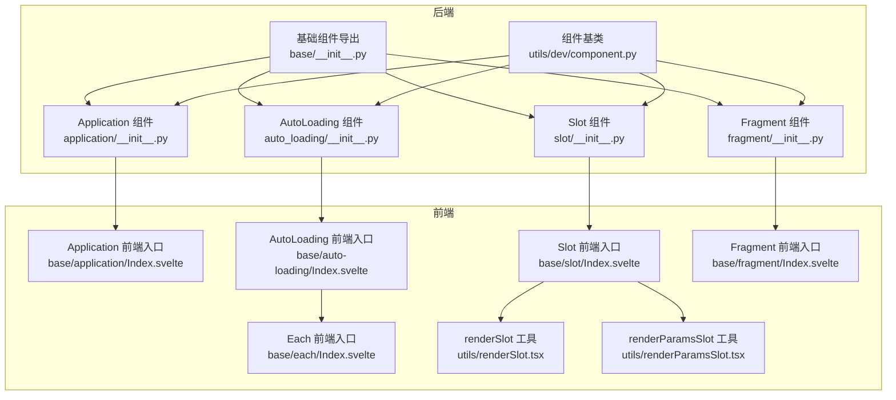
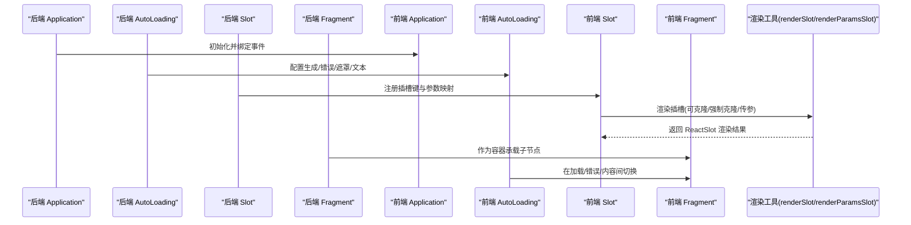
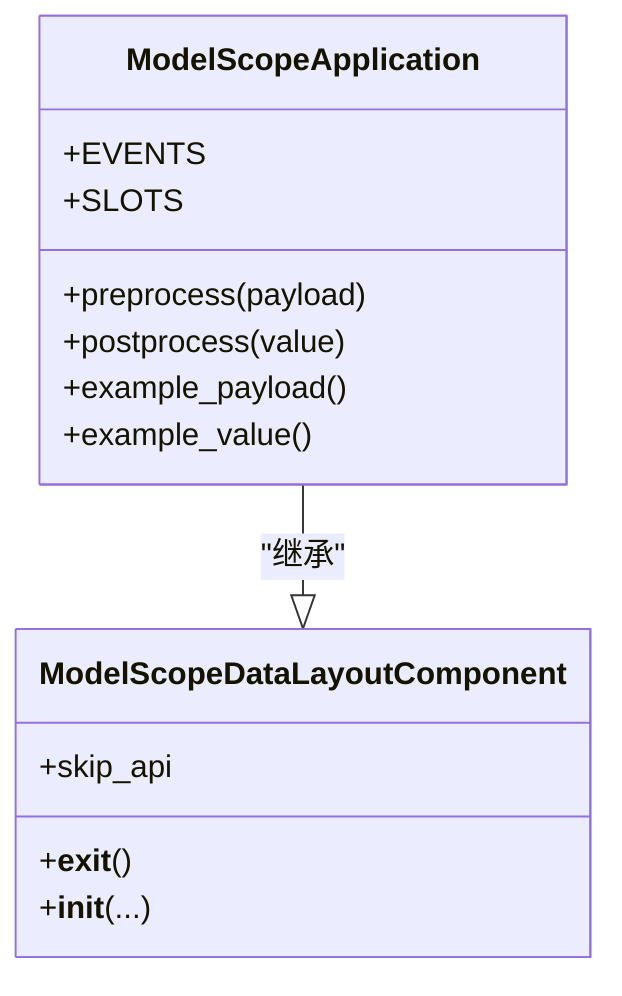
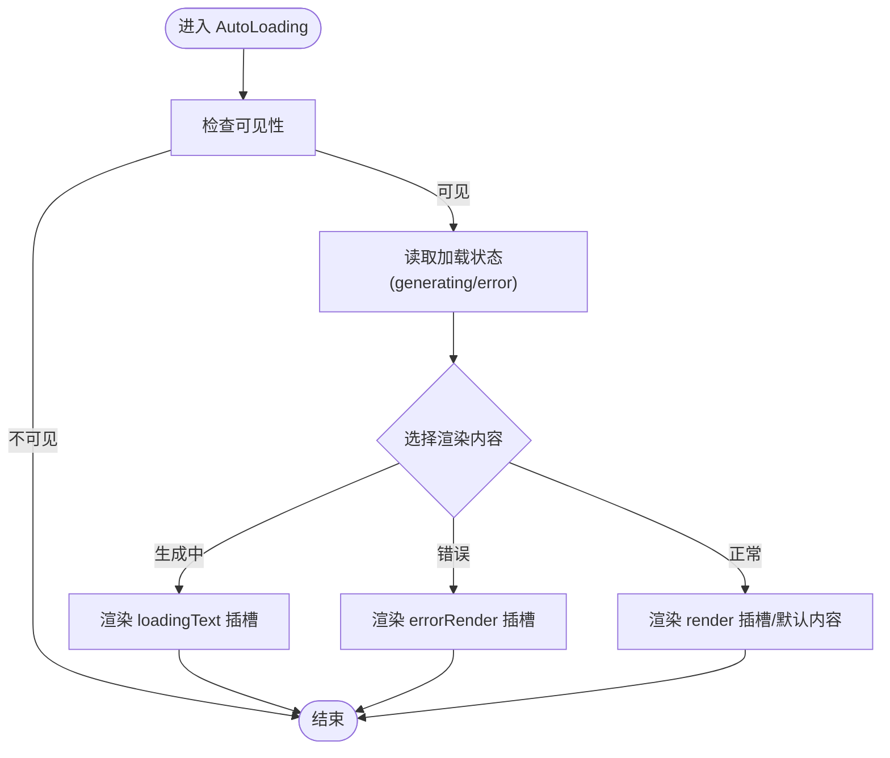
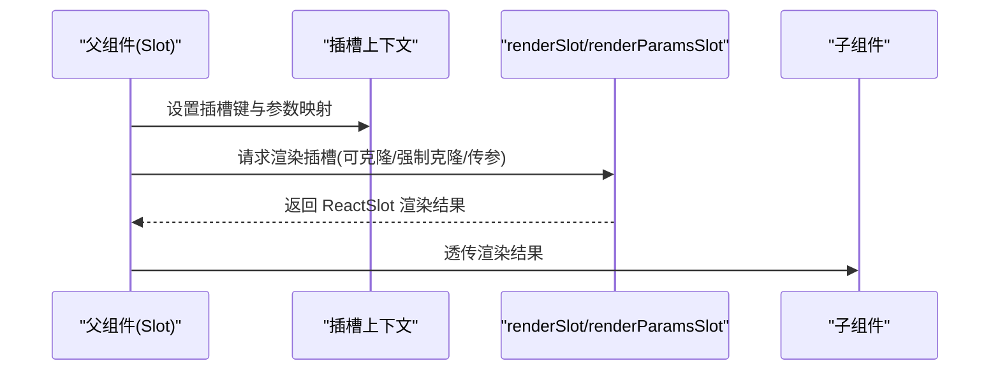
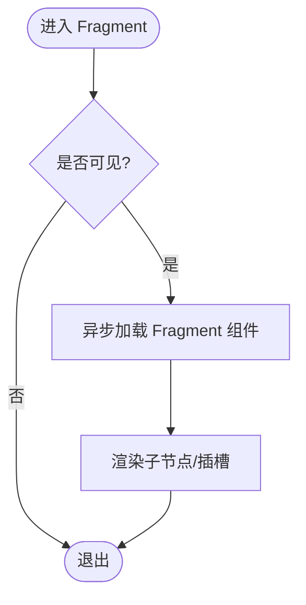
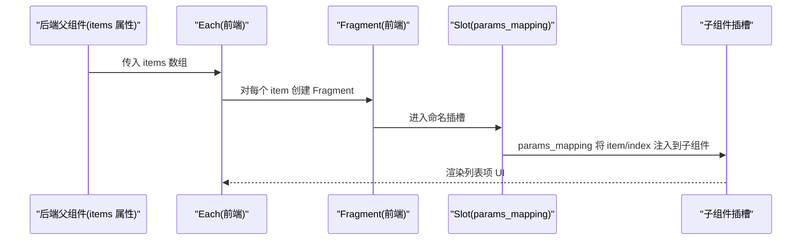
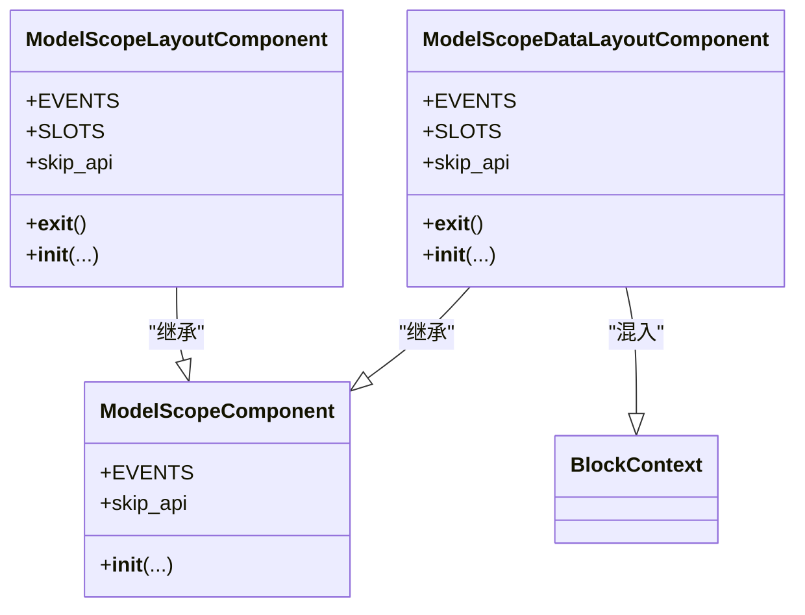
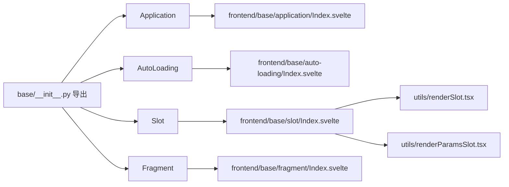

# 基础组件

<cite>
**本文引用的文件**
- [backend/modelscope_studio/components/base/application/__init__.py](file://backend/modelscope_studio/components/base/application/__init__.py)
- [backend/modelscope_studio/components/base/auto_loading/__init__.py](file://backend/modelscope_studio/components/base/auto_loading/__init__.py)
- [backend/modelscope_studio/components/base/slot/__init__.py](file://backend/modelscope_studio/components/base/slot/__init__.py)
- [backend/modelscope_studio/components/base/fragment/__init__.py](file://backend/modelscope_studio/components/base/fragment/__init__.py)
- [backend/modelscope_studio/components/base/__init__.py](file://backend/modelscope_studio/components/base/__init__.py)
- [backend/modelscope_studio/utils/dev/component.py](file://backend/modelscope_studio/utils/dev/component.py)
- [frontend/base/application/Index.svelte](file://frontend/base/application/Index.svelte)
- [frontend/base/auto-loading/Index.svelte](file://frontend/base/auto-loading/Index.svelte)
- [frontend/base/slot/Index.svelte](file://frontend/base/slot/Index.svelte)
- [frontend/base/fragment/Index.svelte](file://frontend/base/fragment/Index.svelte)
- [frontend/base/each/Index.svelte](file://frontend/base/each/Index.svelte)
- [frontend/utils/renderSlot.tsx](file://frontend/utils/renderSlot.tsx)
- [frontend/utils/renderParamsSlot.tsx](file://frontend/utils/renderParamsSlot.tsx)
</cite>

## 目录

1. [简介](#简介)
2. [项目结构](#项目结构)
3. [核心组件](#核心组件)
4. [架构总览](#架构总览)
5. [详细组件分析](#详细组件分析)
6. [依赖分析](#依赖分析)
7. [性能考虑](#性能考虑)
8. [故障排查指南](#故障排查指南)
9. [结论](#结论)
10. [附录](#附录)

## 简介

本篇文档聚焦 ModelScope Studio 的“基础组件”体系，系统讲解 Application、AutoLoading、Slot、Fragment 等核心组件的设计理念、数据与控制流、在整体组件体系中的作用与协作方式，并提供使用示例、最佳实践、性能优化建议与常见问题解决方案。目标是帮助开发者快速理解并正确使用这些基础组件来构建复杂界面。

## 项目结构

基础组件位于后端 Python 模块与前端 Svelte 实现之间，通过统一的组件基类与上下文机制进行桥接。后端负责定义组件类、事件与插槽能力、数据模型与生命周期钩子；前端负责渲染、插槽解析、状态管理与异步加载。

**图表来源**

- [backend/modelscope_studio/components/base/application/**init**.py:26-115](file://backend/modelscope_studio/components/base/application/__init__.py#L26-L115)
- [backend/modelscope_studio/components/base/auto_loading/**init**.py:8-65](file://backend/modelscope_studio/components/base/auto_loading/__init__.py#L8-L65)
- [backend/modelscope_studio/components/base/slot/**init**.py:8-50](file://backend/modelscope_studio/components/base/slot/__init__.py#L8-L50)
- [backend/modelscope_studio/components/base/fragment/**init**.py:8-49](file://backend/modelscope_studio/components/base/fragment/__init__.py#L8-L49)
- [backend/modelscope_studio/components/base/**init**.py:1-11](file://backend/modelscope_studio/components/base/__init__.py#L1-L11)
- [backend/modelscope_studio/utils/dev/component.py:11-169](file://backend/modelscope_studio/utils/dev/component.py#L11-L169)
- [frontend/base/application/Index.svelte:1-17](file://frontend/base/application/Index.svelte#L1-L17)
- [frontend/base/auto-loading/Index.svelte:1-81](file://frontend/base/auto-loading/Index.svelte#L1-L81)
- [frontend/base/slot/Index.svelte:1-68](file://frontend/base/slot/Index.svelte#L1-L68)
- [frontend/base/fragment/Index.svelte:1-50](file://frontend/base/fragment/Index.svelte#L1-L50)
- [frontend/base/each/Index.svelte:1-111](file://frontend/base/each/Index.svelte#L1-L111)
- [frontend/utils/renderSlot.tsx:1-29](file://frontend/utils/renderSlot.tsx#L1-L29)
- [frontend/utils/renderParamsSlot.tsx:1-51](file://frontend/utils/renderParamsSlot.tsx#L1-L51)

**章节来源**

- [backend/modelscope_studio/components/base/**init**.py:1-11](file://backend/modelscope_studio/components/base/__init__.py#L1-L11)
- [backend/modelscope_studio/utils/dev/component.py:11-169](file://backend/modelscope_studio/utils/dev/component.py#L11-L169)

## 核心组件

本节对 Application、AutoLoading、Slot、Fragment 和 Each 的职责、特性与使用方式进行概览式说明。

- Application（应用容器）
  - 职责：作为顶层布局容器，承载页面级事件绑定（自定义事件、挂载、窗口大小变化、卸载），并提供页面环境数据（屏幕尺寸、语言、主题、UA）。
  - 关键点：支持事件监听器注册；作为应用上下文根节点，确保子组件均在有效应用上下文中创建。
  - 典型用法：在应用入口处放置，内部嵌套其他基础或业务组件；通过事件监听器处理浏览器生命周期与交互。

- AutoLoading（自动加载占位）
  - 职责：根据生成状态、错误状态与遮罩/计时器等配置，自动切换加载态、错误态与内容渲染；支持命名插槽（render、errorRender、loadingText）以灵活定制。
  - 关键点：skip_api 标记为真，避免重复 API 调用；通过前端上下文读取加载状态并联动插槽渲染。
  - 典型用法：包裹需要懒加载或条件渲染的内容区域；结合业务逻辑动态设置 generating/showError。

- Slot（插槽）
  - 职责：声明与注册命名插槽，支持参数映射函数，将 DOM 插槽与 React/JSX 内容进行桥接；可嵌套形成层级化插槽键。
  - 关键点：通过上下文设置插槽键与参数映射；在渲染时由工具函数将插槽内容克隆并注入到目标元素。
  - 典型用法：在父组件中声明插槽，在子组件中按需渲染；用于复杂布局与条件渲染。

- Fragment（片段）
  - 职责：轻量容器，不引入额外 DOM 包装，仅承载子节点与插槽；常用于条件渲染、列表项包装等场景。
  - 关键点：skip_api 标记为真；不触发额外渲染开销；可配合 Each/Slot 使用。
  - 典型用法：在 Each 中作为列表项容器；在条件分支中包裹多个子节点而不增加额外层级。

- Each（列表渲染）
  - 职责：为列表或数组数据提供批量渲染能力，将列表中的每个元素与对应的插槽/Fragment 进行参数映射和渲染。
  - 关键点：仅为前端纯渲染组件，无对应后端 Python 类；配合 Fragment 使用实现列表项渲染，配合 Slot 实现参数映射插槽。
  - 参数映射：通过 Slot 的 params_mapping 属性，将列表元素的当前条目和索引注入到子组件插槽中。
  - 典型用法：将 ms.Each 包裹在支持条目渲染的父组件内部，配合 ms.Fragment 和 ms.Slot（带 params_mapping）实现列表动态渲染。

**章节来源**

- [backend/modelscope_studio/components/base/application/**init**.py:26-115](file://backend/modelscope_studio/components/base/application/__init__.py#L26-L115)
- [backend/modelscope_studio/components/base/auto_loading/**init**.py:8-65](file://backend/modelscope_studio/components/base/auto_loading/__init__.py#L8-L65)
- [backend/modelscope_studio/components/base/slot/**init**.py:8-50](file://backend/modelscope_studio/components/base/slot/__init__.py#L8-L50)
- [backend/modelscope_studio/components/base/fragment/**init**.py:8-49](file://backend/modelscope_studio/components/base/fragment/__init__.py#L8-L49)
- [frontend/base/each/Index.svelte:1-111](file://frontend/base/each/Index.svelte#L1-L111)

## 架构总览

下图展示了基础组件从后端到前端的整体调用链路与协作关系。

**图表来源**

- [backend/modelscope_studio/components/base/application/**init**.py:26-115](file://backend/modelscope_studio/components/base/application/__init__.py#L26-L115)
- [backend/modelscope_studio/components/base/auto_loading/**init**.py:8-65](file://backend/modelscope_studio/components/base/auto_loading/__init__.py#L8-L65)
- [backend/modelscope_studio/components/base/slot/**init**.py:8-50](file://backend/modelscope_studio/components/base/slot/__init__.py#L8-L50)
- [backend/modelscope_studio/components/base/fragment/**init**.py:8-49](file://backend/modelscope_studio/components/base/fragment/__init__.py#L8-L49)
- [frontend/base/application/Index.svelte:1-17](file://frontend/base/application/Index.svelte#L1-L17)
- [frontend/base/auto-loading/Index.svelte:1-81](file://frontend/base/auto-loading/Index.svelte#L1-L81)
- [frontend/base/slot/Index.svelte:1-68](file://frontend/base/slot/Index.svelte#L1-L68)
- [frontend/base/fragment/Index.svelte:1-50](file://frontend/base/fragment/Index.svelte#L1-L50)
- [frontend/utils/renderSlot.tsx:1-29](file://frontend/utils/renderSlot.tsx#L1-L29)
- [frontend/utils/renderParamsSlot.tsx:1-51](file://frontend/utils/renderParamsSlot.tsx#L1-L51)

## 详细组件分析

### Application 组件

- 设计理念
  - 作为应用级根容器，集中处理浏览器生命周期事件与页面环境信息，为上层组件提供一致的运行时上下文。
  - 通过事件监听器扩展应用行为边界，如自定义事件分发、挂载/卸载回调、窗口尺寸变化响应。
- 数据模型
  - 页面屏幕数据（宽高、滚动位置）、语言、主题、用户代理等，便于前端适配不同设备与主题。
- 前端实现要点
  - 异步导入实际组件，延迟渲染以提升首屏性能。
  - 将 children 透传给子组件，保持树形结构的灵活性。
- 使用示例路径
  - 在应用入口创建 Application，并在其内部组织页面布局与业务组件。
  - 示例参考：[frontend/base/application/Index.svelte:1-17](file://frontend/base/application/Index.svelte#L1-L17)

**图表来源**

- [backend/modelscope_studio/components/base/application/**init**.py:26-115](file://backend/modelscope_studio/components/base/application/__init__.py#L26-L115)
- [backend/modelscope_studio/utils/dev/component.py:101-169](file://backend/modelscope_studio/utils/dev/component.py#L101-L169)

**章节来源**

- [backend/modelscope_studio/components/base/application/**init**.py:26-115](file://backend/modelscope_studio/components/base/application/__init__.py#L26-L115)
- [frontend/base/application/Index.svelte:1-17](file://frontend/base/application/Index.svelte#L1-L17)

### AutoLoading 组件

- 设计理念
  - 自动化处理“生成中/错误/加载文本”等状态，减少业务侧样板代码；通过插槽实现高度可定制。
- 关键属性
  - generating：是否处于生成中
  - show_error：是否显示错误态
  - show_mask/show_timer：遮罩与计时器开关
  - loading_text：自定义加载文案
  - 支持插槽：render、errorRender、loadingText
- 前端实现要点
  - 通过上下文读取加载状态，决定渲染哪一类内容。
  - 通过 processProps 与 getSlots 将后端传递的属性与插槽映射到前端组件。
- 使用示例路径
  - 在需要懒加载或条件渲染的区域包裹 AutoLoading，并根据业务状态切换 generating/showError。
  - 示例参考：[frontend/base/auto-loading/Index.svelte:1-81](file://frontend/base/auto-loading/Index.svelte#L1-L81)

**图表来源**

- [frontend/base/auto-loading/Index.svelte:1-81](file://frontend/base/auto-loading/Index.svelte#L1-L81)

**章节来源**

- [backend/modelscope_studio/components/base/auto_loading/**init**.py:8-65](file://backend/modelscope_studio/components/base/auto_loading/__init__.py#L8-L65)
- [frontend/base/auto-loading/Index.svelte:1-81](file://frontend/base/auto-loading/Index.svelte#L1-L81)

### Slot 组件

- 设计理念
  - 提供命名插槽与参数映射能力，将 Svelte 插槽与 React/JSX 渲染桥接，支持嵌套插槽键与动态参数。
- 关键属性
  - value：插槽键名（支持嵌套）
  - params_mapping：参数映射函数字符串，运行时转换为函数
- 前端实现要点
  - 通过上下文设置当前插槽键与参数映射函数。
  - 使用 renderSlot/renderParamsSlot 将插槽内容克隆并注入到目标元素，支持强制克隆与多目标渲染。
- 使用示例路径
  - 在父组件中声明 Slot，在子组件中按需渲染；或在 Each 中配合参数映射实现动态渲染。
  - 示例参考：[frontend/base/slot/Index.svelte:1-68](file://frontend/base/slot/Index.svelte#L1-L68)，[frontend/utils/renderSlot.tsx:1-29](file://frontend/utils/renderSlot.tsx#L1-L29)，[frontend/utils/renderParamsSlot.tsx:1-51](file://frontend/utils/renderParamsSlot.tsx#L1-L51)

**图表来源**

- [frontend/base/slot/Index.svelte:1-68](file://frontend/base/slot/Index.svelte#L1-L68)
- [frontend/utils/renderSlot.tsx:1-29](file://frontend/utils/renderSlot.tsx#L1-L29)
- [frontend/utils/renderParamsSlot.tsx:1-51](file://frontend/utils/renderParamsSlot.tsx#L1-L51)

**章节来源**

- [backend/modelscope_studio/components/base/slot/**init**.py:8-50](file://backend/modelscope_studio/components/base/slot/__init__.py#L8-L50)
- [frontend/base/slot/Index.svelte:1-68](file://frontend/base/slot/Index.svelte#L1-L68)
- [frontend/utils/renderSlot.tsx:1-29](file://frontend/utils/renderSlot.tsx#L1-L29)
- [frontend/utils/renderParamsSlot.tsx:1-51](file://frontend/utils/renderParamsSlot.tsx#L1-L51)

### Fragment 组件

- 设计理念
  - 作为轻量容器，不引入额外 DOM 包装，仅承载子节点与插槽；适合条件渲染与列表项包装。
- 前端实现要点
  - 通过异步导入实际组件，延迟渲染；在可见性为真时才渲染。
  - 不重置插槽键，避免影响兄弟节点的插槽状态。
- 使用示例路径
  - 在 Each 或条件渲染中作为列表项容器；在需要无包裹容器时优先选择 Fragment。
  - 示例参考：[frontend/base/fragment/Index.svelte:1-50](file://frontend/base/fragment/Index.svelte#L1-L50)

**图表来源**

- [frontend/base/fragment/Index.svelte:1-50](file://frontend/base/fragment/Index.svelte#L1-L50)

**章节来源**

- [backend/modelscope_studio/components/base/fragment/**init**.py:8-49](file://backend/modelscope_studio/components/base/fragment/__init__.py#L8-L49)
- [frontend/base/fragment/Index.svelte:1-50](file://frontend/base/fragment/Index.svelte#L1-L50)

### Each 组件

- 设计理念
  - Each 是专为列表渲染设计的前端轻量组件，无对应的后端 Python 类。它允许基于数组数据批量实例化子组件，配合 Fragment 与 Slot 可实现参数化动态渲染。
- 与 Fragment 的配合使用
  - 在 Each 的每个条目中使用 Fragment 作为轻量容器，避免引入额外 DOM 包装层级。
  - Fragment 的 `visible` 控制是否渲染当前条目，适合条件式列表。
  - 典型用法：在展示列表元素时，将列表容器组件中的每个条目渲染到一个 Fragment 中。
- 参数映射（params_mapping）
  - 在 Slot 组件上设置 `params_mapping` 属性，可将当前条目值（item）和索引（index）注入到插槽内容中。
  - `params_mapping` 是一个 JavaScript 字符串函数，运行时转换为函数，接收 `(item, index)` 并返回插槽参数对象。
  - 示例：`params_mapping="lambda item, index: {'children': item['label']}"` 将每个条目的 label 字段作为 children 渲染。
- 前端实现要点
  - Each 通过合并上下文值与子项值，将列表元素传递给子组件插槽。
  - 支持嵌套 Each，内层通过 subIndex 防止插槽键冲突。
  - 需要时可配置 `forceClone`，确保每个条目拥有独立的插槽实例。
  - 示例参考：[frontend/base/each/Index.svelte:1-111](file://frontend/base/each/Index.svelte#L1-L111)

**图表来源**

- [frontend/base/each/Index.svelte:1-111](file://frontend/base/each/Index.svelte#L1-L111)

**章节来源**

- [frontend/base/each/Index.svelte:1-111](file://frontend/base/each/Index.svelte#L1-L111)
- [frontend/base/fragment/Index.svelte:1-50](file://frontend/base/fragment/Index.svelte#L1-L50)

### 组件基类与上下文

- ModelScopeLayoutComponent / ModelScopeComponent / ModelScopeDataLayoutComponent
  - 统一处理组件生命周期、样式与内部索引；在 BlockContext 下参与布局树管理。
  - skip_api 控制是否跳过 API 层面的重复渲染或处理。
- AppContext
  - 确保所有基础组件在有效的应用上下文中创建，避免运行时错误。

**图表来源**

- [backend/modelscope_studio/utils/dev/component.py:11-169](file://backend/modelscope_studio/utils/dev/component.py#L11-L169)

**章节来源**

- [backend/modelscope_studio/utils/dev/component.py:11-169](file://backend/modelscope_studio/utils/dev/component.py#L11-L169)

## 依赖分析

- 后端导出
  - 基础组件通过 base/**init**.py 导出，统一对外接口，便于上层模块按需引入。
- 组件间耦合
  - Application 作为根容器，其余组件围绕其展开；AutoLoading 与 Fragment 常作为通用容器；Slot 为跨组件插槽桥接的核心。
- 外部依赖
  - 前端通过 @svelte-preprocess-react 与上下文系统实现 Svelte 与 React 的桥接；渲染工具提供插槽克隆与参数注入能力。

**图表来源**

- [backend/modelscope_studio/components/base/**init**.py:1-11](file://backend/modelscope_studio/components/base/__init__.py#L1-L11)
- [frontend/base/application/Index.svelte:1-17](file://frontend/base/application/Index.svelte#L1-L17)
- [frontend/base/auto-loading/Index.svelte:1-81](file://frontend/base/auto-loading/Index.svelte#L1-L81)
- [frontend/base/slot/Index.svelte:1-68](file://frontend/base/slot/Index.svelte#L1-L68)
- [frontend/base/fragment/Index.svelte:1-50](file://frontend/base/fragment/Index.svelte#L1-L50)
- [frontend/utils/renderSlot.tsx:1-29](file://frontend/utils/renderSlot.tsx#L1-L29)
- [frontend/utils/renderParamsSlot.tsx:1-51](file://frontend/utils/renderParamsSlot.tsx#L1-L51)

**章节来源**

- [backend/modelscope_studio/components/base/**init**.py:1-11](file://backend/modelscope_studio/components/base/__init__.py#L1-L11)

## 性能考虑

- 延迟加载与可见性控制
  - Application/AutoLoading/Fragment 均采用异步导入与可见性判断，减少首屏渲染压力。
- 插槽渲染优化
  - 使用 renderSlot/renderParamsSlot 时，合理设置 clone/forceClone 与 params，避免不必要的重复渲染。
- Each 列表渲染
  - Each 支持合并值与上下文，必要时强制克隆以保证独立状态；注意在深层 Each 中维护 slotKey 与 subIndex，避免插槽键冲突。
- 事件绑定
  - Application 的事件监听器仅在需要时启用，避免无谓的事件处理开销。

[本节为通用指导，无需特定文件引用]

## 故障排查指南

- 插槽未生效
  - 检查 Slot 的 value 是否正确设置，以及父组件是否已注册对应插槽键。
  - 确认 renderSlot/renderParamsSlot 的参数是否正确传入（clone/forceClone/params）。
  - 参考：[frontend/base/slot/Index.svelte:1-68](file://frontend/base/slot/Index.svelte#L1-L68)，[frontend/utils/renderSlot.tsx:1-29](file://frontend/utils/renderSlot.tsx#L1-L29)，[frontend/utils/renderParamsSlot.tsx:1-51](file://frontend/utils/renderParamsSlot.tsx#L1-L51)
- AutoLoading 未按预期切换
  - 确认 generating/showError 状态是否正确传递至前端；检查插槽名称是否匹配（render/errorRender/loadingText）。
  - 参考：[frontend/base/auto-loading/Index.svelte:1-81](file://frontend/base/auto-loading/Index.svelte#L1-L81)
- Fragment 未渲染
  - 检查 visible 属性与异步加载是否完成；确认未误用 shouldResetSlotKey 导致插槽键丢失。
  - 参考：[frontend/base/fragment/Index.svelte:1-50](file://frontend/base/fragment/Index.svelte#L1-L50)
- Each 列表错位或插槽冲突
  - 确保 Each 的上下文值与子项值正确合并；在嵌套 Each 中维护 subIndex 与 slotKey。
  - 参考：[frontend/base/each/Index.svelte:1-111](file://frontend/base/each/Index.svelte#L1-L111)

**章节来源**

- [frontend/base/slot/Index.svelte:1-68](file://frontend/base/slot/Index.svelte#L1-L68)
- [frontend/utils/renderSlot.tsx:1-29](file://frontend/utils/renderSlot.tsx#L1-L29)
- [frontend/utils/renderParamsSlot.tsx:1-51](file://frontend/utils/renderParamsSlot.tsx#L1-L51)
- [frontend/base/auto-loading/Index.svelte:1-81](file://frontend/base/auto-loading/Index.svelte#L1-L81)
- [frontend/base/fragment/Index.svelte:1-50](file://frontend/base/fragment/Index.svelte#L1-L50)
- [frontend/base/each/Index.svelte:1-111](file://frontend/base/each/Index.svelte#L1-L111)

## 结论

基础组件体系以 Application 为根、AutoLoading 为通用容器、Slot 为跨组件桥接、Fragment 为轻量容器，配合统一的组件基类与上下文机制，实现了前后端协同、事件与插槽解耦、渲染性能可控的架构设计。遵循本文的最佳实践与排障建议，开发者可以高效地使用这些组件构建复杂且高性能的界面。

[本节为总结性内容，无需特定文件引用]

## 附录

- 快速上手清单
  - 在应用入口放置 Application，确保全局上下文可用。
  - 对需要懒加载的区域使用 AutoLoading，并根据业务状态切换生成/错误态。
  - 使用 Slot 声明命名插槽，配合 renderSlot/renderParamsSlot 进行渲染。
  - 在列表或条件渲染中使用 Fragment 作为无包裹容器。
- 相关实现参考路径
  - [frontend/base/application/Index.svelte:1-17](file://frontend/base/application/Index.svelte#L1-L17)
  - [frontend/base/auto-loading/Index.svelte:1-81](file://frontend/base/auto-loading/Index.svelte#L1-L81)
  - [frontend/base/slot/Index.svelte:1-68](file://frontend/base/slot/Index.svelte#L1-L68)
  - [frontend/base/fragment/Index.svelte:1-50](file://frontend/base/fragment/Index.svelte#L1-L50)
  - [frontend/base/each/Index.svelte:1-111](file://frontend/base/each/Index.svelte#L1-L111)
  - [frontend/utils/renderSlot.tsx:1-29](file://frontend/utils/renderSlot.tsx#L1-L29)
  - [frontend/utils/renderParamsSlot.tsx:1-51](file://frontend/utils/renderParamsSlot.tsx#L1-L51)

[本节为补充材料，无需特定文件引用]
