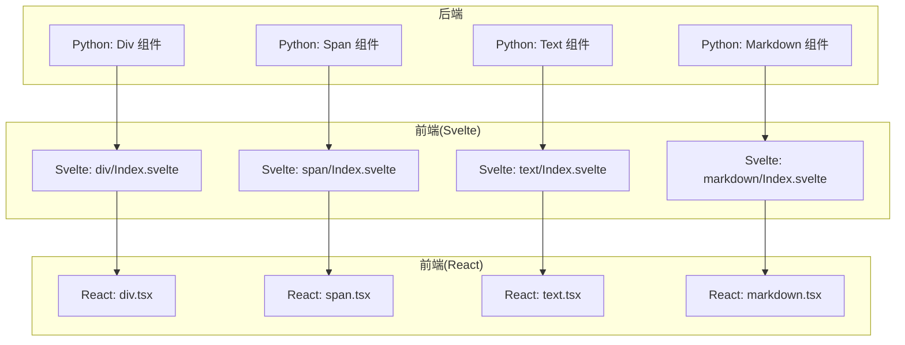
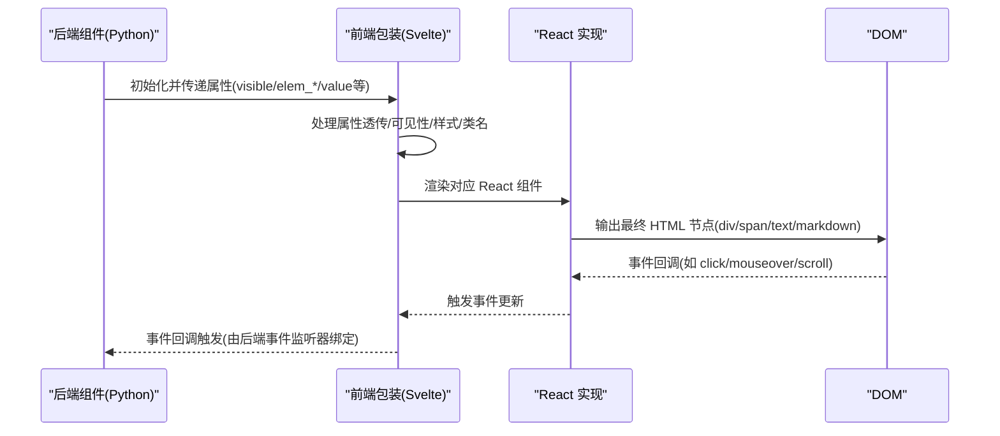
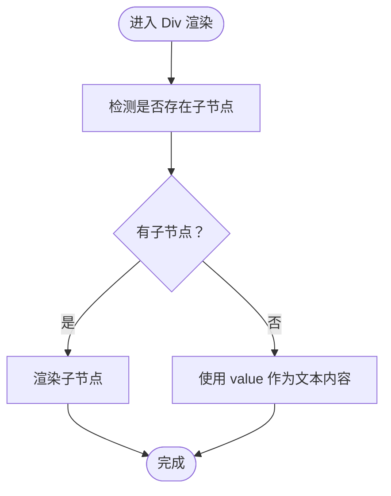
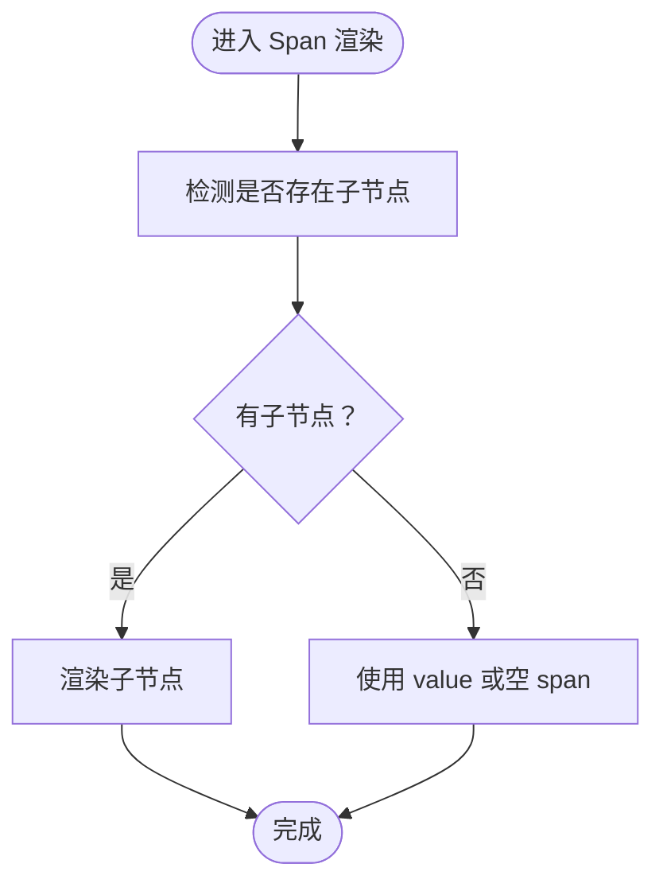
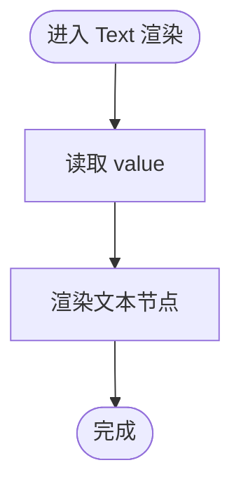
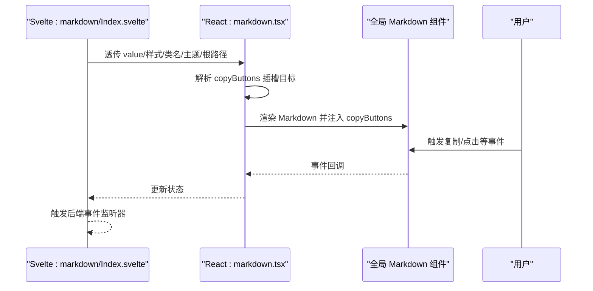
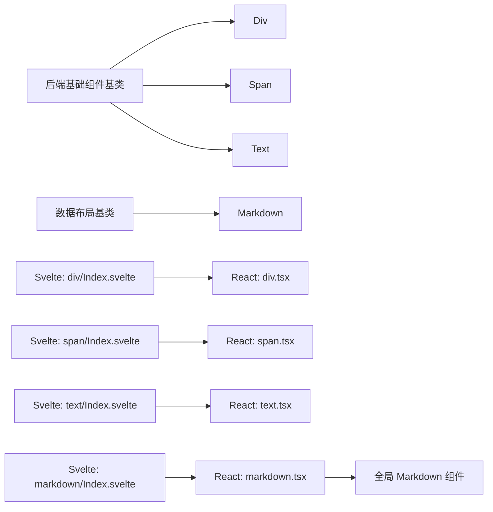

# 布局组件

<cite>
**本文引用的文件**
- [backend/modelscope_studio/components/base/__init__.py](file://backend/modelscope_studio/components/base/__init__.py)
- [backend/modelscope_studio/components/base/div/__init__.py](file://backend/modelscope_studio/components/base/div/__init__.py)
- [backend/modelscope_studio/components/base/span/__init__.py](file://backend/modelscope_studio/components/base/span/__init__.py)
- [backend/modelscope_studio/components/base/text/__init__.py](file://backend/modelscope_studio/components/base/text/__init__.py)
- [backend/modelscope_studio/components/base/markdown/__init__.py](file://backend/modelscope_studio/components/base/markdown/__init__.py)
- [frontend/base/package.json](file://frontend/base/package.json)
- [frontend/base/div/Index.svelte](file://frontend/base/div/Index.svelte)
- [frontend/base/span/Index.svelte](file://frontend/base/span/Index.svelte)
- [frontend/base/text/Index.svelte](file://frontend/base/text/Index.svelte)
- [frontend/base/markdown/Index.svelte](file://frontend/base/markdown/Index.svelte)
- [frontend/base/div/div.tsx](file://frontend/base/div/div.tsx)
- [frontend/base/span/span.tsx](file://frontend/base/span/span.tsx)
- [frontend/base/text/text.tsx](file://frontend/base/text/text.tsx)
- [frontend/base/markdown/markdown.tsx](file://frontend/base/markdown/markdown.tsx)
</cite>

## 目录

1. [简介](#简介)
2. [项目结构](#项目结构)
3. [核心组件](#核心组件)
4. [架构总览](#架构总览)
5. [详细组件分析](#详细组件分析)
6. [依赖关系分析](#依赖关系分析)
7. [性能考量](#性能考量)
8. [故障排查指南](#故障排查指南)
9. [结论](#结论)
10. [附录](#附录)

## 简介

本文件系统性梳理模型空间（ModelScope Studio）中“布局组件”系列，重点覆盖 Div、Span、Text、Markdown 四类基础布局与内容组件。文档从架构、数据流、处理逻辑、样式与主题适配、组合与嵌套最佳实践、性能特性与优化建议、以及常见问题与调试技巧等维度进行深入说明，帮助开发者在页面布局与内容展示中高效、稳定地使用这些组件。

## 项目结构

布局组件位于后端 Python 组件层与前端 Svelte/React 层之间，采用“Python 组件定义 + Svelte 包装 + React 实现”的分层设计：

- 后端：通过 Python 类定义组件行为、事件绑定、预处理/后处理逻辑，并声明前端资源目录。
- 前端 Svelte 层：负责属性透传、可见性控制、样式与类名拼接、插槽（slots）解析与渲染。
- React 层：具体 HTML 元素包装（如 div/span），或基于全局组件（如 Markdown）进行渲染。

图表来源

- [backend/modelscope_studio/components/base/div/**init**.py:10-86](file://backend/modelscope_studio/components/base/div/__init__.py#L10-L86)
- [backend/modelscope_studio/components/base/span/**init**.py:10-87](file://backend/modelscope_studio/components/base/span/__init__.py#L10-L87)
- [backend/modelscope_studio/components/base/text/**init**.py:8-57](file://backend/modelscope_studio/components/base/text/__init__.py#L8-L57)
- [backend/modelscope_studio/components/base/markdown/**init**.py:11-174](file://backend/modelscope_studio/components/base/markdown/__init__.py#L11-L174)
- [frontend/base/div/Index.svelte:1-65](file://frontend/base/div/Index.svelte#L1-L65)
- [frontend/base/span/Index.svelte:1-64](file://frontend/base/span/Index.svelte#L1-L64)
- [frontend/base/text/Index.svelte:1-42](file://frontend/base/text/Index.svelte#L1-L42)
- [frontend/base/markdown/Index.svelte:1-64](file://frontend/base/markdown/Index.svelte#L1-L64)
- [frontend/base/div/div.tsx:1-18](file://frontend/base/div/div.tsx#L1-L18)
- [frontend/base/span/span.tsx:1-20](file://frontend/base/span/span.tsx#L1-L20)
- [frontend/base/text/text.tsx:1-11](file://frontend/base/text/text.tsx#L1-L11)
- [frontend/base/markdown/markdown.tsx:1-35](file://frontend/base/markdown/markdown.tsx#L1-L35)

章节来源

- [backend/modelscope_studio/components/base/**init**.py:1-11](file://backend/modelscope_studio/components/base/__init__.py#L1-L11)
- [frontend/base/package.json:1-6](file://frontend/base/package.json#L1-L6)

## 核心组件

本节对四个基础布局组件进行功能与用法概览，强调其在页面布局与内容展示中的定位与职责。

- Div
  - 定位：块级容器，用于承载子元素或文本值；支持鼠标/滚轮等通用交互事件绑定。
  - 关键点：可接收额外属性透传，支持可见性、元素 ID、类名、内联样式等通用属性。
  - 适用场景：卡片背景、区域划分、复杂嵌套布局的外层容器。

- Span
  - 定位：行内容器，适合包裹短文本或内联元素；同样支持通用交互事件。
  - 关键点：当存在子节点时优先渲染子节点，否则回退到 value 或子节点。
  - 适用场景：内联高亮、标签、按钮组内的文本片段。

- Text
  - 定位：纯文本输出组件，无额外容器包装，直接渲染字符串。
  - 关键点：无事件绑定，仅处理 value；适合最小成本的文本渲染。
  - 适用场景：标题、段落、提示文案等轻量文本。

- Markdown
  - 定位：富文本渲染组件，支持复制按钮插槽、LaTeX 数学公式、HTML 安全策略、换行与标题链接等选项。
  - 关键点：支持 copyButtons 插槽；后处理会清理缩进；主题模式与根路径透传给底层组件。
  - 适用场景：帮助文档、说明文本、动态生成的富文本内容。

章节来源

- [backend/modelscope_studio/components/base/div/**init**.py:10-86](file://backend/modelscope_studio/components/base/div/__init__.py#L10-L86)
- [backend/modelscope_studio/components/base/span/**init**.py:10-87](file://backend/modelscope_studio/components/base/span/__init__.py#L10-L87)
- [backend/modelscope_studio/components/base/text/**init**.py:8-57](file://backend/modelscope_studio/components/base/text/__init__.py#L8-L57)
- [backend/modelscope_studio/components/base/markdown/**init**.py:11-174](file://backend/modelscope_studio/components/base/markdown/__init__.py#L11-L174)

## 架构总览

下图展示了从后端组件到前端渲染的整体调用链路与数据流：

图表来源

- [backend/modelscope_studio/components/base/div/**init**.py:14-39](file://backend/modelscope_studio/components/base/div/__init__.py#L14-L39)
- [backend/modelscope_studio/components/base/span/**init**.py:14-39](file://backend/modelscope_studio/components/base/span/__init__.py#L14-L39)
- [backend/modelscope_studio/components/base/markdown/**init**.py:15-46](file://backend/modelscope_studio/components/base/markdown/__init__.py#L15-L46)
- [frontend/base/div/Index.svelte:22-47](file://frontend/base/div/Index.svelte#L22-L47)
- [frontend/base/span/Index.svelte:21-46](file://frontend/base/span/Index.svelte#L21-L46)
- [frontend/base/text/Index.svelte:15-29](file://frontend/base/text/Index.svelte#L15-L29)
- [frontend/base/markdown/Index.svelte:19-44](file://frontend/base/markdown/Index.svelte#L19-L44)
- [frontend/base/div/div.tsx:12-15](file://frontend/base/div/div.tsx#L12-L15)
- [frontend/base/span/span.tsx:12-17](file://frontend/base/span/span.tsx#L12-L17)
- [frontend/base/text/text.tsx:4-8](file://frontend/base/text/text.tsx#L4-L8)
- [frontend/base/markdown/markdown.tsx:8-32](file://frontend/base/markdown/markdown.tsx#L8-L32)

## 详细组件分析

### Div 组件

- 设计要点
  - 作为块级容器，内部优先渲染子节点，若无子节点则回退到 value 字符串。
  - 支持通用交互事件绑定（click、dblclick、mousedown、mouseup、mouseover、mouseout、mousemove、scroll）。
  - 可透传额外属性，配合 elem_id、elem_classes、elem_style 进行样式与定位控制。
- 数据流与处理逻辑
  - 预处理/后处理均保持字符串不变；可见性由 Svelte 层统一控制。
- 使用建议
  - 适合大范围布局分区与复杂嵌套；避免在需要行内语义的场景使用。
  - 与 Grid/Flex 等布局结合时，注意不要引入不必要的层级。

图表来源

- [frontend/base/div/div.tsx:12-15](file://frontend/base/div/div.tsx#L12-L15)
- [frontend/base/div/Index.svelte:50-63](file://frontend/base/div/Index.svelte#L50-L63)

章节来源

- [backend/modelscope_studio/components/base/div/**init**.py:10-86](file://backend/modelscope_studio/components/base/div/__init__.py#L10-L86)
- [frontend/base/div/Index.svelte:1-65](file://frontend/base/div/Index.svelte#L1-L65)
- [frontend/base/div/div.tsx:1-18](file://frontend/base/div/div.tsx#L1-L18)

### Span 组件

- 设计要点
  - 行内容器，优先渲染子节点；若无子节点则使用 value 或回退到空 span。
  - 支持与 Div 相同的交互事件绑定集合。
- 使用建议
  - 适合内联文本片段、标签、按钮内的文字等场景。
  - 不建议在需要块级换行的场景使用。

图表来源

- [frontend/base/span/span.tsx:12-17](file://frontend/base/span/span.tsx#L12-L17)
- [frontend/base/span/Index.svelte:49-63](file://frontend/base/span/Index.svelte#L49-L63)

章节来源

- [backend/modelscope_studio/components/base/span/**init**.py:10-87](file://backend/modelscope_studio/components/base/span/__init__.py#L10-L87)
- [frontend/base/span/Index.svelte:1-64](file://frontend/base/span/Index.svelte#L1-L64)
- [frontend/base/span/span.tsx:1-20](file://frontend/base/span/span.tsx#L1-L20)

### Text 组件

- 设计要点
  - 最小化包装，直接渲染字符串；无事件绑定。
  - 适合纯文本输出，性能开销低。
- 使用建议
  - 与富文本或需要交互的场景不混用；需要样式时通过 elem_classes/elem_style 控制。

图表来源

- [frontend/base/text/text.tsx:4-8](file://frontend/base/text/text.tsx#L4-L8)
- [frontend/base/text/Index.svelte:32-41](file://frontend/base/text/Index.svelte#L32-L41)

章节来源

- [backend/modelscope_studio/components/base/text/**init**.py:8-57](file://backend/modelscope_studio/components/base/text/__init__.py#L8-L57)
- [frontend/base/text/Index.svelte:1-42](file://frontend/base/text/Index.svelte#L1-L42)
- [frontend/base/text/text.tsx:1-11](file://frontend/base/text/text.tsx#L1-L11)

### Markdown 组件

- 设计要点
  - 支持 copyButtons 插槽，允许自定义复制按钮；支持 LaTeX 数学公式定界符、HTML 安全策略、换行与标题链接等选项。
  - 后处理会清理输入的缩进，保证渲染一致性。
  - 主题模式与根路径通过 props 透传到底层 Markdown 组件。
- 数据流与处理逻辑
  - Svelte 层解析 slots 并将 copyButtons 目标注入 React 层。
  - React 层隐藏 children，交由全局 Markdown 组件进行渲染与交互。

图表来源

- [frontend/base/markdown/Index.svelte:19-44](file://frontend/base/markdown/Index.svelte#L19-L44)
- [frontend/base/markdown/markdown.tsx:8-32](file://frontend/base/markdown/markdown.tsx#L8-L32)
- [backend/modelscope_studio/components/base/markdown/**init**.py:15-46](file://backend/modelscope_studio/components/base/markdown/__init__.py#L15-L46)

章节来源

- [backend/modelscope_studio/components/base/markdown/**init**.py:11-174](file://backend/modelscope_studio/components/base/markdown/__init__.py#L11-L174)
- [frontend/base/markdown/Index.svelte:1-64](file://frontend/base/markdown/Index.svelte#L1-L64)
- [frontend/base/markdown/markdown.tsx:1-35](file://frontend/base/markdown/markdown.tsx#L1-L35)

## 依赖关系分析

- 组件间耦合
  - 四个组件均通过统一的后端基类（布局/数据布局/普通组件）派生，具备一致的生命周期与事件机制。
  - 前端 Svelte 层采用相同的属性透传与可见性控制模式，降低维护成本。
- 外部依赖
  - React 包装层依赖 @svelte-preprocess-react 提供的 sveltify 与 slot 能力。
  - Markdown 组件依赖全局 Markdown 组件与 ReactSlot 进行插槽渲染。
- 潜在循环依赖
  - 当前结构为单向依赖（后端 → Svelte → React），未见循环依赖迹象。

图表来源

- [backend/modelscope_studio/components/base/div/**init**.py](file://backend/modelscope_studio/components/base/div/__init__.py#L7)
- [backend/modelscope_studio/components/base/span/**init**.py](file://backend/modelscope_studio/components/base/span/__init__.py#L7)
- [backend/modelscope_studio/components/base/text/**init**.py](file://backend/modelscope_studio/components/base/text/__init__.py#L5)
- [backend/modelscope_studio/components/base/markdown/**init**.py](file://backend/modelscope_studio/components/base/markdown/__init__.py#L8)
- [frontend/base/markdown/markdown.tsx:4-5](file://frontend/base/markdown/markdown.tsx#L4-L5)

章节来源

- [backend/modelscope_studio/components/base/**init**.py:1-11](file://backend/modelscope_studio/components/base/__init__.py#L1-L11)
- [frontend/base/package.json:1-6](file://frontend/base/package.json#L1-L6)

## 性能考量

- 渲染路径
  - Text 为纯文本直出，开销最低；Div/Span 在存在子节点时走 React 子树渲染，需关注子树规模。
  - Markdown 通过隐藏 children 的方式复用全局渲染能力，减少重复解析。
- 事件绑定
  - 所有布局组件均支持多种鼠标/滚轮事件绑定，建议按需启用，避免不必要的回调开销。
- 样式与类名
  - 通过 elem_classes/elem_style 控制样式，尽量使用原子化类名以减少样式计算。
- 主题与资源
  - Markdown 主题模式与根路径透传，确保静态资源加载路径正确，避免二次请求。

[本节为通用性能建议，无需特定文件引用]

## 故障排查指南

- 文本未显示
  - 检查 value 是否为空或仅含空白；Text 组件在 value 缺失时会回退为空 span。
  - 对于 Div/Span，确认是否传入了子节点导致 value 被忽略。
- 事件无效
  - 确认事件监听器已在后端注册；检查 visible 是否为 true，不可见时不会触发。
- Markdown 复制按钮不生效
  - 确认 copyButtons 插槽已正确挂载；React 层会根据插槽目标决定是否替换默认按钮。
- 样式不生效
  - 检查 elem_id/elem_classes/elem_style 的拼接顺序与优先级；必要时使用更具体的 CSS 选择器。
- 主题错乱
  - 确认 themeMode 与 rootUrl 正确透传至 Markdown 组件。

章节来源

- [backend/modelscope_studio/components/base/text/**init**.py:45-50](file://backend/modelscope_studio/components/base/text/__init__.py#L45-L50)
- [backend/modelscope_studio/components/base/div/**init**.py:14-39](file://backend/modelscope_studio/components/base/div/__init__.py#L14-L39)
- [backend/modelscope_studio/components/base/span/**init**.py:14-39](file://backend/modelscope_studio/components/base/span/__init__.py#L14-L39)
- [backend/modelscope_studio/components/base/markdown/**init**.py:49-52](file://backend/modelscope_studio/components/base/markdown/__init__.py#L49-L52)
- [frontend/base/markdown/markdown.tsx:14-31](file://frontend/base/markdown/markdown.tsx#L14-L31)

## 结论

Div、Span、Text、Markdown 四个组件构成了模型空间布局与内容展示的基础能力。它们在后端统一抽象、前端一致包装、React 层精准渲染的设计下，既保证了易用性，也兼顾了扩展性与性能。合理选择组件类型、按需启用事件与插槽、遵循样式与主题规范，是构建高质量界面的关键。

[本节为总结性内容，无需特定文件引用]

## 附录

### 组件属性与行为速查

- Div
  - 事件：click、dblclick、mousedown、mouseup、mouseover、mouseout、mousemove、scroll
  - 属性：value、additional_props、elem_id、elem_classes、elem_style、visible、render
- Span
  - 事件：click、dblclick、mousedown、mouseup、mouseover、mouseout、mousemove、scroll
  - 属性：value、additional_props、elem_id、elem_classes、elem_style、visible、render
- Text
  - 事件：无
  - 属性：value、elem_id、elem_classes、elem_style、visible、render
- Markdown
  - 事件：change、copy、click、dblclick、mousedown、mouseup、mouseover、mouseout、mousemove、scroll
  - 插槽：copyButtons
  - 属性：value、rtl、latex_delimiters、sanitize_html、line_breaks、header_links、allow_tags、show_copy_button、copy_buttons、elem_id、elem_classes、elem_style、visible、render

章节来源

- [backend/modelscope_studio/components/base/div/**init**.py:14-68](file://backend/modelscope_studio/components/base/div/__init__.py#L14-L68)
- [backend/modelscope_studio/components/base/span/**init**.py:14-69](file://backend/modelscope_studio/components/base/span/__init__.py#L14-L69)
- [backend/modelscope_studio/components/base/text/**init**.py:12-39](file://backend/modelscope_studio/components/base/text/__init__.py#L12-L39)
- [backend/modelscope_studio/components/base/markdown/**init**.py:15-143](file://backend/modelscope_studio/components/base/markdown/__init__.py#L15-L143)
