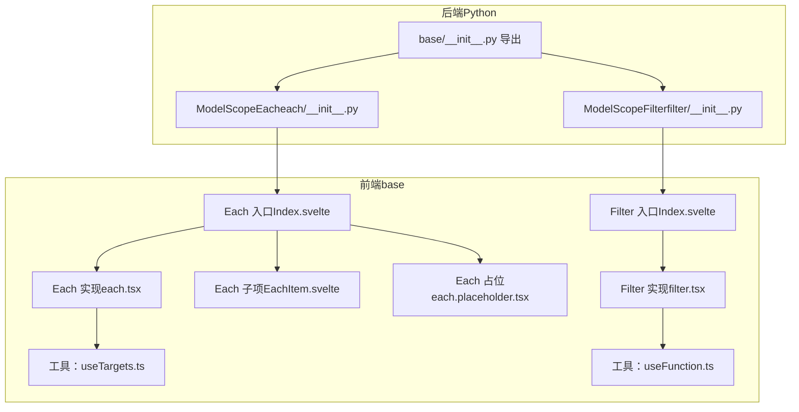
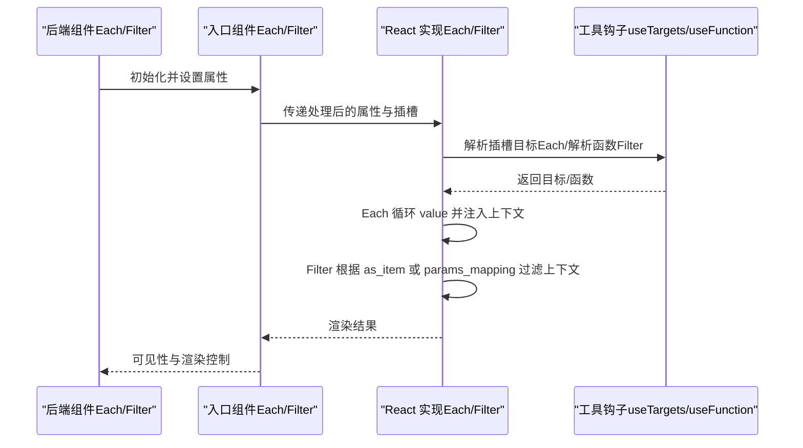
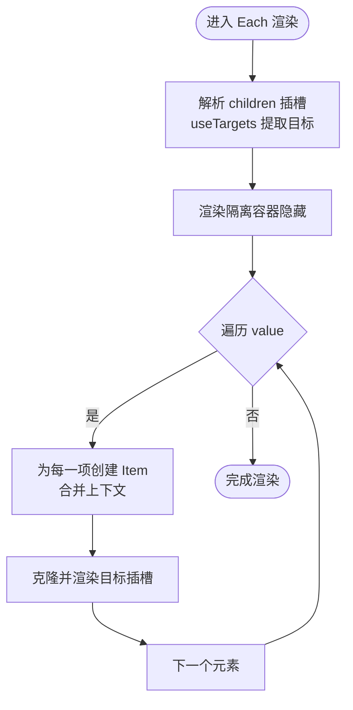
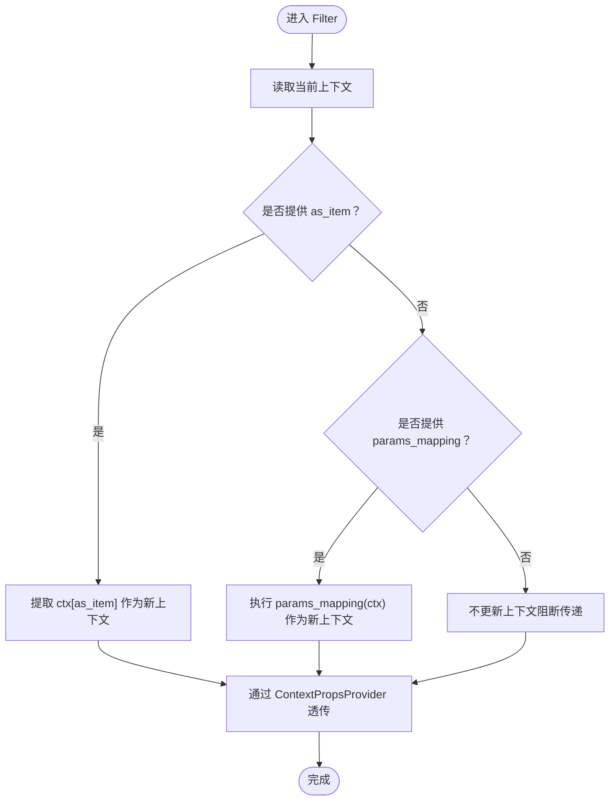
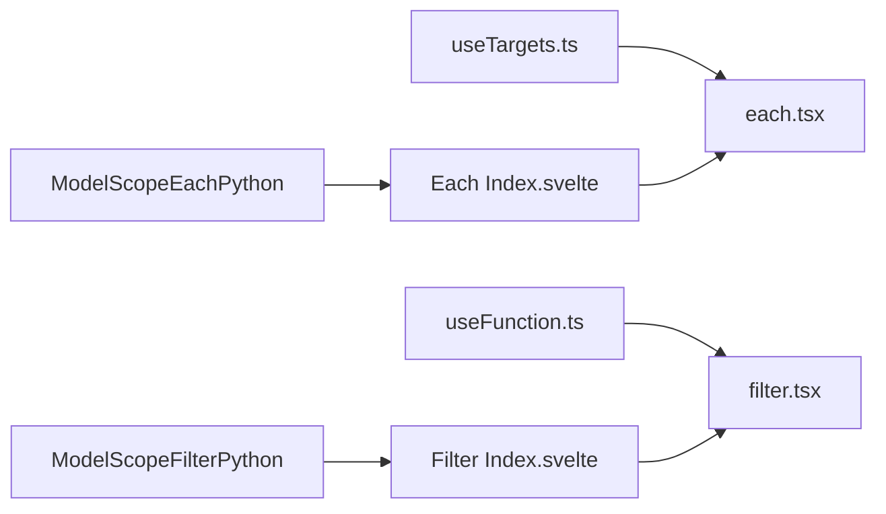

# 渲染组件

<cite>
**本文引用的文件**
- [each.tsx](file://frontend/base/each/each.tsx)
- [Index.svelte（Each）](file://frontend/base/each/Index.svelte)
- [EachItem.svelte](file://frontend/base/each/EachItem.svelte)
- [each.placeholder.tsx](file://frontend/base/each/each.placeholder.tsx)
- [useTargets.ts](file://frontend/utils/hooks/useTargets.ts)
- [useFunction.ts](file://frontend/utils/hooks/useFunction.ts)
- [filter.tsx](file://frontend/base/filter/filter.tsx)
- [Index.svelte（Filter）](file://frontend/base/filter/Index.svelte)
- [each/__init__.py](file://backend/modelscope_studio/components/base/each/__init__.py)
- [filter/__init__.py](file://backend/modelscope_studio/components/base/filter/__init__.py)
- [base/__init__.py](file://backend/modelscope_studio/components/base/__init__.py)
- [filter/README-zh_CN.md](file://docs/components/base/filter/README-zh_CN.md)
- [filter/demos/basic.py](file://docs/components/base/filter/demos/basic.py)
</cite>

## 目录

1. [引言](#引言)
2. [项目结构](#项目结构)
3. [核心组件](#核心组件)
4. [架构总览](#架构总览)
5. [组件详解](#组件详解)
6. [依赖关系分析](#依赖关系分析)
7. [性能考量](#性能考量)
8. [故障排查指南](#故障排查指南)
9. [结论](#结论)
10. [附录](#附录)

## 引言

本篇文档聚焦于渲染组件系列中的 Each 与 Filter，系统阐述它们在数据渲染与条件显示中的关键作用。Each 负责将列表数据逐项渲染，并为每一项注入上下文；Filter 则负责对上下文进行筛选或提取，支持以键名提取子对象或通过函数自定义过滤。文档将从架构、数据流、处理逻辑、集成与状态管理、性能优化到调试技巧进行全面说明，并提供多场景使用示例与最佳实践。

## 项目结构

渲染组件位于前端 base 包下，分别由 Svelte 入口组件与 React 实现组成，并在后端 Python 层提供对应的组件类以对接 Gradio 数据流。核心文件组织如下：

- 前端 Each：入口 Svelte 组件负责属性处理与占位符协调，React 实现负责循环渲染与上下文注入。
- 前端 Filter：入口 Svelte 组件负责属性处理，React 实现负责上下文筛选与透传。
- 后端 Each/Filter：Python 组件类，定义属性、可见性、前后处理与前端目录映射。

图表来源

- [Index.svelte（Each）:1-111](file://frontend/base/each/Index.svelte#L1-L111)
- [each.tsx:1-61](file://frontend/base/each/each.tsx#L1-L61)
- [EachItem.svelte:1-37](file://frontend/base/each/EachItem.svelte#L1-L37)
- [each.placeholder.tsx:1-31](file://frontend/base/each/each.placeholder.tsx#L1-L31)
- [Index.svelte（Filter）:1-52](file://frontend/base/filter/Index.svelte#L1-L52)
- [filter.tsx:1-41](file://frontend/base/filter/filter.tsx#L1-L41)
- [useTargets.ts:1-52](file://frontend/utils/hooks/useTargets.ts#L1-L52)
- [useFunction.ts:1-13](file://frontend/utils/hooks/useFunction.ts#L1-L13)
- [each/**init**.py:1-73](file://backend/modelscope_studio/components/base/each/__init__.py#L1-L73)
- [filter/**init**.py:1-45](file://backend/modelscope_studio/components/base/filter/__init__.py#L1-L45)
- [base/**init**.py:1-11](file://backend/modelscope_studio/components/base/__init__.py#L1-L11)

章节来源

- [Index.svelte（Each）:1-111](file://frontend/base/each/Index.svelte#L1-L111)
- [filter.tsx:1-41](file://frontend/base/filter/filter.tsx#L1-L41)
- [each.tsx:1-61](file://frontend/base/each/each.tsx#L1-L61)
- [each/**init**.py:1-73](file://backend/modelscope_studio/components/base/each/__init__.py#L1-L73)
- [filter/**init**.py:1-45](file://backend/modelscope_studio/components/base/filter/__init__.py#L1-L45)
- [base/**init**.py:1-11](file://backend/modelscope_studio/components/base/__init__.py#L1-L11)

## 核心组件

- Each：接收列表数据与上下文，逐项渲染子节点，并将每项的值合并到上下文中，供子组件消费。
- Filter：对当前上下文进行筛选或提取，支持两种模式：
  - as_item：按键名提取上下文中的子对象作为新上下文继续向下传递。
  - params_mapping：传入 JS 函数字符串，对上下文执行自定义过滤，返回新的上下文。
  - 两者均不提供时，阻断上下文传递，使后续属性覆盖失效。

章节来源

- [each.tsx:8-13](file://frontend/base/each/each.tsx#L8-L13)
- [filter.tsx:9-13](file://frontend/base/filter/filter.tsx#L9-L13)
- [filter/README-zh_CN.md:1-22](file://docs/components/base/filter/README-zh_CN.md#L1-L22)

## 架构总览

Each 与 Filter 的运行流程可概括为：前端入口组件解析属性并准备 React 实现；React 实现根据数据与上下文生成子树；Filter 在渲染前对上下文进行筛选，确保下游组件仅接收到所需数据。

图表来源

- [Index.svelte（Each）:1-111](file://frontend/base/each/Index.svelte#L1-L111)
- [each.tsx:35-58](file://frontend/base/each/each.tsx#L35-L58)
- [Index.svelte（Filter）:1-52](file://frontend/base/filter/Index.svelte#L1-L52)
- [filter.tsx:15-38](file://frontend/base/filter/filter.tsx#L15-L38)
- [useTargets.ts:5-51](file://frontend/utils/hooks/useTargets.ts#L5-L51)
- [useFunction.ts:5-12](file://frontend/utils/hooks/useFunction.ts#L5-L12)

## 组件详解

### Each 组件

Each 的职责是将列表数据逐项渲染，并为每个子项注入上下文。其关键点包括：

- 输入属性：value（数组）、contextValue（初始上下文）、children（子树）、内部插槽键。
- 渲染策略：先渲染一个“隔离”的隐藏容器，确保外部上下文不污染内部插槽；随后对 value 执行 map，为每一项创建 Item。
- 上下文注入：Item 将传入的 value 合并到 contextValue，形成最终上下文，再通过 ContextPropsProvider 注入给子树。
- 插槽解析：通过 useTargets 提取 children 中带有匹配 slotKey 的节点，保证渲染顺序与目标挂载正确。

图表来源

- [each.tsx:35-58](file://frontend/base/each/each.tsx#L35-L58)
- [useTargets.ts:5-51](file://frontend/utils/hooks/useTargets.ts#L5-L51)

章节来源

- [each.tsx:8-13](file://frontend/base/each/each.tsx#L8-L13)
- [each.tsx:35-58](file://frontend/base/each/each.tsx#L35-L58)
- [useTargets.ts:5-51](file://frontend/utils/hooks/useTargets.ts#L5-L51)
- [Index.svelte（Each）:66-104](file://frontend/base/each/Index.svelte#L66-L104)
- [each.placeholder.tsx:15-28](file://frontend/base/each/each.placeholder.tsx#L15-L28)
- [EachItem.svelte:23-27](file://frontend/base/each/EachItem.svelte#L23-L27)

### Filter 组件

Filter 的职责是对当前上下文进行筛选或提取，支持两种模式：

- as_item：从上下文中按键名提取子对象作为新上下文继续向下传递。
- params_mapping：传入 JS 函数字符串，通过 useFunction 解析为函数，对上下文执行自定义过滤。
- 未提供参数时：阻断上下文传递，使后续属性覆盖失效。

图表来源

- [filter.tsx:15-38](file://frontend/base/filter/filter.tsx#L15-L38)
- [useFunction.ts:5-12](file://frontend/utils/hooks/useFunction.ts#L5-L12)

章节来源

- [filter.tsx:9-13](file://frontend/base/filter/filter.tsx#L9-L13)
- [filter.tsx:15-38](file://frontend/base/filter/filter.tsx#L15-L38)
- [Index.svelte（Filter）:33-45](file://frontend/base/filter/Index.svelte#L33-L45)
- [filter/README-zh_CN.md:1-22](file://docs/components/base/filter/README-zh_CN.md#L1-L22)

### 属性与事件

- Each（前端入口 Index.svelte）
  - 关键属性：value、context_value、visible、elem_id、elem_classes、elem_style、\_internal.index 等。
  - 内部行为：通过占位组件收集变更（如 forceClone、合并后的 value/context_value），决定是否采用 React 实现或直接使用 EachItem 渲染。
- Each（React 实现 each.tsx）
  - 关键属性：value、contextValue、children、\_\_internal_slot_key。
  - 内部行为：隔离外部上下文，解析插槽目标，逐项渲染并注入上下文。
- Filter（前端入口 Index.svelte）
  - 关键属性：params_mapping、as_item、visible。
  - 内部行为：将 params_mapping 与 as_item 传递至 React 实现。
- Filter（React 实现 filter.tsx）
  - 关键属性：paramsMapping、asItem。
  - 内部行为：根据参数选择提取或函数过滤，更新上下文并透传。

章节来源

- [Index.svelte（Each）:17-57](file://frontend/base/each/Index.svelte#L17-L57)
- [Index.svelte（Each）:66-104](file://frontend/base/each/Index.svelte#L66-L104)
- [each.tsx:8-13](file://frontend/base/each/each.tsx#L8-L13)
- [Index.svelte（Filter）:16-31](file://frontend/base/filter/Index.svelte#L16-L31)
- [filter.tsx:9-13](file://frontend/base/filter/filter.tsx#L9-L13)

### 与状态管理的集成

- Each 通过 contextValue 与子项 value 合并，形成逐项上下文，供下游组件读取。
- Filter 通过 useContextPropsContext 获取当前上下文，结合 as_item 或 params_mapping 生成新的上下文，实现“条件显示/数据筛选”。
- 可结合后端组件的 visible 控制渲染可见性，前端入口组件在不可见时不会加载 React 实现，减少开销。

章节来源

- [each.tsx:15-33](file://frontend/base/each/each.tsx#L15-L33)
- [filter.tsx:19-27](file://frontend/base/filter/filter.tsx#L19-L27)
- [Index.svelte（Each）:66-104](file://frontend/base/each/Index.svelte#L66-L104)
- [Index.svelte（Filter）:33-45](file://frontend/base/filter/Index.svelte#L33-L45)

### 使用示例与场景

- 基础用法（无 Filter）
  - 场景：对列表数据进行循环渲染，按钮等子组件直接消费 Each 注入的上下文。
  - 参考示例路径：[filter/demos/basic.py:1-20](file://docs/components/base/filter/demos/basic.py#L1-L20)
- 使用 as_item
  - 场景：Each 输出的上下文包含多个字段，仅需将某字段作为新上下文继续传递给子组件。
  - 参考说明路径：[filter/README-zh_CN.md:1-22](file://docs/components/base/filter/README-zh_CN.md#L1-L22)
- 使用 params_mapping
  - 场景：通过 JS 函数对上下文进行复杂筛选或转换，例如过滤、拼装派生字段等。
  - 参考说明路径：[filter/README-zh_CN.md:1-22](file://docs/components/base/filter/README-zh_CN.md#L1-L22)

章节来源

- [filter/demos/basic.py:1-20](file://docs/components/base/filter/demos/basic.py#L1-L20)
- [filter/README-zh_CN.md:1-22](file://docs/components/base/filter/README-zh_CN.md#L1-L22)

## 依赖关系分析

- Each 依赖
  - 工具钩子：useTargets 用于解析插槽目标，确保渲染顺序与挂载正确。
  - 上下文：ContextPropsProvider 用于隔离与合并上下文。
- Filter 依赖
  - 工具钩子：useFunction 将字符串函数解析为可执行函数。
  - 上下文：ContextPropsProvider 用于透传筛选后的上下文。
- 后端组件
  - Each/Filter 分别继承自布局组件基类，定义属性、可见性、前后处理与前端目录映射。

图表来源

- [useTargets.ts:5-51](file://frontend/utils/hooks/useTargets.ts#L5-L51)
- [useFunction.ts:5-12](file://frontend/utils/hooks/useFunction.ts#L5-L12)
- [each.tsx:1-7](file://frontend/base/each/each.tsx#L1-L7)
- [filter.tsx:1-7](file://frontend/base/filter/filter.tsx#L1-L7)
- [Index.svelte（Each）:1-16](file://frontend/base/each/Index.svelte#L1-L16)
- [Index.svelte（Filter）:1-8](file://frontend/base/filter/Index.svelte#L1-L8)
- [each/**init**.py:1-73](file://backend/modelscope_studio/components/base/each/__init__.py#L1-L73)
- [filter/**init**.py:1-45](file://backend/modelscope_studio/components/base/filter/__init__.py#L1-L45)

章节来源

- [each.tsx:1-7](file://frontend/base/each/each.tsx#L1-L7)
- [filter.tsx:1-7](file://frontend/base/filter/filter.tsx#L1-L7)
- [useTargets.ts:5-51](file://frontend/utils/hooks/useTargets.ts#L5-L51)
- [useFunction.ts:5-12](file://frontend/utils/hooks/useFunction.ts#L5-L12)
- [each/**init**.py:1-73](file://backend/modelscope_studio/components/base/each/__init__.py#L1-L73)
- [filter/**init**.py:1-45](file://backend/modelscope_studio/components/base/filter/__init__.py#L1-L45)

## 性能考量

- 列表渲染
  - Each 对 value 执行 map 渲染，应避免在 children 中进行重型计算，尽量将计算前置或缓存。
  - 使用稳定 key（索引）有助于 React/Svelte 的 diff 优化，但若列表存在插入/删除，建议使用唯一 id 作为 key。
- 上下文合并
  - Each/EachItem 合并上下文时，尽量保持 value 结构简洁，避免深层嵌套导致的重复渲染。
- 条件筛选
  - Filter 的 params_mapping 应避免在每次渲染中创建新函数，推荐在上层定义并传入字符串形式的函数。
- 可见性控制
  - 通过 visible 控制组件渲染，不可见时不加载 React 实现，减少不必要的初始化与渲染。
- 大数据量处理
  - 优先考虑分页、虚拟滚动或懒加载策略，避免一次性渲染超大列表。
  - 合理拆分 Each 嵌套层级，减少上下文深度与渲染树复杂度。

## 故障排查指南

- 子组件无法读取上下文
  - 检查 Each 是否正确传入 contextValue 与 value，确认 EachItem 合并逻辑生效。
  - 若使用 Filter，请确认 as_item 键名正确或 params_mapping 返回了期望对象。
- 插槽渲染顺序异常
  - 确认插槽键（slotKey）一致，且 useTargets 能正确识别目标节点。
- Filter 不生效
  - 确认 params_mapping 字符串可被解析为函数，或 as_item 键名存在于当前上下文中。
  - 若未提供参数，Filter 会阻断上下文传递，这是预期行为。
- 渲染卡顿
  - 检查 Each 的 value 是否过大，必要时进行分页或虚拟化。
  - 避免在 children 中进行昂贵操作，将计算移至上游或使用 memo 化。

章节来源

- [each.tsx:15-33](file://frontend/base/each/each.tsx#L15-L33)
- [filter.tsx:15-38](file://frontend/base/filter/filter.tsx#L15-L38)
- [useTargets.ts:5-51](file://frontend/utils/hooks/useTargets.ts#L5-L51)
- [Index.svelte（Each）:66-104](file://frontend/base/each/Index.svelte#L66-L104)
- [Index.svelte（Filter）:33-45](file://frontend/base/filter/Index.svelte#L33-L45)

## 结论

Each 与 Filter 构成了渲染组件系列中“循环渲染”与“条件筛选”的核心能力。Each 通过上下文合并与插槽解析，为列表中的每一项提供一致的数据环境；Filter 则在渲染前对上下文进行提取或自定义过滤，满足多样化的条件显示与数据筛选需求。结合后端组件的可见性控制与前端工具钩子，可在保证性能的同时实现灵活的渲染策略。

## 附录

- API 概览（简要）
  - Each（前端入口）
    - 属性：value、context_value、visible、elem_id、elem_classes、elem_style、\_internal.index 等。
    - 行为：占位组件收集变更，决定是否采用 React 实现或 EachItem 渲染。
  - Each（React 实现）
    - 属性：value、contextValue、children、\_\_internal_slot_key。
    - 行为：隔离外部上下文，解析插槽目标，逐项渲染并注入上下文。
  - Filter（前端入口）
    - 属性：params_mapping、as_item、visible。
    - 行为：将参数传递至 React 实现。
  - Filter（React 实现）
    - 属性：paramsMapping、asItem。
    - 行为：根据 as_item 或 params_mapping 更新上下文并透传。
- 后端组件
  - Each/Filter 均继承自布局组件基类，定义属性、可见性、前后处理与前端目录映射。

章节来源

- [Index.svelte（Each）:17-57](file://frontend/base/each/Index.svelte#L17-L57)
- [each.tsx:8-13](file://frontend/base/each/each.tsx#L8-L13)
- [Index.svelte（Filter）:16-31](file://frontend/base/filter/Index.svelte#L16-L31)
- [filter.tsx:9-13](file://frontend/base/filter/filter.tsx#L9-L13)
- [each/**init**.py:23-51](file://backend/modelscope_studio/components/base/each/__init__.py#L23-L51)
- [filter/**init**.py:13-25](file://backend/modelscope_studio/components/base/filter/__init__.py#L13-L25)
