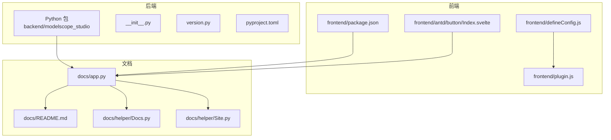
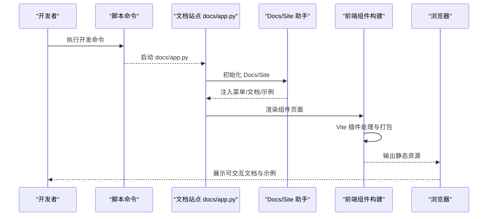
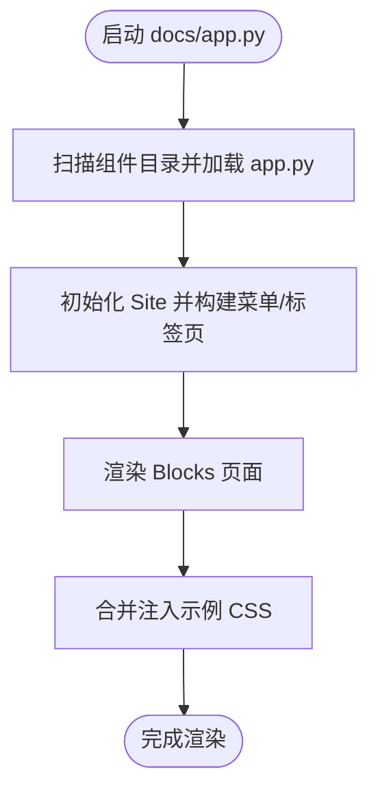
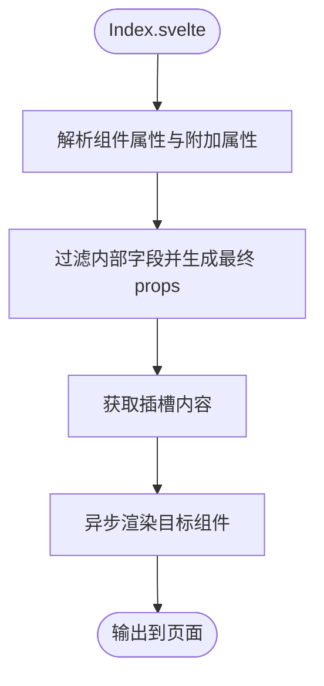
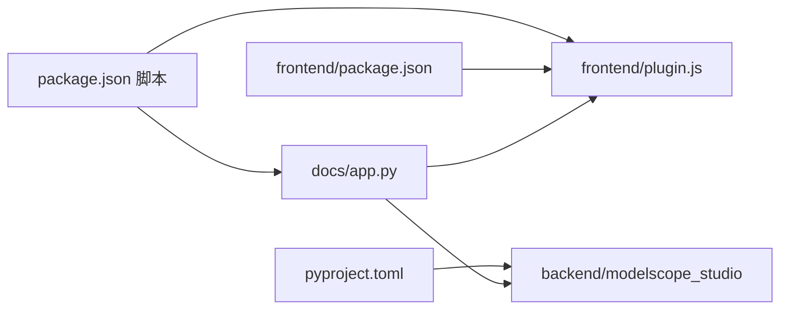

# 开发指南

<cite>
**本文引用的文件**
- [README.md](file://README.md)
- [package.json](file://package.json)
- [pyproject.toml](file://pyproject.toml)
- [frontend/package.json](file://frontend/package.json)
- [backend/modelscope_studio/__init__.py](file://backend/modelscope_studio/__init__.py)
- [backend/modelscope_studio/version.py](file://backend/modelscope_studio/version.py)
- [docs/app.py](file://docs/app.py)
- [docs/README.md](file://docs/README.md)
- [docs/helper/Docs.py](file://docs/helper/Docs.py)
- [docs/helper/Site.py](file://docs/helper/Site.py)
- [frontend/defineConfig.js](file://frontend/defineConfig.js)
- [frontend/plugin.js](file://frontend/plugin.js)
- [frontend/antd/button/Index.svelte](file://frontend/antd/button/Index.svelte)
- [backend/modelscope_studio/components/antd/__init__.py](file://backend/modelscope_studio/components/antd/__init__.py)
</cite>

## 目录

1. [简介](#简介)
2. [项目结构](#项目结构)
3. [核心组件](#核心组件)
4. [架构总览](#架构总览)
5. [详细组件分析](#详细组件分析)
6. [依赖关系分析](#依赖关系分析)
7. [性能考虑](#性能考虑)
8. [故障排查指南](#故障排查指南)
9. [结论](#结论)
10. [附录](#附录)

## 简介

本指南面向希望参与 ModelScope Studio（基于 Gradio 的第三方组件库）开发与扩展的工程师，涵盖开发环境搭建、依赖安装、开发服务器启动、构建配置、整体架构与开发流程、组件开发标准流程与最佳实践、文档系统使用与示例规范、测试与质量保障、调试技巧与常见问题、贡献指南与代码规范等内容。

## 项目结构

仓库采用多包工作区组织方式，主要由以下部分组成：

- 后端 Python 包：提供组件类与打包配置，负责组件在 Python 端的导出与分发。
- 前端 Svelte/React 生态：通过 Vite 构建，提供组件的前端实现与打包。
- 文档站点：基于 Gradio 的文档系统，动态加载各组件的文档与示例。
- 工具与脚本：变更集版本管理、发布脚本、编码检查等。

**图表来源**

- [backend/modelscope_studio/**init**.py:1-3](file://backend/modelscope_studio/__init__.py#L1-L3)
- [backend/modelscope_studio/version.py:1-2](file://backend/modelscope_studio/version.py#L1-L2)
- [pyproject.toml:1-257](file://pyproject.toml#L1-L257)
- [frontend/package.json:1-59](file://frontend/package.json#L1-L59)
- [frontend/defineConfig.js:1-19](file://frontend/defineConfig.js#L1-L19)
- [frontend/plugin.js:1-168](file://frontend/plugin.js#L1-L168)
- [frontend/antd/button/Index.svelte:1-74](file://frontend/antd/button/Index.svelte#L1-L74)
- [docs/app.py:1-595](file://docs/app.py#L1-L595)
- [docs/README.md:1-75](file://docs/README.md#L1-L75)
- [docs/helper/Docs.py:1-178](file://docs/helper/Docs.py#L1-L178)
- [docs/helper/Site.py:1-255](file://docs/helper/Site.py#L1-L255)

**章节来源**

- [README.md:80-101](file://README.md#L80-L101)
- [package.json:8-25](file://package.json#L8-L25)
- [pyproject.toml:1-257](file://pyproject.toml#L1-L257)
- [frontend/package.json:1-59](file://frontend/package.json#L1-L59)
- [docs/app.py:1-595](file://docs/app.py#L1-L595)

## 核心组件

- 后端组件导出：后端通过统一的导出入口将各子模块组件暴露给用户，便于按需导入与使用。
- 前端组件桥接：前端以 Svelte 组件形式包装 Ant Design/React 组件，并通过插件进行全局变量映射与外部化处理。
- 文档系统：文档站点通过动态加载各组件目录下的 app.py 生成文档与示例，支持中英文切换与主题样式注入。

**章节来源**

- [backend/modelscope_studio/components/antd/**init**.py:1-150](file://backend/modelscope_studio/components/antd/__init__.py#L1-L150)
- [frontend/antd/button/Index.svelte:1-74](file://frontend/antd/button/Index.svelte#L1-L74)
- [docs/app.py:19-91](file://docs/app.py#L19-L91)

## 架构总览

下图展示了从开发到运行的关键路径：开发者在本地执行命令启动文档站点，文档站点读取组件文档与示例，前端组件通过 Vite 插件进行构建与外部化，最终在浏览器中渲染。

**图表来源**

- [package.json:15](file://package.json#L15)
- [docs/app.py:577-595](file://docs/app.py#L577-L595)
- [docs/helper/Docs.py:12-178](file://docs/helper/Docs.py#L12-L178)
- [docs/helper/Site.py:9-255](file://docs/helper/Site.py#L9-L255)
- [frontend/defineConfig.js:1-19](file://frontend/defineConfig.js#L1-L19)
- [frontend/plugin.js:41-168](file://frontend/plugin.js#L41-L168)

## 详细组件分析

### 文档系统与站点渲染

- 动态加载：站点根据组件类型扫描目录，动态加载每个组件的 app.py 并提取 docs 字典。
- 菜单与标签页：通过 Site 类组织顶部标签页与侧边菜单，支持横向菜单与内嵌菜单联动。
- CSS 注入：为避免多 Blocks 场景下的样式丢失，将各示例的 CSS 合并注入到根 Blocks 中。

**图表来源**

- [docs/app.py:19-91](file://docs/app.py#L19-L91)
- [docs/helper/Site.py:41-255](file://docs/helper/Site.py#L41-L255)
- [docs/helper/Docs.py:163-178](file://docs/helper/Docs.py#L163-L178)

**章节来源**

- [docs/app.py:1-595](file://docs/app.py#L1-L595)
- [docs/helper/Site.py:1-255](file://docs/helper/Site.py#L1-L255)
- [docs/helper/Docs.py:1-178](file://docs/helper/Docs.py#L1-L178)

### 前端构建与组件桥接

- Vite 插件：对特定模块进行外部化映射，将 import 映射到 window 上的全局对象，减少打包体积并提升加载性能。
- Svelte 组件：通过 importComponent 包装 React/AntD 组件，统一处理属性、插槽与可见性控制。

**图表来源**

- [frontend/antd/button/Index.svelte:10-74](file://frontend/antd/button/Index.svelte#L10-L74)
- [frontend/plugin.js:41-168](file://frontend/plugin.js#L41-L168)

**章节来源**

- [frontend/defineConfig.js:1-19](file://frontend/defineConfig.js#L1-L19)
- [frontend/plugin.js:1-168](file://frontend/plugin.js#L1-L168)
- [frontend/antd/button/Index.svelte:1-74](file://frontend/antd/button/Index.svelte#L1-L74)

### 后端组件导出与版本

- 统一导出：后端组件通过 **init**.py 将各子模块组件集中导出，便于用户直接按需导入。
- 版本管理：版本号集中维护于 version.py，确保前后端版本一致。

**章节来源**

- [backend/modelscope_studio/**init**.py:1-3](file://backend/modelscope_studio/__init__.py#L1-L3)
- [backend/modelscope_studio/version.py:1-2](file://backend/modelscope_studio/version.py#L1-L2)
- [backend/modelscope_studio/components/antd/**init**.py:1-150](file://backend/modelscope_studio/components/antd/__init__.py#L1-L150)

## 依赖关系分析

- Python 依赖：后端通过 hatchling 构建，声明对 Gradio 的版本范围约束；前端依赖 Ant Design、React、Svelte 等生态库。
- 文档与脚本：package.json 定义了开发、构建、格式化、校验与发布相关脚本；pyproject.toml 配置了打包产物与元信息。

**图表来源**

- [package.json:8-25](file://package.json#L8-L25)
- [pyproject.toml:25-43](file://pyproject.toml#L25-L43)
- [frontend/package.json:1-59](file://frontend/package.json#L1-L59)
- [docs/app.py:1-595](file://docs/app.py#L1-L595)

**章节来源**

- [package.json:1-55](file://package.json#L1-L55)
- [pyproject.toml:1-257](file://pyproject.toml#L1-L257)
- [frontend/package.json:1-59](file://frontend/package.json#L1-L59)

## 性能考虑

- 外部化与别名：Vite 插件对常用库进行外部化映射，减少重复打包，提升首屏加载速度。
- 按需渲染：组件桥接层仅在 visible 为真时渲染，避免无用节点。
- CSS 合并：文档站点将示例 CSS 合并注入，避免多 Blocks 场景下的样式缺失导致的重绘与闪烁。

[本节为通用建议，不涉及具体文件分析]

## 故障排查指南

- 文档站点无法显示或样式异常
  - 确认是否在 Hugging Face Space 中设置了 ssr_mode=False。
  - 检查文档站点是否正确合并注入 CSS。
- 组件未生效或报错
  - 检查组件是否已正确导出并在 **init**.py 中聚合。
  - 确认前端组件的属性与插槽是否按约定传递。
- 构建失败或外部化异常
  - 检查 Vite 插件的 external excludes 配置是否覆盖了需要外部化的模块。
- 开发服务器启动失败
  - 使用文档提供的命令启动开发模式，确认端口与热更新配置。

**章节来源**

- [README.md:32-33](file://README.md#L32-L33)
- [docs/helper/Site.py:60-73](file://docs/helper/Site.py#L60-L73)
- [frontend/plugin.js:41-76](file://frontend/plugin.js#L41-L76)
- [backend/modelscope_studio/components/antd/**init**.py:1-150](file://backend/modelscope_studio/components/antd/__init__.py#L1-L150)

## 结论

本指南提供了从环境搭建到组件开发、文档系统使用、构建与部署、调试与故障排查的完整路径。建议在开发过程中遵循统一的组件开发流程与命名规范，充分利用文档系统与脚本工具，确保前后端一致性与可维护性。

[本节为总结性内容，不涉及具体文件分析]

## 附录

### 开发环境搭建与命令

- 克隆仓库并安装后端依赖与前端依赖
- 使用文档提供的开发命令启动本地文档站点

**章节来源**

- [README.md:82-101](file://README.md#L82-L101)
- [package.json:15](file://package.json#L15)

### 组件开发标准流程与最佳实践

- 在对应组件目录下创建或完善 app.py 与示例文件，确保文档系统可加载。
- 前端组件保持最小必要属性透传，避免冗余逻辑。
- 使用统一的插槽与样式注入机制，保证一致的外观与行为。

**章节来源**

- [docs/app.py:19-91](file://docs/app.py#L19-L91)
- [frontend/antd/button/Index.svelte:10-74](file://frontend/antd/button/Index.svelte#L10-L74)

### 文档系统使用与示例编写规范

- 使用 Docs 助手解析 Markdown 并渲染示例，支持折叠、标题与位置控制。
- 示例代码与渲染结果并排展示，便于对比与调试。

**章节来源**

- [docs/helper/Docs.py:82-178](file://docs/helper/Docs.py#L82-L178)

### 测试策略与质量保证

- 使用脚本进行格式化、风格检查与类型检查，确保代码一致性。
- 通过文档站点验证组件在不同环境下的表现。

**章节来源**

- [package.json:18-22](file://package.json#L18-L22)

### 调试技巧

- 利用 Gradio 的事件与更新机制，观察菜单切换与标签页联动。
- 在浏览器控制台查看组件渲染与属性传递情况。

**章节来源**

- [docs/helper/Site.py:203-255](file://docs/helper/Site.py#L203-L255)

### 贡献指南与代码规范

- 遵循项目既定的脚本与工具链，提交前确保通过格式化与校验。
- 变更版本与发布流程通过 Changesets 与脚本自动化。

**章节来源**

- [package.json:10-25](file://package.json#L10-L25)
