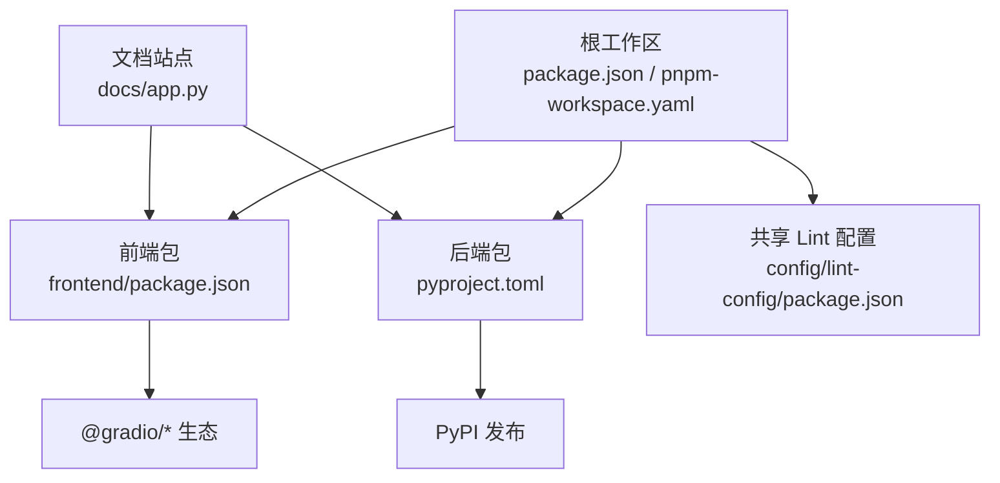
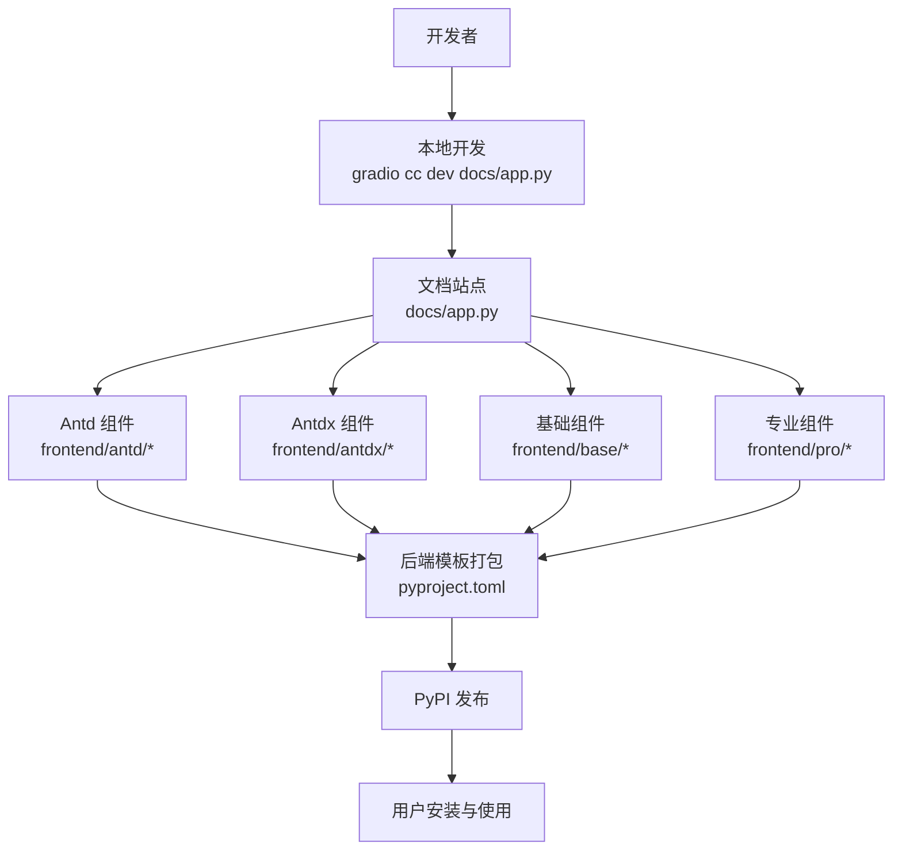
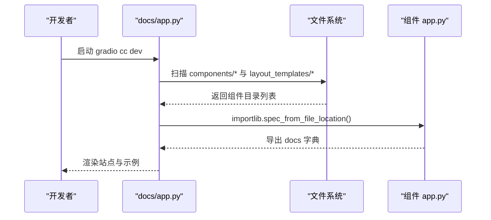
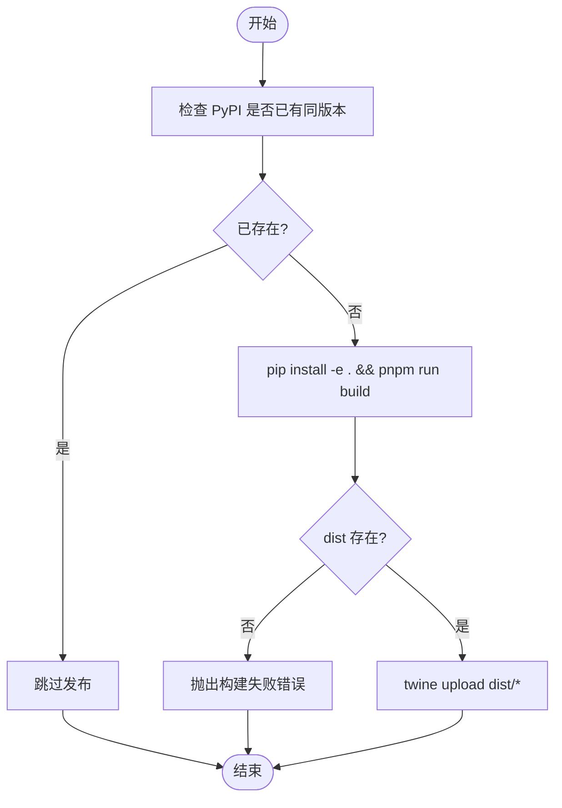
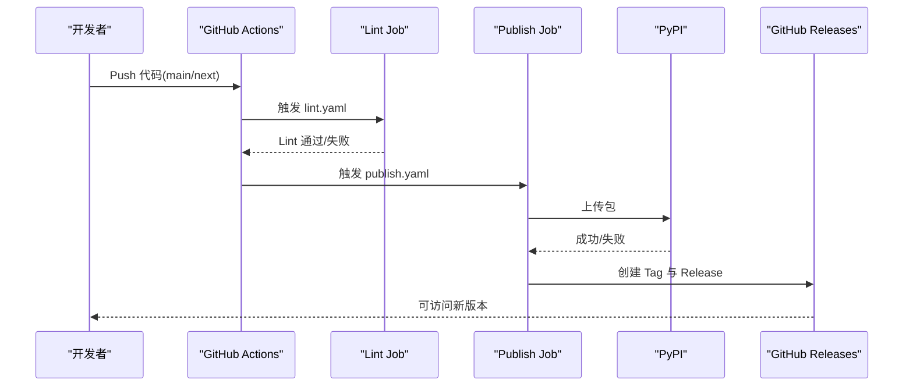
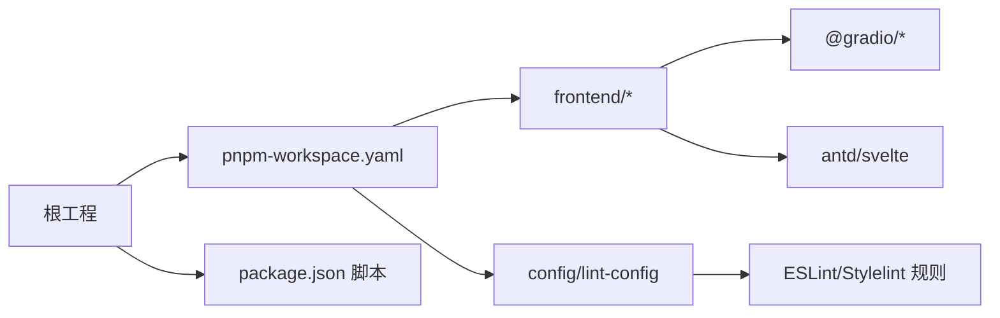

# 开发流程

<cite>
**本文引用的文件**
- [package.json](file://package.json)
- [pnpm-workspace.yaml](file://pnpm-workspace.yaml)
- [pyproject.toml](file://pyproject.toml)
- [README.md](file://README.md)
- [docs/app.py](file://docs/app.py)
- [frontend/package.json](file://frontend/package.json)
- [.github/workflows/lint.yaml](file://.github/workflows/lint.yaml)
- [.github/workflows/publish.yaml](file://.github/workflows/publish.yaml)
- [scripts/publish-to-pypi.mts](file://scripts/publish-to-pypi.mts)
- [scripts/create-tag-n-release.mts](file://scripts/create-tag-n-release.mts)
- [backend/modelscope_studio/version.py](file://backend/modelscope_studio/version.py)
</cite>

## 目录

1. [简介](#简介)
2. [项目结构](#项目结构)
3. [核心组件](#核心组件)
4. [架构总览](#架构总览)
5. [详细组件分析](#详细组件分析)
6. [依赖关系分析](#依赖关系分析)
7. [性能考虑](#性能考虑)
8. [故障排查指南](#故障排查指南)
9. [结论](#结论)
10. [附录](#附录)

## 简介

本指南面向 ModelScope Studio 的开发者与维护者，系统阐述项目的整体架构、开发模式与发布流程。项目采用 Monorepo 结构，前端基于 Svelte 与 Gradio 组件生态，后端提供 Python 包封装与模板生成，文档站点通过 Python 动态加载各组件示例与文档。文档覆盖从需求分析到组件发布的全流程，包括 Git 工作流、分支管理、代码审查、本地开发与热重载、CI/CD 与自动化发布。

## 项目结构

- 顶层使用 pnpm workspace 管理多包，包含根工程、前端包、基础与专业组件包、以及共享的 lint 配置包。
- 后端以 Python 包形式提供组件模板与打包规则，构建产物用于 PyPI 发布。
- 文档站点位于 docs 目录，通过 Python 动态扫描组件目录并渲染示例页面，支持本地开发与热更新。
- 前端组件以 Svelte + TypeScript 构建，配合 Gradio 生态进行演示与集成。

图表来源

- [pnpm-workspace.yaml:1-12](file://pnpm-workspace.yaml#L1-L12)
- [package.json:1-55](file://package.json#L1-L55)
- [frontend/package.json:1-59](file://frontend/package.json#L1-L59)
- [pyproject.toml:1-257](file://pyproject.toml#L1-L257)
- [docs/app.py:1-595](file://docs/app.py#L1-L595)

章节来源

- [pnpm-workspace.yaml:1-12](file://pnpm-workspace.yaml#L1-L12)
- [package.json:1-55](file://package.json#L1-L55)
- [frontend/package.json:1-59](file://frontend/package.json#L1-L59)
- [pyproject.toml:1-257](file://pyproject.toml#L1-L257)
- [docs/app.py:1-595](file://docs/app.py#L1-L595)

## 核心组件

- 文档站点与路由：docs/app.py 负责动态加载各组件的 app.py 示例与文档，组织多标签页与菜单项，并在本地开发时启用热更新。
- 前端组件生态：frontend 目录下按 antd、antdx、base、pro 等分类组织组件，每个组件包含 Svelte 实现与 Gradio 配置。
- 后端 Python 包：pyproject.toml 定义构建目标与产物清单，将大量模板文件打包进 wheel，供 PyPI 使用。
- 共享 Lint 配置：config/lint-config 提供统一的 ESLint、Stylelint 规则与解析器，保证跨包一致性。
- CI/CD 脚本：scripts 目录包含 PyPI 发布与 GitHub Release 创建脚本，配合 GitHub Actions 实现自动化发布。

章节来源

- [docs/app.py:1-595](file://docs/app.py#L1-L595)
- [frontend/package.json:1-59](file://frontend/package.json#L1-L59)
- [pyproject.toml:1-257](file://pyproject.toml#L1-L257)
- [config/lint-config/package.json:1-48](file://config/lint-config/package.json#L1-L48)
- [scripts/publish-to-pypi.mts:1-60](file://scripts/publish-to-pypi.mts#L1-L60)
- [scripts/create-tag-n-release.mts:1-131](file://scripts/create-tag-n-release.mts#L1-L131)

## 架构总览

ModelScope Studio 的开发与发布围绕“文档驱动的组件开发”展开：前端组件以 Svelte 实现，后端 Python 包负责模板与打包，文档站点作为统一入口聚合所有组件示例；CI/CD 在主分支触发构建与发布，确保版本一致性与可追溯性。

图表来源

- [docs/app.py:1-595](file://docs/app.py#L1-L595)
- [frontend/package.json:1-59](file://frontend/package.json#L1-L59)
- [pyproject.toml:1-257](file://pyproject.toml#L1-L257)
- [package.json:8-25](file://package.json#L8-L25)

章节来源

- [docs/app.py:1-595](file://docs/app.py#L1-L595)
- [pyproject.toml:1-257](file://pyproject.toml#L1-L257)
- [package.json:8-25](file://package.json#L8-L25)

## 详细组件分析

### 文档站点与组件发现机制

文档站点通过扫描 docs/components 与 docs/layout_templates 下的子目录，动态导入每个组件的 app.py 并提取其 docs 字段，形成统一的站点结构。该机制支持新增组件无需修改站点路由，只需在对应目录提供 app.py 与示例即可。

图表来源

- [docs/app.py:19-61](file://docs/app.py#L19-L61)

章节来源

- [docs/app.py:19-61](file://docs/app.py#L19-L61)

### 前端组件开发与构建

- 组件以 Svelte + TypeScript 编写，每个组件拥有独立 package.json 与 Gradio 配置，便于独立开发与演示。
- 顶层 package.json 提供统一的构建与开发脚本，调用 Gradio CLI 构建与启动文档站点。
- 前端包依赖 @gradio/\* 生态与 antd、svelte 等核心库，确保与 Gradio 组件生态兼容。

章节来源

- [frontend/package.json:1-59](file://frontend/package.json#L1-L59)
- [package.json:8-25](file://package.json#L8-L25)

### 后端模板打包与发布

- pyproject.toml 定义了大量模板文件的打包规则，构建产物包含后端组件模板，确保安装后可在 Python 端直接使用。
- 发布流程通过脚本检查版本是否已存在，若未存在则执行构建并使用 twine 上传至 PyPI。

图表来源

- [scripts/publish-to-pypi.mts:14-55](file://scripts/publish-to-pypi.mts#L14-L55)
- [pyproject.toml:45-245](file://pyproject.toml#L45-L245)

章节来源

- [scripts/publish-to-pypi.mts:14-55](file://scripts/publish-to-pypi.mts#L14-L55)
- [pyproject.toml:45-245](file://pyproject.toml#L45-L245)

### CI/CD 流程与自动化发布

- Lint 工作流：在 push 与 pull_request 上自动执行，安装 Python 与 Node 依赖，运行统一 lint 脚本，保障代码风格一致。
- 发布工作流：在 main/next 分支 push 时触发，但需要满足提交消息为“chore: update versions”的条件；只有满足条件的提交才会执行 PyPI 发布脚本；发布成功后创建 Git Tag 并创建 GitHub Release，内容来自变更日志。

图表来源

- [.github/workflows/lint.yaml:1-34](file://.github/workflows/lint.yaml#L1-L34)
- [.github/workflows/publish.yaml:1-74](file://.github/workflows/publish.yaml#L1-L74)
- [scripts/publish-to-pypi.mts:32-42](file://scripts/publish-to-pypi.mts#L32-L42)
- [scripts/create-tag-n-release.mts:88-115](file://scripts/create-tag-n-release.mts#L88-L115)

章节来源

- [.github/workflows/lint.yaml:1-34](file://.github/workflows/lint.yaml#L1-L34)
- [.github/workflows/publish.yaml:1-74](file://.github/workflows/publish.yaml#L1-L74)
- [scripts/publish-to-pypi.mts:32-42](file://scripts/publish-to-pypi.mts#L32-L42)
- [scripts/create-tag-n-release.mts:88-115](file://scripts/create-tag-n-release.mts#L88-L115)

## 依赖关系分析

- 包管理：根 package.json 与 pnpm-workspace.yaml 定义了工作区范围与脚本命令，frontend 与 config/lint-config 为独立包。
- 语言与工具链：Python 侧由 hatchling 构建，Node 侧由 pnpm 管理依赖与脚本；ESLint、Stylelint 由共享 lint 配置包提供。
- 组件生态：前端依赖 @gradio/\* 与 antd/svelte，文档站点通过 Python 导入组件示例，实现“文档即示例”的开发体验。

图表来源

- [pnpm-workspace.yaml:1-12](file://pnpm-workspace.yaml#L1-L12)
- [package.json:8-25](file://package.json#L8-L25)
- [frontend/package.json:8-40](file://frontend/package.json#L8-L40)
- [config/lint-config/package.json:8-42](file://config/lint-config/package.json#L8-L42)

章节来源

- [pnpm-workspace.yaml:1-12](file://pnpm-workspace.yaml#L1-L12)
- [package.json:8-25](file://package.json#L8-L25)
- [frontend/package.json:8-40](file://frontend/package.json#L8-L40)
- [config/lint-config/package.json:8-42](file://config/lint-config/package.json#L8-L42)

## 性能考虑

- 文档站点的动态导入仅在开发环境启用，生产构建可通过禁用 watch 或调整并发参数优化启动时间。
- 前端组件按需构建，避免不必要的全量编译；建议在本地开发时仅关注当前组件目录，减少无关文件监听。
- PyPI 发布前先检查版本是否存在，避免重复上传与网络浪费。

## 故障排查指南

- 文档站点无法热更新
  - 确认环境变量 GRADIO_WATCH_MODULE_NAME 设置正确，且 docs/app.py 在 dev 模式下运行。
  - 参考路径：[docs/app.py:10](file://docs/app.py#L10)
- 构建失败或 dist 不存在
  - 检查根工程与前端包的依赖安装是否完整，确认构建脚本执行成功。
  - 参考路径：[scripts/publish-to-pypi.mts:22-30](file://scripts/publish-to-pypi.mts#L22-L30)
- PyPI 重复发布被跳过
  - 若版本已在 PyPI 存在，脚本会跳过上传；请确认版本号变更或清理缓存。
  - 参考路径：[scripts/publish-to-pypi.mts:44-51](file://scripts/publish-to-pypi.mts#L44-L51)
- GitHub Release 创建失败
  - 检查 GITHUB_TOKEN 权限与仓库可见性，确认 CHANGELOG 内容可解析。
  - 参考路径：[scripts/create-tag-n-release.mts:88-115](file://scripts/create-tag-n-release.mts#L88-L115)

章节来源

- [docs/app.py:10](file://docs/app.py#L10)
- [scripts/publish-to-pypi.mts:22-30](file://scripts/publish-to-pypi.mts#L22-L30)
- [scripts/publish-to-pypi.mts:44-51](file://scripts/publish-to-pypi.mts#L44-L51)
- [scripts/create-tag-n-release.mts:88-115](file://scripts/create-tag-n-release.mts#L88-L115)

## 结论

ModelScope Studio 采用“文档驱动 + Monorepo + CI/CD 自动化”的开发模式，前端以 Svelte 与 Gradio 生态为核心，后端通过 Python 包打包模板并发布至 PyPI。通过统一的 lint 配置与工作流，团队可以高效协作并保持质量与一致性。建议在新增组件时遵循现有目录结构与命名规范，确保文档站点与发布流程顺畅。

## 附录

### 本地开发与热重载

- 安装依赖与构建
  - 参考路径：[README.md:82-94](file://README.md#L82-L94)
- 启动文档站点（含热重载）
  - 参考路径：[package.json:15](file://package.json#L15)
- 版本信息
  - 参考路径：[backend/modelscope_studio/version.py:1-2](file://backend/modelscope_studio/version.py#L1-L2)

章节来源

- [README.md:82-94](file://README.md#L82-L94)
- [package.json:15](file://package.json#L15)
- [backend/modelscope_studio/version.py:1-2](file://backend/modelscope_studio/version.py#L1-L2)
