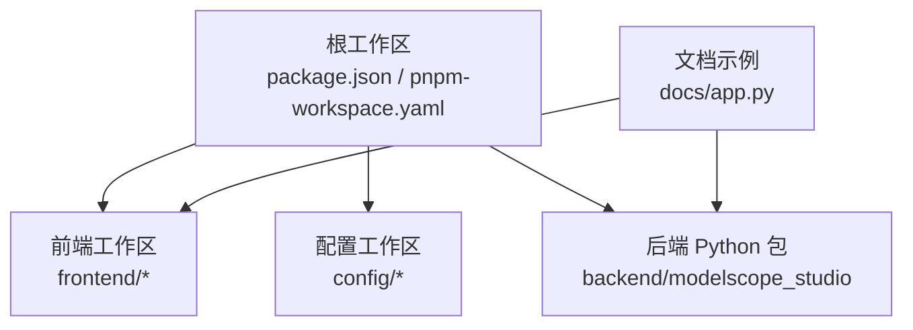
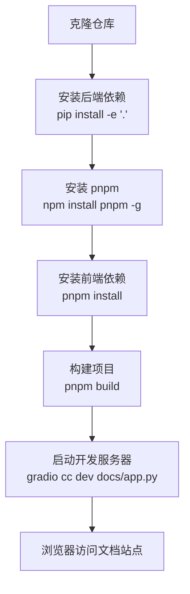
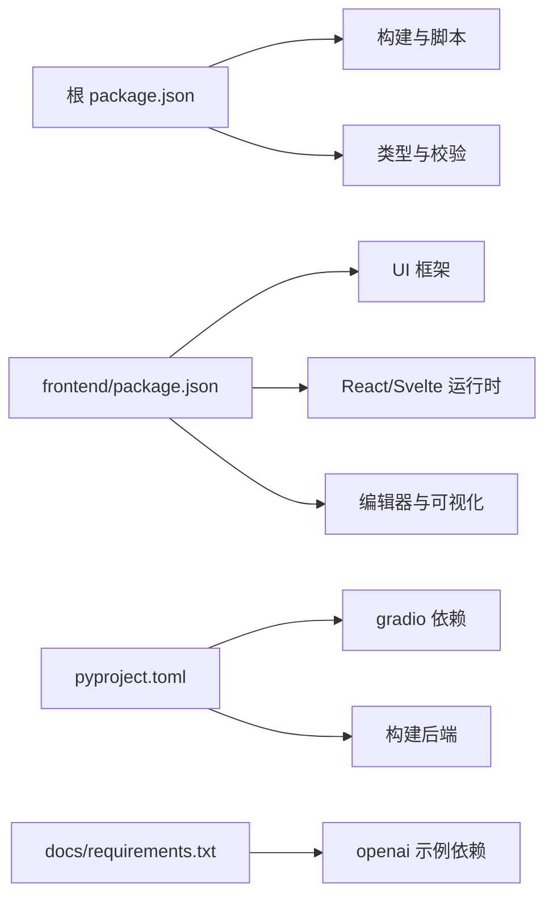

# 开发环境搭建

<cite>
**本文引用的文件**
- [README.md](file://README.md)
- [package.json](file://package.json)
- [pnpm-workspace.yaml](file://pnpm-workspace.yaml)
- [pyproject.toml](file://pyproject.toml)
- [frontend/package.json](file://frontend/package.json)
- [frontend/defineConfig.js](file://frontend/defineConfig.js)
- [frontend/tsconfig.json](file://frontend/tsconfig.json)
- [tsconfig.json](file://tsconfig.json)
- [svelte-tsconfig.json](file://svelte-tsconfig.json)
- [docs/requirements.txt](file://docs/requirements.txt)
- [docs/app.py](file://docs/app.py)
- [scripts/publish-to-pypi.mts](file://scripts/publish-to-pypi.mts)
</cite>

## 目录

1. [简介](#简介)
2. [项目结构](#项目结构)
3. [核心组件](#核心组件)
4. [架构总览](#架构总览)
5. [详细组件分析](#详细组件分析)
6. [依赖分析](#依赖分析)
7. [性能考虑](#性能考虑)
8. [故障排除指南](#故障排除指南)
9. [结论](#结论)
10. [附录](#附录)

## 简介

本指南面向希望在本地搭建并开发 ModelScope Studio 的工程师与贡献者，覆盖系统要求、Node.js 与 Python 环境配置、依赖安装、pnpm 工作空间设置、后端与前端依赖安装、构建流程、开发服务器启动与验证方法，并提供多操作系统下的注意事项与常见问题解决方案。

## 项目结构

该项目采用双层工作区设计：

- 根工作区：包含前端子包（antd、antdx、base、pro）、配置包（lint-config、changelog）以及根级脚本与配置。
- 后端 Python 包：位于 backend/modelscope_studio，通过可编辑安装集成到 Python 环境。
- 文档与示例：docs 目录提供示例应用与依赖约束。

图表来源

- [pnpm-workspace.yaml:1-12](file://pnpm-workspace.yaml#L1-L12)
- [package.json:1-55](file://package.json#L1-L55)
- [docs/app.py:1-595](file://docs/app.py#L1-L595)

章节来源

- [pnpm-workspace.yaml:1-12](file://pnpm-workspace.yaml#L1-L12)
- [package.json:1-55](file://package.json#L1-L55)
- [README.md:80-101](file://README.md#L80-L101)

## 核心组件

- 根级脚本与工具链：通过 package.json 定义构建、开发、格式化、校验等命令。
- pnpm 工作空间：统一管理前端子包与配置包，确保依赖版本一致与增量构建。
- Python 构建与打包：使用 hatchling 作为构建后端，支持源码分发与轮子分发。
- 文档站点：基于 Gradio 的 docs/app.py 提供组件演示与导航。
- 前端工程：Vite + Svelte 5，配合自定义插件与类型配置。

章节来源

- [package.json:8-25](file://package.json#L8-L25)
- [pnpm-workspace.yaml:1-12](file://pnpm-workspace.yaml#L1-L12)
- [pyproject.toml:1-257](file://pyproject.toml#L1-L257)
- [docs/app.py:577-595](file://docs/app.py#L577-L595)
- [frontend/package.json:1-59](file://frontend/package.json#L1-L59)

## 架构总览

下图展示了开发时从克隆仓库到启动文档站点的整体流程：

图表来源

- [README.md:82-101](file://README.md#L82-L101)
- [package.json:8-16](file://package.json#L8-L16)
- [docs/app.py:592-595](file://docs/app.py#L592-L595)

## 详细组件分析

### 系统要求与前置条件

- Python
  - 本地开发最低版本：Python 3.8+
  - CI/CD 发布环境：Python 3.12（由 .github/workflows/publish.yaml 指定）
  - 推荐使用虚拟环境隔离依赖
- Node.js
  - 最低版本：Node.js 18.0+，推荐使用 20+ 或更新版本
  - 使用 pnpm 作为包管理器；建议安装 pnpm 全局工具
- 操作系统
  - Linux/macOS/Windows 均可，注意路径分隔符与权限差异
- 可选：Docker（用于发布流程中的 twine 上传）

章节来源

- [pyproject.toml:15](file://pyproject.toml#L15)
- [README.md:82-101](file://README.md#L82-L101)

### 克隆与初始化

- 克隆仓库至本地
- 在根目录执行后端可编辑安装，使 Python 环境识别 backend/modelscope_studio
- 全局安装 pnpm
- 在根目录执行 pnpm install 安装所有工作区依赖
- 执行 pnpm build 完成前端构建

章节来源

- [README.md:82-101](file://README.md#L82-L101)
- [package.json:8-16](file://package.json#L8-L16)

### 后端依赖安装（Python）

- 使用可编辑安装将 backend/modelscope_studio 集成到当前 Python 环境
- Python 版本需满足 pyproject.toml 中的最低要求
- 如需发布流程，可参考发布脚本中的 twine 上传步骤

章节来源

- [pyproject.toml:15](file://pyproject.toml#L15)
- [scripts/publish-to-pypi.mts:22-42](file://scripts/publish-to-pypi.mts#L22-L42)

### 前端依赖安装与构建

- pnpm 工作空间包含多个前端子包与配置包，统一安装可避免版本冲突
- 前端工程使用 Vite 与 Svelte 5，defineConfig.js 提供插件与预处理配置
- tsconfig.json 与 svelte-tsconfig.json 提供类型检查与路径别名配置

章节来源

- [pnpm-workspace.yaml:1-12](file://pnpm-workspace.yaml#L1-L12)
- [frontend/package.json:1-59](file://frontend/package.json#L1-L59)
- [frontend/defineConfig.js:1-19](file://frontend/defineConfig.js#L1-L19)
- [frontend/tsconfig.json:1-8](file://frontend/tsconfig.json#L1-L8)
- [tsconfig.json:1-33](file://tsconfig.json#L1-L33)
- [svelte-tsconfig.json:1-4](file://svelte-tsconfig.json#L1-L4)

### 开发服务器启动与验证

- 使用 gradio cc dev docs/app.py 启动文档站点
- 文档站点会自动扫描 docs/components 与 docs/layout_templates 下的示例应用
- 访问默认地址（由 Gradio 输出）查看组件演示与导航

章节来源

- [README.md:96-101](file://README.md#L96-L101)
- [docs/app.py:10,19-61,577-595](file://docs/app.py#L10,L19-L61,L577-L595)

### 发布与打包（可选）

- 发布脚本会先执行 pip install -e '.' 与 pnpm run build，再检查 dist 是否存在
- 若版本未存在于 PyPI，则调用 twine 上传 dist/\* 资源

章节来源

- [scripts/publish-to-pypi.mts:14-55](file://scripts/publish-to-pypi.mts#L14-L55)

## 依赖分析

- 根级依赖
  - 构建与脚本：gradio cc、rimraf、tsx、husky 等
  - 类型与校验：typescript、svelte-check、eslint、stylelint、prettier
- 前端依赖
  - UI 框架：antd、@ant-design/x、@ant-design/icons
  - React/Svelte：react、react-dom、svelte 5
  - 编辑器与可视化：monaco-editor、@monaco-editor/react、mermaid、katex
- Python 依赖
  - 核心：gradio（版本范围约束）
  - 构建：hatchling、hatch-requirements-txt、hatch-fancy-pypi-readme
  - 可选：openai（文档示例中使用）

图表来源

- [package.json:26-52](file://package.json#L26-L52)
- [frontend/package.json:8-40](file://frontend/package.json#L8-L40)
- [pyproject.toml:2,42-43](file://pyproject.toml#L2,L42-L43)
- [docs/requirements.txt:1-4](file://docs/requirements.txt#L1-L4)

章节来源

- [package.json:26-52](file://package.json#L26-L52)
- [frontend/package.json:8-40](file://frontend/package.json#L8-L40)
- [pyproject.toml:2,42-43](file://pyproject.toml#L2,L42-L43)
- [docs/requirements.txt:1-4](file://docs/requirements.txt#L1-L4)

## 性能考虑

- 使用 pnpm 工作空间统一依赖版本，减少重复安装与内存占用
- 前端构建目标为 ESNext，结合现代浏览器特性提升运行效率
- 文档站点按需加载组件示例，避免一次性加载全部资源
- 在大型项目中建议启用 TypeScript 的 noEmit 与 svelte-check，提前发现类型问题

## 故障排除指南

- 安装后端依赖失败
  - 确认 Python 版本满足 >=3.8
  - 使用虚拟环境避免全局污染
  - 参考发布脚本中的 pip install -e '.' 流程进行排查
- pnpm 安装失败或依赖不兼容
  - 清理缓存并重试：删除 node_modules 与 pnpm-lock.yaml 后重新安装
  - 确认 pnpm 版本与工作区配置一致
- 构建失败
  - 检查是否已执行 pnpm build
  - 确认 dist 目录生成
- 开发服务器无法访问
  - 确认已执行 gradio cc dev docs/app.py
  - 检查防火墙与端口占用
  - 如在 Hugging Face Space 中使用，按 README 提示设置 ssr_mode=False

章节来源

- [pyproject.toml:15](file://pyproject.toml#L15)
- [scripts/publish-to-pypi.mts:22-30](file://scripts/publish-to-pypi.mts#L22-L30)
- [README.md:32,96-101](file://README.md#L32,L96-L101)

## 结论

通过以上步骤，您可以在本地成功搭建 ModelScope Studio 的开发环境，完成后端与前端依赖安装、构建与文档站点启动。遇到问题时，可依据本指南的故障排除部分逐项排查。建议在变更前先清理缓存并使用虚拟环境，以确保一致性与可复现性。

## 附录

### 常用命令速查

- 克隆与初始化
  - pip install -e '.'
  - npm install pnpm -g
  - pnpm install
  - pnpm build
- 启动开发服务器
  - gradio cc dev docs/app.py
- 格式化与校验
  - pnpm run lint
  - pnpm run format
- 版本与发布（CI）
  - pnpm run version
  - pnpm run ci:version
  - pnpm run ci:publish

章节来源

- [README.md:82-101](file://README.md#L82-L101)
- [package.json:8-25](file://package.json#L8-L25)
