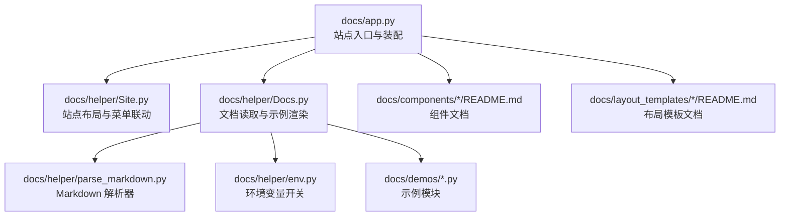
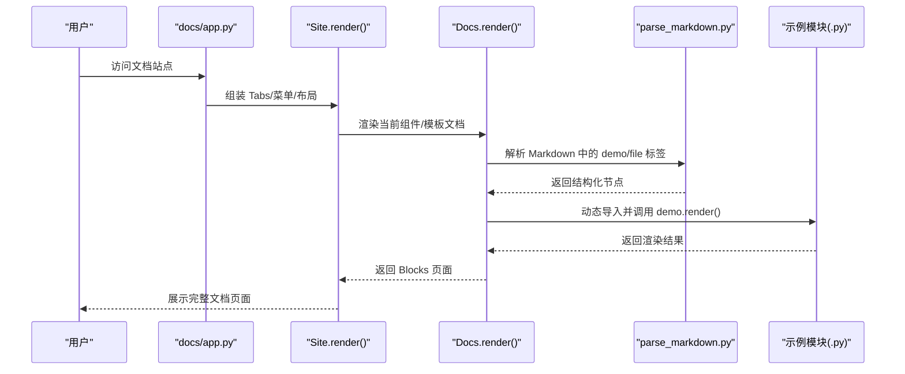
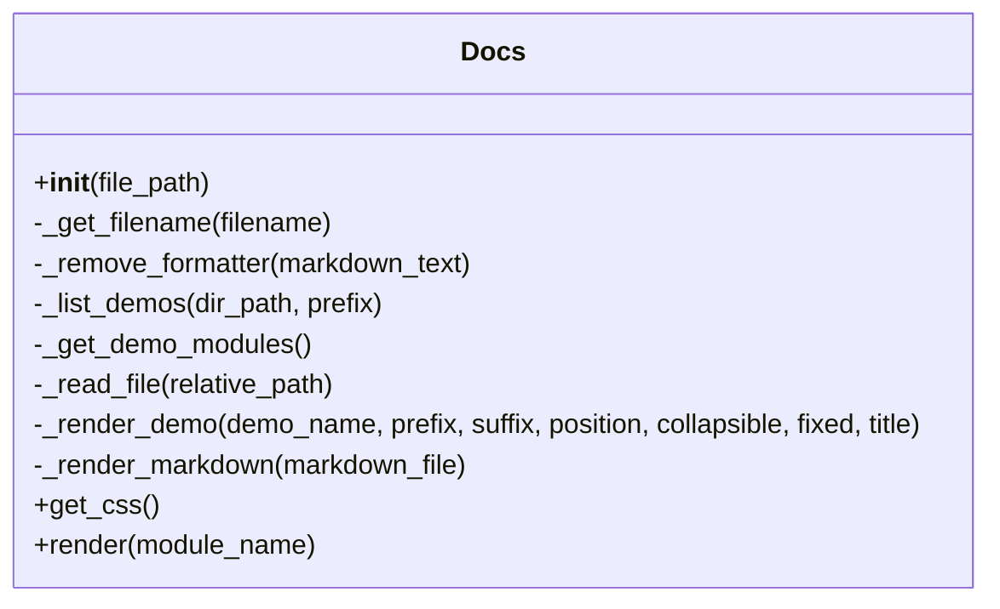
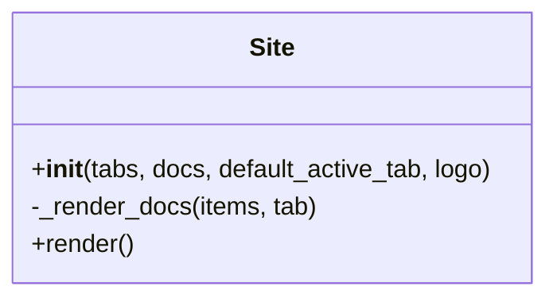
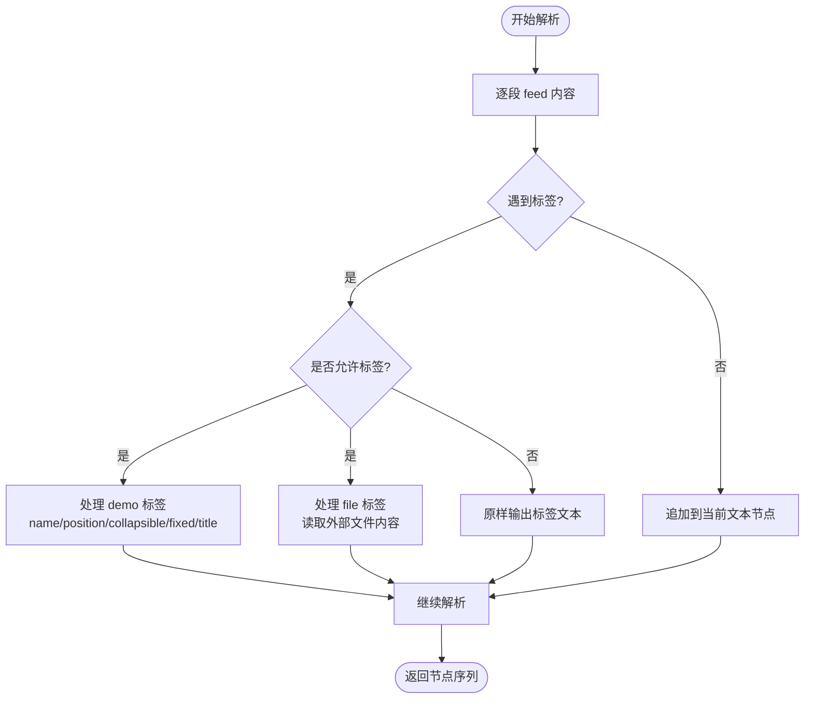
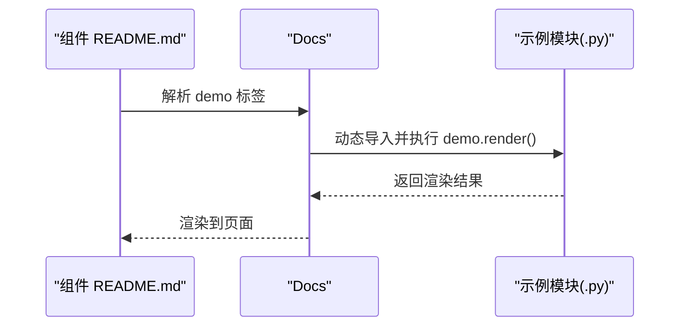
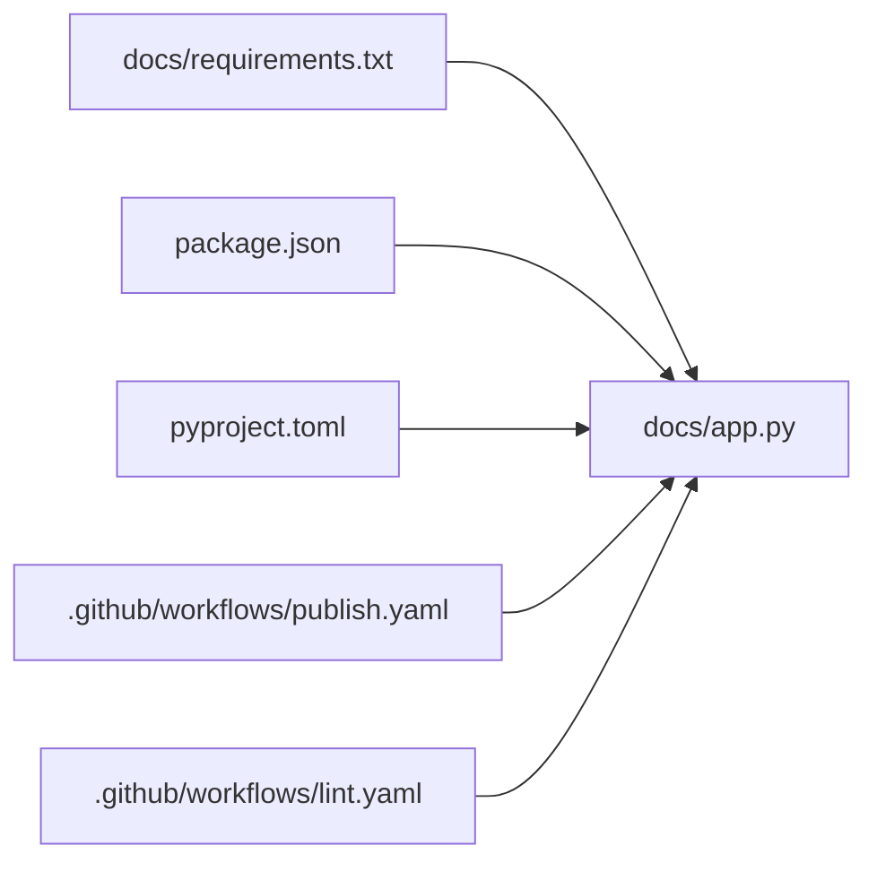

# 文档系统

<cite>
**本文引用的文件**   
- [docs/app.py](file://docs/app.py)
- [docs/helper/Docs.py](file://docs/helper/Docs.py)
- [docs/helper/Site.py](file://docs/helper/Site.py)
- [docs/helper/parse_markdown.py](file://docs/helper/parse_markdown.py)
- [docs/helper/env.py](file://docs/helper/env.py)
- [docs/components/antd/button/README.md](file://docs/components/antd/button/README.md)
- [docs/components/antd/button/app.py](file://docs/components/antd/button/app.py)
- [docs/layout_templates/chatbot/README.md](file://docs/layout_templates/chatbot/README.md)
- [docs/layout_templates/chatbot/app.py](file://docs/layout_templates/chatbot/app.py)
- [docs/demos/example.py](file://docs/demos/example.py)
- [docs/requirements.txt](file://docs/requirements.txt)
- [.github/workflows/publish.yaml](file://.github/workflows/publish.yaml)
- [.github/workflows/lint.yaml](file://.github/workflows/lint.yaml)
- [package.json](file://package.json)
- [pyproject.toml](file://pyproject.toml)
- [README.md](file://README.md)
</cite>

## 目录

1. [简介](#简介)
2. [项目结构](#项目结构)
3. [核心组件](#核心组件)
4. [架构总览](#架构总览)
5. [详细组件分析](#详细组件分析)
6. [依赖分析](#依赖分析)
7. [性能考虑](#性能考虑)
8. [故障排查指南](#故障排查指南)
9. [结论](#结论)
10. [附录](#附录)

## 简介

本指南面向维护者与贡献者，系统讲解 ModelScope Studio 文档系统的架构与使用方法，涵盖以下主题：

- 文档站点的整体架构与构建流程
- 组件文档生成机制（Markdown 解析、示例渲染）
- 示例管理与演示模块加载
- 多语言支持与环境变量处理
- Docs 工具类与 Site 工具类的使用
- 文档更新流程与发布策略

## 项目结构

文档系统位于 docs 目录，采用“按组件/模板分类 + 辅助工具”的组织方式：

- docs/app.py：站点入口与路由、菜单、Tab 布局、站点装配
- docs/helper/：文档解析与站点渲染工具
  - Docs.py：文档读取、Markdown 解析、示例模块加载与渲染
  - Site.py：站点整体布局、菜单联动、响应式侧边栏与内容区
  - parse_markdown.py：自定义 Markdown 解析器，支持 demo/file 标签
  - env.py：环境变量开关（是否为 ModelScope Studio 环境）
- docs/components/antd/button/...：各组件的文档与独立示例页面
- docs/layout_templates/chatbot/...：布局模板示例页面
- docs/demos/example.py：示例演示脚本模板
- docs/requirements.txt：文档站点运行所需依赖
- .github/workflows/publish.yaml、lint.yaml：CI 发布与代码检查
- package.json、pyproject.toml：前端与后端构建脚本与打包配置
- README.md：项目总体说明与开发指引

图表来源

- [docs/app.py:1-595](file://docs/app.py#L1-L595)
- [docs/helper/Site.py:1-255](file://docs/helper/Site.py#L1-L255)
- [docs/helper/Docs.py:1-178](file://docs/helper/Docs.py#L1-L178)
- [docs/helper/parse_markdown.py:1-84](file://docs/helper/parse_markdown.py#L1-L84)
- [docs/helper/env.py:1-4](file://docs/helper/env.py#L1-L4)

章节来源

- [docs/app.py:1-595](file://docs/app.py#L1-L595)
- [docs/requirements.txt:1-4](file://docs/requirements.txt#L1-L4)
- [package.json:1-55](file://package.json#L1-L55)
- [pyproject.toml:1-257](file://pyproject.toml#L1-L257)

## 核心组件

- Docs 工具类
  - 功能：扫描同目录下 Markdown 文件与 demos 子目录；根据环境变量选择中英文文档；解析 Markdown 并渲染示例；收集示例模块样式；统一渲染为 Gradio Blocks 页面。
  - 关键点：支持 demo 标签（name、position、collapsible、fixed、title）与 demo-prefix/demo-suffix 注入；支持 file 标签内联外部文件内容。
- Site 工具类
  - 功能：组装顶部 Tab 与侧边菜单；在内容区渲染对应文档；处理菜单切换事件；动态控制侧边栏尺寸与可见性；合并所有示例模块的 CSS。
- Markdown 解析器
  - 功能：基于 HTMLParser 的轻量解析器，识别 demo/file 标签，输出结构化节点序列（文本/示例），供 Docs 渲染。
- 环境变量处理
  - 功能：通过 MODELSCOPE_ENVIRONMENT 控制是否为 Studio 环境，决定文档命名与过滤规则。

章节来源

- [docs/helper/Docs.py:12-178](file://docs/helper/Docs.py#L12-L178)
- [docs/helper/Site.py:9-255](file://docs/helper/Site.py#L9-L255)
- [docs/helper/parse_markdown.py:12-84](file://docs/helper/parse_markdown.py#L12-L84)
- [docs/helper/env.py:1-4](file://docs/helper/env.py#L1-L4)

## 架构总览

文档系统以 docs/app.py 为入口，Site 负责整体布局与菜单联动，Docs 负责单个组件或模板的文档渲染。Markdown 解析器将文档中的 demo/file 标签转换为可执行的渲染指令，示例模块由 Docs 动态导入并在页面中渲染。

图表来源

- [docs/app.py:577-590](file://docs/app.py#L577-L590)
- [docs/helper/Site.py:41-254](file://docs/helper/Site.py#L41-L254)
- [docs/helper/Docs.py:171-178](file://docs/helper/Docs.py#L171-L178)
- [docs/helper/parse_markdown.py:80-84](file://docs/helper/parse_markdown.py#L80-L84)

## 详细组件分析

### Docs 工具类（文档渲染）

- 初始化与文件发现
  - 扫描同级目录下的 .md 文件，按环境变量过滤中英文版本；自动发现 demos 子目录下的 .py 示例模块并动态导入。
- Markdown 解析
  - 使用 parse_markdown 将文档转为节点序列，支持 text/demo/file 三类节点。
- 示例渲染
  - 支持 demo 标签属性：name、position、collapsible、fixed、title；支持 demo-prefix/demo-suffix 注入前缀/后缀代码；支持 file 标签内联外部文件内容。
- CSS 合并
  - 遍历示例模块，收集 css 字段并注入到页面，解决多 Blocks 场景下样式丢失问题。

图表来源

- [docs/helper/Docs.py:12-178](file://docs/helper/Docs.py#L12-L178)

章节来源

- [docs/helper/Docs.py:12-178](file://docs/helper/Docs.py#L12-L178)
- [docs/helper/parse_markdown.py:12-84](file://docs/helper/parse_markdown.py#L12-L84)

### Site 工具类（站点布局）

- Tabs 与菜单
  - 定义多个 Tab（概览、基础组件、高级组件、Antd 组件、Antdx 组件），每个 Tab 可包含 inline 菜单与内容区。
- 事件联动
  - 顶部菜单与侧边菜单联动，点击菜单项同步更新 active_key 与可见内容；应用挂载时根据屏幕宽度调整侧边栏默认大小。
- 响应式布局
  - 使用 Splitter 与 Layout 实现侧边栏与内容区的自适应；在小屏设备上隐藏侧边栏并提供内联菜单。
- CSS 注入
  - 合并所有示例模块的 CSS，保证示例样式生效。

图表来源

- [docs/helper/Site.py:9-255](file://docs/helper/Site.py#L9-L255)

章节来源

- [docs/helper/Site.py:9-255](file://docs/helper/Site.py#L9-L255)

### Markdown 解析器（demo/file 标签）

- 支持标签
  - demo：包含 name、position、collapsible、fixed、title 等属性；用于标识要渲染的示例模块。
  - demo-prefix/demo-suffix：用于在 demo 前后注入额外代码片段。
  - file：内联读取指定路径的文件内容并插入到当前位置。
- 解析流程
  - 基于 HTMLParser，遇到非允许标签则原样输出；遇到 demo/file 标签则构造相应节点；记录标签栈以便正确闭合。

图表来源

- [docs/helper/parse_markdown.py:12-84](file://docs/helper/parse_markdown.py#L12-L84)

章节来源

- [docs/helper/parse_markdown.py:12-84](file://docs/helper/parse_markdown.py#L12-L84)

### 环境变量与多语言支持

- 环境变量
  - MODELSCOPE_ENVIRONMENT=studio 时启用中文文档与特定过滤逻辑；否则仅显示英文文档。
- 文档命名与过滤
  - 中文文档以 -zh_CN.md 结尾；英文文档无后缀；Docs 在初始化时根据环境变量过滤可用文档文件。

章节来源

- [docs/helper/env.py:1-4](file://docs/helper/env.py#L1-L4)
- [docs/helper/Docs.py:17-31](file://docs/helper/Docs.py#L17-L31)

### 组件文档与示例管理

- 组件文档
  - 每个组件目录下包含 README.md 与 app.py；README.md 使用 demo 标签引用示例模块；app.py 通过 Docs 渲染该组件的文档页面。
- 示例模块
  - demos 目录下放置 .py 文件，Docs 动态导入并调用其 demo.render() 方法进行渲染；可在示例模块中定义 css 字符串以注入样式。
- 布局模板
  - layout_templates 目录下提供可复用的页面布局示例，同样通过 app.py 与 Docs 渲染。

图表来源

- [docs/components/antd/button/README.md:1-8](file://docs/components/antd/button/README.md#L1-L8)
- [docs/components/antd/button/app.py:1-7](file://docs/components/antd/button/app.py#L1-L7)
- [docs/helper/Docs.py:82-161](file://docs/helper/Docs.py#L82-L161)

章节来源

- [docs/components/antd/button/README.md:1-8](file://docs/components/antd/button/README.md#L1-L8)
- [docs/components/antd/button/app.py:1-7](file://docs/components/antd/button/app.py#L1-L7)
- [docs/layout_templates/chatbot/README.md:1-20](file://docs/layout_templates/chatbot/README.md#L1-L20)
- [docs/layout_templates/chatbot/app.py:1-7](file://docs/layout_templates/chatbot/app.py#L1-L7)
- [docs/demos/example.py:1-11](file://docs/demos/example.py#L1-L11)

## 依赖分析

- 运行时依赖
  - docs/requirements.txt 指定 gradio 与 modelscope_studio 版本，确保文档站点与组件库兼容。
- 构建与脚本
  - package.json 提供 dev/build/publish 等脚本；pyproject.toml 定义后端打包与产物清单。
- CI 工作流
  - publish.yaml：在分支推送时安装依赖、构建并发布至 PyPI，并创建标签与发布。
  - lint.yaml：执行代码风格与格式化检查。

图表来源

- [docs/requirements.txt:1-4](file://docs/requirements.txt#L1-L4)
- [package.json:1-55](file://package.json#L1-L55)
- [pyproject.toml:1-257](file://pyproject.toml#L1-L257)
- [.github/workflows/publish.yaml:1-74](file://.github/workflows/publish.yaml#L1-L74)
- [.github/workflows/lint.yaml:1-34](file://.github/workflows/lint.yaml#L1-L34)

章节来源

- [docs/requirements.txt:1-4](file://docs/requirements.txt#L1-L4)
- [package.json:1-55](file://package.json#L1-L55)
- [pyproject.toml:1-257](file://pyproject.toml#L1-L257)
- [.github/workflows/publish.yaml:1-74](file://.github/workflows/publish.yaml#L1-L74)
- [.github/workflows/lint.yaml:1-34](file://.github/workflows/lint.yaml#L1-L34)

## 性能考虑

- 多 Blocks 场景下的 CSS 注入
  - Site 合并所有示例模块的 CSS，避免在多 Blocks 中重复注入导致的样式丢失。
- 示例模块懒加载
  - Docs 仅在需要时动态导入示例模块，减少启动时的内存占用。
- 响应式布局优化
  - 侧边栏尺寸根据屏幕宽度动态调整，提升移动端体验。

章节来源

- [docs/helper/Site.py:55-73](file://docs/helper/Site.py#L55-L73)
- [docs/helper/Docs.py:58-75](file://docs/helper/Docs.py#L58-L75)
- [docs/helper/Site.py:241-249](file://docs/helper/Site.py#L241-L249)

## 故障排查指南

- 文档未显示中文或英文不正确
  - 检查 MODELSCOPE_ENVIRONMENT 是否设置为 studio 或未设置；确认 README 文件命名是否符合 -zh_CN.md 规范。
- 示例无法渲染或报错
  - 确认 demos 目录下存在对应名称的 .py 文件且包含 demo.render()；检查示例模块是否可被动态导入。
- 页面样式异常
  - 确认示例模块中定义了 css 字符串；Site 会合并这些样式；若仍异常，检查是否有多个 Blocks 导致样式未注入。
- 启动失败或端口占用
  - 使用 package.json 中的 dev 脚本启动；确保端口未被占用；必要时在 launch 参数中设置 ssr_mode=false。

章节来源

- [docs/helper/env.py:1-4](file://docs/helper/env.py#L1-L4)
- [docs/helper/Docs.py:58-75](file://docs/helper/Docs.py#L58-L75)
- [docs/helper/Site.py:55-73](file://docs/helper/Site.py#L55-L73)
- [README.md:32-32](file://README.md#L32-L32)
- [package.json:15-15](file://package.json#L15-L15)

## 结论

ModelScope Studio 文档系统通过 Docs 与 Site 两大工具类，结合自定义 Markdown 解析器与示例模块动态加载机制，实现了组件文档与布局模板的统一渲染与多语言支持。借助清晰的目录结构与 CI 流程，维护者可以高效地扩展文档内容、添加示例并发布更新。

## 附录

### 使用与维护指南（操作步骤）

- 编写组件文档
  - 在 docs/components/<category>/<component>/ 下新增 README.md，使用 demo 标签引用示例模块；如需中英文双语，分别提供 .md 与 -zh_CN.md。
- 添加示例代码
  - 在 docs/demos/ 下新增 .py 文件，导出 demo.render() 方法；如需样式，导出 css 字符串。
- 配置多语言支持
  - 设置 MODELSCOPE_ENVIRONMENT=studio 以启用中文文档；保持英文文档命名规范。
- 运行与调试
  - 使用 pnpm dev 启动文档站点；修改 docs/app.py 中的 tabs/docs 映射以注册新组件或模板。
- 发布与版本管理
  - 使用 package.json 中的 ci:publish 脚本发布至 PyPI；CI 工作流会在满足条件时自动创建标签与发布。

章节来源

- [docs/components/antd/button/README.md:1-8](file://docs/components/antd/button/README.md#L1-L8)
- [docs/components/antd/button/app.py:1-7](file://docs/components/antd/button/app.py#L1-L7)
- [docs/layout_templates/chatbot/README.md:1-20](file://docs/layout_templates/chatbot/README.md#L1-L20)
- [docs/layout_templates/chatbot/app.py:1-7](file://docs/layout_templates/chatbot/app.py#L1-L7)
- [docs/demos/example.py:1-11](file://docs/demos/example.py#L1-L11)
- [docs/helper/env.py:1-4](file://docs/helper/env.py#L1-L4)
- [package.json:8-24](file://package.json#L8-L24)
- [.github/workflows/publish.yaml:59-74](file://.github/workflows/publish.yaml#L59-L74)
