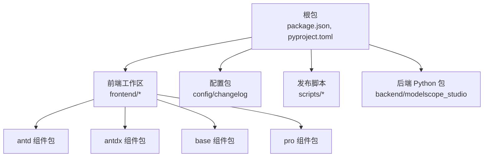
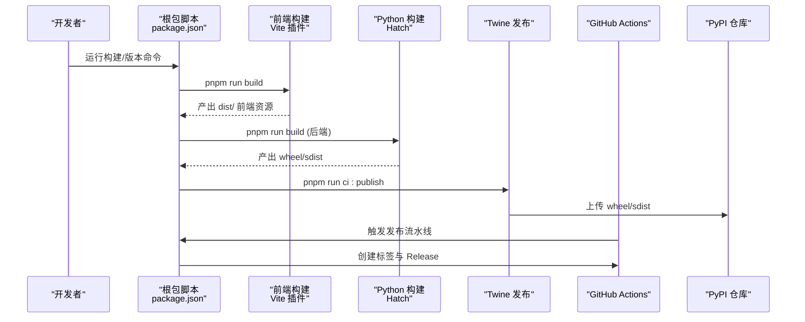
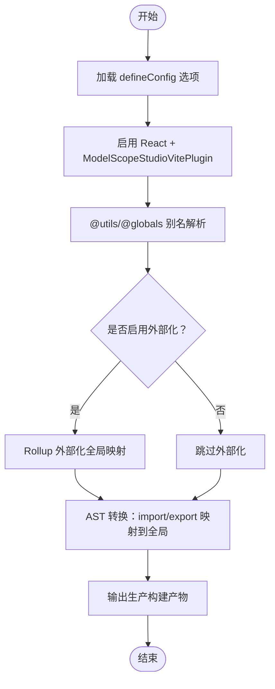
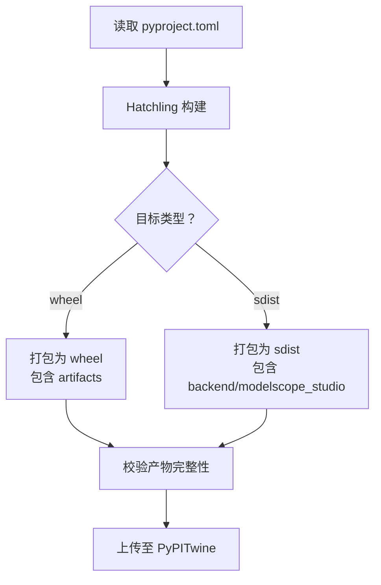
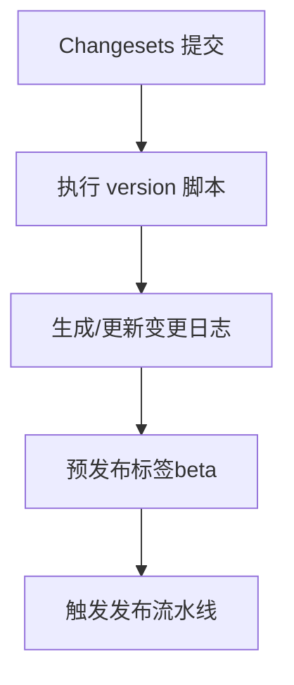
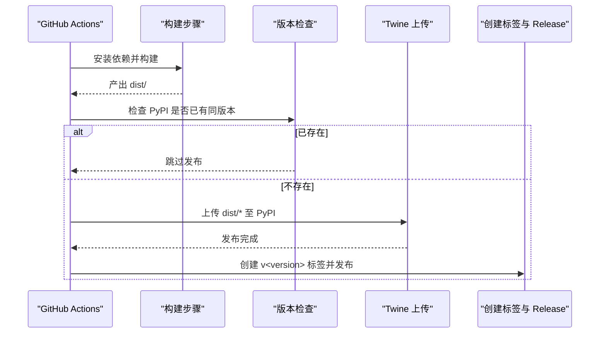
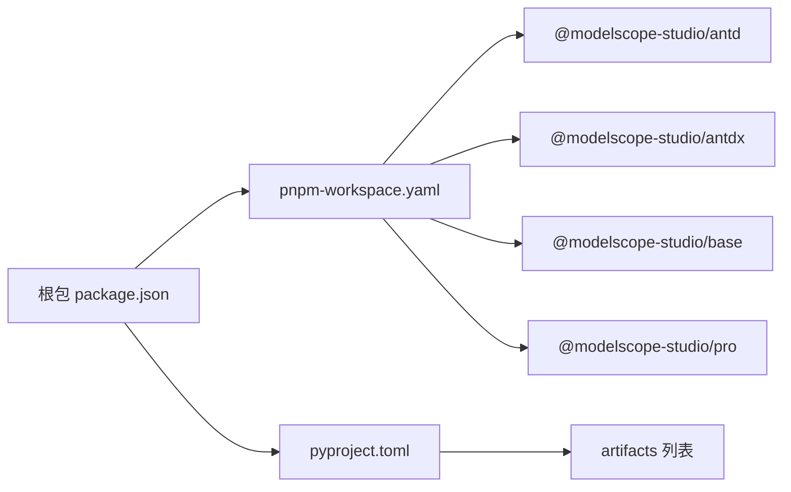

# 构建与部署

<cite>
**本文引用的文件**
- [package.json](file://package.json)
- [pyproject.toml](file://pyproject.toml)
- [pnpm-workspace.yaml](file://pnpm-workspace.yaml)
- [frontend/package.json](file://frontend/package.json)
- [frontend/defineConfig.js](file://frontend/defineConfig.js)
- [frontend/plugin.js](file://frontend/plugin.js)
- [.github/workflows/publish.yaml](file://.github/workflows/publish.yaml)
- [scripts/publish-to-pypi.mts](file://scripts/publish-to-pypi.mts)
- [scripts/create-tag-n-release.mts](file://scripts/create-tag-n-release.mts)
- [backend/modelscope_studio/version.py](file://backend/modelscope_studio/version.py)
- [config/changelog/src/index.ts](file://config/changelog/src/index.ts)
- [config/changelog/tsup.config.ts](file://config/changelog/tsup.config.ts)
- [.changeset/config.json](file://.changeset/config.json)
- [.changeset/pre.json](file://.changeset/pre.json)
- [README.md](file://README.md)
- [docs/requirements.txt](file://docs/requirements.txt)
</cite>

## 目录

1. [简介](#简介)
2. [项目结构](#项目结构)
3. [核心组件](#核心组件)
4. [架构总览](#架构总览)
5. [详细组件分析](#详细组件分析)
6. [依赖分析](#依赖分析)
7. [性能考虑](#性能考虑)
8. [故障排查指南](#故障排查指南)
9. [结论](#结论)
10. [附录](#附录)

## 简介

本指南面向 ModelScope Studio 的构建与发布流程，覆盖以下主题：

- 前端构建配置与打包策略（Vite 插件、外部化与别名）
- Python 包构建与分发（Hatch 配置、wheel/sdist 艺术品清单）
- 版本管理与变更集（Changesets、预发布标签、自动变更日志生成）
- 自动化发布流水线（PyPI 发布、GitHub 标签与 Release 创建）
- 部署最佳实践与注意事项
- 依赖更新与兼容性处理建议

## 项目结构

仓库采用多包工作区组织方式，包含根级包、前端子包与配置包：

- 根包：提供构建脚本、变更集配置与发布脚本
- 前端工作区：包含 antd、antdx、base、pro 等组件包
- 配置包：变更日志生成器与 Lint 配置
- 后端 Python 包：通过 Hatch 构建并打包为 wheel/sdist

图表来源

- [pnpm-workspace.yaml:1-12](file://pnpm-workspace.yaml#L1-L12)
- [package.json:1-55](file://package.json#L1-L55)
- [frontend/package.json:1-59](file://frontend/package.json#L1-L59)

章节来源

- [pnpm-workspace.yaml:1-12](file://pnpm-workspace.yaml#L1-L12)
- [package.json:1-55](file://package.json#L1-L55)
- [frontend/package.json:1-59](file://frontend/package.json#L1-L59)

## 核心组件

- 前端 Vite 构建插件：负责 React/Svelte 预处理、全局变量注入与外部化策略
- Python 包构建系统：基于 Hatch，定义 artifacts、wheel/sdist 打包范围与可选依赖
- 变更集与变更日志：Changesets 驱动的版本与日志生成，支持多包统一管理
- 自动化发布流水线：GitHub Actions 触发构建、PyPI 发布与 GitHub Release 创建

章节来源

- [frontend/plugin.js:1-168](file://frontend/plugin.js#L1-L168)
- [frontend/defineConfig.js:1-19](file://frontend/defineConfig.js#L1-L19)
- [pyproject.toml:1-257](file://pyproject.toml#L1-L257)
- [.changeset/config.json:1-15](file://.changeset/config.json#L1-L15)
- [.changeset/pre.json:1-16](file://.changeset/pre.json#L1-L16)
- [config/changelog/src/index.ts:1-222](file://config/changelog/src/index.ts#L1-L222)

## 架构总览

下图展示从本地开发到自动化发布的整体流程：

图表来源

- [package.json:8-25](file://package.json#L8-L25)
- [frontend/defineConfig.js:1-19](file://frontend/defineConfig.js#L1-L19)
- [frontend/plugin.js:41-76](file://frontend/plugin.js#L41-L76)
- [pyproject.toml:45-257](file://pyproject.toml#L45-L257)
- [.github/workflows/publish.yaml:1-74](file://.github/workflows/publish.yaml#L1-L74)
- [scripts/publish-to-pypi.mts:22-55](file://scripts/publish-to-pypi.mts#L22-L55)

## 详细组件分析

### 前端构建与打包

- 构建入口与插件链
  - 使用 Vite 插件组合：React SWC 与自定义 ModelScopeStudioVitePlugin
  - 定义全局变量映射，将常用依赖外部化至宿主环境（如 window.ms_globals.React）
  - 支持按需排除某些外部化项，便于在特定场景内联
- 别名与预处理
  - 通过别名指向 utils/globals 目录，简化导入路径
  - 关闭 Svelte 预处理以避免与现有方案冲突
- 生产环境优化
  - 在构建阶段设置 NODE_ENV 为 production
  - 对导出的模块进行 AST 转换，将 import/export 重写为对全局对象的访问，减少打包体积

图表来源

- [frontend/defineConfig.js:8-18](file://frontend/defineConfig.js#L8-L18)
- [frontend/plugin.js:41-76](file://frontend/plugin.js#L41-L76)
- [frontend/plugin.js:77-165](file://frontend/plugin.js#L77-L165)

章节来源

- [frontend/defineConfig.js:1-19](file://frontend/defineConfig.js#L1-L19)
- [frontend/plugin.js:1-168](file://frontend/plugin.js#L1-L168)

### Python 包构建与分发

- 构建后端 Python 包
  - 使用 Hatchling 作为构建后端，读取 pyproject.toml 中的元数据与依赖
  - 指定 artifacts 列表，确保模板与静态资源被包含进 wheel
  - wheel/sdist 的目标目录与排除规则明确，避免冗余文件进入发布包
- 依赖与兼容性
  - 通过 hatch-requirements-txt 与 hatch-fancy-pypi-readme 管理依赖与 README 渲染
  - Python 版本要求与分类器声明清晰，便于 PyPI 展示与安装器识别
- 版本号一致性
  - 根包与后端版本保持一致，避免发布时出现不匹配

图表来源

- [pyproject.toml:1-257](file://pyproject.toml#L1-L257)
- [backend/modelscope_studio/version.py:1-2](file://backend/modelscope_studio/version.py#L1-L2)

章节来源

- [pyproject.toml:1-257](file://pyproject.toml#L1-L257)
- [backend/modelscope_studio/version.py:1-2](file://backend/modelscope_studio/version.py#L1-L2)

### 版本管理与变更日志

- Changesets 配置
  - 使用自定义 changelog 生成器，支持 PR/Commit/用户链接解析
  - 统一版本基线与预发布标签（beta），便于预览与回滚
- 变更日志生成
  - 通过 tsup 编译配置包，输出 esm/cjs 两种格式
  - changelog 生成器聚合各包 CHANGELOG 并写入临时状态文件，最终由根包驱动生成统一发布内容
- 预发布模式
  - pre.json 指定预发布标签与初始版本，配合 Changesets 流程实现灰度发布

图表来源

- [.changeset/config.json:1-15](file://.changeset/config.json#L1-L15)
- [.changeset/pre.json:1-16](file://.changeset/pre.json#L1-L16)
- [config/changelog/src/index.ts:1-222](file://config/changelog/src/index.ts#L1-L222)
- [config/changelog/tsup.config.ts:1-21](file://config/changelog/tsup.config.ts#L1-L21)

章节来源

- [.changeset/config.json:1-15](file://.changeset/config.json#L1-L15)
- [.changeset/pre.json:1-16](file://.changeset/pre.json#L1-L16)
- [config/changelog/src/index.ts:1-222](file://config/changelog/src/index.ts#L1-L222)
- [config/changelog/tsup.config.ts:1-21](file://config/changelog/tsup.config.ts#L1-L21)

### 自动化发布流水线

- 触发条件
  - 推送至 main/next 分支且提交消息为“chore: update versions”
- 步骤分解
  - 安装 Python 与 Node 依赖，准备构建环境
  - 执行构建：pip 安装可编辑模式、pnpm 运行构建
  - 检查 dist 是否存在，防止构建失败继续发布
  - 使用 Twine 将 dist 内所有产物上传至 PyPI（带跳过已存在）
  - 若发布成功，调用脚本创建 Git 标签并推送，随后在 GitHub 创建 Release，正文来自变更日志

图表来源

- [.github/workflows/publish.yaml:1-74](file://.github/workflows/publish.yaml#L1-L74)
- [scripts/publish-to-pypi.mts:14-55](file://scripts/publish-to-pypi.mts#L14-L55)
- [scripts/create-tag-n-release.mts:80-125](file://scripts/create-tag-n-release.mts#L80-L125)

章节来源

- [.github/workflows/publish.yaml:1-74](file://.github/workflows/publish.yaml#L1-L74)
- [scripts/publish-to-pypi.mts:1-60](file://scripts/publish-to-pypi.mts#L1-L60)
- [scripts/create-tag-n-release.mts:1-131](file://scripts/create-tag-n-release.mts#L1-L131)

## 依赖分析

- 工作区与包关系
  - pnpm-workspace 定义了根包与多个前端子包，确保包间共享与构建顺序
  - 根包 package.json 提供统一脚本与依赖，集中管理构建与发布任务
- 前端依赖外部化策略
  - 通过 Vite 插件将 React、Ant Design、Monaco Editor 等映射到全局，减少打包体积
  - 支持按需排除外部化列表，满足不同宿主环境需求
- Python 依赖与兼容性
  - 通过 hatch-requirements-txt 与 hatch-fancy-pypi-readme 管理依赖与 README 渲染
  - 限定 Gradio 版本范围，确保与前端组件协同工作

图表来源

- [pnpm-workspace.yaml:1-12](file://pnpm-workspace.yaml#L1-L12)
- [package.json:1-55](file://package.json#L1-L55)
- [pyproject.toml:45-245](file://pyproject.toml#L45-L245)

章节来源

- [pnpm-workspace.yaml:1-12](file://pnpm-workspace.yaml#L1-L12)
- [package.json:1-55](file://package.json#L1-L55)
- [pyproject.toml:1-257](file://pyproject.toml#L1-L257)

## 性能考虑

- 前端构建优化
  - 启用外部化策略，减少重复打包与体积膨胀
  - AST 转换仅作用于导出/导入语句，避免影响运行时性能
  - 生产环境强制设置 NODE_ENV，确保最小化与 Tree-shaking 生效
- Python 包体积控制
  - 明确 artifacts 白名单，避免将测试或源码缓存文件打包
  - 使用 sdist/wheel 双轨发布，兼顾安装器与缓存效率
- 发布流程稳定性
  - 先检查 PyPI 是否已存在同版本，避免重复上传与失败重试
  - 使用“跳过已存在”参数，降低网络与时间开销

## 故障排查指南

- 构建失败
  - 检查 dist 目录是否存在；若缺失，确认前端构建脚本与 Vite 插件配置正确
  - 确认 Node 与 Python 环境版本满足要求
- PyPI 发布失败
  - 核对 PYPI_TOKEN 是否配置，网络连通性是否正常
  - 若提示版本已存在，确认是否需要升级版本或清理缓存
- GitHub Release 创建失败
  - 检查 GITHUB_TOKEN 权限与 REPO/OWNER 参数
  - 确认变更日志生成是否成功，避免空正文导致创建失败
- 依赖冲突
  - 更新 Gradio 版本范围与前端依赖，确保兼容性
  - 使用 docs/requirements.txt 固定示例依赖版本，便于复现与调试

章节来源

- [scripts/publish-to-pypi.mts:22-55](file://scripts/publish-to-pypi.mts#L22-L55)
- [scripts/create-tag-n-release.mts:88-125](file://scripts/create-tag-n-release.mts#L88-L125)
- [docs/requirements.txt:1-4](file://docs/requirements.txt#L1-L4)

## 结论

本指南提供了从本地开发到自动化发布的完整路径：前端通过 Vite 插件实现外部化与别名优化，Python 包借助 Hatch 实现精确打包与分发，版本与变更日志由 Changesets 驱动，最终通过 GitHub Actions 完成 PyPI 发布与 GitHub Release 创建。遵循本文档的步骤与最佳实践，可显著提升构建效率与发布可靠性。

## 附录

### 常用构建与发布命令

- 本地开发与构建
  - 运行根包构建脚本，生成前端与后端产物
  - 开发文档站点可通过指定入口启动
- 版本与变更日志
  - 使用 Changesets 更新版本并生成变更日志
  - 修复变更日志格式后重新生成
- 发布到 PyPI
  - 通过 CI 脚本检查版本是否已存在，存在则跳过，否则构建并上传
- 创建标签与 Release
  - 依据变更日志生成内容，创建 Git 标签并推送，随后在 GitHub 创建 Release

章节来源

- [package.json:8-25](file://package.json#L8-L25)
- [README.md:80-101](file://README.md#L80-L101)
- [scripts/publish-to-pypi.mts:44-55](file://scripts/publish-to-pypi.mts#L44-L55)
- [scripts/create-tag-n-release.mts:117-125](file://scripts/create-tag-n-release.mts#L117-L125)
