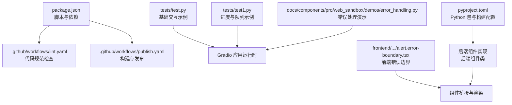
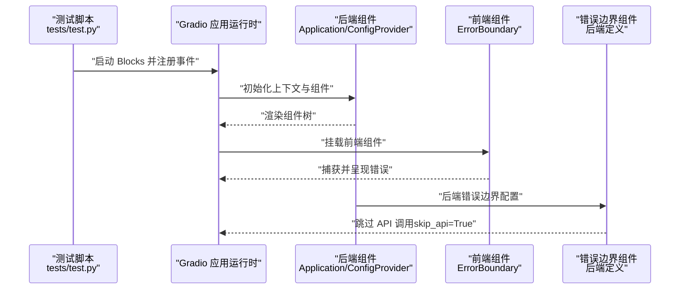
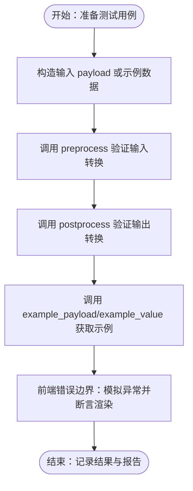
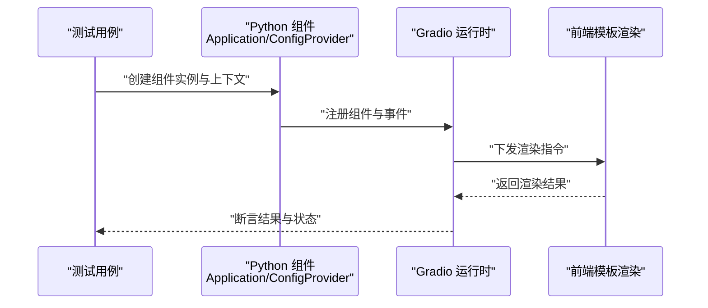
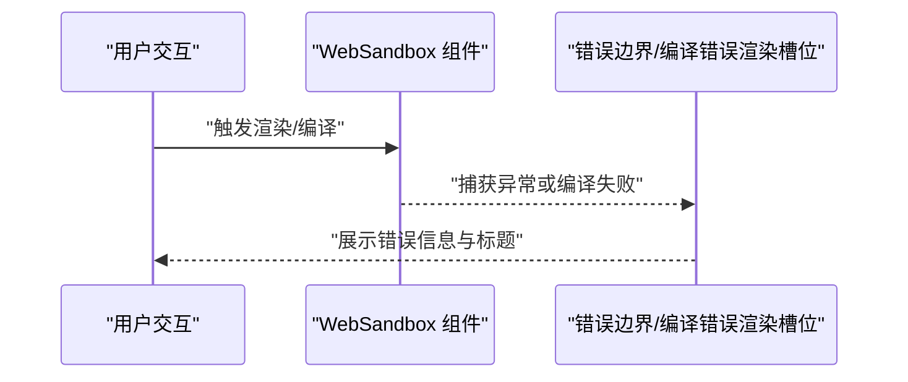
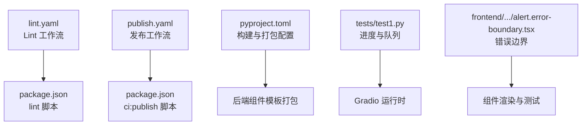

# 测试与调试

<cite>
**本文引用的文件**
- [package.json](file://package.json)
- [.github/workflows/lint.yaml](file://.github/workflows/lint.yaml)
- [.github/workflows/publish.yaml](file://.github/workflows/publish.yaml)
- [pyproject.toml](file://pyproject.toml)
- [tests/test.py](file://tests/test.py)
- [tests/test1.py](file://tests/test1.py)
- [frontend/antd/alert/error-boundary/alert.error-boundary.tsx](file://frontend/antd/alert/error-boundary/alert.error-boundary.tsx)
- [backend/modelscope_studio/components/antd/alert/error_boundary/__init__.py](file://backend/modelscope_studio/components/antd/alert/error_boundary/__init__.py)
- [backend/modelscope_studio/components/pro/monaco_editor/__init__.py](file://backend/modelscope_studio/components/pro/monaco_editor/__init__.py)
- [docs/components/pro/web_sandbox/demos/error_handling.py](file://docs/components/pro/web_sandbox/demos/error_handling.py)
</cite>

## 目录

1. [简介](#简介)
2. [项目结构](#项目结构)
3. [核心组件](#核心组件)
4. [架构总览](#架构总览)
5. [详细组件分析](#详细组件分析)
6. [依赖分析](#依赖分析)
7. [性能考虑](#性能考虑)
8. [故障排查指南](#故障排查指南)
9. [结论](#结论)
10. [附录](#附录)

## 简介

本指南面向 ModelScope Studio 的开发者与维护者，系统化介绍项目的测试与调试策略，覆盖单元测试、集成测试与端到端测试的编写与执行方式；同时提供调试技巧、常用工具使用方法、常见问题诊断与解决路径，以及性能测试与优化建议。文档以仓库现有脚本、工作流与示例为依据，确保可操作性与可追溯性。

## 项目结构

ModelScope Studio 是一个基于 Gradio 的第三方组件库，采用前后端分离：前端使用 Svelte（TypeScript）构建组件，后端通过 Python 组件桥接前端模板与 Gradio 运行时。测试与质量保障主要依托以下资源：

- 脚本与工作流：通过 package.json 中的脚本与 GitHub Actions 工作流实现自动化检查与发布。
- 示例与演示：tests 目录包含基础功能演示脚本，docs 下的 demos 提供更复杂的交互场景与错误处理示例。
- 组件实现：后端组件定义了 preprocess/postprocess、example_payload/example_value 等接口，便于测试与验证。

**图表来源**

- [package.json:1-55](file://package.json#L1-L55)
- [.github/workflows/lint.yaml:1-34](file://.github/workflows/lint.yaml#L1-L34)
- [.github/workflows/publish.yaml:1-74](file://.github/workflows/publish.yaml#L1-L74)
- [tests/test.py:1-17](file://tests/test.py#L1-L17)
- [tests/test1.py:1-15](file://tests/test1.py#L1-L15)
- [docs/components/pro/web_sandbox/demos/error_handling.py:1-28](file://docs/components/pro/web_sandbox/demos/error_handling.py#L1-L28)
- [pyproject.toml:1-257](file://pyproject.toml#L1-L257)
- [frontend/antd/alert/error-boundary/alert.error-boundary.tsx:1-34](file://frontend/antd/alert/error-boundary/alert.error-boundary.tsx#L1-L34)

**章节来源**

- [package.json:1-55](file://package.json#L1-L55)
- [.github/workflows/lint.yaml:1-34](file://.github/workflows/lint.yaml#L1-L34)
- [.github/workflows/publish.yaml:1-74](file://.github/workflows/publish.yaml#L1-L74)
- [pyproject.toml:1-257](file://pyproject.toml#L1-L257)

## 核心组件

- 测试脚本与演示
  - tests/test.py：展示 Application 与 ConfigProvider 的组合使用，以及按钮点击事件与输入输出的简单交互。
  - tests/test1.py：演示进度条与队列在 Gradio 接口中的使用。
- 错误处理与边界
  - 前端错误边界：frontend/antd/alert/error-boundary/alert.error-boundary.tsx 将 Ant Design 的 ErrorBoundary 以 sveltify 方式桥接到 Svelte 组件体系。
  - 后端错误边界：backend/modelscope_studio/components/antd/alert/error_boundary/**init**.py 定义了支持 slots 的错误边界组件，skip_api=True 表明其不直接暴露 API。
- 集成点示例
  - docs/components/pro/web_sandbox/demos/error_handling.py：演示 WebSandbox 在渲染错误、编译错误及自定义编译错误渲染下的行为，适合用于端到端测试与回归验证。

**章节来源**

- [tests/test.py:1-17](file://tests/test.py#L1-L17)
- [tests/test1.py:1-15](file://tests/test1.py#L1-L15)
- [frontend/antd/alert/error-boundary/alert.error-boundary.tsx:1-34](file://frontend/antd/alert/error-boundary/alert.error-boundary.tsx#L1-L34)
- [backend/modelscope_studio/components/antd/alert/error_boundary/**init**.py:20-72](file://backend/modelscope_studio/components/antd/alert/error_boundary/__init__.py#L20-L72)
- [docs/components/pro/web_sandbox/demos/error_handling.py:1-28](file://docs/components/pro/web_sandbox/demos/error_handling.py#L1-L28)

## 架构总览

下图展示了从测试脚本到组件渲染与错误处理的关键流程，体现单元级（组件接口）、集成级（前后端桥接）与端到端（应用运行时）的测试视角。

**图表来源**

- [tests/test.py:10-17](file://tests/test.py#L10-L17)
- [frontend/antd/alert/error-boundary/alert.error-boundary.tsx:1-34](file://frontend/antd/alert/error-boundary/alert.error-boundary.tsx#L1-L34)
- [backend/modelscope_studio/components/antd/alert/error_boundary/**init**.py:55-72](file://backend/modelscope_studio/components/antd/alert/error_boundary/__init__.py#L55-L72)

## 详细组件分析

### 单元测试：组件接口与数据流

- 目标
  - 验证后端组件的 preprocess/postprocess、example_payload/example_value 是否符合预期。
  - 验证前端组件在错误边界场景下的行为是否稳定。
- 建议用例
  - 对于后端组件：构造输入 payload，断言 preprocess 输出；构造后端值，断言 postprocess 输出；调用 example_payload/example_value 获取示例数据。
  - 对于前端错误边界：模拟异常抛出，断言错误边界是否正确捕获并渲染描述信息。
- 参考实现位置
  - 后端组件接口定义与示例：[backend/modelscope_studio/components/pro/monaco_editor/**init**.py:87-106](file://backend/modelscope_studio/components/pro/monaco_editor/__init__.py#L87-L106)
  - 前端错误边界实现：[frontend/antd/alert/error-boundary/alert.error-boundary.tsx:1-34](file://frontend/antd/alert/error-boundary/alert.error-boundary.tsx#L1-L34)

**图表来源**

- [backend/modelscope_studio/components/pro/monaco_editor/**init**.py:87-106](file://backend/modelscope_studio/components/pro/monaco_editor/__init__.py#L87-L106)
- [frontend/antd/alert/error-boundary/alert.error-boundary.tsx:1-34](file://frontend/antd/alert/error-boundary/alert.error-boundary.tsx#L1-L34)

**章节来源**

- [backend/modelscope_studio/components/pro/monaco_editor/**init**.py:87-106](file://backend/modelscope_studio/components/pro/monaco_editor/__init__.py#L87-L106)
- [frontend/antd/alert/error-boundary/alert.error-boundary.tsx:1-34](file://frontend/antd/alert/error-boundary/alert.error-boundary.tsx#L1-L34)

### 集成测试：前后端桥接与上下文

- 目标
  - 验证 Python 组件与前端模板的桥接是否正确，上下文（如 Application、ConfigProvider）是否生效。
- 建议用例
  - 在测试脚本中组合 Application 与 ConfigProvider，触发组件交互，断言渲染结果与状态变更。
  - 使用进度与队列接口验证异步任务的调度与反馈。
- 参考实现位置
  - 基础交互示例：[tests/test.py:10-17](file://tests/test.py#L10-L17)
  - 进度与队列示例：[tests/test1.py:6-14](file://tests/test1.py#L6-L14)

**图表来源**

- [tests/test.py:10-17](file://tests/test.py#L10-L17)
- [tests/test1.py:6-14](file://tests/test1.py#L6-L14)

**章节来源**

- [tests/test.py:10-17](file://tests/test.py#L10-L17)
- [tests/test1.py:6-14](file://tests/test1.py#L6-L14)

### 端到端测试：错误处理与回归验证

- 目标
  - 验证 WebSandbox 在渲染错误、编译错误及自定义编译错误渲染下的稳定性与可恢复性。
- 建议用例
  - 模拟渲染错误：点击按钮触发异常，断言错误提示出现。
  - 模拟编译错误：传入空模板或无效内容，断言编译错误渲染槽位被激活。
  - 自定义编译错误渲染：通过插槽参数映射，断言标题与副标题正确显示。
- 参考实现位置
  - 错误处理演示：[docs/components/pro/web_sandbox/demos/error_handling.py:1-28](file://docs/components/pro/web_sandbox/demos/error_handling.py#L1-L28)

**图表来源**

- [docs/components/pro/web_sandbox/demos/error_handling.py:1-28](file://docs/components/pro/web_sandbox/demos/error_handling.py#L1-L28)

**章节来源**

- [docs/components/pro/web_sandbox/demos/error_handling.py:1-28](file://docs/components/pro/web_sandbox/demos/error_handling.py#L1-L28)

## 依赖分析

- 质量与构建链路
  - Lint 工作流：安装 Python 与 Node 依赖，执行统一 lint 脚本，覆盖 JS/TS、样式与 Python 规范。
  - 发布工作流：在满足条件时执行构建与发布，并创建标签与发布说明。
- 包与构建配置
  - Python 包通过 hatchling 构建，artifacts 列表包含大量组件模板目录，确保打包完整性。
- 测试与调试工具
  - Gradio 提供队列与进度能力，适合在测试脚本中验证异步与进度反馈。
  - 前端错误边界组件通过 sveltify 与 ReactSlot 实现插槽渲染，便于在测试中注入自定义错误视图。

**图表来源**

- [.github/workflows/lint.yaml:1-34](file://.github/workflows/lint.yaml#L1-L34)
- [.github/workflows/publish.yaml:1-74](file://.github/workflows/publish.yaml#L1-L74)
- [package.json:18-24](file://package.json#L18-L24)
- [pyproject.toml:45-245](file://pyproject.toml#L45-L245)
- [tests/test1.py:6-14](file://tests/test1.py#L6-L14)
- [frontend/antd/alert/error-boundary/alert.error-boundary.tsx:1-34](file://frontend/antd/alert/error-boundary/alert.error-boundary.tsx#L1-L34)

**章节来源**

- [.github/workflows/lint.yaml:1-34](file://.github/workflows/lint.yaml#L1-L34)
- [.github/workflows/publish.yaml:1-74](file://.github/workflows/publish.yaml#L1-L74)
- [package.json:18-24](file://package.json#L18-L24)
- [pyproject.toml:45-245](file://pyproject.toml#L45-L245)

## 性能考虑

- 异步与队列
  - 使用 Gradio 的 queue() 与 Progress 接口，可在测试脚本中验证任务调度与进度回调的性能表现。
  - 参考：[tests/test1.py:6-14](file://tests/test1.py#L6-L14)
- 前端渲染与错误边界
  - 错误边界组件应尽量避免额外渲染开销，确保在异常情况下快速降级并展示最小化 UI。
  - 参考：[frontend/antd/alert/error-boundary/alert.error-boundary.tsx:1-34](file://frontend/antd/alert/error-boundary/alert.error-boundary.tsx#L1-L34)
- 打包与模板
  - Python 包的 artifacts 列表包含大量组件模板，建议在本地开发时仅加载必要模板，减少构建时间。
  - 参考：[pyproject.toml:45-245](file://pyproject.toml#L45-L245)

[本节为通用指导，无需具体文件分析]

## 故障排查指南

- 常见问题与定位
  - 渲染错误：通过 docs/components/pro/web_sandbox/demos/error_handling.py 中的演示，确认错误边界是否正确捕获并渲染。
  - 编译错误：当模板为空或语法错误时，检查编译错误渲染槽位是否被激活。
  - 插槽参数映射：若自定义错误视图未生效，检查参数映射是否正确传递至插槽。
- 调试步骤
  - 启动测试脚本，观察控制台输出与页面交互。
  - 在前端错误边界组件中增加日志或最小化渲染，确认异常路径。
  - 使用 Gradio 的队列与进度接口验证异步任务的响应时间与稳定性。
- 参考实现位置
  - 错误处理演示：[docs/components/pro/web_sandbox/demos/error_handling.py:1-28](file://docs/components/pro/web_sandbox/demos/error_handling.py#L1-L28)
  - 前端错误边界：[frontend/antd/alert/error-boundary/alert.error-boundary.tsx:1-34](file://frontend/antd/alert/error-boundary/alert.error-boundary.tsx#L1-L34)

**章节来源**

- [docs/components/pro/web_sandbox/demos/error_handling.py:1-28](file://docs/components/pro/web_sandbox/demos/error_handling.py#L1-L28)
- [frontend/antd/alert/error-boundary/alert.error-boundary.tsx:1-34](file://frontend/antd/alert/error-boundary/alert.error-boundary.tsx#L1-L34)

## 结论

本指南基于仓库现有脚本、工作流与示例，给出了覆盖单元、集成与端到端的测试策略与调试方法。建议在日常开发中：

- 以组件接口与数据流为核心编写单元测试；
- 以上下文与事件驱动为核心编写集成测试；
- 以错误处理与交互回归为核心编写端到端测试；
- 结合 Gradio 队列与进度能力进行性能验证；
- 借助 GitHub Actions 工作流确保代码质量与发布一致性。

[本节为总结，无需具体文件分析]

## 附录

- 执行测试套件
  - 本地执行：参考 package.json 中的脚本，先安装依赖，再运行相应测试脚本。
  - 参考：[package.json:8-24](file://package.json#L8-L24)
- 质量检查与发布
  - Lint 工作流：[lint.yaml:1-34](file://.github/workflows/lint.yaml#L1-L34)
  - 发布工作流：[publish.yaml:1-74](file://.github/workflows/publish.yaml#L1-L74)
- 组件打包与模板
  - Python 包构建配置：[pyproject.toml:45-245](file://pyproject.toml#L45-L245)

**章节来源**

- [package.json:8-24](file://package.json#L8-L24)
- [.github/workflows/lint.yaml:1-34](file://.github/workflows/lint.yaml#L1-L34)
- [.github/workflows/publish.yaml:1-74](file://.github/workflows/publish.yaml#L1-L74)
- [pyproject.toml:45-245](file://pyproject.toml#L45-L245)
