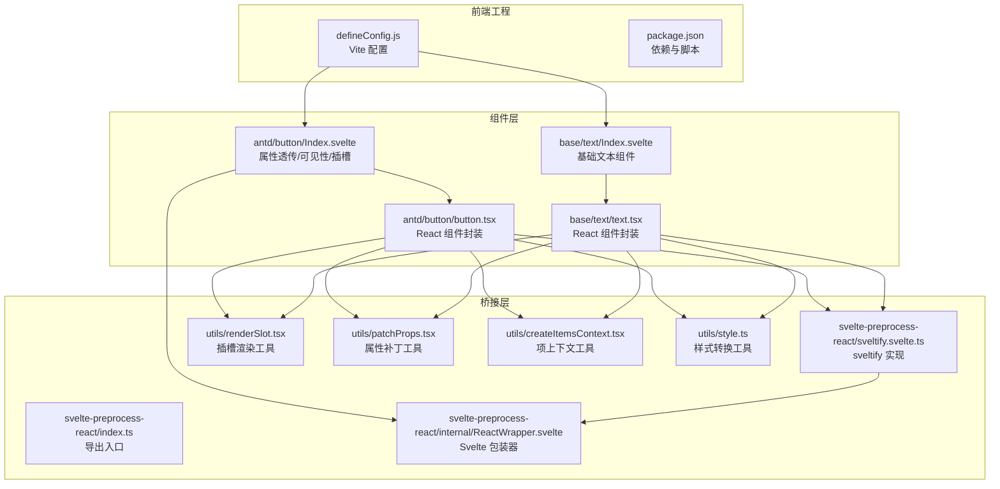
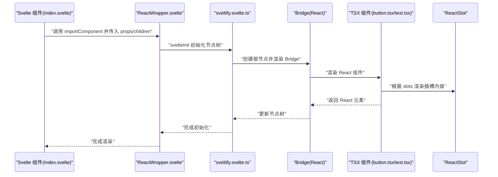
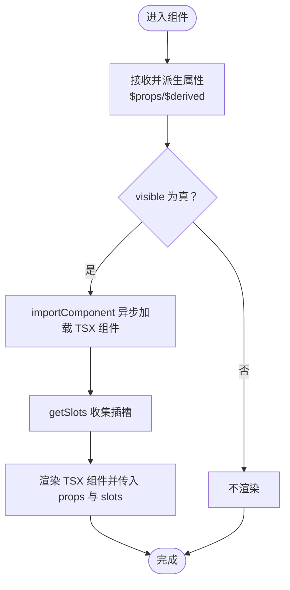
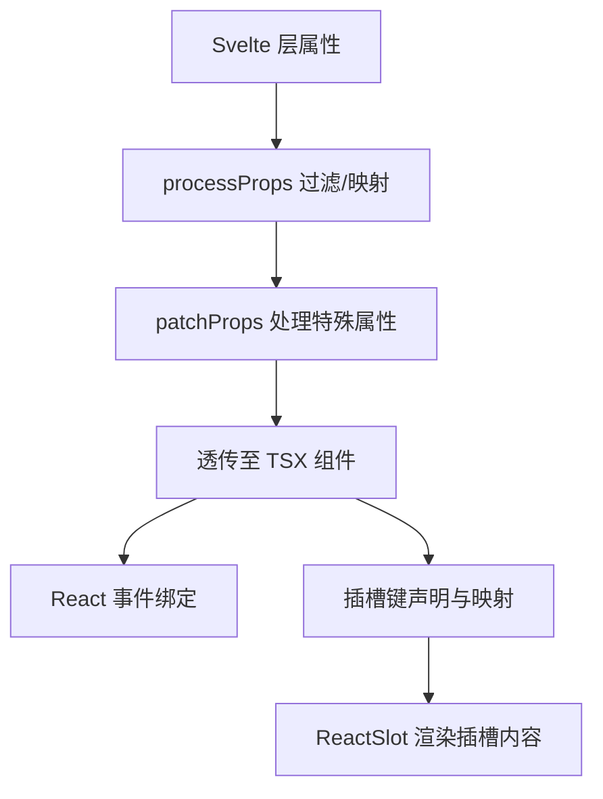
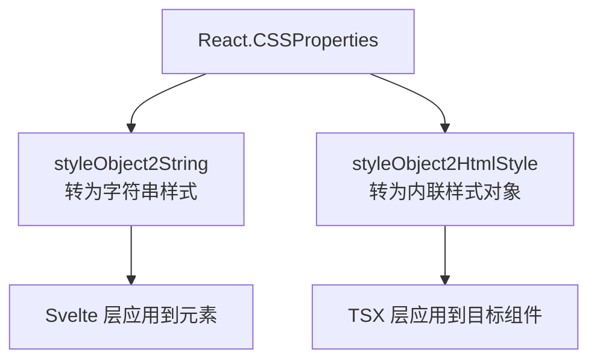
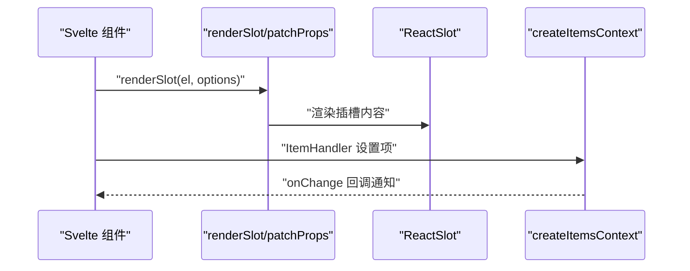
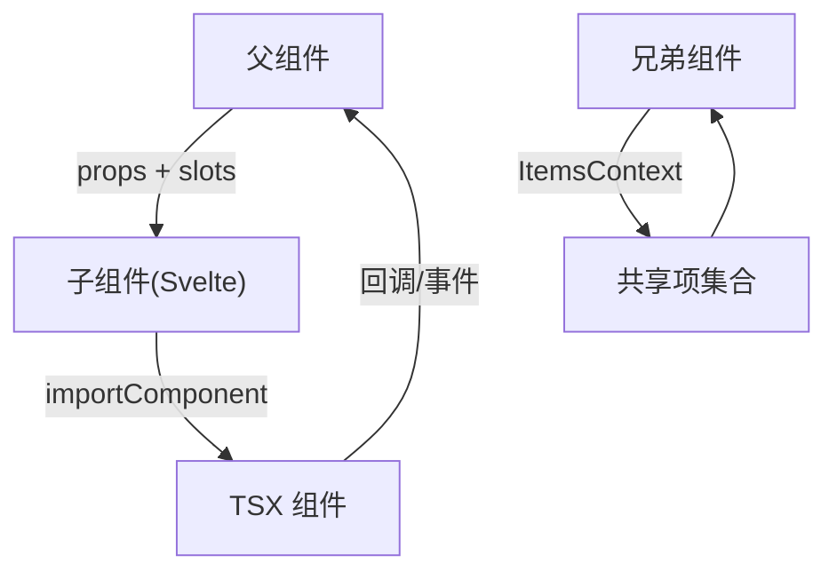
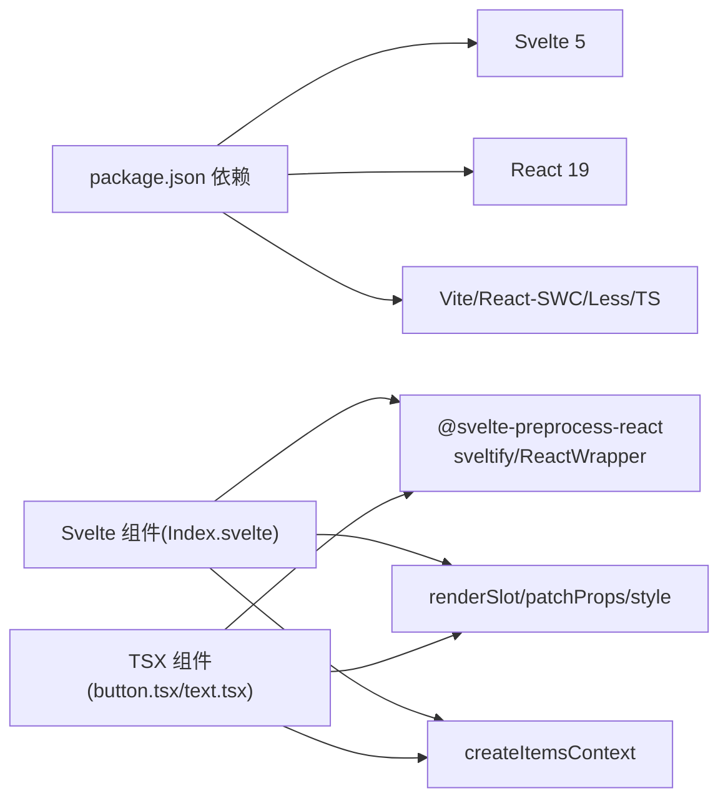

# 前端组件开发

<cite>
**本文引用的文件**
- [frontend/package.json](file://frontend/package.json)
- [frontend/defineConfig.js](file://frontend/defineConfig.js)
- [frontend/svelte-preprocess-react/index.ts](file://frontend/svelte-preprocess-react/index.ts)
- [frontend/svelte-preprocess-react/sveltify.svelte.ts](file://frontend/svelte-preprocess-react/sveltify.svelte.ts)
- [frontend/svelte-preprocess-react/internal/ReactWrapper.svelte](file://frontend/svelte-preprocess-react/internal/ReactWrapper.svelte)
- [frontend/utils/renderSlot.tsx](file://frontend/utils/renderSlot.tsx)
- [frontend/utils/patchProps.tsx](file://frontend/utils/patchProps.tsx)
- [frontend/utils/createItemsContext.tsx](file://frontend/utils/createItemsContext.tsx)
- [frontend/utils/style.ts](file://frontend/utils/style.ts)
- [frontend/antd/button/Index.svelte](file://frontend/antd/button/Index.svelte)
- [frontend/antd/button/button.tsx](file://frontend/antd/button/button.tsx)
- [frontend/base/text/Index.svelte](file://frontend/base/text/Index.svelte)
- [frontend/base/text/text.tsx](file://frontend/base/text/text.tsx)
</cite>

## 目录

1. [简介](#简介)
2. [项目结构](#项目结构)
3. [核心组件](#核心组件)
4. [架构总览](#架构总览)
5. [详细组件分析](#详细组件分析)
6. [依赖关系分析](#依赖关系分析)
7. [性能考量](#性能考量)
8. [故障排查指南](#故障排查指南)
9. [结论](#结论)
10. [附录](#附录)

## 简介

本指南面向前端开发者，系统讲解如何在 frontend/ 目录下基于 Svelte 5 开发组件，并通过 svelte-preprocess-react 将现有 React 组件桥接为 Svelte 组件。内容涵盖组件结构、生命周期与状态管理、事件处理、样式处理、插槽系统、属性传递、组件间通信与数据流等主题，并提供可直接参考的文件路径与最佳实践。

## 项目结构

- 根目录包含 Vite 配置与构建入口，前端工程以模块化方式组织，按组件类型分层（antd、antdx、base、pro 等）。
- 每个具体组件通常由两部分组成：Svelte 层的 Index.svelte（负责属性透传、可见性控制、插槽收集与渲染）与 TSX 层的组件文件（负责实际 UI 渲染与桥接逻辑）。
- svelte-preprocess-react 提供 sveltify 工具，将 React 组件包装为 Svelte 组件，支持插槽、上下文、节点树管理与挂载桥接。

**图表来源**

- [frontend/defineConfig.js:1-19](file://frontend/defineConfig.js#L1-L19)
- [frontend/package.json:1-59](file://frontend/package.json#L1-L59)
- [frontend/antd/button/Index.svelte:1-74](file://frontend/antd/button/Index.svelte#L1-L74)
- [frontend/antd/button/button.tsx:1-39](file://frontend/antd/button/button.tsx#L1-L39)
- [frontend/base/text/Index.svelte:1-42](file://frontend/base/text/Index.svelte#L1-L42)
- [frontend/base/text/text.tsx:1-11](file://frontend/base/text/text.tsx#L1-L11)
- [frontend/svelte-preprocess-react/index.ts:1-8](file://frontend/svelte-preprocess-react/index.ts#L1-L8)
- [frontend/svelte-preprocess-react/sveltify.svelte.ts:1-119](file://frontend/svelte-preprocess-react/sveltify.svelte.ts#L1-L119)
- [frontend/svelte-preprocess-react/internal/ReactWrapper.svelte:1-82](file://frontend/svelte-preprocess-react/internal/ReactWrapper.svelte#L1-L82)
- [frontend/utils/renderSlot.tsx:1-29](file://frontend/utils/renderSlot.tsx#L1-L29)
- [frontend/utils/patchProps.tsx:1-39](file://frontend/utils/patchProps.tsx#L1-L39)
- [frontend/utils/createItemsContext.tsx:1-274](file://frontend/utils/createItemsContext.tsx#L1-L274)
- [frontend/utils/style.ts:1-77](file://frontend/utils/style.ts#L1-L77)

**章节来源**

- [frontend/defineConfig.js:1-19](file://frontend/defineConfig.js#L1-L19)
- [frontend/package.json:1-59](file://frontend/package.json#L1-L59)

## 核心组件

- Svelte 组件层（Index.svelte）
  - 负责接收父组件传入的属性，进行过滤与派生计算，控制可见性，收集插槽并透传给 TSX 层。
  - 使用异步加载导入 TSX 组件，避免阻塞首屏渲染。
- TSX 组件层（\*.tsx）
  - 通过 sveltify 将 React 组件包装为 Svelte 可用的组件，支持插槽映射、属性补丁、上下文注入与节点树管理。
  - 使用 ReactSlot 渲染来自 Svelte 的插槽内容，支持克隆与参数化渲染。
- 桥接与工具
  - sveltify：建立 Svelte 与 React 的桥接，维护共享根节点与子节点树，负责挂载与卸载。
  - ReactWrapper：在 Svelte 中作为包装器，注入上下文、收集插槽与属性，并在销毁时清理节点树。
  - renderSlot/patchProps/createItemsContext/style：分别负责插槽渲染、属性补丁、项上下文与样式转换。

**章节来源**

- [frontend/antd/button/Index.svelte:1-74](file://frontend/antd/button/Index.svelte#L1-L74)
- [frontend/antd/button/button.tsx:1-39](file://frontend/antd/button/button.tsx#L1-L39)
- [frontend/base/text/Index.svelte:1-42](file://frontend/base/text/Index.svelte#L1-L42)
- [frontend/base/text/text.tsx:1-11](file://frontend/base/text/text.tsx#L1-L11)
- [frontend/svelte-preprocess-react/sveltify.svelte.ts:1-119](file://frontend/svelte-preprocess-react/sveltify.svelte.ts#L1-L119)
- [frontend/svelte-preprocess-react/internal/ReactWrapper.svelte:1-82](file://frontend/svelte-preprocess-react/internal/ReactWrapper.svelte#L1-L82)
- [frontend/utils/renderSlot.tsx:1-29](file://frontend/utils/renderSlot.tsx#L1-L29)
- [frontend/utils/patchProps.tsx:1-39](file://frontend/utils/patchProps.tsx#L1-L39)
- [frontend/utils/createItemsContext.tsx:1-274](file://frontend/utils/createItemsContext.tsx#L1-L274)
- [frontend/utils/style.ts:1-77](file://frontend/utils/style.ts#L1-L77)

## 架构总览

下图展示了从 Svelte 组件到 React 组件的桥接流程，以及插槽与属性的传递链路。

**图表来源**

- [frontend/antd/button/Index.svelte:1-74](file://frontend/antd/button/Index.svelte#L1-L74)
- [frontend/svelte-preprocess-react/internal/ReactWrapper.svelte:1-82](file://frontend/svelte-preprocess-react/internal/ReactWrapper.svelte#L1-L82)
- [frontend/svelte-preprocess-react/sveltify.svelte.ts:1-119](file://frontend/svelte-preprocess-react/sveltify.svelte.ts#L1-L119)
- [frontend/antd/button/button.tsx:1-39](file://frontend/antd/button/button.tsx#L1-L39)
- [frontend/utils/renderSlot.tsx:1-29](file://frontend/utils/renderSlot.tsx#L1-L29)

## 详细组件分析

### 组件结构与生命周期

- Svelte 层（Index.svelte）
  - 使用 $props/$derived 进行属性派生与可见性判断；通过 importComponent 异步加载 TSX 组件，提升性能。
  - 使用 getProps/processProps 对属性进行过滤与额外处理，确保只传递必要属性。
  - 使用 getSlots 收集插槽，传递给 TSX 层。
- TSX 层（\*.tsx）
  - 使用 sveltify 包装 React 组件，声明支持的插槽键（如 icon、loading.icon），并在渲染时通过 ReactSlot 映射插槽。
  - 通过 useTargets 等工具处理 children 与 value 的优先级，保证渲染一致性。
- 生命周期与状态
  - ReactWrapper 在初始化时注入上下文、收集插槽与属性；在销毁时从父节点移除自身并触发重渲染。
  - sveltify 内部维护共享根节点与子节点树，节点变更会触发 rerender。

**图表来源**

- [frontend/antd/button/Index.svelte:1-74](file://frontend/antd/button/Index.svelte#L1-L74)
- [frontend/base/text/Index.svelte:1-42](file://frontend/base/text/Index.svelte#L1-L42)

**章节来源**

- [frontend/antd/button/Index.svelte:1-74](file://frontend/antd/button/Index.svelte#L1-L74)
- [frontend/base/text/Index.svelte:1-42](file://frontend/base/text/Index.svelte#L1-L42)
- [frontend/svelte-preprocess-react/internal/ReactWrapper.svelte:1-82](file://frontend/svelte-preprocess-react/internal/ReactWrapper.svelte#L1-L82)

### 事件处理与属性传递

- 属性传递
  - 通过 processProps 对属性进行过滤与映射，例如将 href_target 映射为 target，保留 restProps 与附加属性。
  - 使用 patchProps/applyPatchToProps 处理 key 等特殊属性，避免冲突。
- 事件绑定
  - 在 TSX 层直接绑定 React 事件回调，Svelte 层通过 props 透传；注意避免重复绑定或丢失上下文。
- 插槽映射
  - 在 TSX 层声明支持的插槽键，使用 ReactSlot 渲染对应插槽内容，支持 clone 与参数化渲染。

**图表来源**

- [frontend/antd/button/Index.svelte:24-52](file://frontend/antd/button/Index.svelte#L24-L52)
- [frontend/utils/patchProps.tsx:1-39](file://frontend/utils/patchProps.tsx#L1-L39)
- [frontend/antd/button/button.tsx:8-36](file://frontend/antd/button/button.tsx#L8-L36)

**章节来源**

- [frontend/antd/button/Index.svelte:24-52](file://frontend/antd/button/Index.svelte#L24-L52)
- [frontend/utils/patchProps.tsx:1-39](file://frontend/utils/patchProps.tsx#L1-L39)
- [frontend/antd/button/button.tsx:8-36](file://frontend/antd/button/button.tsx#L8-L36)

### 样式处理与单位转换

- 样式对象转字符串：将驼峰命名转换为连字符形式，并对数值型属性自动添加 px 单位（除明确无需单位的属性外）。
- HTML 内联样式：将样式对象转换为可直接用于内联样式的键值对。
- 在 Svelte 层可通过 elem_style/elem_classes 透传样式与类名，在 TSX 层应用到目标 React 组件。

**图表来源**

- [frontend/utils/style.ts:1-77](file://frontend/utils/style.ts#L1-L77)
- [frontend/antd/button/Index.svelte:62-63](file://frontend/antd/button/Index.svelte#L62-L63)

**章节来源**

- [frontend/utils/style.ts:1-77](file://frontend/utils/style.ts#L1-L77)
- [frontend/antd/button/Index.svelte:62-63](file://frontend/antd/button/Index.svelte#L62-L63)

### 插槽系统与项上下文

- 插槽渲染
  - renderSlot 提供统一的插槽渲染入口，支持 clone、forceClone 与 params 参数化渲染。
  - ReactSlot 接收来自 Svelte 的插槽 DOM，将其渲染为 React 子树。
- 项上下文（ItemsContext）
  - createItemsContext 提供项集合的上下文，支持设置项、监听变更、子项递归构建。
  - ItemHandler 负责将 Svelte 的项描述（props、slots、children）转换为标准化结构并写入上下文。

**图表来源**

- [frontend/utils/renderSlot.tsx:1-29](file://frontend/utils/renderSlot.tsx#L1-L29)
- [frontend/utils/patchProps.tsx:1-39](file://frontend/utils/patchProps.tsx#L1-L39)
- [frontend/utils/createItemsContext.tsx:1-274](file://frontend/utils/createItemsContext.tsx#L1-L274)

**章节来源**

- [frontend/utils/renderSlot.tsx:1-29](file://frontend/utils/renderSlot.tsx#L1-L29)
- [frontend/utils/patchProps.tsx:1-39](file://frontend/utils/patchProps.tsx#L1-L39)
- [frontend/utils/createItemsContext.tsx:1-274](file://frontend/utils/createItemsContext.tsx#L1-L274)

### 组件间通信与数据流

- 父子通信
  - 父组件通过 props 与插槽向子组件传递数据与 UI 片段；子组件在 TSX 层解析并渲染。
- 兄弟/跨层通信
  - 通过 createItemsContext 在多层级中共享项集合，实现兄弟组件之间的数据同步。
- 事件回传
  - 在 TSX 层绑定回调并通过 props 向上传递给父组件；在 Svelte 层通过事件句柄转发。

**图表来源**

- [frontend/antd/button/Index.svelte:1-74](file://frontend/antd/button/Index.svelte#L1-L74)
- [frontend/antd/button/button.tsx:1-39](file://frontend/antd/button/button.tsx#L1-L39)
- [frontend/utils/createItemsContext.tsx:1-274](file://frontend/utils/createItemsContext.tsx#L1-L274)

**章节来源**

- [frontend/antd/button/Index.svelte:1-74](file://frontend/antd/button/Index.svelte#L1-L74)
- [frontend/antd/button/button.tsx:1-39](file://frontend/antd/button/button.tsx#L1-L39)
- [frontend/utils/createItemsContext.tsx:1-274](file://frontend/utils/createItemsContext.tsx#L1-L274)

## 依赖关系分析

- 依赖与版本
  - 前端工程使用 Svelte 5 与 React 19，配合 @vitejs/plugin-react-swc 与 less、typescript-json-schema 等工具链。
  - svelte-preprocess-react 提供桥接能力，内部包含 Bridge、ReactWrapper、ReactSlot 等核心模块。
- 关键依赖关系
  - Svelte 组件依赖 @svelte-preprocess-react/component 与 svelte 上下文工具进行属性与插槽处理。
  - TSX 组件依赖 sveltify 与 ReactSlot 进行桥接与插槽渲染。
  - 工具模块（renderSlot、patchProps、createItemsContext、style）贯穿于属性、插槽与样式处理。

**图表来源**

- [frontend/package.json:1-59](file://frontend/package.json#L1-L59)
- [frontend/defineConfig.js:1-19](file://frontend/defineConfig.js#L1-L19)
- [frontend/antd/button/Index.svelte:1-74](file://frontend/antd/button/Index.svelte#L1-L74)
- [frontend/antd/button/button.tsx:1-39](file://frontend/antd/button/button.tsx#L1-L39)
- [frontend/utils/renderSlot.tsx:1-29](file://frontend/utils/renderSlot.tsx#L1-L29)
- [frontend/utils/patchProps.tsx:1-39](file://frontend/utils/patchProps.tsx#L1-L39)
- [frontend/utils/createItemsContext.tsx:1-274](file://frontend/utils/createItemsContext.tsx#L1-L274)
- [frontend/utils/style.ts:1-77](file://frontend/utils/style.ts#L1-L77)

**章节来源**

- [frontend/package.json:1-59](file://frontend/package.json#L1-L59)
- [frontend/defineConfig.js:1-19](file://frontend/defineConfig.js#L1-L19)

## 性能考量

- 异步组件加载
  - 使用 importComponent 异步加载 TSX 组件，减少首屏负担，建议将体积较大的组件延迟加载。
- 属性与插槽最小化
  - processProps 过滤无关属性，避免不必要的重渲染；仅传递必要的 slots 键，降低桥接成本。
- 节点树管理
  - sveltify 维护共享根节点与子节点树，节点变更触发局部 rerender；避免频繁创建/销毁节点。
- 样式转换缓存
  - 对样式对象转换结果进行缓存（如使用 useMemoizedEqualValue），减少重复计算。

[本节为通用性能建议，无需特定文件引用]

## 故障排查指南

- 插槽未显示
  - 检查 TSX 是否声明了对应的插槽键；确认 renderSlot 的 el 是否存在且未被强制克隆导致内容丢失。
  - 参考路径：[frontend/utils/renderSlot.tsx:13-28](file://frontend/utils/renderSlot.tsx#L13-L28)
- 属性异常或冲突
  - 检查 patchProps/applyPatchToProps 的使用，确保 key 等特殊属性正确处理。
  - 参考路径：[frontend/utils/patchProps.tsx:1-39](file://frontend/utils/patchProps.tsx#L1-L39)
- 组件未渲染或闪烁
  - 确认 visible 控制逻辑与 importComponent 加载时机；检查 ReactWrapper 的初始化与销毁钩子。
  - 参考路径：[frontend/antd/button/Index.svelte:59-73](file://frontend/antd/button/Index.svelte#L59-L73)、[frontend/svelte-preprocess-react/internal/ReactWrapper.svelte:60-66](file://frontend/svelte-preprocess-react/internal/ReactWrapper.svelte#L60-L66)
- 项上下文未更新
  - 检查 ItemHandler 的 setItem 调用与 allowedSlots 配置；确认 onChange 回调是否触发。
  - 参考路径：[frontend/utils/createItemsContext.tsx:124-156](file://frontend/utils/createItemsContext.tsx#L124-L156)
- 样式不生效
  - 检查 styleObject2String/styleObject2HtmlStyle 的转换结果；确认是否遗漏单位或拼写错误。
  - 参考路径：[frontend/utils/style.ts:39-76](file://frontend/utils/style.ts#L39-L76)

**章节来源**

- [frontend/utils/renderSlot.tsx:13-28](file://frontend/utils/renderSlot.tsx#L13-L28)
- [frontend/utils/patchProps.tsx:1-39](file://frontend/utils/patchProps.tsx#L1-L39)
- [frontend/antd/button/Index.svelte:59-73](file://frontend/antd/button/Index.svelte#L59-L73)
- [frontend/svelte-preprocess-react/internal/ReactWrapper.svelte:60-66](file://frontend/svelte-preprocess-react/internal/ReactWrapper.svelte#L60-L66)
- [frontend/utils/createItemsContext.tsx:124-156](file://frontend/utils/createItemsContext.tsx#L124-L156)
- [frontend/utils/style.ts:39-76](file://frontend/utils/style.ts#L39-L76)

## 结论

本指南系统梳理了在 frontend/ 下基于 Svelte 5 与 svelte-preprocess-react 的组件开发方法，覆盖组件结构、生命周期、状态管理、事件处理、样式与插槽、属性传递及组件间通信。通过异步加载、属性过滤、插槽映射与项上下文等机制，既能保持 Svelte 的简洁性，又能高效复用 React 生态资源。建议在新组件开发中遵循本文的文件组织与桥接模式，以获得更好的可维护性与性能表现。

## 附录

- 新建组件步骤（建议流程）
  - 在 frontend/ 目录下创建组件目录（如 frontend/antd/my-component/）。
  - 创建 Index.svelte：定义属性、可见性、插槽收集与 importComponent 异步加载。
  - 创建 my-component.tsx：使用 sveltify 包装 React 组件，声明插槽键并渲染 ReactSlot。
  - 如需样式，使用 style.ts 进行转换；如需插槽参数化，使用 renderSlot/patchProps。
  - 如需跨层共享数据，使用 createItemsContext 提供上下文与 onChange 回调。
- 参考文件路径
  - [frontend/antd/button/Index.svelte](file://frontend/antd/button/Index.svelte)
  - [frontend/antd/button/button.tsx](file://frontend/antd/button/button.tsx)
  - [frontend/base/text/Index.svelte](file://frontend/base/text/Index.svelte)
  - [frontend/base/text/text.tsx](file://frontend/base/text/text.tsx)
  - [frontend/svelte-preprocess-react/sveltify.svelte.ts](file://frontend/svelte-preprocess-react/sveltify.svelte.ts)
  - [frontend/svelte-preprocess-react/internal/ReactWrapper.svelte](file://frontend/svelte-preprocess-react/internal/ReactWrapper.svelte)
  - [frontend/utils/renderSlot.tsx](file://frontend/utils/renderSlot.tsx)
  - [frontend/utils/patchProps.tsx](file://frontend/utils/patchProps.tsx)
  - [frontend/utils/createItemsContext.tsx](file://frontend/utils/createItemsContext.tsx)
  - [frontend/utils/style.ts](file://frontend/utils/style.ts)
