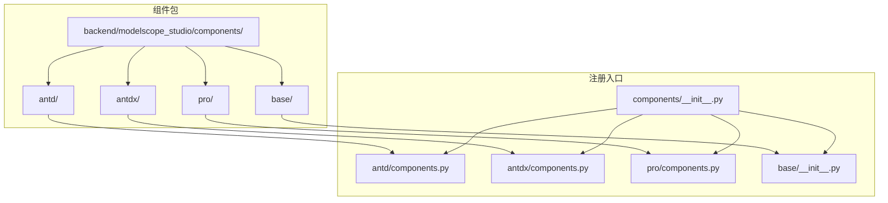
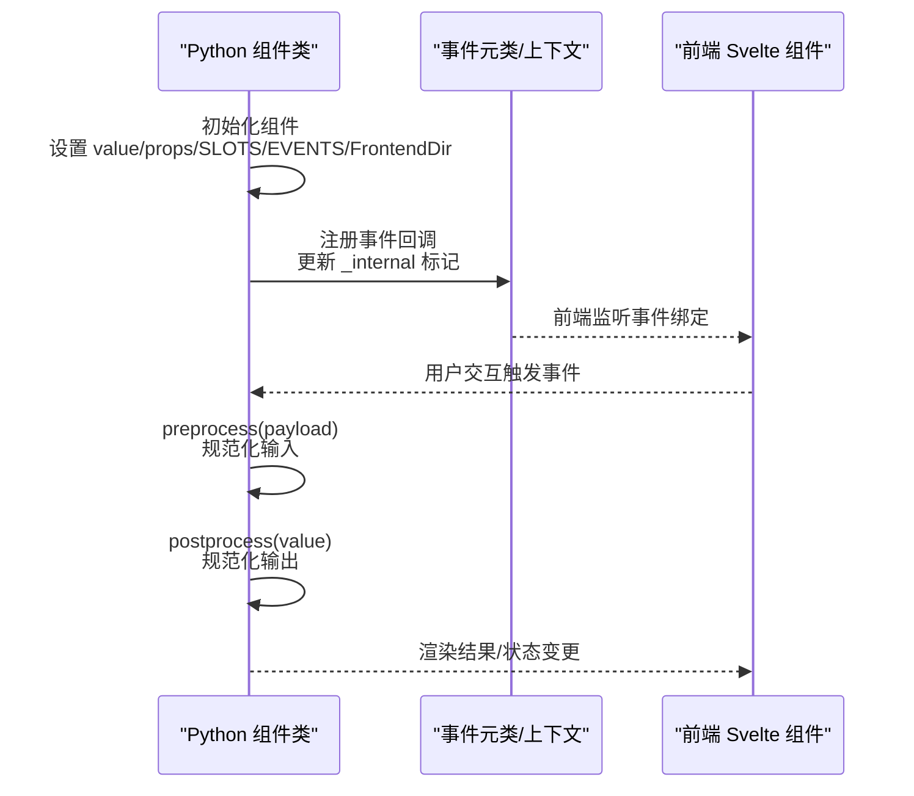
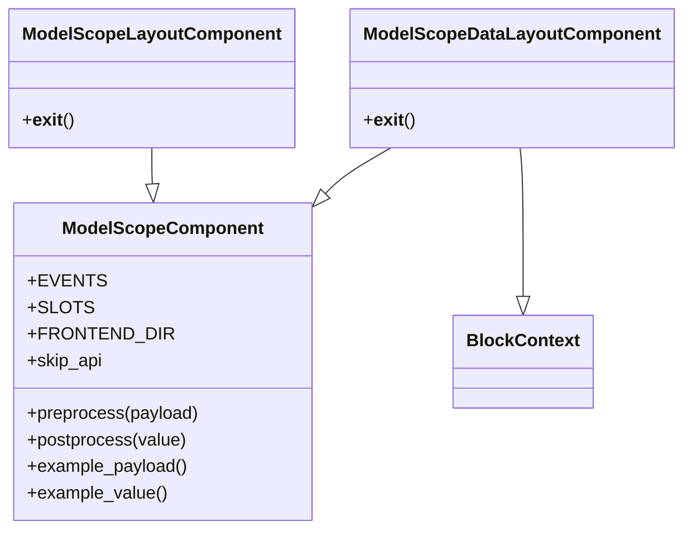
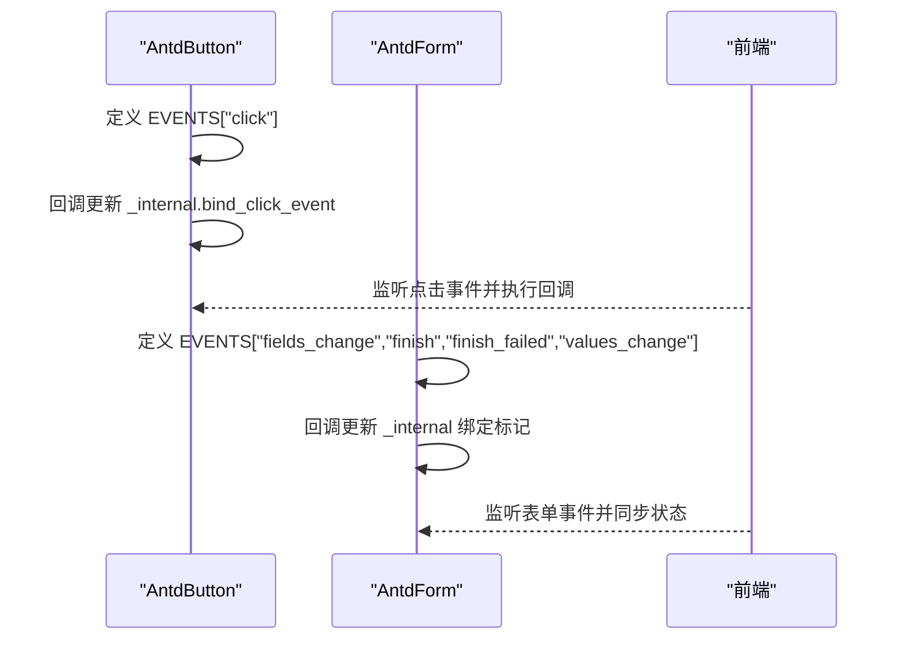
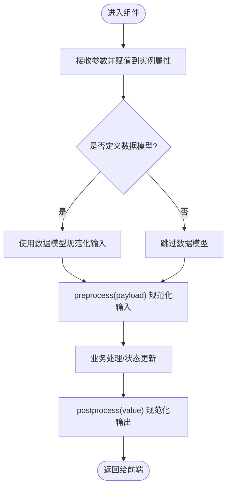
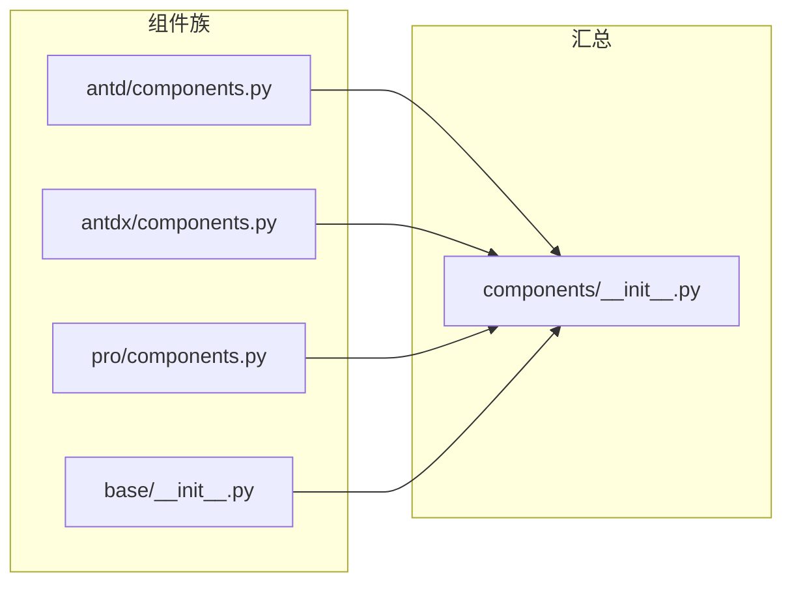

# 后端组件开发

<cite>
**本文引用的文件**
- [backend/modelscope_studio/components/__init__.py](file://backend/modelscope_studio/components/__init__.py)
- [backend/modelscope_studio/components/antd/components.py](file://backend/modelscope_studio/components/antd/components.py)
- [backend/modelscope_studio/components/antdx/components.py](file://backend/modelscope_studio/components/antdx/components.py)
- [backend/modelscope_studio/components/pro/components.py](file://backend/modelscope_studio/components/pro/components.py)
- [backend/modelscope_studio/components/base/__init__.py](file://backend/modelscope_studio/components/base/__init__.py)
- [backend/modelscope_studio/utils/dev/component.py](file://backend/modelscope_studio/utils/dev/component.py)
- [backend/modelscope_studio/utils/dev/__init__.py](file://backend/modelscope_studio/utils/dev/__init__.py)
- [backend/modelscope_studio/components/antd/button/__init__.py](file://backend/modelscope_studio/components/antd/button/__init__.py)
- [backend/modelscope_studio/components/antd/form/__init__.py](file://backend/modelscope_studio/components/antd/form/__init__.py)
- [backend/modelscope_studio/components/base/text/__init__.py](file://backend/modelscope_studio/components/base/text/__init__.py)
</cite>

## 目录

1. [简介](#简介)
2. [项目结构](#项目结构)
3. [核心组件](#核心组件)
4. [架构总览](#架构总览)
5. [详细组件分析](#详细组件分析)
6. [依赖分析](#依赖分析)
7. [性能考虑](#性能考虑)
8. [故障排查指南](#故障排查指南)
9. [结论](#结论)
10. [附录](#附录)

## 简介

本指南面向后端组件开发者，系统讲解如何在 backend/modelscope_studio/components/ 目录下实现 Python 组件，涵盖组件类的继承体系、属性定义与验证、事件与回调、生命周期钩子、与前端 Svelte 组件的对接，以及 Python 到 JavaScript 的数据转换流程。文档同时给出组件注册机制（**init**.py 与 components.py）的使用方法，并通过真实文件路径指引具体实现步骤。

## 项目结构

ModelScope Studio 的后端组件采用分层与分类组织：按组件族分为 antd、antdx、base、pro；每个族内以模块化目录组织具体组件；通过各族的 components.py 进行集中导出，再由 components/**init**.py 汇总到顶层命名空间，便于统一导入与使用。

图表来源

- [backend/modelscope_studio/components/**init**.py:1-5](file://backend/modelscope_studio/components/__init__.py#L1-L5)
- [backend/modelscope_studio/components/antd/components.py:1-145](file://backend/modelscope_studio/components/antd/components.py#L1-L145)
- [backend/modelscope_studio/components/antdx/components.py:1-40](file://backend/modelscope_studio/components/antdx/components.py#L1-L40)
- [backend/modelscope_studio/components/pro/components.py:1-8](file://backend/modelscope_studio/components/pro/components.py#L1-L8)
- [backend/modelscope_studio/components/base/**init**.py:1-11](file://backend/modelscope_studio/components/base/__init__.py#L1-L11)

章节来源

- [backend/modelscope_studio/components/**init**.py:1-5](file://backend/modelscope_studio/components/__init__.py#L1-L5)
- [backend/modelscope_studio/components/antd/components.py:1-145](file://backend/modelscope_studio/components/antd/components.py#L1-L145)
- [backend/modelscope_studio/components/antdx/components.py:1-40](file://backend/modelscope_studio/components/antdx/components.py#L1-L40)
- [backend/modelscope_studio/components/pro/components.py:1-8](file://backend/modelscope_studio/components/pro/components.py#L1-L8)
- [backend/modelscope_studio/components/base/**init**.py:1-11](file://backend/modelscope_studio/components/base/__init__.py#L1-L11)

## 核心组件

后端组件的基类与元类由开发工具模块提供，统一了组件的生命周期、事件绑定、布局与渲染控制、以及与前端目录映射的能力。

- 基类与元类
  - ModelScopeComponent：通用组件基类，支持 value、visible、elem\_\*、render 等标准属性，以及 load_fn、inputs、key、every 等高级配置。
  - ModelScopeLayoutComponent：用于布局或容器型组件，强调布局更新与上下文退出行为。
  - ModelScopeDataLayoutComponent：数据驱动的布局组件，融合 Gradio 的 BlockContext 能力，支持 preserved_by_key 等特性。
- 关键约定
  - EVENTS：组件支持的事件列表，通常通过 EventListener 定义，回调中会更新 \_internal 的绑定标记，以便前端监听。
  - SLOTS：组件支持的插槽名称集合，用于前端渲染时的插槽注入。
  - FRONTEND_DIR：通过 resolve_frontend_dir 解析到对应前端 Svelte 组件目录，确保前后端一致。
  - skip_api：决定该组件是否暴露 API 接口（如某些纯展示组件可跳过 API）。
  - preprocess/postprocess/example_payload/example_value：标准化数据转换与示例值，保证前后端数据契约一致。

章节来源

- [backend/modelscope_studio/utils/dev/component.py:11-169](file://backend/modelscope_studio/utils/dev/component.py#L11-L169)
- [backend/modelscope_studio/utils/dev/**init**.py:9-13](file://backend/modelscope_studio/utils/dev/__init__.py#L9-L13)

## 架构总览

后端组件与前端 Svelte 组件通过统一的目录映射与事件绑定机制对接。组件类在初始化时设置 FRONTEND_DIR，使前端能够定位到对应的 Svelte 实现；事件通过 EVENTS 列表与回调更新 \_internal 标记，前端据此绑定相应行为；数据流通过 preprocess/postprocess 规范化，确保 Python 层与 JS 层的数据形态一致。

图表来源

- [backend/modelscope_studio/utils/dev/component.py:11-169](file://backend/modelscope_studio/utils/dev/component.py#L11-L169)
- [backend/modelscope_studio/components/antd/button/**init**.py:41-46](file://backend/modelscope_studio/components/antd/button/__init__.py#L41-L46)
- [backend/modelscope_studio/components/antd/form/**init**.py:23-36](file://backend/modelscope_studio/components/antd/form/__init__.py#L23-L36)

## 详细组件分析

### 组件类继承体系与职责

- ModelScopeComponent：通用组件，适合数据型组件（如文本、输入框、选择器等），支持 value 与标准 UI 属性。
- ModelScopeLayoutComponent：布局型组件（如按钮、卡片、栅格等），强调布局更新与上下文退出。
- ModelScopeDataLayoutComponent：数据驱动的布局组件（如表单、表格等），具备 BlockContext 能力，适合复杂交互与状态持久化。

图表来源

- [backend/modelscope_studio/utils/dev/component.py:54-169](file://backend/modelscope_studio/utils/dev/component.py#L54-L169)

章节来源

- [backend/modelscope_studio/utils/dev/component.py:11-169](file://backend/modelscope_studio/utils/dev/component.py#L11-L169)

### 事件处理与回调机制

- 事件定义：通过 EVENTS 列表声明组件支持的事件，如点击、字段变化、提交完成等。
- 回调逻辑：事件回调中更新 \_internal 的绑定标记，通知前端进行事件绑定。
- 典型用法：AntdButton 的点击事件、AntdForm 的 fields_change/finish/values_change 等。

图表来源

- [backend/modelscope_studio/components/antd/button/**init**.py:41-46](file://backend/modelscope_studio/components/antd/button/__init__.py#L41-L46)
- [backend/modelscope_studio/components/antd/form/**init**.py:23-36](file://backend/modelscope_studio/components/antd/form/__init__.py#L23-L36)

章节来源

- [backend/modelscope_studio/components/antd/button/**init**.py:41-46](file://backend/modelscope_studio/components/antd/button/__init__.py#L41-L46)
- [backend/modelscope_studio/components/antd/form/**init**.py:23-36](file://backend/modelscope_studio/components/antd/form/__init__.py#L23-L36)

### 属性定义与验证机制

- 属性声明：组件在 **init** 中接收 value、additional_props 及大量 UI 相关参数（如尺寸、形状、颜色、样式等），并通过实例属性保存。
- 数据模型：部分组件提供自定义数据模型（如 AntdFormData），用于规范化复杂数据结构。
- 验证与转换：preprocess/postprocess 明确输入输出形态，避免前后端数据不一致。

图表来源

- [backend/modelscope_studio/components/antd/form/**init**.py:13-15](file://backend/modelscope_studio/components/antd/form/__init__.py#L13-L15)
- [backend/modelscope_studio/components/antd/form/**init**.py:120-126](file://backend/modelscope_studio/components/antd/form/__init__.py#L120-L126)

章节来源

- [backend/modelscope_studio/components/antd/button/**init**.py:51-137](file://backend/modelscope_studio/components/antd/button/__init__.py#L51-L137)
- [backend/modelscope_studio/components/antd/form/**init**.py:13-15](file://backend/modelscope_studio/components/antd/form/__init__.py#L13-L15)
- [backend/modelscope_studio/components/antd/form/**init**.py:120-126](file://backend/modelscope_studio/components/antd/form/__init__.py#L120-L126)

### 生命周期钩子与渲染控制

- 初始化：设置 visible、elem_id、elem_classes、elem_style、render、as_item、\_internal 等基础属性。
- 上下文退出：布局型组件在 **exit** 中更新 layout=True，确保前端重新计算布局。
- 渲染策略：skip_api 控制是否暴露 API；render 控制是否渲染；preserved_by_key 控制数据保留策略（在数据布局组件中生效）。

章节来源

- [backend/modelscope_studio/utils/dev/component.py:24-26](file://backend/modelscope_studio/utils/dev/component.py#L24-L26)
- [backend/modelscope_studio/utils/dev/component.py:125-127](file://backend/modelscope_studio/utils/dev/component.py#L125-L127)
- [backend/modelscope_studio/utils/dev/component.py:161-168](file://backend/modelscope_studio/utils/dev/component.py#L161-L168)

### 与前端 Svelte 组件的对接

- 目录映射：组件类通过 FRONTEND_DIR 指向前端 Svelte 组件目录，确保前后端一一对应。
- 插槽与事件：SLOTS 定义插槽名，EVENTS 定义事件，前端据此渲染与绑定。
- 数据转换：preprocess/postprocess 保证 Python 与 JS 之间的数据形态一致。

章节来源

- [backend/modelscope_studio/components/antd/button/**init**.py:139-156](file://backend/modelscope_studio/components/antd/button/__init__.py#L139-L156)
- [backend/modelscope_studio/components/antd/form/**init**.py:114-132](file://backend/modelscope_studio/components/antd/form/__init__.py#L114-L132)
- [backend/modelscope_studio/components/base/text/**init**.py:39-56](file://backend/modelscope_studio/components/base/text/__init__.py#L39-L56)

### 创建新组件的步骤与规范

- 选择族别与目录
  - 在 antd、antdx、base、pro 中选择合适族别，于对应目录下新建组件子目录。
- 编写组件类
  - 继承合适的基类（通用/布局/数据布局）。
  - 定义 EVENTS、SLOTS、FRONTEND_DIR。
  - 实现 preprocess/postprocess/example_payload/example_value。
  - 在 **init** 中接收并保存所有对外参数。
- 注册组件
  - 在族级 components.py 中导入并导出组件类。
  - 若为新增族别，需在 components/**init**.py 中添加导出。
- 示例参考
  - 文本组件（base/text）：最简组件示例，展示最小化属性与方法。
  - 按钮组件（antd/button）：布局型组件，包含事件与插槽。
  - 表单组件（antd/form）：数据布局型组件，包含数据模型与多事件。

章节来源

- [backend/modelscope_studio/components/antd/button/**init**.py:15-157](file://backend/modelscope_studio/components/antd/button/__init__.py#L15-L157)
- [backend/modelscope_studio/components/antd/form/**init**.py:17-133](file://backend/modelscope_studio/components/antd/form/__init__.py#L17-L133)
- [backend/modelscope_studio/components/base/text/**init**.py:8-57](file://backend/modelscope_studio/components/base/text/__init__.py#L8-L57)
- [backend/modelscope_studio/components/antd/components.py:1-145](file://backend/modelscope_studio/components/antd/components.py#L1-L145)
- [backend/modelscope_studio/components/antdx/components.py:1-40](file://backend/modelscope_studio/components/antdx/components.py#L1-L40)
- [backend/modelscope_studio/components/pro/components.py:1-8](file://backend/modelscope_studio/components/pro/components.py#L1-L8)
- [backend/modelscope_studio/components/base/**init**.py:1-11](file://backend/modelscope_studio/components/base/__init__.py#L1-L11)
- [backend/modelscope_studio/components/**init**.py:1-5](file://backend/modelscope_studio/components/__init__.py#L1-L5)

## 依赖分析

- 组件族导出
  - antd/components.py 导入并导出众多组件类，形成完整生态。
  - antdx/components.py 导出扩展组件族。
  - pro/components.py 导出专业版组件族。
  - base/**init**.py 导出基础组件族。
  - components/**init**.py 汇总上述族导出，作为统一入口。
- 组件类依赖
  - 所有组件均依赖 utils/dev 下的基类与工具函数（如 resolve_frontend_dir）。
- 事件与上下文
  - 事件通过 gradio.events.EventListener 定义，回调更新 \_internal 标记，前端据此绑定。

图表来源

- [backend/modelscope_studio/components/antd/components.py:1-145](file://backend/modelscope_studio/components/antd/components.py#L1-L145)
- [backend/modelscope_studio/components/antdx/components.py:1-40](file://backend/modelscope_studio/components/antdx/components.py#L1-L40)
- [backend/modelscope_studio/components/pro/components.py:1-8](file://backend/modelscope_studio/components/pro/components.py#L1-L8)
- [backend/modelscope_studio/components/base/**init**.py:1-11](file://backend/modelscope_studio/components/base/__init__.py#L1-L11)
- [backend/modelscope_studio/components/**init**.py:1-5](file://backend/modelscope_studio/components/__init__.py#L1-L5)

章节来源

- [backend/modelscope_studio/components/antd/components.py:1-145](file://backend/modelscope_studio/components/antd/components.py#L1-L145)
- [backend/modelscope_studio/components/antdx/components.py:1-40](file://backend/modelscope_studio/components/antdx/components.py#L1-L40)
- [backend/modelscope_studio/components/pro/components.py:1-8](file://backend/modelscope_studio/components/pro/components.py#L1-L8)
- [backend/modelscope_studio/components/base/**init**.py:1-11](file://backend/modelscope_studio/components/base/__init__.py#L1-L11)
- [backend/modelscope_studio/components/**init**.py:1-5](file://backend/modelscope_studio/components/__init__.py#L1-L5)

## 性能考虑

- 事件绑定最小化：仅在必要时启用事件绑定，避免频繁更新 \_internal 导致前端重渲染。
- 数据转换轻量化：preprocess/postprocess 应保持简单高效，避免深度拷贝与复杂计算。
- 渲染控制：合理使用 render 与 skip_api，减少不必要的 API 暴露与渲染开销。
- 布局组件优化：布局型组件在 **exit** 中更新 layout=True，应避免在高频事件中重复触发。

## 故障排查指南

- 事件未生效
  - 检查 EVENTS 是否正确声明，回调是否更新 \_internal 对应标记。
  - 确认前端已根据 \_internal 标记进行事件绑定。
- 前端找不到组件
  - 检查 FRONTEND_DIR 是否指向正确的 Svelte 目录。
  - 确认 components.py 已导出该组件类，且 components/**init**.py 汇总导出。
- 数据不一致
  - 检查 preprocess/postprocess 是否对齐前后端数据形态。
  - 对于复杂数据，确认是否使用了自定义数据模型并正确解析/序列化。
- 渲染异常
  - 检查 skip_api 与 render 设置是否符合预期。
  - 布局组件注意在 **exit** 中的布局更新时机。

章节来源

- [backend/modelscope_studio/utils/dev/component.py:15-26](file://backend/modelscope_studio/utils/dev/component.py#L15-L26)
- [backend/modelscope_studio/utils/dev/component.py:125-127](file://backend/modelscope_studio/utils/dev/component.py#L125-L127)
- [backend/modelscope_studio/components/antd/button/**init**.py:139-156](file://backend/modelscope_studio/components/antd/button/__init__.py#L139-L156)
- [backend/modelscope_studio/components/antd/form/**init**.py:114-132](file://backend/modelscope_studio/components/antd/form/__init__.py#L114-L132)

## 结论

通过统一的基类体系、明确的事件与插槽约定、严格的前后端目录映射与数据转换规范，ModelScope Studio 的后端组件开发形成了高内聚、低耦合、易扩展的架构。遵循本文档的结构规范与实现步骤，即可快速创建高质量的组件并与前端 Svelte 生态无缝对接。

## 附录

- 快速参考
  - 组件基类：ModelScopeComponent / ModelScopeLayoutComponent / ModelScopeDataLayoutComponent
  - 关键属性：EVENTS、SLOTS、FRONTEND_DIR、skip_api、preprocess/postprocess、example_payload/example_value
  - 注册路径：族级 components.py → components/**init**.py
  - 示例组件：antd/button、antd/form、base/text
