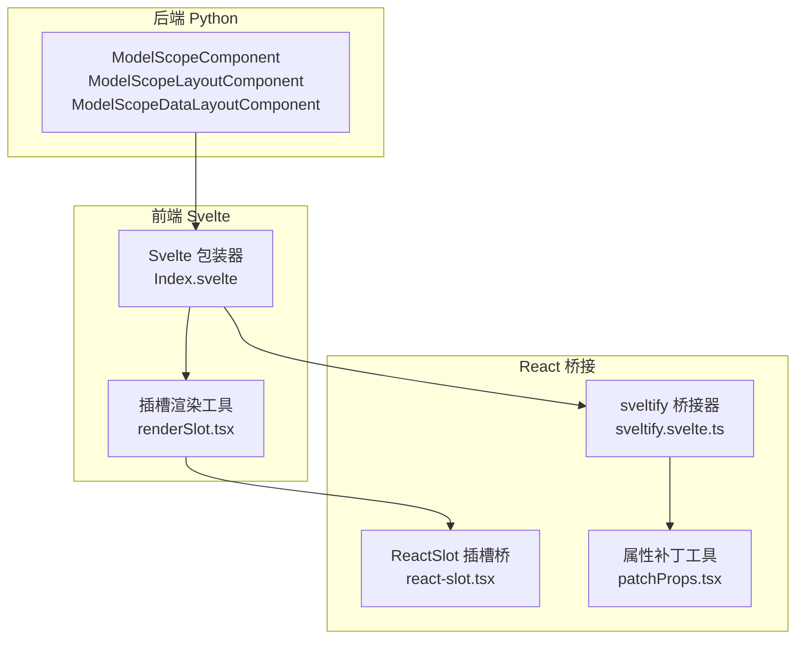
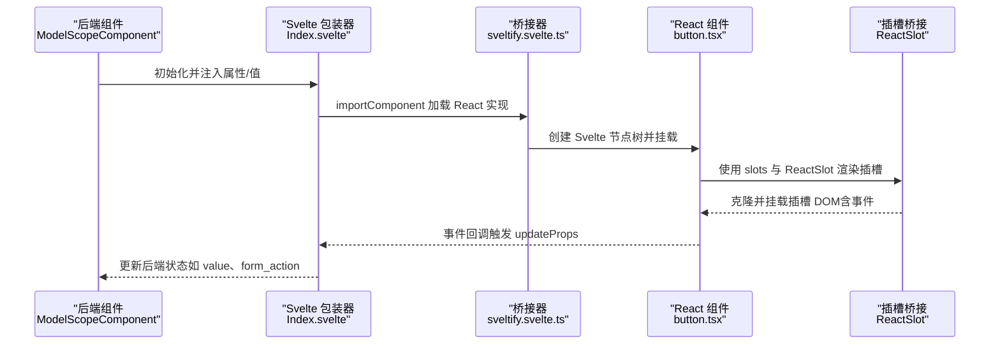
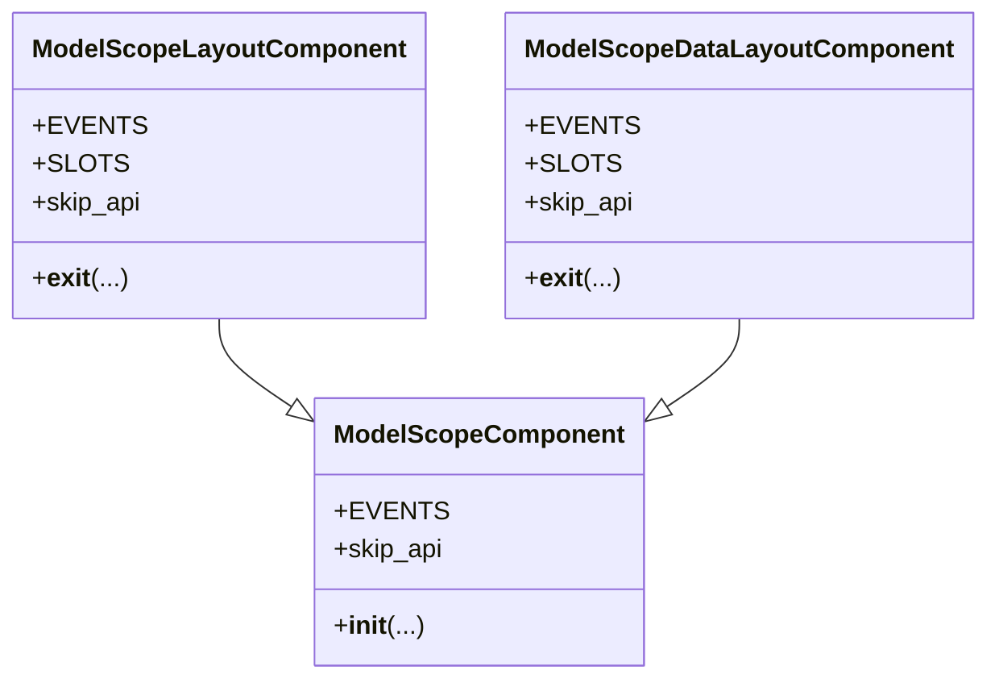
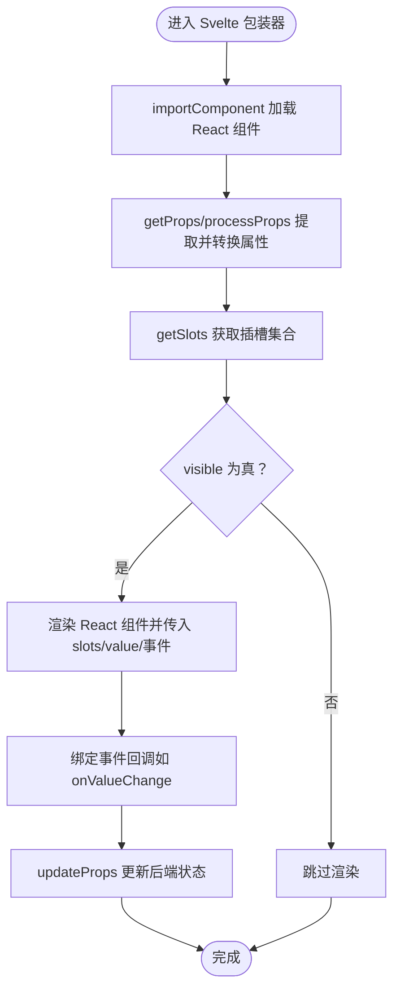
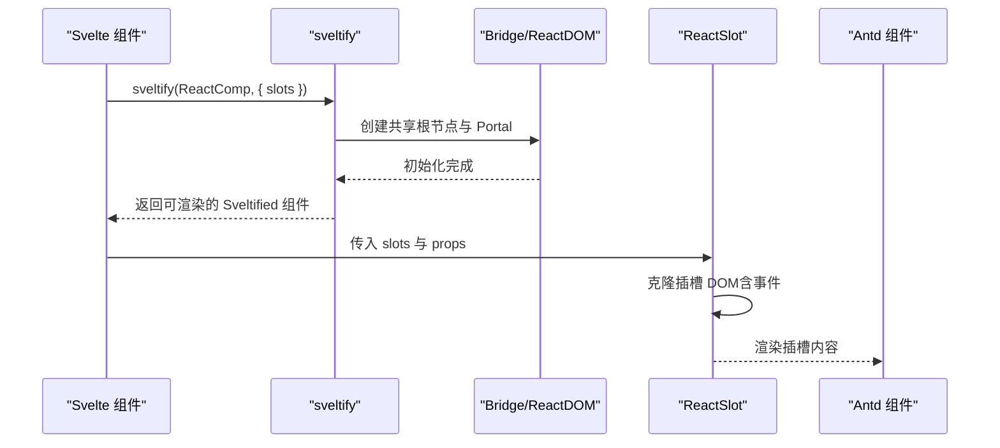
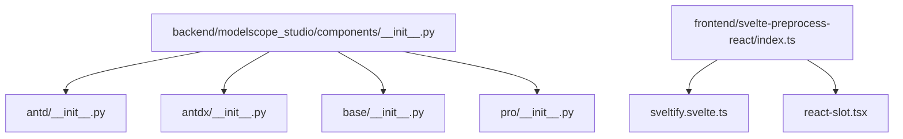

# 组件开发

<cite>
**本文引用的文件**
- [backend/modelscope_studio/components/__init__.py](file://backend/modelscope_studio/components/__init__.py)
- [backend/modelscope_studio/components/base/__init__.py](file://backend/modelscope_studio/components/base/__init__.py)
- [backend/modelscope_studio/components/antd/__init__.py](file://backend/modelscope_studio/components/antd/__init__.py)
- [backend/modelscope_studio/components/pro/__init__.py](file://backend/modelscope_studio/components/pro/__init__.py)
- [backend/modelscope_studio/utils/dev/component.py](file://backend/modelscope_studio/utils/dev/component.py)
- [frontend/svelte-preprocess-react/index.ts](file://frontend/svelte-preprocess-react/index.ts)
- [frontend/svelte-preprocess-react/sveltify.svelte.ts](file://frontend/svelte-preprocess-react/sveltify.svelte.ts)
- [frontend/svelte-preprocess-react/react-slot.tsx](file://frontend/svelte-preprocess-react/react-slot.tsx)
- [frontend/utils/renderSlot.tsx](file://frontend/utils/renderSlot.tsx)
- [frontend/utils/patchProps.tsx](file://frontend/utils/patchProps.tsx)
- [frontend/antd/button/Index.svelte](file://frontend/antd/button/Index.svelte)
- [frontend/antd/form/Index.svelte](file://frontend/antd/form/Index.svelte)
- [frontend/antd/button/button.tsx](file://frontend/antd/button/button.tsx)
</cite>

## 目录

1. [简介](#简介)
2. [项目结构](#项目结构)
3. [核心组件](#核心组件)
4. [架构总览](#架构总览)
5. [详细组件分析](#详细组件分析)
6. [依赖分析](#依赖分析)
7. [性能考虑](#性能考虑)
8. [故障排查指南](#故障排查指南)
9. [结论](#结论)
10. [附录](#附录)

## 简介

本指南面向在 ModelScope Studio 中进行组件开发的工程师与产品同学，覆盖后端 Python 组件实现、前端 Svelte 组件开发、React 组件桥接与插槽系统使用，以及组件结构规范、属性定义、事件处理、测试与文档编写最佳实践。通过并行解析后端组件基类与前端桥接机制，帮助你快速扩展现有组件或创建全新组件类型。

## 项目结构

ModelScope Studio 的组件体系由三层构成：

- 后端 Python 组件层：统一继承自 Gradio 的组件元类，提供通用生命周期、事件与插槽能力。
- 前端 Svelte 层：每个组件以 Svelte 包装器形式加载对应的 React 实现，负责属性透传、事件桥接与插槽渲染。
- React 桥接层：通过 sveltify 将 Ant Design 等 React 组件“桥接”为 Svelte 可用的组件，并支持插槽与样式透传。

图表来源

- [backend/modelscope_studio/utils/dev/component.py:11-169](file://backend/modelscope_studio/utils/dev/component.py#L11-L169)
- [frontend/svelte-preprocess-react/sveltify.svelte.ts:1-119](file://frontend/svelte-preprocess-react/sveltify.svelte.ts#L1-L119)
- [frontend/svelte-preprocess-react/react-slot.tsx:1-224](file://frontend/svelte-preprocess-react/react-slot.tsx#L1-L224)
- [frontend/utils/renderSlot.tsx:1-29](file://frontend/utils/renderSlot.tsx#L1-L29)
- [frontend/utils/patchProps.tsx:1-39](file://frontend/utils/patchProps.tsx#L1-L39)

章节来源

- [backend/modelscope_studio/components/**init**.py:1-5](file://backend/modelscope_studio/components/__init__.py#L1-L5)
- [backend/modelscope_studio/components/base/**init**.py:1-11](file://backend/modelscope_studio/components/base/__init__.py#L1-L11)
- [backend/modelscope_studio/components/antd/**init**.py:1-150](file://backend/modelscope_studio/components/antd/__init__.py#L1-L150)
- [backend/modelscope_studio/components/pro/**init**.py:1-7](file://backend/modelscope_studio/components/pro/__init__.py#L1-L7)

## 核心组件

- 后端组件基类
  - ModelScopeComponent：面向数据组件，支持 visible、elem_id、elem_classes、elem_style、value、key、inputs、load_fn 等通用属性；默认暴露 API。
  - ModelScopeLayoutComponent：面向布局组件，支持 as_item、visible、elem_id、elem_classes、elem_style、render 等；默认跳过 API 导出。
  - ModelScopeDataLayoutComponent：数据+布局混合组件，具备 BlockContext 能力与 layout 标记，避免重复渲染。
- 前端桥接与插槽
  - sveltify：将 React 组件包装为 Svelte 组件，支持 slots 参数声明与插槽树构建。
  - ReactSlot：将 Svelte 插槽内容克隆并挂载到 React 子树中，支持属性与事件透传、MutationObserver 观察。
  - renderSlot：便捷入口，根据是否需要强制克隆或参数化渲染，提供上下文包裹。
  - patchProps/applyPatchToProps：对 key 等内部字段做兼容性转换，保证 React 渲染稳定。

章节来源

- [backend/modelscope_studio/utils/dev/component.py:11-169](file://backend/modelscope_studio/utils/dev/component.py#L11-L169)
- [frontend/svelte-preprocess-react/sveltify.svelte.ts:1-119](file://frontend/svelte-preprocess-react/sveltify.svelte.ts#L1-L119)
- [frontend/svelte-preprocess-react/react-slot.tsx:1-224](file://frontend/svelte-preprocess-react/react-slot.tsx#L1-L224)
- [frontend/utils/renderSlot.tsx:1-29](file://frontend/utils/renderSlot.tsx#L1-L29)
- [frontend/utils/patchProps.tsx:1-39](file://frontend/utils/patchProps.tsx#L1-L39)

## 架构总览

下图展示从后端组件到前端 Svelte 包装器再到 React 组件的调用链路，以及插槽系统如何在 React 子树中复用 Svelte 插槽内容。

图表来源

- [frontend/antd/button/Index.svelte:1-74](file://frontend/antd/button/Index.svelte#L1-L74)
- [frontend/antd/button/button.tsx:1-39](file://frontend/antd/button/button.tsx#L1-L39)
- [frontend/svelte-preprocess-react/sveltify.svelte.ts:1-119](file://frontend/svelte-preprocess-react/sveltify.svelte.ts#L1-L119)
- [frontend/svelte-preprocess-react/react-slot.tsx:1-224](file://frontend/svelte-preprocess-react/react-slot.tsx#L1-L224)

## 详细组件分析

### 后端组件基类与生命周期

- 继承关系
  - ModelScopeComponent：基础数据组件，支持 value、visible、elem\_\*、key、inputs、load_fn 等。
  - ModelScopeLayoutComponent：布局组件，支持 as*item、visible、elem*\*、render。
  - ModelScopeDataLayoutComponent：兼具数据与布局特性，进入/退出时标记 layout，避免重复渲染。
- 关键行为
  - 自动记录父组件子节点索引，便于定位与更新。
  - 支持跳过 API 导出（skip_api），用于布局类组件。
  - 与 AppContext 协作，确保应用上下文存在。

图表来源

- [backend/modelscope_studio/utils/dev/component.py:11-169](file://backend/modelscope_studio/utils/dev/component.py#L11-L169)

章节来源

- [backend/modelscope_studio/utils/dev/component.py:11-169](file://backend/modelscope_studio/utils/dev/component.py#L11-L169)

### 前端 Svelte 包装器与属性处理

- 典型流程
  - 通过 importComponent 异步加载对应 React 组件。
  - 使用 getProps/processProps 提取并转换属性，映射命名（如 fields_change → fieldsChange）。
  - 通过 getSlots 获取插槽集合，传递给 React 组件。
  - 在可见性控制下渲染，并将 children 作为默认插槽传入。
- 事件桥接
  - 对于可变值组件（如 Form），监听 onValueChange 并调用 updateProps 更新后端状态。

图表来源

- [frontend/antd/form/Index.svelte:1-99](file://frontend/antd/form/Index.svelte#L1-L99)
- [frontend/antd/button/Index.svelte:1-74](file://frontend/antd/button/Index.svelte#L1-L74)

章节来源

- [frontend/antd/form/Index.svelte:1-99](file://frontend/antd/form/Index.svelte#L1-L99)
- [frontend/antd/button/Index.svelte:1-74](file://frontend/antd/button/Index.svelte#L1-L74)

### React 组件桥接与插槽系统

- sveltify
  - 接收 React 组件与可选 slots 声明，返回 Sveltified 组件。
  - 内部维护共享根节点与 Portal，按需创建 Bridge 渲染树。
  - 支持 ignore 忽略某些节点，便于复杂场景优化。
- ReactSlot
  - 将 Svelte 插槽克隆到 React 子树，保留事件监听器与子节点。
  - 支持强制克隆（forceClone）、参数化渲染（params）与属性观察（observeAttributes）。
  - 通过 ContextPropsProvider 与 patchProps 工具，确保 key 等内部字段正确传递。
- 插槽渲染管线
  - renderSlot 根据 options 决定是否包裹 ContextPropsProvider。
  - patchProps/applyPatchToProps 在桥接前后修正 key 字段，避免 React 警告。

图表来源

- [frontend/svelte-preprocess-react/sveltify.svelte.ts:1-119](file://frontend/svelte-preprocess-react/sveltify.svelte.ts#L1-L119)
- [frontend/svelte-preprocess-react/react-slot.tsx:1-224](file://frontend/svelte-preprocess-react/react-slot.tsx#L1-L224)
- [frontend/utils/renderSlot.tsx:1-29](file://frontend/utils/renderSlot.tsx#L1-L29)
- [frontend/utils/patchProps.tsx:1-39](file://frontend/utils/patchProps.tsx#L1-L39)

章节来源

- [frontend/svelte-preprocess-react/index.ts:1-8](file://frontend/svelte-preprocess-react/index.ts#L1-L8)
- [frontend/svelte-preprocess-react/sveltify.svelte.ts:1-119](file://frontend/svelte-preprocess-react/sveltify.svelte.ts#L1-L119)
- [frontend/svelte-preprocess-react/react-slot.tsx:1-224](file://frontend/svelte-preprocess-react/react-slot.tsx#L1-L224)
- [frontend/utils/renderSlot.tsx:1-29](file://frontend/utils/renderSlot.tsx#L1-L29)
- [frontend/utils/patchProps.tsx:1-39](file://frontend/utils/patchProps.tsx#L1-L39)

### 组件结构规范与属性定义

- 结构规范
  - 每个组件目录包含：Index.svelte（包装器）、对应 React 实现（如 button.tsx）、package.json 与 gradio.config.js。
  - 包装器负责属性提取、事件桥接与插槽透传。
- 属性定义
  - 通用属性：visible、elem_id、elem_classes、elem_style、as_item、\_internal.layout 等。
  - 业务属性：如 Form 的 formAction、name，Button 的 target、loading.icon 等。
  - 映射规则：processProps 支持命名映射（如 fields_change → fieldsChange）。
- 事件处理
  - 数据组件通过 onValueChange/updateProps 回写后端。
  - 行为组件通过 onClick/onSubmit 等原生事件触发后端动作。
- 插槽系统
  - 通过 slots.icon、slots['loading.icon'] 等命名插槽注入 ReactSlot。
  - 支持 children 默认插槽与参数化插槽（params）。

章节来源

- [frontend/antd/button/Index.svelte:1-74](file://frontend/antd/button/Index.svelte#L1-L74)
- [frontend/antd/button/button.tsx:1-39](file://frontend/antd/button/button.tsx#L1-L39)
- [frontend/antd/form/Index.svelte:1-99](file://frontend/antd/form/Index.svelte#L1-L99)

### 扩展现有组件与创建全新组件类型

- 扩展现有组件
  - 在后端：基于 ModelScopeComponent/ModelScopeLayoutComponent 新增属性与事件，必要时重写 **exit**/**enter**。
  - 在前端：在 Svelte 包装器中扩展 getProps/processProps 映射，新增事件回调与插槽。
  - 在 React：通过 sveltify 增加 slots 声明，使用 ReactSlot 渲染插槽。
- 创建全新组件类型
  - 后端：选择合适的基类，定义 EVENTS/SLOTS，设置 skip_api。
  - 前端：新建 Index.svelte，引入 importComponent 与 getSlots，配置 processProps。
  - React：实现 sveltify 包装，处理插槽与样式，导出默认组件。

章节来源

- [backend/modelscope_studio/utils/dev/component.py:11-169](file://backend/modelscope_studio/utils/dev/component.py#L11-L169)
- [frontend/svelte-preprocess-react/sveltify.svelte.ts:1-119](file://frontend/svelte-preprocess-react/sveltify.svelte.ts#L1-L119)
- [frontend/antd/button/Index.svelte:1-74](file://frontend/antd/button/Index.svelte#L1-L74)

## 依赖分析

- 组件分类入口
  - 后端 components/**init**.py 汇聚 antd、antdx、base、pro 各模块组件。
  - antd/**init**.py 列举大量 Ant Design 组件别名，便于统一导入。
  - base/**init**.py 汇聚基础布局与文本组件。
  - pro/**init**.py 汇聚专业组件（如 Chatbot、Monaco Editor）。
- 前端桥接入口
  - svelte-preprocess-react/index.ts 暴露 sveltify 与内部类型，供组件包装器使用。

图表来源

- [backend/modelscope_studio/components/**init**.py:1-5](file://backend/modelscope_studio/components/__init__.py#L1-L5)
- [backend/modelscope_studio/components/antd/**init**.py:1-150](file://backend/modelscope_studio/components/antd/__init__.py#L1-L150)
- [backend/modelscope_studio/components/base/**init**.py:1-11](file://backend/modelscope_studio/components/base/__init__.py#L1-L11)
- [backend/modelscope_studio/components/pro/**init**.py:1-7](file://backend/modelscope_studio/components/pro/__init__.py#L1-L7)
- [frontend/svelte-preprocess-react/index.ts:1-8](file://frontend/svelte-preprocess-react/index.ts#L1-L8)

章节来源

- [backend/modelscope_studio/components/**init**.py:1-5](file://backend/modelscope_studio/components/__init__.py#L1-L5)
- [frontend/svelte-preprocess-react/index.ts:1-8](file://frontend/svelte-preprocess-react/index.ts#L1-L8)

## 性能考虑

- 避免重复渲染
  - 使用 ModelScopeDataLayoutComponent 的 layout 标记，减少 BlockContext 重复渲染。
- 插槽克隆策略
  - ReactSlot 支持强制克隆（clone/forceClone），在复杂 DOM 变更时保持事件与结构一致性。
  - 使用 MutationObserver 观测插槽变化，按需重绘，降低全量更新成本。
- 属性透传优化
  - 通过 patchProps/applyPatchToProps 仅在必要时转换 key 等字段，减少 React diff 开销。
- 异步加载
  - Svelte 包装器使用 importComponent 异步加载 React 组件，避免首屏阻塞。

## 故障排查指南

- 插槽不生效
  - 检查 Svelte 包装器是否正确调用 getSlots 并传入 React 组件的 slots。
  - 确认 ReactSlot 的 slot 参数是否指向正确的 DOM 节点。
- 事件未回传
  - 确认组件是否监听 onValueChange 或其他回调，并调用 updateProps 更新后端状态。
  - 对于表单类组件，检查 formAction 是否被清空或重置。
- 样式与类名异常
  - 检查 elem_id、elem_classes、elem_style 是否正确透传至 React 组件。
  - 确认 ReactSlot 是否正确应用 className 与内联样式。
- key 冲突或警告
  - 使用 patchProps/applyPatchToProps 处理内部 key 字段，避免 React 报错。

章节来源

- [frontend/antd/form/Index.svelte:1-99](file://frontend/antd/form/Index.svelte#L1-L99)
- [frontend/antd/button/button.tsx:1-39](file://frontend/antd/button/button.tsx#L1-L39)
- [frontend/utils/patchProps.tsx:1-39](file://frontend/utils/patchProps.tsx#L1-L39)

## 结论

通过后端组件基类与前端桥接机制的协同，ModelScope Studio 实现了从 Python 到 Svelte 再到 React 的完整组件链路。遵循本文的结构规范、属性定义与事件处理约定，即可高效扩展现有组件或创建全新组件类型，并借助插槽系统实现灵活的内容复用与样式透传。

## 附录

- 组件开发清单
  - 后端：选择合适基类、定义 EVENTS/SLOTS、设置 skip_api、必要时重写生命周期。
  - 前端：编写 Index.svelte，配置 getProps/processProps 与 getSlots，处理事件回调。
  - React：使用 sveltify 包装，声明 slots，通过 ReactSlot 渲染插槽，应用样式与属性。
  - 测试：覆盖属性映射、事件回传、插槽渲染与错误边界。
  - 文档：按 docs/components 下各组件 README 模板编写，提供最小可用示例与参数说明。
