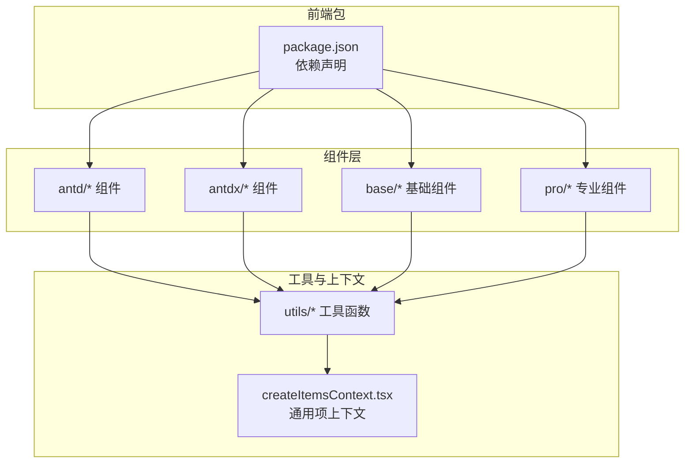
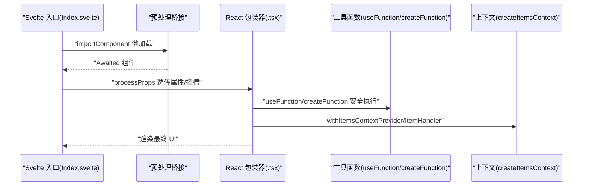
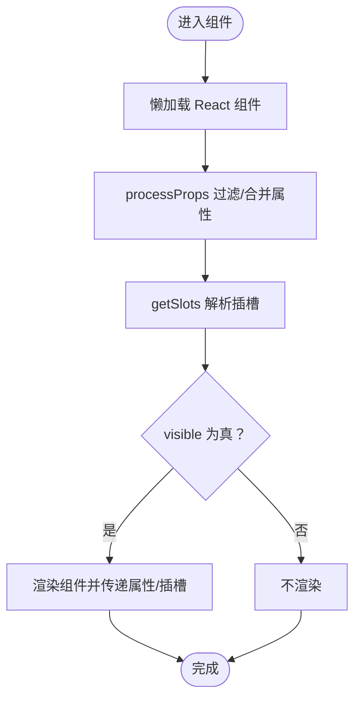
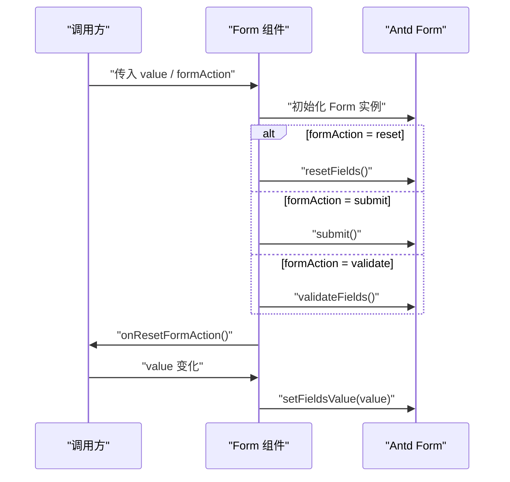
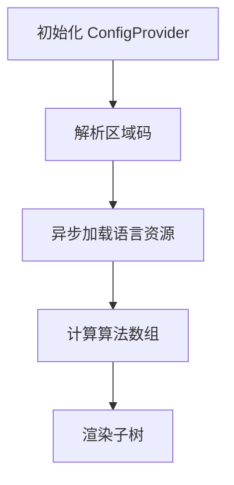
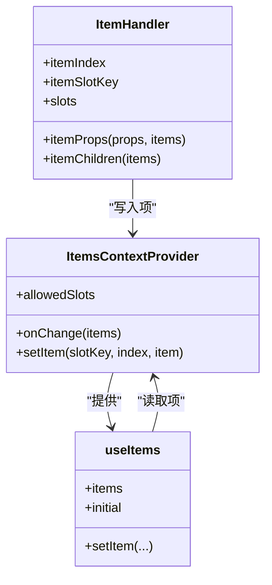
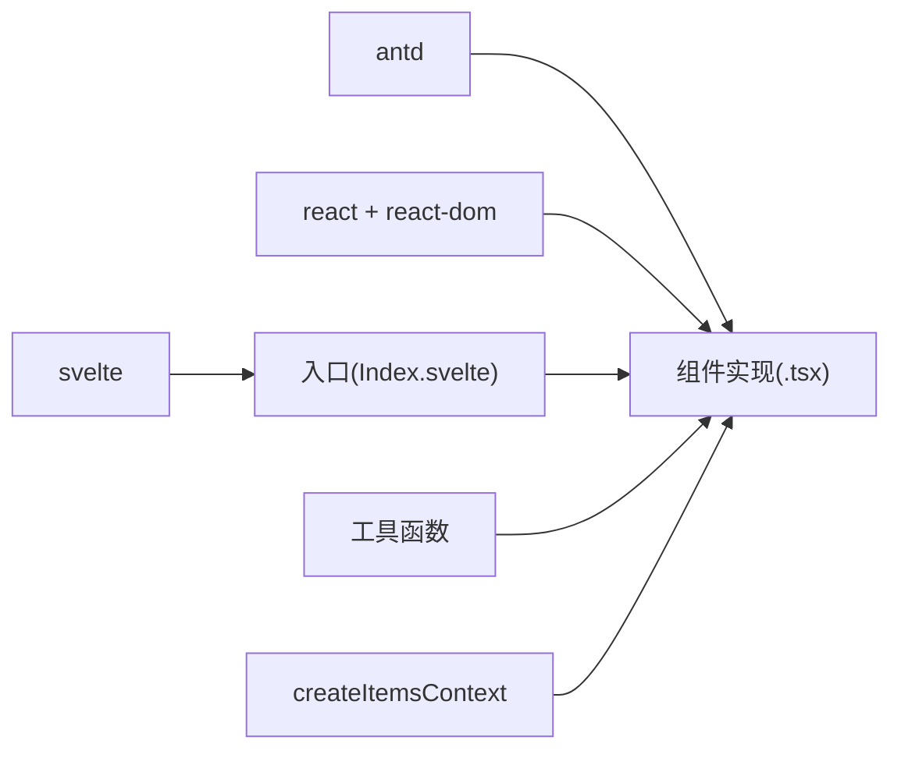

# 组件开发最佳实践

<cite>
**本文引用的文件**
- [frontend/package.json](file://frontend/package.json)
- [frontend/antd/button/Index.svelte](file://frontend/antd/button/Index.svelte)
- [frontend/antd/form/form.tsx](file://frontend/antd/form/form.tsx)
- [frontend/base/text/text.tsx](file://frontend/base/text/text.tsx)
- [frontend/antd/layout/layout.base.tsx](file://frontend/antd/layout/layout.base.tsx)
- [frontend/antd/grid/context.ts](file://frontend/antd/grid/context.ts)
- [frontend/antd/config-provider/config-provider.tsx](file://frontend/antd/config-provider/config-provider.tsx)
- [frontend/antd/form/context.ts](file://frontend/antd/form/context.ts)
- [frontend/utils/hooks/useFunction.ts](file://frontend/utils/hooks/useFunction.ts)
- [frontend/utils/hooks/useMemoizedFn.ts](file://frontend/utils/hooks/useMemoizedFn.ts)
- [frontend/utils/createFunction.ts](file://frontend/utils/createFunction.ts)
- [frontend/utils/createItemsContext.tsx](file://frontend/utils/createItemsContext.tsx)
- [frontend/antd/table/table.tsx](file://frontend/antd/table/table.tsx)
- [frontend/antd/modal/modal.tsx](file://frontend/antd/modal/modal.tsx)
- [eslint.config.mjs](file://eslint.config.mjs)
- [prettier.config.mjs](file://prettier.config.mjs)
</cite>

## 目录

1. [引言](#引言)
2. [项目结构](#项目结构)
3. [核心组件](#核心组件)
4. [架构总览](#架构总览)
5. [详细组件分析](#详细组件分析)
6. [依赖关系分析](#依赖关系分析)
7. [性能考量](#性能考量)
8. [故障排查指南](#故障排查指南)
9. [结论](#结论)
10. [附录](#附录)

## 引言

本指南面向在 ModelScope Studio 前端生态中进行组件开发的工程师，系统总结设计原则与编码规范，覆盖命名约定、文件组织、代码风格、性能优化、可复用性设计、错误处理与边界情况、国际化与无障碍、跨浏览器兼容等主题，并结合仓库中的真实组件实现给出重构建议与最佳实践。

## 项目结构

该项目采用多包工作区（pnpm workspace）组织，前端以 Svelte 5 + React 生态为核心，通过预处理层桥接 Ant Design 组件库，形成统一的组件体系。组件按领域分层：antd、antdx、base、pro 等模块，每个组件通常由 Svelte 入口文件与对应的 React 包装器组成，配合工具函数与上下文实现高内聚低耦合。

图表来源

- [frontend/package.json:1-59](file://frontend/package.json#L1-L59)

章节来源

- [frontend/package.json:1-59](file://frontend/package.json#L1-L59)

## 核心组件

本节聚焦于组件开发的关键模式与规范，包括：

- 统一的入口与包装：Svelte 入口负责属性透传、懒加载与插槽渲染；React 包装器负责生命周期与状态管理。
- 可配置的国际化与主题：通过 ConfigProvider 提供语言、主题算法与容器策略。
- 高内聚上下文：createItemsContext 抽象“项集合”与“子项处理器”，支撑复杂组件的动态列、行选择、展开等场景。
- 函数式能力：useFunction、useMemoizedFn、createFunction 将字符串或函数式配置安全地转换为运行时函数。

章节来源

- [frontend/antd/button/Index.svelte:1-74](file://frontend/antd/button/Index.svelte#L1-L74)
- [frontend/antd/form/form.tsx:1-79](file://frontend/antd/form/form.tsx#L1-L79)
- [frontend/antd/config-provider/config-provider.tsx:1-154](file://frontend/antd/config-provider/config-provider.tsx#L1-L154)
- [frontend/utils/hooks/useFunction.ts:1-13](file://frontend/utils/hooks/useFunction.ts#L1-L13)
- [frontend/utils/hooks/useMemoizedFn.ts:1-11](file://frontend/utils/hooks/useMemoizedFn.ts#L1-L11)
- [frontend/utils/createFunction.ts:1-38](file://frontend/utils/createFunction.ts#L1-L38)
- [frontend/utils/createItemsContext.tsx:1-274](file://frontend/utils/createItemsContext.tsx#L1-L274)

## 架构总览

下图展示组件从入口到渲染的关键路径，以及与工具函数、上下文的关系。

图表来源

- [frontend/antd/button/Index.svelte:10-73](file://frontend/antd/button/Index.svelte#L10-L73)
- [frontend/antd/form/form.tsx:15-76](file://frontend/antd/form/form.tsx#L15-L76)
- [frontend/utils/hooks/useFunction.ts:5-12](file://frontend/utils/hooks/useFunction.ts#L5-L12)
- [frontend/utils/createFunction.ts:10-37](file://frontend/utils/createFunction.ts#L10-L37)
- [frontend/utils/createItemsContext.tsx:171-184](file://frontend/utils/createItemsContext.tsx#L171-L184)

## 详细组件分析

### 组件命名与文件组织

- 命名约定
  - 组件目录与文件名使用小驼峰或短横线命名，如 button、date-picker、config-provider。
  - Svelte 入口统一命名为 Index.svelte，对应组件源文件命名为组件名.tsx 或组件名.svelte。
- 文件组织
  - 每个组件包含：入口文件（Index.svelte）、组件实现（_.tsx）、样式（_.less）、配置（package.json、gradio.config.js）。
  - 复杂组件拆分子模块（如 table 的 column、row-selection、expandable），并通过上下文聚合。

章节来源

- [frontend/antd/button/Index.svelte:1-74](file://frontend/antd/button/Index.svelte#L1-L74)
- [frontend/antd/config-provider/config-provider.tsx:1-154](file://frontend/antd/config-provider/config-provider.tsx#L1-L154)
- [frontend/antd/table/table.tsx:1-200](file://frontend/antd/table/table.tsx#L1-L200)

### 属性透传与懒加载

- 懒加载：通过 importComponent 实现按需加载，避免首屏体积膨胀。
- 属性透传：processProps 过滤内部字段，保留可见性、样式、类名、ID 等对外属性。
- 插槽渲染：getSlots 获取默认插槽，结合 ReactSlot 渲染自定义节点。

图表来源

- [frontend/antd/button/Index.svelte:12-56](file://frontend/antd/button/Index.svelte#L12-L56)

章节来源

- [frontend/antd/button/Index.svelte:12-74](file://frontend/antd/button/Index.svelte#L12-L74)

### 表单组件：状态同步与动作调度

- 动作调度：根据 formAction（reset/submit/validate）触发对应行为，并在完成后重置动作标记。
- 值同步：value 变化时设置表单值，未提供时重置字段。
- 插槽与回调：requiredMark、feedbackIcons 优先使用插槽，否则回退到函数或静态值；onValuesChange 同步外部状态。

图表来源

- [frontend/antd/form/form.tsx:32-53](file://frontend/antd/form/form.tsx#L32-L53)
- [frontend/antd/form/form.tsx:15-76](file://frontend/antd/form/form.tsx#L15-L76)

章节来源

- [frontend/antd/form/form.tsx:1-79](file://frontend/antd/form/form.tsx#L1-L79)

### 布局基础组件：动态选择器

- Base 组件根据 component 参数动态选择 Header/Footer/Content/Layout，统一注入类名前缀，便于样式隔离。

章节来源

- [frontend/antd/layout/layout.base.tsx:1-40](file://frontend/antd/layout/layout.base.tsx#L1-L40)

### 国际化与主题：ConfigProvider

- 主题算法：支持暗色与紧凑算法组合，按 themeMode 切换。
- 语言切换：根据 navigator 语言格式化为可用区域码，动态加载 antd 与 dayjs 本地化资源。
- 容器策略：getPopupContainer/getTargetContainer 支持字符串或函数，函数通过 useFunction 安全执行。
- 插槽注入：支持 renderEmpty 等插槽转为 React 节点。

图表来源

- [frontend/antd/config-provider/config-provider.tsx:85-105](file://frontend/antd/config-provider/config-provider.tsx#L85-L105)
- [frontend/antd/config-provider/config-provider.tsx:127-143](file://frontend/antd/config-provider/config-provider.tsx#L127-L143)

章节来源

- [frontend/antd/config-provider/config-provider.tsx:1-154](file://frontend/antd/config-provider/config-provider.tsx#L1-L154)

### 上下文与项集合：createItemsContext

- 作用：为复杂组件（如表格、表单项规则）提供“项集合”的收集与传递机制。
- 关键能力
  - withItemsContextProvider：包裹子树，建立上下文。
  - ItemHandler：将子项（props/slots/children）写入上下文，支持 memo 化与去重。
  - useItems：读取当前项集合，触发 onChange 回调。
- 使用场景：表格列、展开项、行选择、表单项规则等。

图表来源

- [frontend/utils/createItemsContext.tsx:108-170](file://frontend/utils/createItemsContext.tsx#L108-L170)
- [frontend/utils/createItemsContext.tsx:190-261](file://frontend/utils/createItemsContext.tsx#L190-L261)
- [frontend/antd/grid/context.ts:1-7](file://frontend/antd/grid/context.ts#L1-L7)

章节来源

- [frontend/utils/createItemsContext.tsx:1-274](file://frontend/utils/createItemsContext.tsx#L1-L274)
- [frontend/antd/grid/context.ts:1-7](file://frontend/antd/grid/context.ts#L1-L7)
- [frontend/antd/form/context.ts:1-10](file://frontend/antd/form/context.ts#L1-L10)

### 表格组件：列、展开、行选择与函数配置

- 列与扩展：通过上下文聚合列与展开配置，支持默认列与内置占位符（EXPAND_COLUMN、SELECTION_COLUMN）。
- 函数配置：getPopupContainer、rowKey、rowClassName、sticky、showSorterTooltip、summary/footer 等均支持字符串或函数，经 createFunction/useFunction 安全执行。
- 插槽：loading、pagination、tooltip、summary 等支持插槽参数化渲染。

章节来源

- [frontend/antd/table/table.tsx:41-200](file://frontend/antd/table/table.tsx#L41-L200)

### 模态框组件：插槽与函数化配置

- 插槽优先：okText、cancelText、footer、title、closeIcon、okButtonProps.icon、cancelButtonProps.icon、closable.closeIcon、modalRender 等优先使用插槽。
- 函数兜底：当插槽不可用时，使用 useFunction 将字符串或函数转换为可执行函数。
- 容器策略：getContainer 支持字符串选择器或函数。

章节来源

- [frontend/antd/modal/modal.tsx:1-107](file://frontend/antd/modal/modal.tsx#L1-L107)

### 基础文本组件：最小实现

- 仅接收 value 并渲染，若为空则插入空占位元素，保证 DOM 结构稳定。

章节来源

- [frontend/base/text/text.tsx:1-11](file://frontend/base/text/text.tsx#L1-L11)

## 依赖关系分析

- 依赖来源：package.json 中集中声明 Ant Design、React、Svelte、国际化与多媒体相关依赖。
- 组件间耦合：通过预处理桥接与工具函数降低耦合；复杂组件通过上下文解耦。
- 外部集成：ConfigProvider 与 dayjs 协同实现语言切换；StyleProvider 控制样式哈希优先级。

图表来源

- [frontend/package.json:8-40](file://frontend/package.json#L8-L40)
- [frontend/antd/button/Index.svelte:6-10](file://frontend/antd/button/Index.svelte#L6-L10)
- [frontend/utils/createItemsContext.tsx:1-274](file://frontend/utils/createItemsContext.tsx#L1-L274)

章节来源

- [frontend/package.json:1-59](file://frontend/package.json#L1-L59)

## 性能考量

- 懒加载与按需渲染
  - 使用 importComponent 按需加载，避免一次性引入大量组件导致首屏阻塞。
  - Svelte 条件渲染 visible 字段，减少无效节点挂载。
- 函数与对象稳定化
  - useFunction/useMemoizedFn/createFunction 将字符串或函数式配置转换为稳定函数，避免重复创建闭包。
  - useMemo/useMemoizedEqualValue 在上下文中缓存昂贵计算与等值比较。
- 插槽与隐藏渲染
  - 复杂组件常将实际内容隐藏渲染，仅暴露占位，减少初始布局抖动。
- 主题与样式
  - StyleProvider 配置哈希优先级，避免样式冲突带来的重绘。
- 事件与回调
  - 对高频回调使用 useMemoizedFn 缓存引用，降低子组件重渲染概率。

章节来源

- [frontend/antd/button/Index.svelte:59-73](file://frontend/antd/button/Index.svelte#L59-L73)
- [frontend/antd/form/form.tsx:28-30](file://frontend/antd/form/form.tsx#L28-L30)
- [frontend/utils/hooks/useFunction.ts:5-12](file://frontend/utils/hooks/useFunction.ts#L5-L12)
- [frontend/utils/hooks/useMemoizedFn.ts:3-10](file://frontend/utils/hooks/useMemoizedFn.ts#L3-L10)
- [frontend/utils/createFunction.ts:10-37](file://frontend/utils/createFunction.ts#L10-L37)
- [frontend/antd/config-provider/config-provider.tsx:110-110](file://frontend/antd/config-provider/config-provider.tsx#L110-L110)

## 故障排查指南

- 插槽未生效
  - 检查插槽键是否正确（如 footer、title、okText 等），确认是否使用 ReactSlot 包裹。
  - 对于需要参数的插槽，使用 renderParamsSlot 渲染。
- 函数配置异常
  - 若传入字符串函数，确保格式合法；使用 createFunction/useFunction 安全执行。
- 主题或语言不生效
  - 确认 themeMode 与 locale 设置；检查语言资源加载是否成功。
- 上下文项未更新
  - 确保 ItemHandler 的 itemIndex 与 itemSlotKey 正确；检查 setItem 是否被调用。
- 性能问题
  - 检查是否存在不必要的 props 变更；对回调使用 useMemoizedFn；避免在 render 内创建新函数。

章节来源

- [frontend/antd/modal/modal.tsx:40-95](file://frontend/antd/modal/modal.tsx#L40-L95)
- [frontend/antd/config-provider/config-provider.tsx:96-105](file://frontend/antd/config-provider/config-provider.tsx#L96-L105)
- [frontend/utils/createFunction.ts:10-37](file://frontend/utils/createFunction.ts#L10-L37)
- [frontend/utils/createItemsContext.tsx:234-254](file://frontend/utils/createItemsContext.tsx#L234-L254)

## 结论

本指南基于仓库现有组件实现，总结了组件开发的设计原则与工程化实践：以 Svelte 入口 + React 包装器的桥接模式实现统一生态；通过上下文与工具函数实现高内聚低耦合；借助懒加载、函数稳定化与插槽机制提升性能与可扩展性。遵循这些最佳实践，可在保证一致性的同时提升组件质量与可维护性。

## 附录

### 设计原则与编码规范

- 命名与组织
  - 组件目录与文件名采用小驼峰或短横线命名；入口统一为 Index.svelte；实现为 \*.tsx。
  - 复杂组件拆分子模块并通过上下文聚合。
- 属性与插槽
  - 明确区分对外属性与内部属性；对外属性通过 processProps 透传；插槽优先于静态值。
- 函数与回调
  - 所有字符串函数通过 createFunction/useFunction 安全执行；高频回调使用 useMemoizedFn 缓存。
- 国际化与主题
  - 使用 ConfigProvider 管理语言与主题；语言资源按需加载；容器策略支持字符串与函数。
- 样式与主题
  - 使用 StyleProvider 控制样式哈希优先级；为不同组件类型注入统一前缀类名。
- 错误处理与边界
  - 对不可识别的函数字符串返回 undefined 并降级；对插槽缺失时提供合理默认值。
- 无障碍与兼容
  - 保持语义化标签与可访问属性；避免仅依赖颜色表达信息；测试主流浏览器与移动端。

章节来源

- [frontend/antd/button/Index.svelte:24-52](file://frontend/antd/button/Index.svelte#L24-L52)
- [frontend/antd/config-provider/config-provider.tsx:110-149](file://frontend/antd/config-provider/config-provider.tsx#L110-L149)
- [frontend/utils/createFunction.ts:10-37](file://frontend/utils/createFunction.ts#L10-L37)
- [eslint.config.mjs:1-9](file://eslint.config.mjs#L1-L9)
- [prettier.config.mjs:1-26](file://prettier.config.mjs#L1-L26)
