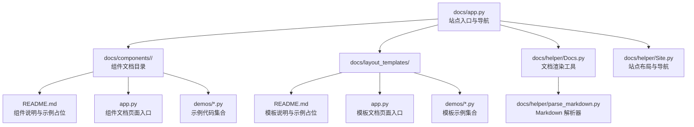
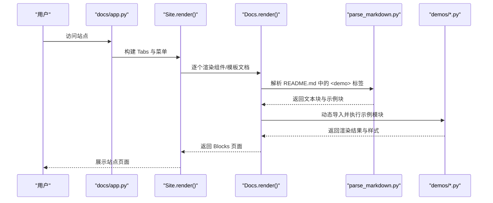
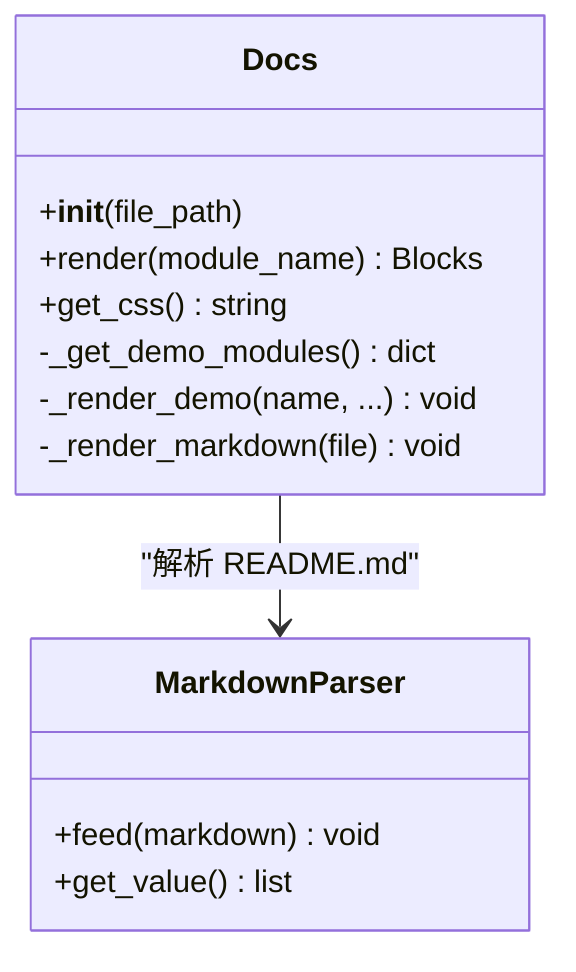
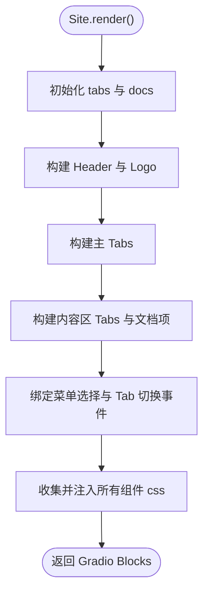
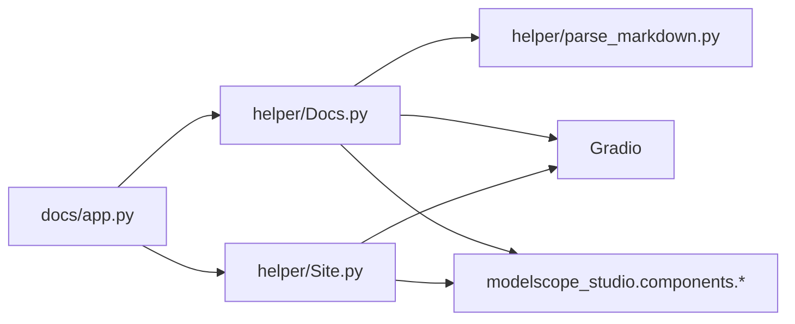

# 组件文档编写

<cite>
**本文引用的文件**
- [Docs.py](file://docs/helper/Docs.py)
- [Site.py](file://docs/helper/Site.py)
- [app.py](file://docs/app.py)
- [README.md](file://docs/README.md)
- [FAQ.md](file://docs/FAQ.md)
- [parse_markdown.py](file://docs/helper/parse_markdown.py)
- [button/README.md](file://docs/components/antd/button/README.md)
- [button/app.py](file://docs/components/antd/button/app.py)
- [chatbot/README.md](file://docs/layout_templates/chatbot/README.md)
- [chatbot/app.py](file://docs/layout_templates/chatbot/app.py)
- [example.py](file://docs/demos/example.py)
- [basic.py（按钮示例）](file://docs/components/antd/button/demos/basic.py)
- [basic.py（聊天模板示例）](file://docs/layout_templates/chatbot/demos/basic.py)
</cite>

## 目录

1. [简介](#简介)
2. [项目结构](#项目结构)
3. [核心组件](#核心组件)
4. [架构总览](#架构总览)
5. [详细组件分析](#详细组件分析)
6. [依赖分析](#依赖分析)
7. [性能考虑](#性能考虑)
8. [故障排查指南](#故障排查指南)
9. [结论](#结论)
10. [附录](#附录)

## 简介

本指南面向为 ModelScope Studio 组件编写完整文档的开发者，覆盖以下主题：

- README.md 的编写规范与元信息配置
- demos 目录的组织结构与示例文件命名约定
- app.py 的配置方法与站点导航构建
- 文档生成工具 Docs.py 与 Site.py 的功能与用法
- 示例代码的分层规范：基础用法、高级配置、常见问题
- 组件分类与导航结构的组织方式
- 模板与示例路径指引，帮助快速上手

## 项目结构

文档系统由“组件文档”“布局模板”“辅助工具”三部分组成，并通过统一入口 app.py 构建站点导航与内容渲染。

图表来源

- [app.py:1-598](file://docs/app.py#L1-L598)
- [Docs.py:1-178](file://docs/helper/Docs.py#L1-L178)
- [Site.py:1-255](file://docs/helper/Site.py#L1-L255)
- [parse_markdown.py:1-84](file://docs/helper/parse_markdown.py#L1-L84)

章节来源

- [app.py:1-598](file://docs/app.py#L1-L598)

## 核心组件

- Docs 渲染器：负责解析 README.md 中的 <demo> 标签，动态加载 demos 目录中的示例模块，渲染“代码+效果”的对比视图，并收集各示例模块的样式。
- Site 站点：负责构建多标签页、侧边菜单、主内容区的站点骨架，支持 Tab 切换、菜单联动、响应式布局与全局样式注入。
- Markdown 解析器：识别并处理 <demo>、<demo-prefix>、<demo-suffix>、<file> 等标签，将 README 内容拆分为文本块与示例块，供 Docs 渲染。
- 站点入口 app.py：扫描 components 与 layout_templates 目录，聚合各组件/模板的 docs，构建 tabs 与 menus，最终生成 Site 并返回 Gradio Blocks。

章节来源

- [Docs.py:12-178](file://docs/helper/Docs.py#L12-L178)
- [Site.py:9-255](file://docs/helper/Site.py#L9-L255)
- [parse_markdown.py:12-84](file://docs/helper/parse_markdown.py#L12-L84)
- [app.py:19-598](file://docs/app.py#L19-L598)

## 架构总览

下图展示了从 README.md 到最终页面渲染的关键流程，以及 Docs 与 Site 的协作关系。

图表来源

- [app.py:580-598](file://docs/app.py#L580-L598)
- [Site.py:41-255](file://docs/helper/Site.py#L41-L255)
- [Docs.py:171-178](file://docs/helper/Docs.py#L171-L178)
- [parse_markdown.py:80-84](file://docs/helper/parse_markdown.py#L80-L84)

## 详细组件分析

### README.md 编写规范

- 元信息（前言 YAML）：用于定义标签、标题、颜色、简述、SDK、版本、是否置顶、头部样式、应用文件、许可证等。参考：[README.md:1-17](file://docs/README.md#L1-L17)
- 标题与简介：简洁明了地介绍组件库定位与适用场景。参考：[README.md:19-44](file://docs/README.md#L19-L44)
- 依赖与安装：列出最低依赖与安装命令。参考：[README.md:46-54](file://docs/README.md#L46-L54)
- 示例占位：<demo name="..."></demo> 用于在 README 中插入示例。参考：[README.md:56-58](file://docs/README.md#L56-L58)
- 迁移说明：提供版本迁移要点与兼容建议。参考：[README.md:60-75](file://docs/README.md#L60-L75)

章节来源

- [README.md:1-75](file://docs/README.md#L1-L75)

### demos 目录组织结构

- 组件示例：位于 docs/components/<category>/<component>/demos/，每个示例文件以功能命名（如 basic.py），导出可被 Docs 动态导入的模块对象。
- 模板示例：位于 docs/layout_templates/<template>/demos/，按功能拆分示例文件。
- 示例文件命名：避免以 \_\_ 开头；扩展名为 .py；示例名称即文件名（不含扩展名）。
- 示例模块要求：需包含可调用的 render 方法或可直接作为入口运行的 Gradio Blocks；若示例需要样式，可在模块中暴露 css 字符串。

章节来源

- [button/README.md:1-8](file://docs/components/antd/button/README.md#L1-L8)
- [chatbot/README.md:1-20](file://docs/layout_templates/chatbot/README.md#L1-L20)
- [basic.py（按钮示例）:1-26](file://docs/components/antd/button/demos/basic.py#L1-L26)
- [basic.py（聊天模板示例）:1-699](file://docs/layout_templates/chatbot/demos/basic.py#L1-L699)

### app.py 配置方法

- 组件扫描：get_docs(type) 扫描 docs/components/<type> 下的子目录，导入每个子目录下的 app.py，聚合为 docs 字典。
- 模板扫描：get_layout_templates() 扫描 docs/layout_templates 下的子目录，导入 app.py 聚合为 docs 字典。
- 站点导航：tabs 定义标签页与默认激活项；menus 定义侧边菜单树，支持分组与默认激活键。
- 站点实例：Site(tabs, docs, default_active_tab, logo) 构建站点骨架，返回 Gradio Blocks。
- 启动参数：demo.queue(...).launch(...) 支持并发与线程上限设置；在 Hugging Face Space 中需传入 ssr_mode=False。

章节来源

- [app.py:19-598](file://docs/app.py#L19-L598)

### 文档生成工具 Docs.py

- 初始化：接收当前文件路径，自动发现同级目录下的 .md 文件，过滤语言后缀（根据环境变量决定 zh_CN 或非 zh_CN）。
- 示例发现：递归扫描 demos 目录，排除以 \_\_ 开头的文件，仅保留 .py 文件。
- 动态导入：使用 importlib.util 从文件路径加载示例模块，缓存到 demo_modules。
- Markdown 解析：调用 parse_markdown，将 README 转换为文本块与示例块序列。
- 示例渲染：对每个示例块，读取对应 demos/<name>.py 的源码，渲染“代码+效果”对比视图；支持标题、折叠、位置、固定等参数。
- 样式收集：遍历所有示例模块，合并 css 字符串，注入到站点根级 Blocks。

图表来源

- [Docs.py:12-178](file://docs/helper/Docs.py#L12-L178)
- [parse_markdown.py:12-84](file://docs/helper/parse_markdown.py#L12-L84)

章节来源

- [Docs.py:12-178](file://docs/helper/Docs.py#L12-L178)
- [parse_markdown.py:12-84](file://docs/helper/parse_markdown.py#L12-L84)

### 站点工具 Site.py

- 导航结构：接收 tabs 列表与 docs 字典，构建顶部菜单与侧边菜单，支持横向菜单与内嵌菜单两种模式。
- 样式注入：遍历 docs 中所有组件/模板的 css，统一注入到根级 Blocks。
- 事件联动：Tab 切换与菜单选择通过 Gradio 事件绑定，实现菜单高亮与内容可见性同步。
- 响应式布局：使用 Splitter 与 Layout 实现侧边栏与内容区的自适应宽度与滚动。

图表来源

- [Site.py:41-255](file://docs/helper/Site.py#L41-L255)

章节来源

- [Site.py:9-255](file://docs/helper/Site.py#L9-L255)

### 示例代码编写规范

- 基础用法：展示组件最简单的使用方式，强调最小可运行示例。参考：[basic.py（按钮示例）:1-26](file://docs/components/antd/button/demos/basic.py#L1-L26)
- 高级配置：演示组件的常用属性、插槽、事件与组合使用。参考：[basic.py（聊天模板示例）:1-699](file://docs/layout_templates/chatbot/demos/basic.py#L1-L699)
- 常见问题：在 README 中通过 <demo> 标签引入示例，说明常见问题与解决方案。参考：[FAQ.md:1-20](file://docs/FAQ.md#L1-L20)
- 示例模块结构：示例文件应能独立运行，必要时在末尾添加 if **name** == "**main**": demo.queue().launch(...)。参考：[example.py:1-11](file://docs/demos/example.py#L1-L11)

章节来源

- [basic.py（按钮示例）:1-26](file://docs/components/antd/button/demos/basic.py#L1-L26)
- [basic.py（聊天模板示例）:1-699](file://docs/layout_templates/chatbot/demos/basic.py#L1-L699)
- [example.py:1-11](file://docs/demos/example.py#L1-L11)
- [FAQ.md:1-20](file://docs/FAQ.md#L1-L20)

### 组件分类与导航结构

- 分类维度：基础组件（base）、高级组件（pro）、Antd 组件（antd）、Antdx 组件（antdx）、首页与 FAQ、布局模板（layout_templates）。
- 导航层级：tabs 定义一级标签页；每个标签页可配置 menus（二级菜单树），支持分组与默认激活键。
- 语言适配：通过 get_text 在中文环境下显示中文标签，在非中文环境下显示英文标签。
- 扩展菜单：可在 antd 菜单底部追加“更多组件”链接，指向官方文档。

章节来源

- [app.py:19-598](file://docs/app.py#L19-L598)

## 依赖分析

- Docs 依赖：parse_markdown、Gradio、modelscope_studio 组件库（antd/base）。
- Site 依赖：Gradio、modelscope_studio 组件库（antd/base），负责布局与事件。
- app.py 依赖：Docs、Site、环境变量判断（是否为 ModelScope Studio 环境）。

图表来源

- [app.py:1-598](file://docs/app.py#L1-L598)
- [Docs.py:1-178](file://docs/helper/Docs.py#L1-L178)
- [Site.py:1-255](file://docs/helper/Site.py#L1-L255)
- [parse_markdown.py:1-84](file://docs/helper/parse_markdown.py#L1-L84)

章节来源

- [app.py:1-598](file://docs/app.py#L1-L598)
- [Docs.py:1-178](file://docs/helper/Docs.py#L1-L178)
- [Site.py:1-255](file://docs/helper/Site.py#L1-L255)
- [parse_markdown.py:1-84](file://docs/helper/parse_markdown.py#L1-L84)

## 性能考虑

- 并发与队列：在 demo.queue(default_concurrency_limit=..., max_size=...) 中合理设置并发与队列上限，避免资源争用。
- 样式注入：Site 将所有组件的 css 合并注入，避免多 Blocks 场景下的样式丢失问题。
- 启动参数：在 Hugging Face Space 中启用 ssr_mode=False，确保自定义组件正常渲染。
- 示例模块：尽量减少示例中的外部依赖与网络请求，或在示例中提供降级方案。

章节来源

- [app.py:595-598](file://docs/app.py#L595-L598)
- [Site.py:55-73](file://docs/helper/Site.py#L55-L73)

## 故障排查指南

- 页面不显示或空白：在 demo.launch() 中添加 ssr_mode=False。参考：[FAQ.md:3-5](file://docs/FAQ.md#L3-L5)
- 操作响应慢：未使用 AutoLoading 组件导致加载反馈缺失，建议在应用顶层使用 AutoLoading。参考：[FAQ.md:7-19](file://docs/FAQ.md#L7-L19)
- 示例无法渲染：检查 README.md 中 <demo name="..."> 是否与 demos 目录中的文件名一致；确认示例模块可被 importlib.util 从文件路径正确加载。参考：[Docs.py:58-75](file://docs/helper/Docs.py#L58-L75)
- 语言显示异常：确认环境变量与 Docs 的语言过滤逻辑是否符合预期。参考：[Docs.py:22-31](file://docs/helper/Docs.py#L22-L31)

章节来源

- [FAQ.md:1-20](file://docs/FAQ.md#L1-L20)
- [Docs.py:22-31](file://docs/helper/Docs.py#L22-L31)
- [Docs.py:58-75](file://docs/helper/Docs.py#L58-L75)

## 结论

通过 Docs.py 与 Site.py 的配合，ModelScope Studio 的文档系统实现了“Markdown + 示例模块”的解耦渲染，既保证了文档的可读性，又提供了交互式示例的即时验证能力。遵循本文档的编写规范与组织方式，可以高效地为新组件与模板补充高质量的文档。

## 附录

### README.md 元信息字段说明

- tags：文档标签，便于检索与分类
- title：文档标题
- colorFrom/colorTo：页面渐变色彩
- short_description：简短描述
- sdk/sdk_version：使用的 SDK 及版本
- pinned：是否置顶
- header：头部样式
- app_file：应用入口文件
- license：许可证

章节来源

- [README.md:1-17](file://docs/README.md#L1-L17)

### README.md 中的示例占位语法

- <demo name="...">：插入指定示例
- <demo name="..." position="bottom|left" collapsible="true|false" title="...">：控制示例位置、折叠与标题
- <file src="...">：内联插入文件内容

章节来源

- [parse_markdown.py:9-62](file://docs/helper/parse_markdown.py#L9-L62)
- [button/README.md:5-8](file://docs/components/antd/button/README.md#L5-L8)
- [chatbot/README.md:13-20](file://docs/layout_templates/chatbot/README.md#L13-L20)

### 组件 app.py 的最小模板

- 导入 Docs
- 创建 docs = Docs(**file**)
- 可选：在 if **name** == "**main**" 中调用 docs.render().queue().launch()

章节来源

- [button/app.py:1-7](file://docs/components/antd/button/app.py#L1-L7)
- [chatbot/app.py:1-7](file://docs/layout_templates/chatbot/app.py#L1-L7)
