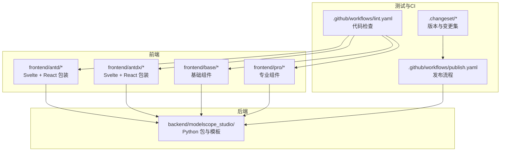
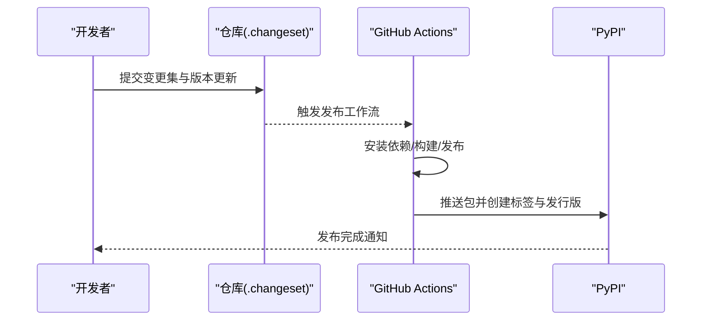
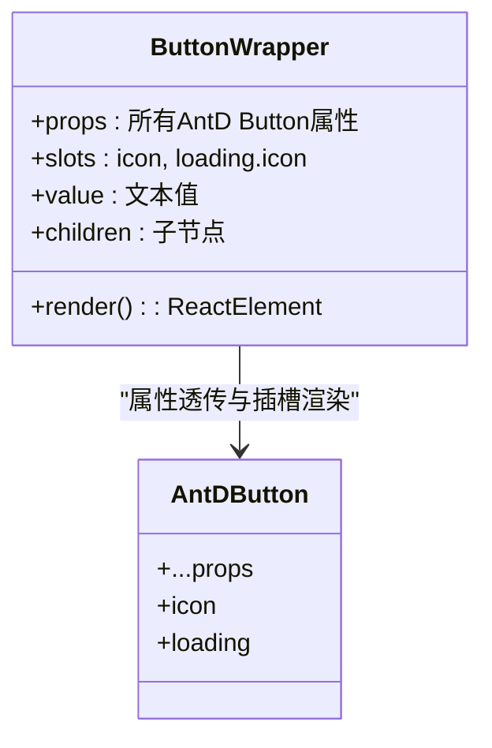
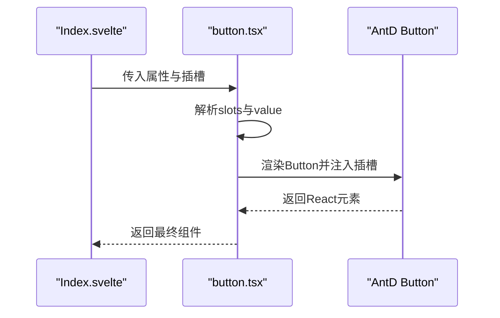
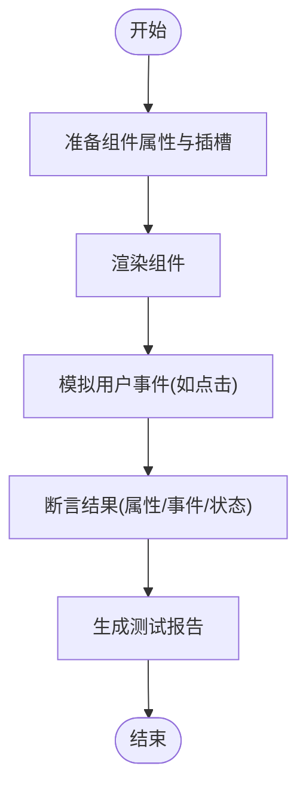
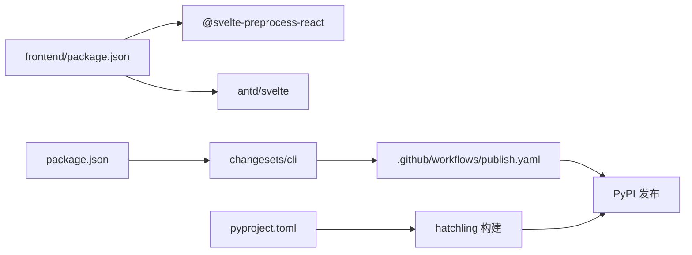

# 组件测试

<cite>
**本文引用的文件**
- [.github/workflows/publish.yaml](file://.github/workflows/publish.yaml)
- [.github/workflows/lint.yaml](file://.github/workflows/lint.yaml)
- [.changeset/README.md](file://.changeset/README.md)
- [.changeset/config.json](file://.changeset/config.json)
- [package.json](file://package.json)
- [frontend/package.json](file://frontend/package.json)
- [pyproject.toml](file://pyproject.toml)
- [tests/test.py](file://tests/test.py)
- [tests/test1.py](file://tests/test1.py)
- [frontend/antd/button/button.tsx](file://frontend/antd/button/button.tsx)
- [frontend/antd/button/Index.svelte](file://frontend/antd/button/Index.svelte)
- [frontend/fixtures.d.ts](file://frontend/fixtures.d.ts)
</cite>

## 目录

1. [引言](#引言)
2. [项目结构](#项目结构)
3. [核心组件](#核心组件)
4. [架构总览](#架构总览)
5. [详细组件分析](#详细组件分析)
6. [依赖分析](#依赖分析)
7. [性能考虑](#性能考虑)
8. [故障排查指南](#故障排查指南)
9. [结论](#结论)
10. [附录](#附录)

## 引言

本指南面向 ModelScope Studio 的组件测试与持续集成实践，覆盖单元测试、集成测试与端到端测试的实施方法，并结合仓库中现有的 GitHub Actions 工作流与 Changesets 配置，给出可操作的测试流程与最佳实践。内容兼顾技术深度与可读性，适合不同背景的读者。

## 项目结构

该项目采用多包工作区（pnpm workspace）组织前端组件与后端 Python 包，配合 Gradio 生态进行组件渲染与交互。测试相关的关键位置如下：

- 前端组件位于 frontend/antd 与 frontend/antdx 等目录，每个组件由 Svelte 模板与 React 包装层组成，便于在 Gradio 中作为自定义组件使用。
- 测试样例位于 tests/，包含基于 Gradio Blocks/Interface 的简单演示脚本，可用于快速验证组件行为。
- GitHub Actions 工作流位于 .github/workflows/，包含 Lint 流程与发布流程；发布流程中包含版本更新与发布步骤，但未直接包含测试执行步骤。
- Changesets 位于 .changeset/，用于管理变更集与版本发布流程。

**图表来源**

- [frontend/antd/button/Index.svelte:1-74](file://frontend/antd/button/Index.svelte#L1-L74)
- [.github/workflows/lint.yaml:1-34](file://.github/workflows/lint.yaml#L1-L34)
- [.github/workflows/publish.yaml:1-74](file://.github/workflows/publish.yaml#L1-L74)
- [.changeset/config.json:1-15](file://.changeset/config.json#L1-L15)

**章节来源**

- [frontend/antd/button/Index.svelte:1-74](file://frontend/antd/button/Index.svelte#L1-L74)
- [.github/workflows/lint.yaml:1-34](file://.github/workflows/lint.yaml#L1-L34)
- [.github/workflows/publish.yaml:1-74](file://.github/workflows/publish.yaml#L1-L74)
- [.changeset/config.json:1-15](file://.changeset/config.json#L1-L15)

## 核心组件

- 组件封装模式：前端组件通常由 Svelte 模板负责属性与插槽处理，通过 React 包装层对接 Ant Design 组件，实现与 Gradio 的桥接。
- 属性与插槽：组件接收标准属性并通过 slots 处理图标、加载态等扩展插槽，支持动态值与可见性控制。
- 测试入口：仓库提供了基于 Gradio 的简单测试脚本，可作为端到端测试的起点。

**章节来源**

- [frontend/antd/button/button.tsx:1-39](file://frontend/antd/button/button.tsx#L1-L39)
- [frontend/antd/button/Index.svelte:1-74](file://frontend/antd/button/Index.svelte#L1-L74)
- [tests/test.py:1-17](file://tests/test.py#L1-L17)
- [tests/test1.py:1-15](file://tests/test1.py#L1-L15)

## 架构总览

下图展示了从组件到测试与发布的整体流程，以及 Changesets 在版本管理中的作用。

**图表来源**

- [.github/workflows/publish.yaml:1-74](file://.github/workflows/publish.yaml#L1-L74)
- [.changeset/config.json:1-15](file://.changeset/config.json#L1-L15)

**章节来源**

- [.github/workflows/publish.yaml:1-74](file://.github/workflows/publish.yaml#L1-L74)
- [.changeset/README.md:1-9](file://.changeset/README.md#L1-L9)
- [.changeset/config.json:1-15](file://.changeset/config.json#L1-L15)

## 详细组件分析

### 组件：按钮（antd.button）

该组件展示了典型的属性与插槽处理模式，包括：

- 属性透传：将 Ant Design Button 的属性原样传递给底层组件。
- 插槽支持：支持 icon 与 loading.icon 插槽，允许自定义图标与加载态。
- 动态值与可见性：根据 children 与 value 决定渲染内容；visible 控制显示。

**图表来源**

- [frontend/antd/button/button.tsx:1-39](file://frontend/antd/button/button.tsx#L1-L39)

**图表来源**

- [frontend/antd/button/Index.svelte:1-74](file://frontend/antd/button/Index.svelte#L1-L74)
- [frontend/antd/button/button.tsx:1-39](file://frontend/antd/button/button.tsx#L1-L39)

**章节来源**

- [frontend/antd/button/button.tsx:1-39](file://frontend/antd/button/button.tsx#L1-L39)
- [frontend/antd/button/Index.svelte:1-74](file://frontend/antd/button/Index.svelte#L1-L74)

### 测试场景与实践指导

- 属性验证：针对按钮组件，应验证 icon 与 loading.icon 插槽是否正确渲染；value 与 children 的优先级逻辑；visible 对显示的影响。
- 事件触发：在 Gradio Blocks 中为按钮绑定 click 回调，验证输入输出与回调触发顺序。
- 状态变化：验证 loading 状态切换、disabled 状态、size 等属性对渲染的影响。
- 端到端测试：使用 Gradio Interface/Blocks 启动本地服务，通过人工或自动化方式点击按钮、观察输出与日志。

[此图为概念性流程，不直接映射具体源码文件]

**章节来源**

- [tests/test.py:1-17](file://tests/test.py#L1-L17)
- [tests/test1.py:1-15](file://tests/test1.py#L1-L15)

## 依赖分析

- 前端依赖：组件依赖 Ant Design 与 Svelte 5，通过 @svelte-preprocess-react 将 React 组件桥接到 Svelte。
- 后端打包：使用 hatchling 构建 Python 包，包含大量模板文件，确保组件在 Gradio 环境中可用。
- 版本与发布：Changesets 负责版本号与变更记录管理；发布工作流负责安装依赖、构建与发布到 PyPI。

**图表来源**

- [frontend/package.json:1-59](file://frontend/package.json#L1-L59)
- [pyproject.toml:1-258](file://pyproject.toml#L1-L258)
- [package.json:1-55](file://package.json#L1-L55)
- [.github/workflows/publish.yaml:1-74](file://.github/workflows/publish.yaml#L1-L74)

**章节来源**

- [frontend/package.json:1-59](file://frontend/package.json#L1-L59)
- [pyproject.toml:1-258](file://pyproject.toml#L1-L258)
- [package.json:1-55](file://package.json#L1-L55)
- [.github/workflows/publish.yaml:1-74](file://.github/workflows/publish.yaml#L1-L74)

## 性能考虑

- 组件渲染：尽量减少不必要的属性重算与插槽解析，避免在渲染路径上做重型计算。
- 事件处理：在 Gradio 中绑定事件时，注意回调函数的幂等性与副作用最小化。
- 构建与发布：发布工作流已包含安装与构建步骤，建议在本地缓存依赖以提升速度。

[本节为通用建议，无需源码引用]

## 故障排查指南

- Lint 工作流失败：检查 Python 与 Node 依赖安装、格式化与类型检查是否通过。
- 发布工作流失败：确认 PyPI 密钥与 GitHub Token 配置正确；检查版本更新与标签创建步骤。
- 组件渲染异常：核对插槽名称与属性透传逻辑；检查 Svelte 模板与 React 包装层的兼容性。

**章节来源**

- [.github/workflows/lint.yaml:1-34](file://.github/workflows/lint.yaml#L1-L34)
- [.github/workflows/publish.yaml:1-74](file://.github/workflows/publish.yaml#L1-L74)

## 结论

本指南基于现有仓库结构与配置，给出了组件测试与持续集成的实施建议。建议在现有 Lint 工作流基础上补充单元与端到端测试步骤，并结合 Changesets 与发布工作流形成完整的质量闭环。

## 附录

### 使用 Changesets 管理版本与发布

- 初始化与配置：仓库已包含 Changesets 配置与说明文档，可直接使用。
- 常见命令：
  - 版本更新：运行版本更新脚本以生成变更集与版本号。
  - 创建变更集：在需要时新增变更集文件描述改动范围与影响。
- 与发布流程协作：发布工作流会根据版本更新后的提交进行构建与发布。

**章节来源**

- [.changeset/README.md:1-9](file://.changeset/README.md#L1-L9)
- [.changeset/config.json:1-15](file://.changeset/config.json#L1-L15)
- [package.json:1-55](file://package.json#L1-L55)

### 在 GitHub Actions 中添加测试步骤

- 当前工作流：
  - Lint 工作流：安装依赖并执行代码检查。
  - 发布工作流：安装依赖、构建并发布到 PyPI。
- 建议新增测试步骤：
  - 单元测试：在前端组件目录中增加测试脚本与运行命令。
  - 集成测试：在后端 Python 包中增加测试脚本与运行命令。
  - 端到端测试：使用 Gradio 示例脚本启动服务并进行交互验证。
- 测试报告：可在测试完成后上传报告或生成摘要信息。

**章节来源**

- [.github/workflows/lint.yaml:1-34](file://.github/workflows/lint.yaml#L1-L34)
- [.github/workflows/publish.yaml:1-74](file://.github/workflows/publish.yaml#L1-L74)
- [tests/test.py:1-17](file://tests/test.py#L1-L17)
- [tests/test1.py:1-15](file://tests/test1.py#L1-L15)

### 组件测试用例与测试数据编写要点

- 用例设计：
  - 正常路径：验证属性与插槽的正常渲染与交互。
  - 边界条件：空值、禁用态、加载态、超长文本等。
  - 错误场景：无效属性、缺失插槽等。
- 测试数据：
  - 使用最小化数据集覆盖关键分支。
  - 对于异步场景（如进度条），使用时间片与断言描述。
- 断言策略：
  - 属性断言：校验最终渲染的 DOM 或 React 元素属性。
  - 事件断言：校验回调触发次数与参数。
  - 状态断言：校验组件内部状态变化与外部表现一致。

**章节来源**

- [tests/test1.py:1-15](file://tests/test1.py#L1-L15)
- [frontend/fixtures.d.ts:1-50](file://frontend/fixtures.d.ts#L1-L50)
