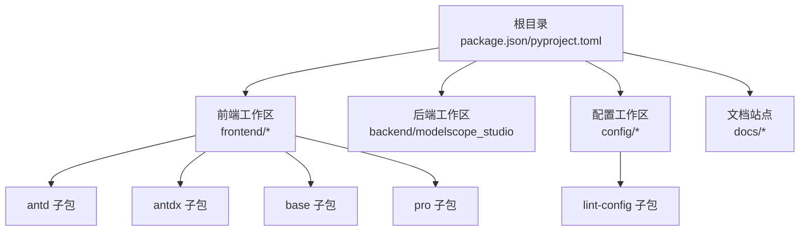
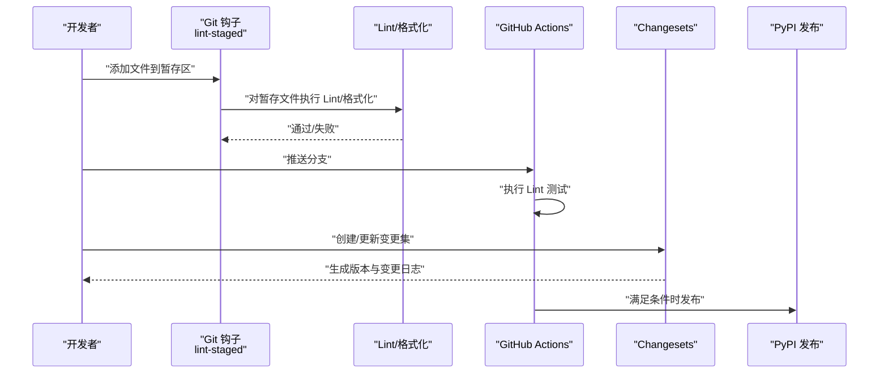
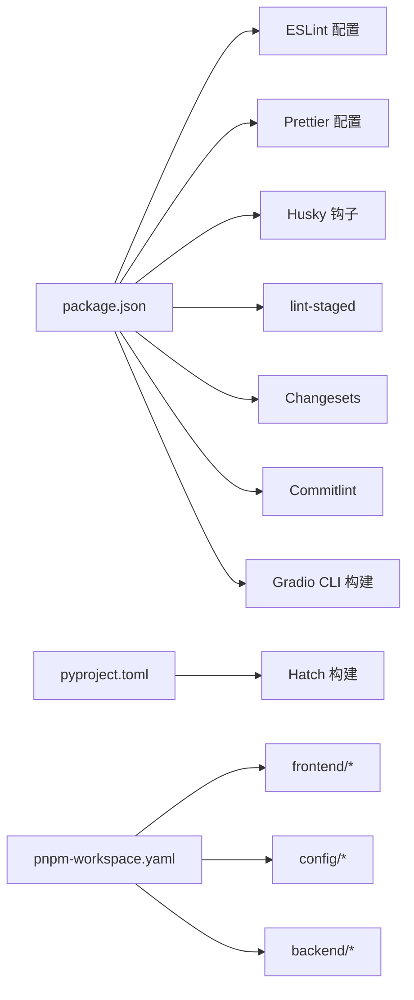

# 贡献指南

<cite>
**本文引用的文件**
- [README.md](file://README.md)
- [package.json](file://package.json)
- [pyproject.toml](file://pyproject.toml)
- [pnpm-workspace.yaml](file://pnpm-workspace.yaml)
- [.commitlintrc.js](file://.commitlintrc.js)
- [.lintstagedrc](file://.lintstagedrc)
- [.editorconfig](file://.editorconfig)
- [.flake8](file://.flake8)
- [.github/workflows/lint.yaml](file://.github/workflows/lint.yaml)
- [.github/workflows/publish.yaml](file://.github/workflows/publish.yaml)
- [eslint.config.mjs](file://eslint.config.mjs)
- [prettier.config.mjs](file://prettier.config.mjs)
- [config/lint-config/package.json](file://config/lint-config/package.json)
- [config/lint-config/eslint.mjs](file://config/lint-config/eslint.mjs)
- [config/lint-config/stylelint.js](file://config/lint-config/stylelint.js)
</cite>

## 目录

1. [简介](#简介)
2. [项目结构](#项目结构)
3. [核心组件](#核心组件)
4. [架构总览](#架构总览)
5. [详细组件分析](#详细组件分析)
6. [依赖关系分析](#依赖关系分析)
7. [性能考虑](#性能考虑)
8. [故障排查指南](#故障排查指南)
9. [结论](#结论)
10. [附录](#附录)

## 简介

本指南面向希望参与 ModelScope Studio 开发与维护的贡献者，涵盖从环境搭建、代码规范、提交规范到 Pull Request 流程、Bug 报告与功能建议、治理与决策流程等全链路实践。项目采用多包工作区（pnpm workspaces）组织前端组件与后端 Python 包，并通过 Changesets 进行版本与变更集管理，配合 GitHub Actions 自动化执行 Lint 与发布。

## 项目结构

- 根目录包含前端组件库、Python 后端包、文档站点、脚本与配置等。
- 前端以 Svelte 5 为基础，按 Ant Design、Ant Design X、Base 组件分包组织；同时存在 Pro 专属组件。
- 后端为 Python 包，使用 Hatch 构建系统，导出大量模板资源供前端运行时使用。
- 工作区通过 pnpm-workspace.yaml 统一管理，包含根、配置、前端各子包等。

图表来源

- [pnpm-workspace.yaml:1-12](file://pnpm-workspace.yaml#L1-L12)
- [package.json:1-55](file://package.json#L1-L55)
- [pyproject.toml:1-257](file://pyproject.toml#L1-L257)

章节来源

- [pnpm-workspace.yaml:1-12](file://pnpm-workspace.yaml#L1-L12)
- [package.json:1-55](file://package.json#L1-L55)
- [pyproject.toml:1-257](file://pyproject.toml#L1-L257)

## 核心组件

- 多包工作区与构建：前端使用 Gradio CLI 构建，根脚本统一管理构建、格式化、类型检查、样式检查与 Lint。
- 版本与发布：Changesets 负责版本号与变更日志生成；GitHub Actions 在主分支推送时触发发布流程。
- 提交规范：Commitlint 使用 Conventional Commits 类型，限制类型枚举并放宽大小写与长度限制。
- 本地钩子：Husky 作为 Git 钩子工具，结合 lint-staged 对暂存文件进行快速 Lint 与格式化。
- 编辑器一致性：EditorConfig 统一缩进、换行与字符集；Prettier 与 ESLint/Stylelint 分别负责格式化与规则校验。

章节来源

- [package.json:8-25](file://package.json#L8-L25)
- [.commitlintrc.js:1-30](file://.commitlintrc.js#L1-L30)
- [.lintstagedrc:1-7](file://.lintstagedrc#L1-L7)
- [.editorconfig:1-17](file://.editorconfig#L1-L17)
- [eslint.config.mjs:1-9](file://eslint.config.mjs#L1-L9)
- [prettier.config.mjs:1-26](file://prettier.config.mjs#L1-L26)

## 架构总览

下图展示贡献流程的关键节点：本地开发、提交规范、CI Lint、版本与发布。

图表来源

- [.lintstagedrc:1-7](file://.lintstagedrc#L1-L7)
- [.github/workflows/lint.yaml:1-34](file://.github/workflows/lint.yaml#L1-L34)
- [.github/workflows/publish.yaml:1-74](file://.github/workflows/publish.yaml#L1-L74)
- [package.json:10-25](file://package.json#L10-L25)

## 详细组件分析

### 代码规范与工具链

- ESLint 配置：根配置聚合 lint-config 中的基础规则，确保前端 JS/TS/Svelte 规则一致。
- Prettier 配置：统一缩进、引号、尾随逗号、换行符等；针对 Svelte 文件指定解析器。
- Stylelint 配置：由 lint-config 提供基础规则，支持 LESS/CSS 检查与修复。
- EditorConfig：统一编辑器基础风格，避免因工具差异导致的格式漂移。
- Flake8：Python Lint 规则与忽略项，限定最大行长与忽略特定规则。

章节来源

- [eslint.config.mjs:1-9](file://eslint.config.mjs#L1-L9)
- [prettier.config.mjs:1-26](file://prettier.config.mjs#L1-L26)
- [config/lint-config/eslint.mjs](file://config/lint-config/eslint.mjs)
- [config/lint-config/stylelint.js](file://config/lint-config/stylelint.js)
- [.editorconfig:1-17](file://.editorconfig#L1-L17)
- [.flake8:1-16](file://.flake8#L1-L16)

### 提交规范与 Commitlint

- 类型枚举：feat、fix、docs、style、refactor、perf、test、build、ci、chore、revert。
- 放宽策略：大小写、空 scope、句号与长度限制均关闭或放宽，降低提交门槛。
- 与 Conventional Commits 兼容：便于下游 Changesets 与自动化发布识别。

章节来源

- [.commitlintrc.js:1-30](file://.commitlintrc.js#L1-L30)

### 本地钩子与 lint-staged

- 按文件类型分组执行 Lint 与格式化：LESS/CSS、JS/TS/Svelte、Markdown/YAML/JSON/HTML、Python。
- 保证每次提交前的最小质量门禁，减少 CI 压力。

章节来源

- [.lintstagedrc:1-7](file://.lintstagedrc#L1-L7)

### CI 流程与发布

- Lint 测试：安装 Python 依赖（flake8/isort/yapf），Node 依赖（pnpm），执行 pnpm run lint。
- 发布流程：在主分支或 next 推送时，安装构建与发布所需依赖，执行版本更新与发布脚本，成功后创建标签与 Release。

章节来源

- [.github/workflows/lint.yaml:1-34](file://.github/workflows/lint.yaml#L1-L34)
- [.github/workflows/publish.yaml:1-74](file://.github/workflows/publish.yaml#L1-L74)

### Changesets 与版本管理

- Changesets 负责版本号推进与变更日志生成；根脚本中提供 version、fix-changelog 等命令。
- 发布前可先构建变更日志子包，再执行版本更新与修复脚本。

章节来源

- [package.json:10-25](file://package.json#L10-L25)

### 新贡献者入门步骤

- 克隆仓库并安装依赖：后端使用 pip 安装可编辑模式，前端使用 pnpm 安装与构建。
- 启动文档站点示例：使用 gradio cc dev 运行 docs/app.py。
- 修改代码后，确保通过本地 Lint 与格式化；提交前由 lint-staged 自动处理。

章节来源

- [README.md:80-101](file://README.md#L80-L101)
- [package.json:8-25](file://package.json#L8-L25)

### Pull Request 流程

- 在本地完成修改与本地验证（Lint/格式化/类型检查/样式检查）。
- 提交前确保 lint-staged 通过；提交信息遵循 Conventional Commits 类型。
- 创建 PR 并等待 CI Lint 与必要测试通过；根据反馈迭代修改。
- 维护者审核后合并，随后由发布流程自动处理版本与发布。

章节来源

- [.lintstagedrc:1-7](file://.lintstagedrc#L1-L7)
- [.commitlintrc.js:1-30](file://.commitlintrc.js#L1-L30)
- [.github/workflows/lint.yaml:1-34](file://.github/workflows/lint.yaml#L1-L34)

### Bug 报告与功能请求

- 在提交 Issue 前，请确认已阅读相关文档与 FAQ。
- 提供清晰的复现步骤、期望行为与实际行为，以及环境信息（Python/Node/浏览器版本）。
- 如涉及前端组件，可附上最小可复现示例或截图。

章节来源

- [README.md:17-101](file://README.md#L17-L101)

### 讨论与协作

- 优先在 Issues 中进行公开讨论，便于追踪与归档。
- 对于设计或架构层面的讨论，可在 Discussion 或 Issues 中发起主题帖。

章节来源

- [README.md:17-101](file://README.md#L17-L101)

### 治理结构与决策流程

- 项目维护者负责审核 PR、Review 代码质量与设计合理性。
- 发布权限由维护者控制，遵循 Changesets 与 CI 发布流程。
- 社区贡献者通过 PR 参与改进，重大变更建议通过 Issues 讨论达成共识。

章节来源

- [.github/workflows/publish.yaml:1-74](file://.github/workflows/publish.yaml#L1-L74)
- [package.json:10-25](file://package.json#L10-L25)

## 依赖关系分析

- 工具链依赖：ESLint、Prettier、Stylelint、Husky、lint-staged、Changesets、Commitlint 等。
- 前端构建：Gradio CLI、Svelte 5、TypeScript、Svelte 检查工具。
- 后端构建：Hatch、Python 依赖声明与打包配置。
- 工作区：pnpm-workspace.yaml 统一管理多包，仅构建依赖明确列出。

图表来源

- [package.json:1-55](file://package.json#L1-L55)
- [pyproject.toml:1-257](file://pyproject.toml#L1-L257)
- [pnpm-workspace.yaml:1-12](file://pnpm-workspace.yaml#L1-L12)

章节来源

- [package.json:1-55](file://package.json#L1-L55)
- [pyproject.toml:1-257](file://pyproject.toml#L1-L257)
- [pnpm-workspace.yaml:1-12](file://pnpm-workspace.yaml#L1-L12)

## 性能考虑

- 本地 Lint 与格式化：通过 lint-staged 仅对暂存文件执行，缩短反馈周期。
- CI 并行任务：Lint 任务拆分 JS/Python/Style/TS 检查并行执行，提升整体效率。
- 类型检查与样式检查：在 CI 中集中执行，避免本地重复负担。

章节来源

- [.lintstagedrc:1-7](file://.lintstagedrc#L1-L7)
- [.github/workflows/lint.yaml:1-34](file://.github/workflows/lint.yaml#L1-L34)

## 故障排查指南

- 提交被拒绝（Commitlint 失败）
  - 检查提交信息是否符合类型枚举；若需临时放宽，可在本地调整规则或使用 --no-verify 跳过。
  - 参考路径：[.commitlintrc.js:1-30](file://.commitlintrc.js#L1-L30)
- Lint 失败
  - 按文件类型执行对应 Lint 命令：pnpm run lint:js、pnpm run lint:py、pnpm run lint:style、pnpm run lint:ts。
  - 参考路径：[package.json:18-22](file://package.json#L18-L22)
- 格式化未生效
  - 确认 Prettier 插件与 Svelte 解析器配置正确；检查 .editorconfig 是否被编辑器识别。
  - 参考路径：[prettier.config.mjs:1-26](file://prettier.config.mjs#L1-L26)，[.editorconfig:1-17](file://.editorconfig#L1-L17)
- CI Lint 失败
  - 检查 Python 依赖安装与 Node 版本；确认 pnpm 安装与缓存清理。
  - 参考路径：[.github/workflows/lint.yaml:14-34](file://.github/workflows/lint.yaml#L14-L34)
- 发布失败
  - 确认 PyPI Token 有效；检查版本更新与标签创建脚本输出。
  - 参考路径：[.github/workflows/publish.yaml:59-74](file://.github/workflows/publish.yaml#L59-L74)

章节来源

- [.commitlintrc.js:1-30](file://.commitlintrc.js#L1-L30)
- [package.json:18-22](file://package.json#L18-L22)
- [prettier.config.mjs:1-26](file://prettier.config.mjs#L1-L26)
- [.editorconfig:1-17](file://.editorconfig#L1-L17)
- [.github/workflows/lint.yaml:14-34](file://.github/workflows/lint.yaml#L14-L34)
- [.github/workflows/publish.yaml:59-74](file://.github/workflows/publish.yaml#L59-L74)

## 结论

本贡献指南基于项目现有配置与工作流，提供了从环境准备、代码与提交规范、PR 流程到发布与故障排查的完整实践路径。建议新贡献者在首次参与时优先完成本地 Lint 与格式化验证，并遵循 Conventional Commits 提交信息规范，以确保顺畅的协作体验。

## 附录

- 快速命令参考
  - 安装与构建：参见 [README.md:80-101](file://README.md#L80-L101)
  - Lint 与格式化：参见 [package.json:18-22](file://package.json#L18-L22)
  - Changesets：参见 [package.json:10-25](file://package.json#L10-L25)
- 配置文件索引
  - ESLint：参见 [eslint.config.mjs:1-9](file://eslint.config.mjs#L1-L9)
  - Prettier：参见 [prettier.config.mjs:1-26](file://prettier.config.mjs#L1-L26)
  - Stylelint：参见 [config/lint-config/stylelint.js](file://config/lint-config/stylelint.js)
  - Commitlint：参见 [.commitlintrc.js:1-30](file://.commitlintrc.js#L1-L30)
  - EditorConfig：参见 [.editorconfig:1-17](file://.editorconfig#L1-L17)
  - Flake8：参见 [.flake8:1-16](file://.flake8#L1-L16)
  - 工作区：参见 [pnpm-workspace.yaml:1-12](file://pnpm-workspace.yaml#L1-L12)
