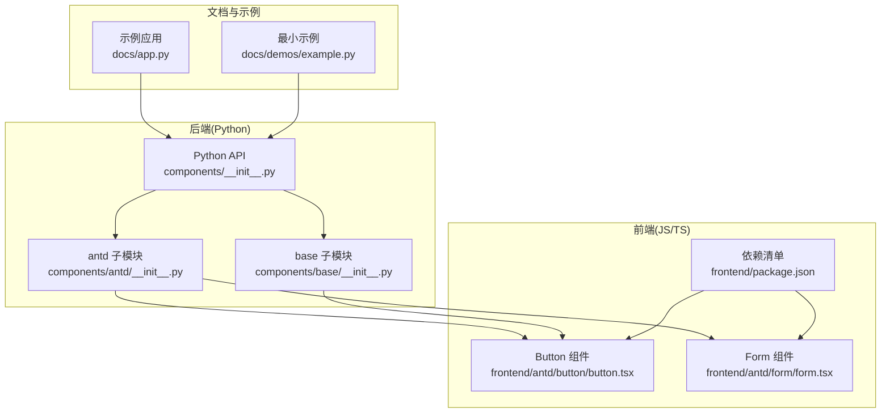
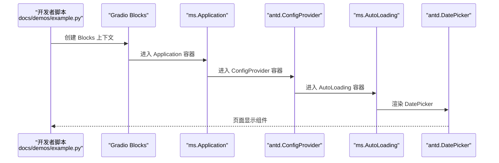
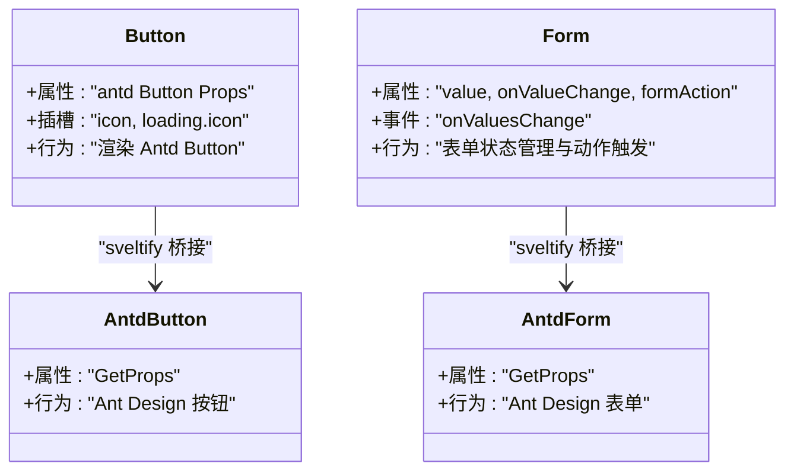
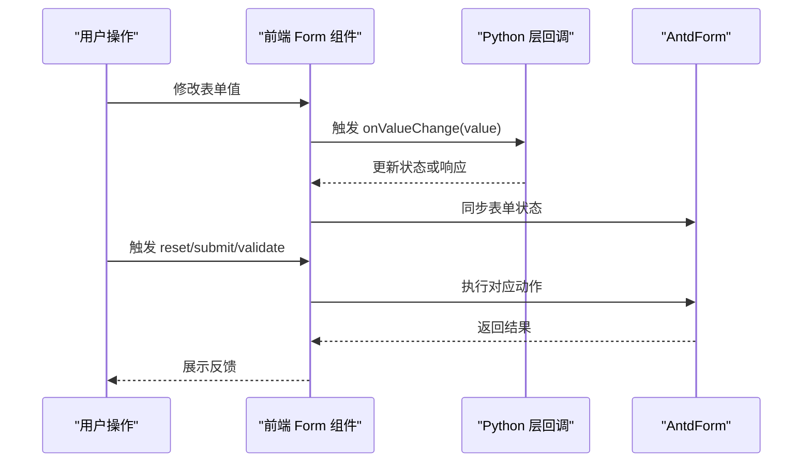
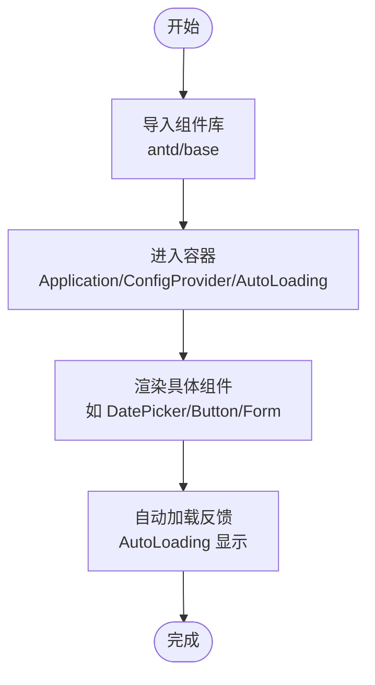
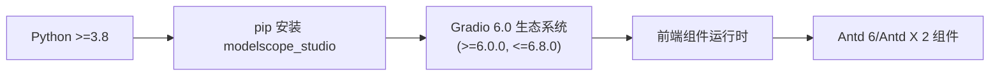

# 快速开始

<cite>
**本文引用的文件**
- [README.md](file://README.md)
- [pyproject.toml](file://pyproject.toml)
- [docs/requirements.txt](file://docs/requirements.txt)
- [docs/demos/example.py](file://docs/demos/example.py)
- [docs/FAQ.md](file://docs/FAQ.md)
- [backend/modelscope_studio/__init__.py](file://backend/modelscope_studio/__init__.py)
- [backend/modelscope_studio/components/__init__.py](file://backend/modelscope_studio/components/__init__.py)
- [backend/modelscope_studio/components/antd/__init__.py](file://backend/modelscope_studio/components/antd/__init__.py)
- [backend/modelscope_studio/components/base/__init__.py](file://backend/modelscope_studio/components/base/__init__.py)
- [frontend/package.json](file://frontend/package.json)
- [frontend/antd/button/button.tsx](file://frontend/antd/button/button.tsx)
- [frontend/antd/form/form.tsx](file://frontend/antd/form/form.tsx)
- [docs/app.py](file://docs/app.py)
- [backend/modelscope_studio/version.py](file://backend/modelscope_studio/version.py)
</cite>

## 更新摘要

**变更内容**

- 更新Gradio版本要求：从4.43.0+迁移到6.0.0+
- 添加版本限制说明和迁移指导
- 更新依赖范围和版本约束
- 强化版本兼容性警告

## 目录

1. [简介](#简介)
2. [项目结构](#项目结构)
3. [核心组件](#核心组件)
4. [架构总览](#架构总览)
5. [详细组件分析](#详细组件分析)
6. [依赖关系分析](#依赖关系分析)
7. [性能注意事项](#性能注意事项)
8. [故障排查指南](#故障排查指南)
9. [结论](#结论)
10. [附录](#附录)

## 简介

本指南面向首次使用 ModelScope Studio 的开发者，帮助你在最短时间内完成安装与运行，并掌握导入组件库、创建基础界面的基本方法。你将学会：

- 安装与环境准备（Python 版本、依赖）
- 最小可用示例的运行步骤
- 组件库的导入与使用模式
- 常见问题的快速解决

**重要更新**：ModelScope Studio 2.0.0 已迁移到 Gradio 6.0 生态系统，支持版本范围为 >=6.0.0 且 <=6.8.0。

## 项目结构

ModelScope Studio 是基于 Gradio 的第三方组件库，提供更丰富的页面布局与组件形态。项目采用"后端 Python 包 + 前端 Svelte/React 组件"的分层设计：

- 后端：Python 包封装组件接口与模板资源
- 前端：Svelte/React 组件桥接 Ant Design/Ant Design X，通过 @svelte-preprocess-react 实现桥接
- 文档与示例：通过 docs/app.py 展示组件与布局模板



**图表来源**

- [backend/modelscope_studio/components/**init**.py:1-5](file://backend/modelscope_studio/components/__init__.py#L1-L5)
- [backend/modelscope_studio/components/antd/**init**.py:1-150](file://backend/modelscope_studio/components/antd/__init__.py#L1-L150)
- [backend/modelscope_studio/components/base/**init**.py:1-11](file://backend/modelscope_studio/components/base/__init__.py#L1-L11)
- [frontend/antd/button/button.tsx:1-39](file://frontend/antd/button/button.tsx#L1-L39)
- [frontend/antd/form/form.tsx:1-79](file://frontend/antd/form/form.tsx#L1-L79)
- [frontend/package.json:1-59](file://frontend/package.json#L1-L59)
- [docs/app.py:1-595](file://docs/app.py#L1-L595)
- [docs/demos/example.py:1-11](file://docs/demos/example.py#L1-L11)

**章节来源**

- [backend/modelscope_studio/components/**init**.py:1-5](file://backend/modelscope_studio/components/__init__.py#L1-L5)
- [backend/modelscope_studio/components/antd/**init**.py:1-150](file://backend/modelscope_studio/components/antd/__init__.py#L1-L150)
- [backend/modelscope_studio/components/base/**init**.py:1-11](file://backend/modelscope_studio/components/base/__init__.py#L1-L11)
- [frontend/package.json:1-59](file://frontend/package.json#L1-L59)
- [docs/app.py:1-595](file://docs/app.py#L1-L595)

## 核心组件

- 组件库入口：通过 modelscope_studio.components.\* 导入各子模块
  - antd：Ant Design 组件集合
  - base：基础布局与渲染组件（如 Application、AutoLoading、Slot、Fragment、Div、Text、Markdown 等）
- 关键组件使用模式
  - 使用上下文容器：ms.Application、antd.ConfigProvider、ms.AutoLoading
  - 在容器内直接嵌套具体组件（如 antd.DatePicker）

**章节来源**

- [backend/modelscope_studio/components/**init**.py:1-5](file://backend/modelscope_studio/components/__init__.py#L1-L5)
- [backend/modelscope_studio/components/antd/**init**.py:1-150](file://backend/modelscope_studio/components/antd/__init__.py#L1-L150)
- [backend/modelscope_studio/components/base/**init**.py:1-11](file://backend/modelscope_studio/components/base/__init__.py#L1-L11)

## 架构总览

下图展示了从 Python 应用到前端组件的调用链路，以及文档站点对组件的动态加载机制。



**图表来源**

- [docs/demos/example.py:5-10](file://docs/demos/example.py#L5-L10)
- [docs/app.py:1-595](file://docs/app.py#L1-L595)

**章节来源**

- [docs/demos/example.py:1-11](file://docs/demos/example.py#L1-L11)
- [docs/app.py:1-595](file://docs/app.py#L1-L595)

## 详细组件分析

### 组件使用模式与最佳实践

- 使用容器组合
  - 建议在最外层包裹 ms.Application，内部再包裹 antd.ConfigProvider 与 ms.AutoLoading，以获得全局配置与自动加载反馈
- 组件导入与实例化
  - 通过 modelscope_studio.components.antd 或 modelscope_studio.components.base 导入所需组件
  - 在容器作用域内直接实例化组件
- 常用组件示例
  - 基础组件：Button、Text、Div、Markdown
  - 数据录入：Form、Input、DatePicker、Select
  - 反馈与提示：Message、Modal、Notification、Spin

**章节来源**

- [backend/modelscope_studio/components/antd/**init**.py:1-150](file://backend/modelscope_studio/components/antd/__init__.py#L1-L150)
- [backend/modelscope_studio/components/base/**init**.py:1-11](file://backend/modelscope_studio/components/base/__init__.py#L1-L11)

### 组件类关系（代码级）

以下类图展示了前端组件与 Ant Design 的映射关系，体现组件桥接与插槽机制。



**图表来源**

- [frontend/antd/button/button.tsx:8-36](file://frontend/antd/button/button.tsx#L8-L36)
- [frontend/antd/form/form.tsx:15-76](file://frontend/antd/form/form.tsx#L15-L76)

**章节来源**

- [frontend/antd/button/button.tsx:1-39](file://frontend/antd/button/button.tsx#L1-L39)
- [frontend/antd/form/form.tsx:1-79](file://frontend/antd/form/form.tsx#L1-L79)

### API 工作流（以 Form 为例）



**图表来源**

- [frontend/antd/form/form.tsx:32-45](file://frontend/antd/form/form.tsx#L32-L45)
- [frontend/antd/form/form.tsx:69-72](file://frontend/antd/form/form.tsx#L69-L72)

**章节来源**

- [frontend/antd/form/form.tsx:1-79](file://frontend/antd/form/form.tsx#L1-L79)

### 复杂逻辑流程（组件加载与渲染）



**图表来源**

- [docs/demos/example.py:5-10](file://docs/demos/example.py#L5-L10)
- [docs/FAQ.md:7-19](file://docs/FAQ.md#L7-L19)

**章节来源**

- [docs/demos/example.py:1-11](file://docs/demos/example.py#L1-L11)
- [docs/FAQ.md:1-20](file://docs/FAQ.md#L1-L20)

## 依赖关系分析

- Python 环境与版本
  - Python 版本要求：>=3.8
  - **Gradio 依赖范围**：>=6.0.0 且 <=6.8.0
  - **重要说明**：当前示例使用 5.34.1，但 2.0.0 版本已迁移到 Gradio 6.0 生态系统
- 前端依赖
  - Ant Design 6.x、Ant Design X 2.x、React 19、Svelte 5、@gradio/\* 系列等
- 文档与示例依赖
  - 示例脚本与文档站点使用 modelscope_studio==2.0.0

**重要更新**：版本迁移详情请参阅 [迁移说明](#迁移指导)



**图表来源**

- [pyproject.toml:15-26](file://pyproject.toml#L15-L26)
- [docs/requirements.txt:1-4](file://docs/requirements.txt#L1-4)
- [frontend/package.json:8-40](file://frontend/package.json#L8-L40)

**章节来源**

- [pyproject.toml:1-257](file://pyproject.toml#L1-L257)
- [docs/requirements.txt:1-4](file://docs/requirements.txt#L1-L4)
- [frontend/package.json:1-59](file://frontend/package.json#L1-L59)

### 版本迁移指导

**Gradio 6.0 迁移指南**

ModelScope Studio 2.0.0 已完成从 Gradio 4.x 到 6.x 的重大迁移，涉及以下关键变更：

#### 版本范围说明

- **支持版本**：>=6.0.0 且 <=6.8.0
- **不支持版本**：<6.0.0 或 >6.8.0
- **迁移原因**：Gradio 6.0 引入了重大架构变更，需要相应的组件适配

#### 迁移前版本使用

如果您的项目仍在使用 Gradio 4.43.0 到 6.0.0 之前的版本，请使用 1.x 版本：

```bash
pip install modelscope_studio~=1.0
```

#### 迁移后的版本使用

对于 Gradio 6.0+ 的新项目，使用最新版本：

```bash
pip install modelscope_studio==2.0.0
```

#### 兼容性注意事项

- **Hugging Face Space**：仍需使用 `ssr_mode=False`
- **组件 API**：大部分 API 保持向后兼容
- **性能提升**：Gradio 6.0 提供更好的性能和稳定性

**章节来源**

- [README.md:36-50](file://README.md#L36-L50)
- [pyproject.toml:26](file://pyproject.toml#L26)
- [backend/modelscope_studio/version.py:1-2](file://backend/modelscope_studio/version.py#L1-L2)

## 性能注意事项

- 交互延迟与加载反馈
  - 组件库独立提供了加载反馈机制，建议在全局启用 AutoLoading，以减少用户等待感知
- 并发与队列
  - 文档站点示例使用了队列与并发限制参数，实际项目可根据需求调整

**章节来源**

- [docs/FAQ.md:7-19](file://docs/FAQ.md#L7-L19)
- [docs/app.py:592-594](file://docs/app.py#L592-L594)

## 故障排查指南

- Hugging Face Space 页面不显示
  - 在 demo.launch() 中添加 ssr_mode=False 参数
- 操作响应慢或无反馈
  - 缺少 AutoLoading 容器会导致无加载反馈，建议在应用顶层加入 ms.AutoLoading
- **Gradio 版本冲突**
  - 确保 Gradio 版本在 >=6.0.0 且 <=6.8.0 范围内
  - 如果使用旧版本 Gradio，请降级到 modelscope_studio 1.x
  - 如果使用新版本 Gradio，请升级到 modelscope_studio 2.0.0

**章节来源**

- [docs/FAQ.md:3-5](file://docs/FAQ.md#L3-L5)
- [docs/FAQ.md:7-19](file://docs/FAQ.md#L7-L19)
- [docs/requirements.txt:1-4](file://docs/requirements.txt#L1-L4)
- [README.md:36-50](file://README.md#L36-L50)

## 结论

通过本指南，你已了解：

- 如何安装与准备环境
- 如何导入组件库并创建最小可用示例
- 如何使用容器与组件的基本模式
- 常见问题的快速定位与修复
- **Gradio 版本迁移的重要注意事项**

建议在后续开发中逐步引入更多组件（如 Form、Table、Modal 等），并结合 AutoLoading 优化用户体验。同时注意版本兼容性，确保 Gradio 版本符合当前支持范围。

## 附录

### 安装与运行步骤

- 安装
  - 使用 pip 安装 modelscope_studio
- 运行
  - 参考最小示例脚本，直接运行即可启动本地服务

**章节来源**

- [README.md:38-57](file://README.md#L38-L57)
- [docs/demos/example.py:1-11](file://docs/demos/example.py#L1-L11)

### 最小示例（路径）

- 示例脚本路径：[docs/demos/example.py:1-11](file://docs/demos/example.py#L1-L11)
- 运行命令参考：在示例脚本所在目录执行 Python 文件

**章节来源**

- [docs/demos/example.py:1-11](file://docs/demos/example.py#L1-L11)

### 组件导入与使用（路径）

- 导入 antd 组件：[backend/modelscope_studio/components/antd/**init**.py:1-150](file://backend/modelscope_studio/components/antd/__init__.py#L1-L150)
- 导入 base 组件：[backend/modelscope_studio/components/base/**init**.py:1-11](file://backend/modelscope_studio/components/base/__init__.py#L1-L11)
- 组件库入口聚合：[backend/modelscope_studio/components/**init**.py:1-5](file://backend/modelscope_studio/components/__init__.py#L1-L5)
- Python 包导出入口：[backend/modelscope_studio/**init**.py:1-3](file://backend/modelscope_studio/__init__.py#L1-L3)

**章节来源**

- [backend/modelscope_studio/components/antd/**init**.py:1-150](file://backend/modelscope_studio/components/antd/__init__.py#L1-L150)
- [backend/modelscope_studio/components/base/**init**.py:1-11](file://backend/modelscope_studio/components/base/__init__.py#L1-L11)
- [backend/modelscope_studio/components/**init**.py:1-5](file://backend/modelscope_studio/components/__init__.py#L1-L5)
- [backend/modelscope_studio/**init**.py:1-3](file://backend/modelscope_studio/__init__.py#L1-L3)

### 文档站点与示例入口（路径）

- 文档站点入口：[docs/app.py:1-595](file://docs/app.py#L1-L595)

**章节来源**

- [docs/app.py:1-595](file://docs/app.py#L1-L595)

### 版本兼容性矩阵

| Gradio 版本       | ModelScope Studio 版本 | 支持状态  |
| ----------------- | ---------------------- | --------- |
| >=4.43.0,<6.0.0   | 1.x                    | ✅ 支持   |
| >=6.0.0,<=6.8.0   | 2.0.0                  | ✅ 支持   |
| <4.43.0 或 >6.8.0 | 任意                   | ❌ 不支持 |

> **⚠️ 说明：Gradio >6.8.0 不支持的原因**
> 当前版本尚未对 Gradio 6.8.0 以上版本进行全面测试与适配。Gradio 新版本可能包含组件 API、辺界行为和内部接口的变更，在未经验证全部覆盖之前不建议使用。如需使用更高版本，请关注官方仓库发布的兼容性更新公告。

**章节来源**

- [README.md:36-50](file://README.md#L36-L50)
- [pyproject.toml:26](file://pyproject.toml#L26)
- [backend/modelscope_studio/version.py:1-2](file://backend/modelscope_studio/version.py#L1-L2)
