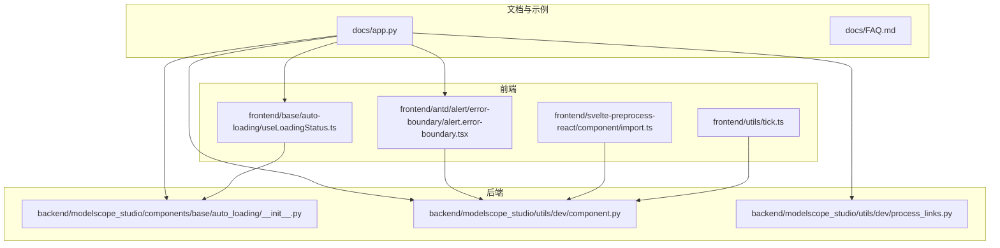
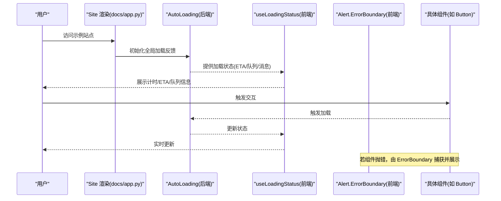
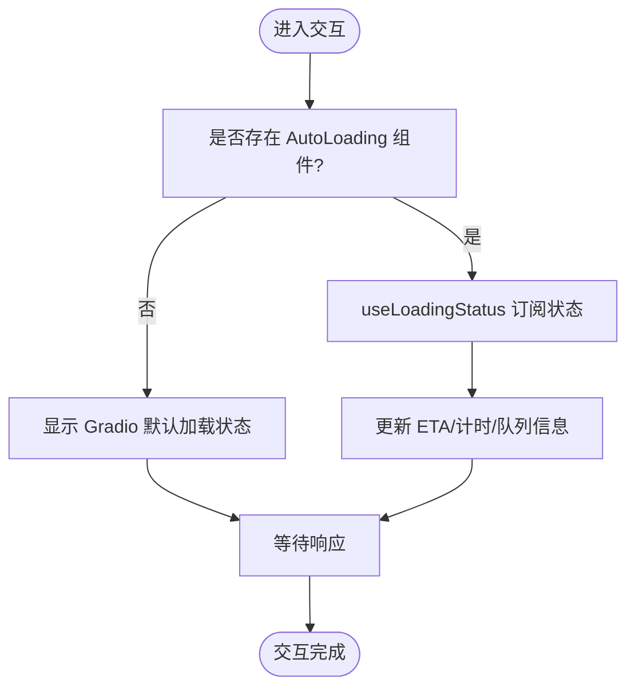
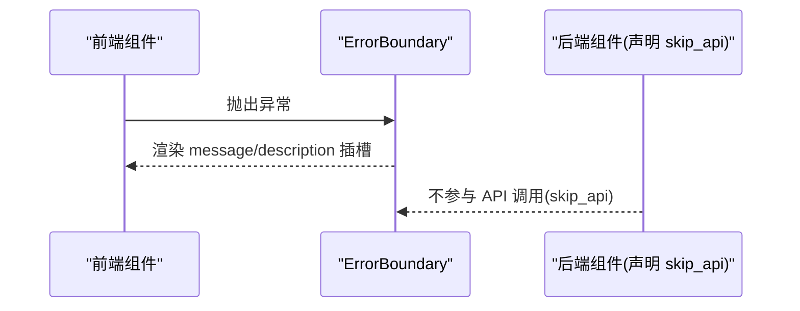
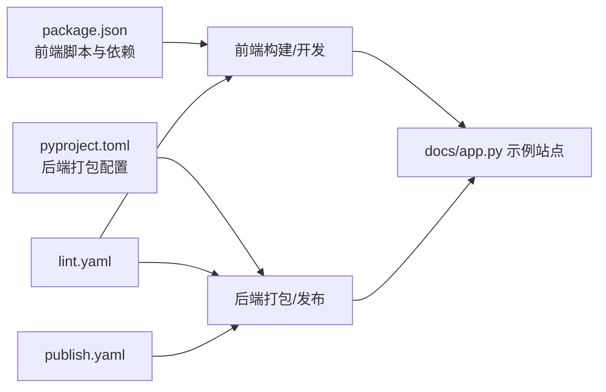

# 故障排除

<cite>
**本文引用的文件**
- [README.md](file://README.md)
- [README-zh_CN.md](file://README-zh_CN.md)
- [FAQ.md](file://docs/FAQ.md)
- [FAQ-zh_CN.md](file://docs/FAQ-zh_CN.md)
- [docs/app.py](file://docs/app.py)
- [package.json](file://package.json)
- [pyproject.toml](file://pyproject.toml)
- [backend/modelscope_studio/components/base/auto_loading/__init__.py](file://backend/modelscope_studio/components/base/auto_loading/__init__.py)
- [frontend/base/auto-loading/useLoadingStatus.ts](file://frontend/base/auto-loading/useLoadingStatus.ts)
- [backend/modelscope_studio/utils/dev/component.py](file://backend/modelscope_studio/utils/dev/component.py)
- [backend/modelscope_studio/utils/dev/process_links.py](file://backend/modelscope_studio/utils/dev/process_links.py)
- [.github/workflows/lint.yaml](file://.github/workflows/lint.yaml)
- [.github/workflows/publish.yaml](file://.github/workflows/publish.yaml)
- [frontend/antd/alert/error-boundary/alert.error-boundary.tsx](file://frontend/antd/alert/error-boundary/alert.error-boundary.tsx)
- [backend/modelscope_studio/components/antd/alert/error_boundary/__init__.py](file://backend/modelscope_studio/components/antd/alert/error_boundary/__init__.py)
- [frontend/svelte-preprocess-react/component/import.ts](file://frontend/svelte-preprocess-react/component/import.ts)
- [frontend/utils/tick.ts](file://frontend/utils/tick.ts)
</cite>

## 目录

1. [简介](#简介)
2. [项目结构](#项目结构)
3. [核心组件](#核心组件)
4. [架构总览](#架构总览)
5. [详细组件分析](#详细组件分析)
6. [依赖关系分析](#依赖关系分析)
7. [性能考虑](#性能考虑)
8. [故障排除指南](#故障排除指南)
9. [结论](#结论)
10. [附录](#附录)

## 简介

本指南面向使用 ModelScope Studio 的开发者，聚焦于安装、配置、运行时错误、性能等常见问题的系统性排查与解决。内容来源于仓库内的官方文档、FAQ、示例站点与源码实现，覆盖前端组件、后端组件桥接、自动加载反馈、错误边界、链接处理、开发与发布流程等关键路径。

## 项目结构

ModelScope Studio 是一个基于 Gradio 的第三方组件库，提供 Ant Design、Ant Design X 以及 Pro 组件生态。项目采用前后端分离与多包工作区组织方式：

- 前端（Svelte + React 预处理）：位于 frontend 目录，按组件拆分，每个组件有独立的构建配置与模板目录
- 后端（Python）：位于 backend/modelscope_studio，提供组件桥接到 Gradio 的能力
- 文档与示例：docs 目录包含示例站点与组件文档
- 构建与发布：package.json 与 pyproject.toml 定义脚本与打包规则；GitHub Actions 负责 Lint 与发布

**图表来源**

- [docs/app.py:1-595](file://docs/app.py#L1-L595)
- [frontend/base/auto-loading/useLoadingStatus.ts:1-94](file://frontend/base/auto-loading/useLoadingStatus.ts#L1-L94)
- [frontend/antd/alert/error-boundary/alert.error-boundary.tsx:1-34](file://frontend/antd/alert/error-boundary/alert.error-boundary.tsx#L1-L34)
- [backend/modelscope_studio/components/base/auto_loading/**init**.py:1-65](file://backend/modelscope_studio/components/base/auto_loading/__init__.py#L1-L65)
- [backend/modelscope_studio/utils/dev/component.py:1-169](file://backend/modelscope_studio/utils/dev/component.py#L1-L169)
- [backend/modelscope_studio/utils/dev/process_links.py:1-61](file://backend/modelscope_studio/utils/dev/process_links.py#L1-L61)

**章节来源**

- [README.md:1-101](file://README.md#L1-L101)
- [README-zh_CN.md:1-101](file://README-zh_CN.md#L1-L101)
- [docs/app.py:1-595](file://docs/app.py#L1-L595)

## 核心组件

- 自动加载反馈（AutoLoading）
  - 后端组件：提供全局加载状态、队列位置、ETA 等信息的桥接与渲染控制
  - 前端 Hook：useLoadingStatus 将 Gradio 的状态追踪转换为可展示的计时与 ETA 格式化
- 错误边界（Alert.ErrorBoundary）
  - 前端：通过 sveltify 包裹 Ant Design 的 ErrorBoundary，支持插槽注入消息与描述
  - 后端：对应组件定义，声明跳过 API 调用，仅用于前端渲染
- 组件基类与上下文
  - 后端：ModelScopeComponent/ModelScopeLayoutComponent 等，统一组件生命周期与 App 上下文校验
- 链接处理
  - 后端：process_links 将 Markdown/HTML 中的相对链接转换为可访问的 /file=... 资源路径

**章节来源**

- [backend/modelscope_studio/components/base/auto_loading/**init**.py:1-65](file://backend/modelscope_studio/components/base/auto_loading/__init__.py#L1-L65)
- [frontend/base/auto-loading/useLoadingStatus.ts:1-94](file://frontend/base/auto-loading/useLoadingStatus.ts#L1-L94)
- [frontend/antd/alert/error-boundary/alert.error-boundary.tsx:1-34](file://frontend/antd/alert/error-boundary/alert.error-boundary.tsx#L1-L34)
- [backend/modelscope_studio/components/antd/alert/error_boundary/**init**.py:20-72](file://backend/modelscope_studio/components/antd/alert/error_boundary/__init__.py#L20-L72)
- [backend/modelscope_studio/utils/dev/component.py:1-169](file://backend/modelscope_studio/utils/dev/component.py#L1-L169)
- [backend/modelscope_studio/utils/dev/process_links.py:1-61](file://backend/modelscope_studio/utils/dev/process_links.py#L1-L61)

## 架构总览

下图展示了从示例站点到组件渲染的关键调用链路，包括自动加载反馈与错误边界的协作。

**图表来源**

- [docs/app.py:577-595](file://docs/app.py#L577-L595)
- [backend/modelscope_studio/components/base/auto_loading/**init**.py:1-65](file://backend/modelscope_studio/components/base/auto_loading/__init__.py#L1-L65)
- [frontend/base/auto-loading/useLoadingStatus.ts:1-94](file://frontend/base/auto-loading/useLoadingStatus.ts#L1-L94)
- [frontend/antd/alert/error-boundary/alert.error-boundary.tsx:1-34](file://frontend/antd/alert/error-boundary/alert.error-boundary.tsx#L1-L34)

## 详细组件分析

### 自动加载反馈（AutoLoading）

- 设计要点
  - 后端组件不参与常规 API 调用，仅负责渲染与状态桥接
  - 前端 Hook 使用 requestAnimationFrame 实现平滑计时，结合 ETA 与队列信息格式化输出
- 常见问题定位
  - 若无 AutoLoading，Gradio 默认加载状态可能不显示，导致用户感知延迟
  - 队列过大或后台任务耗时长会导致 ETA 波动，需结合队列大小与并发限制评估

**图表来源**

- [backend/modelscope_studio/components/base/auto_loading/**init**.py:1-65](file://backend/modelscope_studio/components/base/auto_loading/__init__.py#L1-L65)
- [frontend/base/auto-loading/useLoadingStatus.ts:1-94](file://frontend/base/auto-loading/useLoadingStatus.ts#L1-L94)

**章节来源**

- [backend/modelscope_studio/components/base/auto_loading/**init**.py:1-65](file://backend/modelscope_studio/components/base/auto_loading/__init__.py#L1-L65)
- [frontend/base/auto-loading/useLoadingStatus.ts:1-94](file://frontend/base/auto-loading/useLoadingStatus.ts#L1-L94)

### 错误边界（Alert.ErrorBoundary）

- 设计要点
  - 前端通过 sveltify 包裹 Ant Design 的 ErrorBoundary，支持 slots 注入 message/description
  - 后端组件声明 skip_api，避免被当作普通组件进行 API 调用
- 常见问题定位
  - 组件内部异常未被捕获会直接中断 UI，应确保关键区域包裹 ErrorBoundary
  - 插槽内容为空时回退到 props，保证错误信息可见性

**图表来源**

- [frontend/antd/alert/error-boundary/alert.error-boundary.tsx:1-34](file://frontend/antd/alert/error-boundary/alert.error-boundary.tsx#L1-L34)
- [backend/modelscope_studio/components/antd/alert/error_boundary/**init**.py:20-72](file://backend/modelscope_studio/components/antd/alert/error_boundary/__init__.py#L20-L72)

**章节来源**

- [frontend/antd/alert/error-boundary/alert.error-boundary.tsx:1-34](file://frontend/antd/alert/error-boundary/alert.error-boundary.tsx#L1-L34)
- [backend/modelscope_studio/components/antd/alert/error_boundary/**init**.py:20-72](file://backend/modelscope_studio/components/antd/alert/error_boundary/__init__.py#L20-L72)

### 组件基类与上下文（ModelScopeComponent/Layout）

- 设计要点
  - 统一继承 Gradio 组件元类与 BlockContext，确保父子关系与渲染顺序正确
  - 布局型组件默认 skip_api，数据型组件参与 API 流程
- 常见问题定位
  - 未处于 Application 上下文中会触发断言失败
  - 布局组件退出时需同步 layout 标记，避免渲染错位

**章节来源**

- [backend/modelscope_studio/utils/dev/component.py:1-169](file://backend/modelscope_studio/utils/dev/component.py#L1-L169)

### 链接处理（process_links）

- 设计要点
  - 将 Markdown/HTML 中的相对链接转换为 /file= 缓存路径，便于 Gradio 安全访问
- 常见问题定位
  - 文件不存在或路径错误时原样返回，检查资源绝对路径与 block 缓存映射

**章节来源**

- [backend/modelscope_studio/utils/dev/process_links.py:1-61](file://backend/modelscope_studio/utils/dev/process_links.py#L1-L61)

## 依赖关系分析

- 前后端依赖
  - 前端使用 Svelte 5 与 React 预处理，配合 Gradio 的状态追踪与组件桥接
  - 后端依赖 Gradio 版本范围，确保兼容性
- 构建与发布
  - 前端脚本包含构建、开发、格式化、Lint 等；后端通过 hatchling 打包
  - GitHub Actions 负责 Lint 与发布流程

**图表来源**

- [package.json:1-55](file://package.json#L1-L55)
- [pyproject.toml:1-257](file://pyproject.toml#L1-L257)
- [docs/app.py:577-595](file://docs/app.py#L577-L595)
- [.github/workflows/lint.yaml:1-34](file://.github/workflows/lint.yaml#L1-L34)
- [.github/workflows/publish.yaml:1-74](file://.github/workflows/publish.yaml#L1-L74)

**章节来源**

- [package.json:1-55](file://package.json#L1-L55)
- [pyproject.toml:1-257](file://pyproject.toml#L1-L257)
- [.github/workflows/lint.yaml:1-34](file://.github/workflows/lint.yaml#L1-L34)
- [.github/workflows/publish.yaml:1-74](file://.github/workflows/publish.yaml#L1-L74)

## 性能考虑

- 加载反馈与队列
  - 使用 AutoLoading 与 useLoadingStatus 可提升用户感知性能，但需合理设置并发与队列上限
- SSR 与空间部署
  - 在 Hugging Face Space 中需禁用 SSR，否则自定义组件可能无法正常显示
- 构建与缓存
  - 前端构建脚本与 Gradio 资源缓存策略影响首开与切换性能

**章节来源**

- [docs/FAQ.md:1-20](file://docs/FAQ.md#L1-L20)
- [docs/FAQ-zh_CN.md:1-20](file://docs/FAQ-zh_CN.md#L1-L20)
- [docs/app.py:592-595](file://docs/app.py#L592-L595)

## 故障排除指南

### 1. 安装与环境 `🛠 全版本通用`

- 依赖版本
  - 后端依赖 Gradio 版本范围，确保与当前环境兼容
  - **Gradio 6.0+ 特定**：使用 modelscope_studio 2.x 时，需确保 gradio>=6.0,<=6.8.0
- 前端依赖
  - 使用 pnpm 安装依赖并执行构建；开发模式通过 docs/app.py 启动
- 常见症状
  - 安装后组件不可用或报导入错误，优先检查 Gradio 版本与 Python 环境
- 解决步骤
  - 确认 Gradio 版本满足要求
  - 清理缓存并重新安装依赖
  - 使用示例站点验证环境

**章节来源**

- [pyproject.toml:26-26](file://pyproject.toml#L26-L26)
- [package.json:8-25](file://package.json#L8-L25)
- [README.md:34-42](file://README.md#L34-L42)
- [README-zh_CN.md:34-42](file://README-zh_CN.md#L34-L42)

### 2. 配置问题 `🛠 全版本通用`

- SSR 模式
  - 在 Hugging Face Space 中必须禁用 SSR，否则界面显示异常
  - **适用版本**：Gradio 6.0+ 特定（Gradio 6.0 之前版本也存在此问题）
- 自动加载反馈
  - 若未放置 AutoLoading，Gradio 默认加载状态可能不显示，建议全局至少使用一次 AutoLoading
- 构建与开发
  - 开发模式使用 docs/app.py；生产构建使用前端脚本

**章节来源**

- [docs/FAQ.md:3-5](file://docs/FAQ.md#L3-L5)
- [docs/FAQ-zh_CN.md:3-5](file://docs/FAQ-zh_CN.md#L3-L5)
- [docs/FAQ.md:7-19](file://docs/FAQ.md#L7-L19)
- [docs/FAQ-zh_CN.md:7-19](file://docs/FAQ-zh_CN.md#L7-L19)
- [docs/app.py:592-595](file://docs/app.py#L592-L595)

### 3. 运行时错误 `🛠 Gradio 6.0+ 特定`

- 错误边界
  - 组件内部异常会被 ErrorBoundary 捕获并展示 message/description；若未生效，检查是否正确包裹
- 初始化与懒加载
  - 组件懒加载依赖初始化 Promise，若未完成可能导致组件未就绪；确保等待初始化完成
- 链接访问
  - 相对资源需经 process_links 转换为 /file= 路径；若资源缺失，原样返回，检查路径与缓存

**章节来源**

- [frontend/antd/alert/error-boundary/alert.error-boundary.tsx:1-34](file://frontend/antd/alert/error-boundary/alert.error-boundary.tsx#L1-L34)
- [backend/modelscope_studio/components/antd/alert/error_boundary/**init**.py:20-72](file://backend/modelscope_studio/components/antd/alert/error_boundary/__init__.py#L20-L72)
- [frontend/svelte-preprocess-react/component/import.ts:1-20](file://frontend/svelte-preprocess-react/component/import.ts#L1-L20)
- [backend/modelscope_studio/utils/dev/process_links.py:48-61](file://backend/modelscope_studio/utils/dev/process_links.py#L48-L61)

### 4. 性能问题 `🛠 全版本通用`

- 加载等待与 ETA 波动
  - 队列过大或后台任务耗时长会导致 ETA 波动；可通过减少并发、优化任务逻辑缓解
- 计时与渲染
  - useLoadingStatus 使用 requestAnimationFrame 实时更新，确保 UI 流畅；避免在高频事件中重复创建实例
- SSR 与空间部署
  - 禁用 SSR 可避免自定义组件在 SSR 场景下的兼容性问题

**章节来源**

- [frontend/base/auto-loading/useLoadingStatus.ts:1-94](file://frontend/base/auto-loading/useLoadingStatus.ts#L1-L94)
- [docs/FAQ.md:7-9](file://docs/FAQ.md#L7-L9)
- [docs/FAQ-zh_CN.md:7-9](file://docs/FAQ-zh_CN.md#L7-L9)
- [docs/app.py:592-595](file://docs/app.py#L592-L595)

### 5. 调试技巧 `🛠 全版本通用`

- 日志与状态
  - 利用 useLoadingStatus 输出 ETA、计时、队列位置等信息，辅助定位卡顿原因
- 组件初始化
  - 等待 initializePromise 完成后再动态导入组件，避免未初始化导致的异常
- 链接与资源
  - 使用 process_links 将相对链接转换为 /file= 路径，确保资源可访问

**章节来源**

- [frontend/base/auto-loading/useLoadingStatus.ts:1-94](file://frontend/base/auto-loading/useLoadingStatus.ts#L1-L94)
- [frontend/svelte-preprocess-react/component/import.ts:1-20](file://frontend/svelte-preprocess-react/component/import.ts#L1-L20)
- [backend/modelscope_studio/utils/dev/process_links.py:48-61](file://backend/modelscope_studio/utils/dev/process_links.py#L48-L61)

### 6. 社区支持与问题反馈 `🛠 全版本通用`

- 官方文档与示例
  - 使用示例站点验证问题复现与修复效果
- 提交问题
  - 在仓库中提交 Issue，附带环境信息、依赖版本、最小复现与期望行为
- 参考脚本
  - Lint 与发布脚本可用于检查与验证本地环境

**章节来源**

- [docs/app.py:1-595](file://docs/app.py#L1-L595)
- [.github/workflows/lint.yaml:1-34](file://.github/workflows/lint.yaml#L1-L34)
- [.github/workflows/publish.yaml:1-74](file://.github/workflows/publish.yaml#L1-L74)

## 结论

通过理解 AutoLoading、ErrorBoundary、组件基类与链接处理等核心机制，开发者可以系统性地定位与解决安装、配置、运行时与性能相关问题。建议在 Hugging Face Space 中禁用 SSR，并在全局启用 AutoLoading 以改善用户体验；出现问题时优先检查初始化、错误边界与资源链接，结合示例站点进行最小复现与验证。

## 附录

- 关键文件索引
  - 示例站点与菜单：[docs/app.py:1-595](file://docs/app.py#L1-L595)
  - 自动加载反馈（后端）：[backend/modelscope_studio/components/base/auto_loading/**init**.py:1-65](file://backend/modelscope_studio/components/base/auto_loading/__init__.py#L1-L65)
  - 自动加载反馈（前端）：[frontend/base/auto-loading/useLoadingStatus.ts:1-94](file://frontend/base/auto-loading/useLoadingStatus.ts#L1-L94)
  - 错误边界（前端）：[frontend/antd/alert/error-boundary/alert.error-boundary.tsx:1-34](file://frontend/antd/alert/error-boundary/alert.error-boundary.tsx#L1-L34)
  - 错误边界（后端）：[backend/modelscope_studio/components/antd/alert/error_boundary/**init**.py:20-72](file://backend/modelscope_studio/components/antd/alert/error_boundary/__init__.py#L20-L72)
  - 组件基类：[backend/modelscope_studio/utils/dev/component.py:1-169](file://backend/modelscope_studio/utils/dev/component.py#L1-L169)
  - 链接处理：[backend/modelscope_studio/utils/dev/process_links.py:1-61](file://backend/modelscope_studio/utils/dev/process_links.py#L1-L61)
  - 前端脚本：[package.json:1-55](file://package.json#L1-L55)
  - 后端打包：[pyproject.toml:1-257](file://pyproject.toml#L1-L257)
  - Lint 工作流：[.github/workflows/lint.yaml:1-34](file://.github/workflows/lint.yaml#L1-L34)
  - 发布工作流：[.github/workflows/publish.yaml:1-74](file://.github/workflows/publish.yaml#L1-L74)
