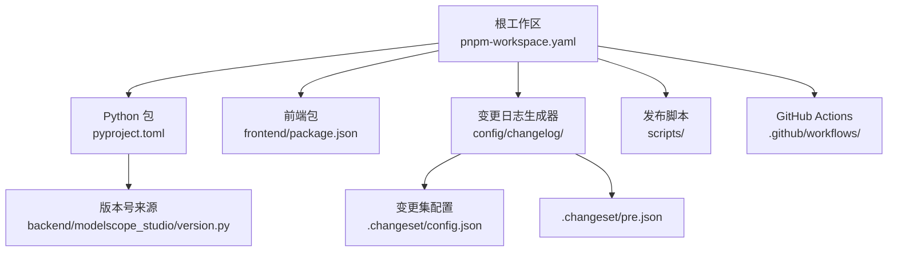
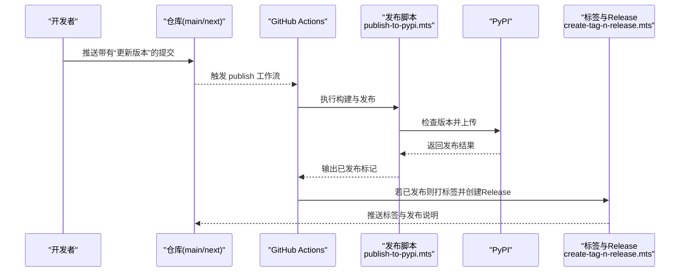
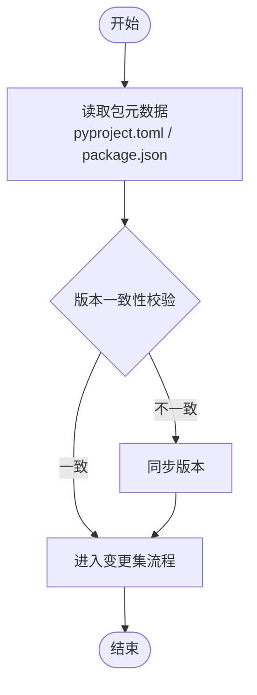
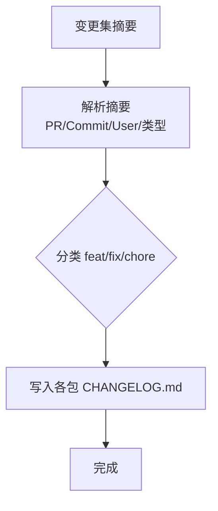
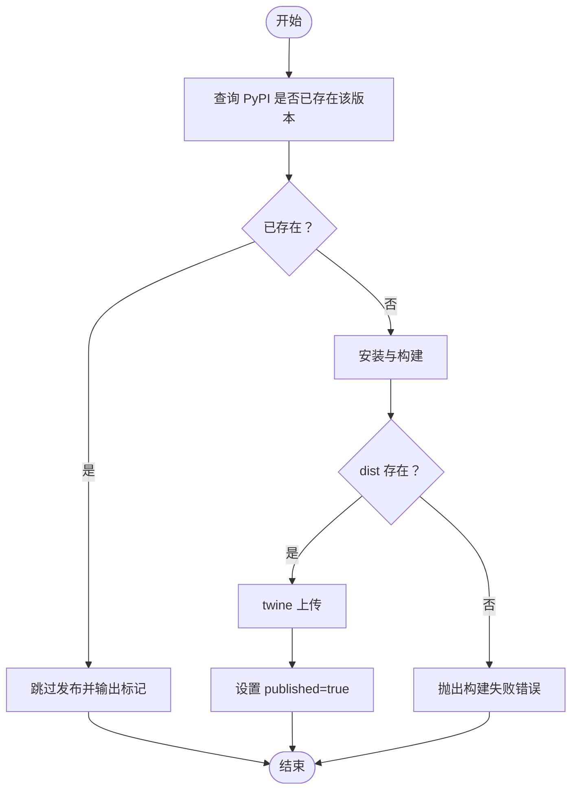
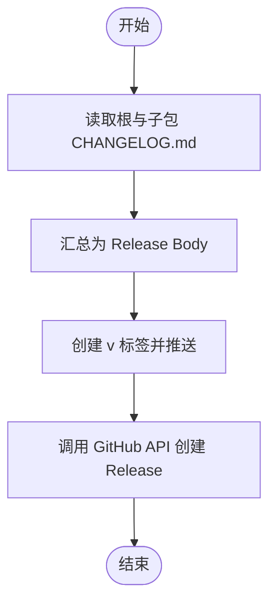
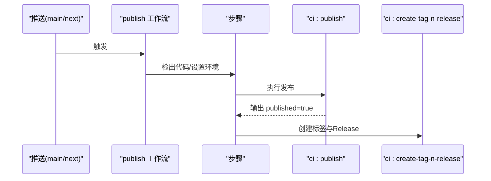
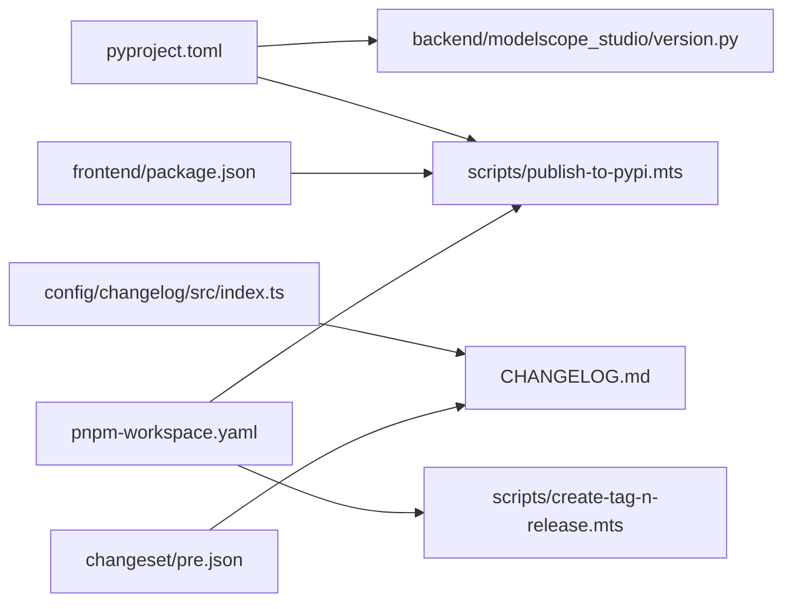

# 发布流程

<cite>
**本文引用的文件**
- [publish.yaml](file://.github/workflows/publish.yaml)
- [lint.yaml](file://.github/workflows/lint.yaml)
- [pyproject.toml](file://pyproject.toml)
- [package.json](file://package.json)
- [publish-to-pypi.mts](file://scripts/publish-to-pypi.mts)
- [create-tag-n-release.mts](file://scripts/create-tag-n-release.mts)
- [.changeset/config.json](file://.changeset/config.json)
- [.changeset/pre.json](file://.changeset/pre.json)
- [version.py](file://backend/modelscope_studio/version.py)
- [CHANGELOG.md](file://CHANGELOG.md)
- [pnpm-workspace.yaml](file://pnpm-workspace.yaml)
- [index.ts](file://config/changelog/src/index.ts)
- [package.json](file://config/changelog/package.json)
- [frontend/package.json](file://frontend/package.json)
</cite>

## 目录

1. [简介](#简介)
2. [项目结构](#项目结构)
3. [核心组件](#核心组件)
4. [架构总览](#架构总览)
5. [详细组件分析](#详细组件分析)
6. [依赖关系分析](#依赖关系分析)
7. [性能考量](#性能考量)
8. [故障排查指南](#故障排查指南)
9. [结论](#结论)
10. [附录](#附录)

## 简介

本文件面向需要管理 ModelScope Studio 项目发布的维护者与高级开发者，系统性阐述从本地开发到 PyPI 正式发布（含预发布、热修复）的完整流程，覆盖版本管理、变更日志生成、自动化流水线、质量保障与回滚策略。内容基于仓库内现有发布脚本、GitHub Actions 工作流与变更集配置，确保可落地、可追溯、可复现。

## 项目结构

ModelScope Studio 采用多包工作区（pnpm workspace）组织，根目录包含 Python 包元数据与前端组件源码；发布相关的关键位置如下：

- 根级包元数据与构建配置：pyproject.toml
- 发布脚本与工作流：scripts/ 与 .github/workflows/
- 变更集与变更日志生成器：.changeset/ 与 config/changelog/
- 版本号来源：backend/modelscope_studio/version.py 与各包 package.json
- 工作区定义：pnpm-workspace.yaml

图表来源

- [pnpm-workspace.yaml:1-12](file://pnpm-workspace.yaml#L1-L12)
- [pyproject.toml:1-257](file://pyproject.toml#L1-L257)
- [frontend/package.json:1-59](file://frontend/package.json#L1-L59)
- [index.ts:1-222](file://config/changelog/src/index.ts#L1-L222)
- [.changeset/config.json:1-15](file://.changeset/config.json#L1-L15)
- [.changeset/pre.json:1-16](file://.changeset/pre.json#L1-L16)
- [publish.yaml:1-74](file://.github/workflows/publish.yaml#L1-L74)
- [publish-to-pypi.mts:1-60](file://scripts/publish-to-pypi.mts#L1-L60)

章节来源

- [pnpm-workspace.yaml:1-12](file://pnpm-workspace.yaml#L1-L12)
- [pyproject.toml:1-257](file://pyproject.toml#L1-L257)
- [frontend/package.json:1-59](file://frontend/package.json#L1-L59)
- [index.ts:1-222](file://config/changelog/src/index.ts#L1-L222)
- [.changeset/config.json:1-15](file://.changeset/config.json#L1-L15)
- [.changeset/pre.json:1-16](file://.changeset/pre.json#L1-L16)
- [publish.yaml:1-74](file://.github/workflows/publish.yaml#L1-L74)
- [publish-to-pypi.mts:1-60](file://scripts/publish-to-pypi.mts#L1-L60)

## 核心组件

- 版本与元数据
  - Python 包版本与元信息由 pyproject.toml 提供，同时 Python 模块版本由 backend/modelscope_studio/version.py 同步维护。
  - 前端包与子包版本在各自 package.json 中声明。
- 变更集与变更日志
  - 使用 Changesets 管理跨包版本与变更摘要，通过自定义 changelog 生成器将变更归类并写入各包 CHANGELOG.md。
- 自动化发布流水线
  - GitHub Actions 在主分支或 next 分支检测“更新版本”提交时触发，执行构建与发布，并在成功后打标签与创建 GitHub Release。
- 发布脚本
  - scripts/publish-to-pypi.mts 负责检查版本是否已存在、构建产物、上传至 PyPI。
  - scripts/create-tag-n-release.mts 负责生成合并后的变更日志、打标签并创建 Release。

章节来源

- [pyproject.toml:1-257](file://pyproject.toml#L1-L257)
- [version.py:1-2](file://backend/modelscope_studio/version.py#L1-L2)
- [frontend/package.json:1-59](file://frontend/package.json#L1-L59)
- [index.ts:1-222](file://config/changelog/src/index.ts#L1-L222)
- [.changeset/config.json:1-15](file://.changeset/config.json#L1-L15)
- [publish.yaml:1-74](file://.github/workflows/publish.yaml#L1-L74)
- [publish-to-pypi.mts:1-60](file://scripts/publish-to-pypi.mts#L1-L60)
- [create-tag-n-release.mts:1-131](file://scripts/create-tag-n-release.mts#L1-L131)

## 架构总览

下图展示从代码提交到 PyPI 发布与 GitHub Release 的整体流程，包括版本检查、构建、上传、打标签与发布。

图表来源

- [publish.yaml:1-74](file://.github/workflows/publish.yaml#L1-L74)
- [publish-to-pypi.mts:1-60](file://scripts/publish-to-pypi.mts#L1-L60)
- [create-tag-n-release.mts:1-131](file://scripts/create-tag-n-release.mts#L1-L131)

章节来源

- [publish.yaml:1-74](file://.github/workflows/publish.yaml#L1-L74)
- [publish-to-pypi.mts:1-60](file://scripts/publish-to-pypi.mts#L1-L60)
- [create-tag-n-release.mts:1-131](file://scripts/create-tag-n-release.mts#L1-L131)

## 详细组件分析

### 组件一：版本与元数据管理

- Python 包版本与元信息
  - pyproject.toml 定义了包名、版本、许可证、依赖与构建目标，wheel 与 sdist 的打包范围明确。
  - backend/modelscope_studio/version.py 作为 Python 模块版本入口，需与 pyproject.toml 版本保持一致。
- 前端与子包版本
  - 各包 package.json（如 frontend/package.json）声明独立版本，便于多包协同发布。
- 工作区与多包
  - pnpm-workspace.yaml 明确包含根、config/\*、frontend 及其子包，确保发布脚本能正确解析包元数据。

图表来源

- [pyproject.toml:1-257](file://pyproject.toml#L1-L257)
- [version.py:1-2](file://backend/modelscope_studio/version.py#L1-L2)
- [frontend/package.json:1-59](file://frontend/package.json#L1-L59)
- [pnpm-workspace.yaml:1-12](file://pnpm-workspace.yaml#L1-L12)

章节来源

- [pyproject.toml:1-257](file://pyproject.toml#L1-L257)
- [version.py:1-2](file://backend/modelscope_studio/version.py#L1-L2)
- [frontend/package.json:1-59](file://frontend/package.json#L1-L59)
- [pnpm-workspace.yaml:1-12](file://pnpm-workspace.yaml#L1-L12)

### 组件二：变更集与变更日志生成

- Changesets 配置
  - .changeset/config.json 指定使用自定义 changelog 生成器与仓库信息，关闭提交记录，设置基础分支为 main。
  - .changeset/pre.json 定义预发布模式与初始版本映射，支持以 beta 标签进行预发布。
- 自定义 changelog 生成器
  - index.ts 实现 getReleaseLine 与 getDependencyReleaseLine，按 feat/fix/chore 归类变更，提取 PR/Commit/User 信息，写入各包 CHANGELOG.md。
- 生成流程
  - package.json 中的 version 脚本调用 changeset version 并修复变更日志，随后构建 changelog 包。

图表来源

- [.changeset/config.json:1-15](file://.changeset/config.json#L1-L15)
- [.changeset/pre.json:1-16](file://.changeset/pre.json#L1-L16)
- [index.ts:1-222](file://config/changelog/src/index.ts#L1-L222)
- [package.json:1-55](file://package.json#L1-L55)
- [config/changelog/package.json:1-32](file://config/changelog/package.json#L1-L32)

章节来源

- [.changeset/config.json:1-15](file://.changeset/config.json#L1-L15)
- [.changeset/pre.json:1-16](file://.changeset/pre.json#L1-L16)
- [index.ts:1-222](file://config/changelog/src/index.ts#L1-L222)
- [package.json:1-55](file://package.json#L1-L55)
- [config/changelog/package.json:1-32](file://config/changelog/package.json#L1-L32)

### 组件三：PyPI 发布脚本

- 功能职责
  - publish-to-pypi.mts 在发布前检查 PyPI 是否已存在同版本，避免重复上传；随后执行安装与构建，最后通过 twine 上传。
- 关键逻辑
  - 使用 @manypkg/get-packages 获取工作区包元数据，读取根包版本。
  - 通过 PyPI JSON API 查询版本是否存在，若存在则跳过。
  - 构建完成后检查 dist 目录存在性，再上传。
  - 设置 GitHub Actions 输出变量 published=true，供后续步骤判断。

图表来源

- [publish-to-pypi.mts:1-60](file://scripts/publish-to-pypi.mts#L1-L60)

章节来源

- [publish-to-pypi.mts:1-60](file://scripts/publish-to-pypi.mts#L1-L60)

### 组件四：标签与 Release 创建

- 功能职责
  - create-tag-n-release.mts 从根与各子包 CHANGELOG.md 汇总本次版本的变更说明，创建 Git 标签并推送，随后调用 GitHub API 创建 Release。
- 关键逻辑
  - 解析 CHANGELOG.md，按版本号截取对应条目，拼接为 Release Body。
  - 使用 GitHub Token 调用 createRelease，根据版本号是否包含连字符决定是否标记为预发布。
  - 配置 Git 用户名与邮箱，确保标签推送到远端。

图表来源

- [create-tag-n-release.mts:1-131](file://scripts/create-tag-n-release.mts#L1-L131)
- [CHANGELOG.md:1-200](file://CHANGELOG.md#L1-L200)

章节来源

- [create-tag-n-release.mts:1-131](file://scripts/create-tag-n-release.mts#L1-L131)
- [CHANGELOG.md:1-200](file://CHANGELOG.md#L1-L200)

### 组件五：GitHub Actions 发布流水线

- 触发条件
  - 推送至 main 或 next 分支，且提交消息匹配“更新版本”时触发。
- 步骤说明
  - 安装 Python 与 Node.js 依赖，pnpm 安装前端依赖。
  - 执行发布脚本 pnpm run ci:publish，传入 PYPI_TOKEN。
  - 若发布成功，执行 pnpm run ci:create-tag-n-release，传入 GITHUB_TOKEN、REPO、OWNER。

图表来源

- [publish.yaml:1-74](file://.github/workflows/publish.yaml#L1-L74)

章节来源

- [publish.yaml:1-74](file://.github/workflows/publish.yaml#L1-L74)

## 依赖关系分析

- 包版本来源与一致性
  - 根包版本由 pyproject.toml 与 backend/modelscope_studio/version.py 共同约束；前端与子包版本由各自 package.json 约束。
- 发布脚本对工作区的依赖
  - publish-to-pypi.mts 与 create-tag-n-release.mts 均通过 @manypkg/get-packages 读取工作区包信息，确保多包版本与变更日志统一。
- 变更日志生成器对 Changesets 的依赖
  - index.ts 依赖 @changesets/get-github-info 与 @manypkg/get-packages，实现从变更集到 CHANGELOG.md 的转换。

图表来源

- [pyproject.toml:1-257](file://pyproject.toml#L1-L257)
- [version.py:1-2](file://backend/modelscope_studio/version.py#L1-L2)
- [frontend/package.json:1-59](file://frontend/package.json#L1-L59)
- [index.ts:1-222](file://config/changelog/src/index.ts#L1-L222)
- [.changeset/pre.json:1-16](file://.changeset/pre.json#L1-L16)
- [pnpm-workspace.yaml:1-12](file://pnpm-workspace.yaml#L1-L12)
- [publish-to-pypi.mts:1-60](file://scripts/publish-to-pypi.mts#L1-L60)
- [create-tag-n-release.mts:1-131](file://scripts/create-tag-n-release.mts#L1-L131)

章节来源

- [pyproject.toml:1-257](file://pyproject.toml#L1-L257)
- [version.py:1-2](file://backend/modelscope_studio/version.py#L1-L2)
- [frontend/package.json:1-59](file://frontend/package.json#L1-L59)
- [index.ts:1-222](file://config/changelog/src/index.ts#L1-L222)
- [.changeset/pre.json:1-16](file://.changeset/pre.json#L1-L16)
- [pnpm-workspace.yaml:1-12](file://pnpm-workspace.yaml#L1-L12)
- [publish-to-pypi.mts:1-60](file://scripts/publish-to-pypi.mts#L1-L60)
- [create-tag-n-release.mts:1-131](file://scripts/create-tag-n-release.mts#L1-L131)

## 性能考量

- 发布流水线并发与超时
  - 工作流启用并发组与取消策略，避免同一分支多轮发布互相干扰；单个 job 超时时间较长，满足大型构建需求。
- 构建与上传效率
  - 发布脚本先检查版本是否已存在，避免重复上传；构建阶段仅在 dist 存在时继续，减少无效 IO。
- 多包工作区
  - 通过 @manypkg/get-packages 一次性读取所有包元数据，降低多次 I/O 开销。

章节来源

- [publish.yaml:1-74](file://.github/workflows/publish.yaml#L1-L74)
- [publish-to-pypi.mts:1-60](file://scripts/publish-to-pypi.mts#L1-L60)

## 故障排查指南

- 发布被跳过
  - 现象：日志显示版本已在 PyPI 存在，跳过发布。
  - 排查：确认版本号是否正确递增；检查 PYPI_TOKEN 是否有效。
  - 参考：发布脚本中的版本检查逻辑。
- 构建失败
  - 现象：dist 目录不存在导致构建失败。
  - 排查：检查构建命令与依赖安装；确认 Node.js 与 pnpm 版本符合要求。
  - 参考：发布脚本的构建与校验步骤。
- 标签与 Release 创建失败
  - 现象：无法创建 Release 或标签未推送。
  - 排查：确认 GITHUB_TOKEN 权限；检查 CHANGELOG.md 是否包含对应版本条目；确认分支保护规则允许标签推送。
  - 参考：标签与 Release 创建脚本。
- 变更日志缺失
  - 现象：Release Body 为空或部分包未包含变更。
  - 排查：确认 changeset 摘要格式规范；检查 pre.json 中的初始版本映射；验证 changelog 生成器是否正确写入各包 CHANGELOG.md。
- 预发布与正式发布
  - 现象：Release 未标记为预发布。
  - 排查：确认版本号包含连字符；检查 pre.json 的 tag 配置与初始版本映射。

章节来源

- [publish-to-pypi.mts:1-60](file://scripts/publish-to-pypi.mts#L1-L60)
- [create-tag-n-release.mts:1-131](file://scripts/create-tag-n-release.mts#L1-L131)
- [.changeset/pre.json:1-16](file://.changeset/pre.json#L1-L16)
- [index.ts:1-222](file://config/changelog/src/index.ts#L1-L222)

## 结论

本发布体系以 Changesets 为核心协调多包版本与变更日志，结合 GitHub Actions 实现自动化构建、上传与发布。通过版本检查、标签与 Release 创建脚本，确保发布过程可追溯、可回滚。建议在每次发布前严格遵循版本管理与变更日志规范，以维持高质量交付。

## 附录

### A. 版本控制与语义化版本最佳实践

- 语义化版本
  - 主版本号：破坏性变更
  - 次版本号：向后兼容的功能新增
  - 修订号：向后兼容的问题修正
- 预发布
  - 使用 pre.json 的 beta 标签进行预发布；版本号包含连字符时自动标记为预发布。
- 热修复
  - 在 main 分支直接修复并创建补丁版本；必要时在 next 分支先行预发布验证。

章节来源

- [.changeset/pre.json:1-16](file://.changeset/pre.json#L1-L16)
- [create-tag-n-release.mts:1-131](file://scripts/create-tag-n-release.mts#L1-L131)

### B. 发布前检查清单

- 版本一致性
  - pyproject.toml 与 backend/modelscope_studio/version.py 版本一致；各包 package.json 版本一致。
- 变更日志
  - 已运行 changeset 并生成对应摘要；各包 CHANGELOG.md 包含本次版本条目。
- 本地构建
  - 本地执行构建并通过基本功能测试。
- 密钥与权限
  - PYPI_TOKEN 与 GITHUB_TOKEN 有效且权限正确。
- 分支与提交
  - 推送分支为 main 或 next；提交消息包含“更新版本”。

章节来源

- [pyproject.toml:1-257](file://pyproject.toml#L1-L257)
- [version.py:1-2](file://backend/modelscope_studio/version.py#L1-L2)
- [frontend/package.json:1-59](file://frontend/package.json#L1-L59)
- [publish.yaml:1-74](file://.github/workflows/publish.yaml#L1-L74)

### C. 不同发布场景配置

- 正式发布
  - 在 main 分支推送“更新版本”提交，触发发布流水线；版本号不含连字符，Release 标记为正式版。
- 预发布
  - 使用 pre.json 的 beta 标签；版本号包含连字符，Release 标记为预发布。
- 热修复
  - 在 main 分支直接创建补丁版本；如需先行验证，可在 next 分支预发布后再合并。

章节来源

- [publish.yaml:1-74](file://.github/workflows/publish.yaml#L1-L74)
- [.changeset/pre.json:1-16](file://.changeset/pre.json#L1-L16)
- [create-tag-n-release.mts:1-131](file://scripts/create-tag-n-release.mts#L1-L131)
