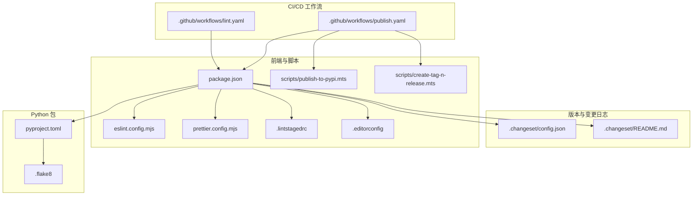
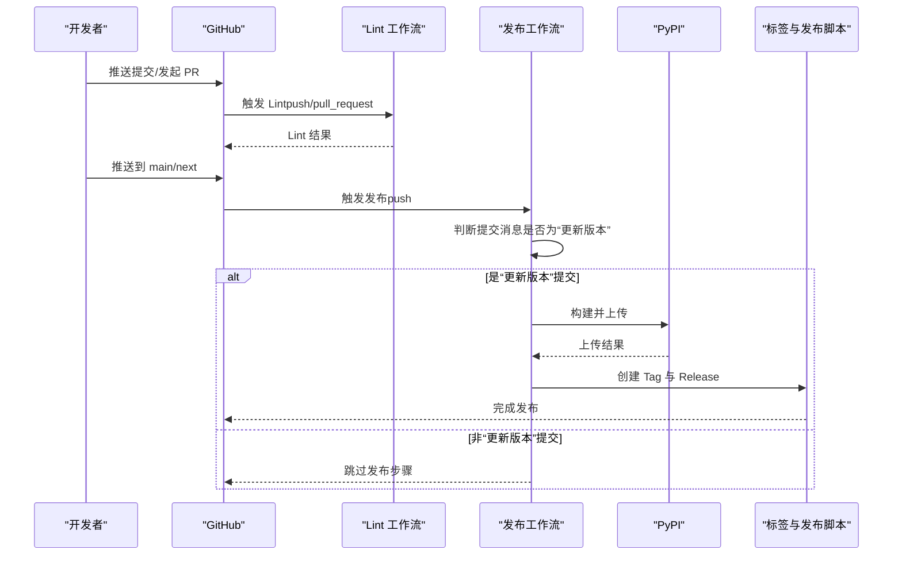
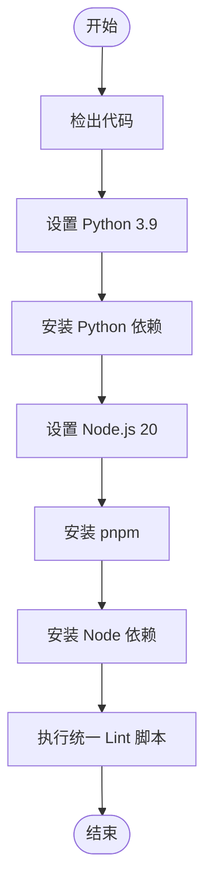
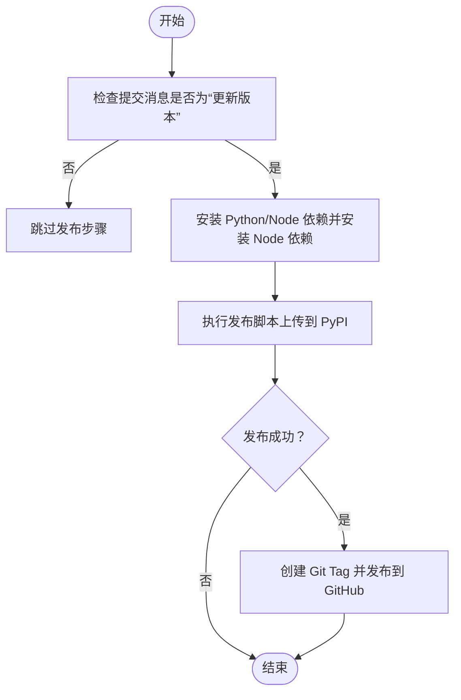
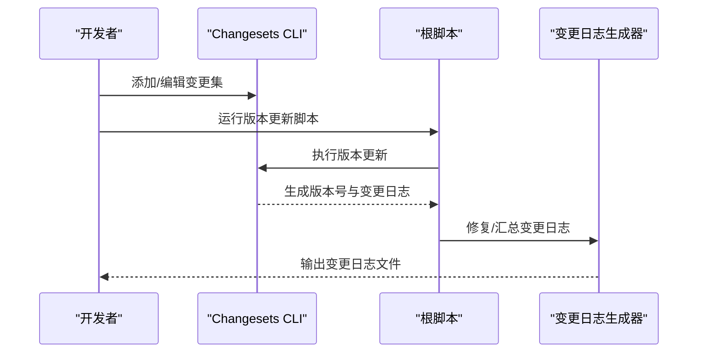
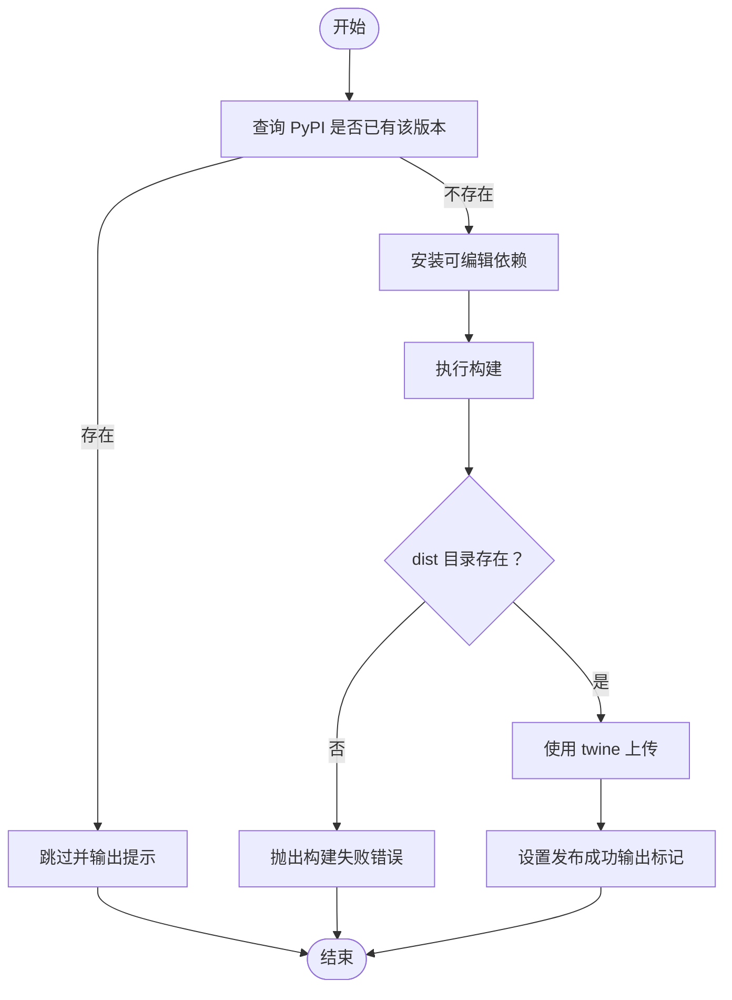
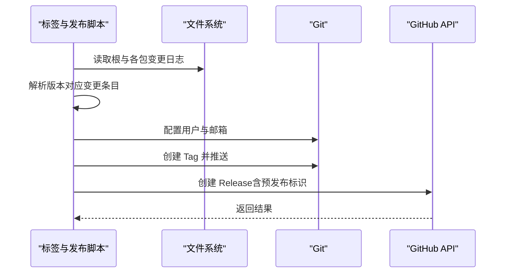
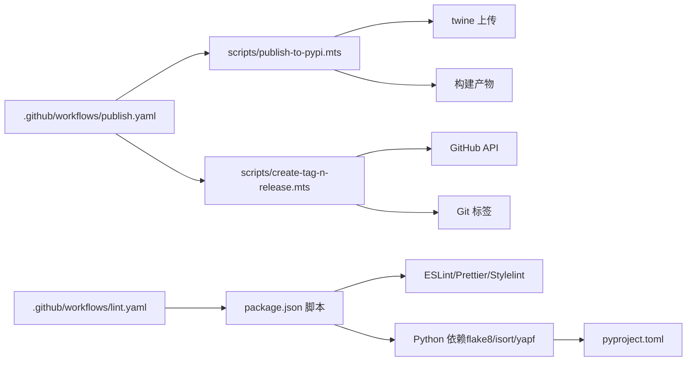

# 持续集成与部署

<cite>
**本文引用的文件**
- [.github/workflows/lint.yaml](file://.github/workflows/lint.yaml)
- [.github/workflows/publish.yaml](file://.github/workflows/publish.yaml)
- [.changeset/config.json](file://.changeset/config.json)
- [.changeset/README.md](file://.changeset/README.md)
- [package.json](file://package.json)
- [pyproject.toml](file://pyproject.toml)
- [scripts/publish-to-pypi.mts](file://scripts/publish-to-pypi.mts)
- [scripts/create-tag-n-release.mts](file://scripts/create-tag-n-release.mts)
- [eslint.config.mjs](file://eslint.config.mjs)
- [prettier.config.mjs](file://prettier.config.mjs)
- [.flake8](file://.flake8)
- [config/lint-config/eslint.mjs](file://config/lint-config/eslint.mjs)
- [.commitlintrc.js](file://.commitlintrc.js)
- [.lintstagedrc](file://.lintstagedrc)
- [.editorconfig](file://.editorconfig)
</cite>

## 目录

1. [简介](#简介)
2. [项目结构](#项目结构)
3. [核心组件](#核心组件)
4. [架构总览](#架构总览)
5. [详细组件分析](#详细组件分析)
6. [依赖关系分析](#依赖关系分析)
7. [性能考虑](#性能考虑)
8. [故障排除指南](#故障排除指南)
9. [结论](#结论)
10. [附录](#附录)

## 简介

本文件面向需要为 ModelScope Studio 配置与维护自动化流水线的开发者与运维人员，系统性说明以下内容：

- GitHub Actions 工作流：代码检查（Lint）与发布（Publish）的配置与执行逻辑
- Lint 工作流集成：ESLint、Prettier、Flake8、isort、yapf 等工具在 CI 中的使用方式
- 发布工作流：版本检测、构建验证、PyPI 发布、标签与发行创建
- Changesets 使用：版本更新、变更日志生成、发布标签创建
- 自定义工作流：如何扩展与定制现有流水线
- 故障排除与性能优化建议

## 项目结构

仓库采用多语言混合工程：前端基于 Svelte/TypeScript，后端为 Python 包；同时通过 Changesets 统一管理版本与变更日志，并以 GitHub Actions 实现 CI/CD。

图表来源

- [.github/workflows/lint.yaml:1-34](file://.github/workflows/lint.yaml#L1-L34)
- [.github/workflows/publish.yaml:1-74](file://.github/workflows/publish.yaml#L1-L74)
- [.changeset/config.json:1-15](file://.changeset/config.json#L1-L15)
- [.changeset/README.md:1-9](file://.changeset/README.md#L1-L9)
- [package.json:1-55](file://package.json#L1-L55)
- [pyproject.toml:1-257](file://pyproject.toml#L1-L257)
- [scripts/publish-to-pypi.mts:1-60](file://scripts/publish-to-pypi.mts#L1-L60)
- [scripts/create-tag-n-release.mts:1-131](file://scripts/create-tag-n-release.mts#L1-L131)
- [eslint.config.mjs:1-9](file://eslint.config.mjs#L1-L9)
- [prettier.config.mjs:1-26](file://prettier.config.mjs#L1-L26)
- [.lintstagedrc:1-7](file://.lintstagedrc#L1-L7)
- [.editorconfig:1-17](file://.editorconfig#L1-L17)
- [.flake8:1-16](file://.flake8#L1-L16)

章节来源

- [.github/workflows/lint.yaml:1-34](file://.github/workflows/lint.yaml#L1-L34)
- [.github/workflows/publish.yaml:1-74](file://.github/workflows/publish.yaml#L1-L74)
- [package.json:1-55](file://package.json#L1-L55)
- [pyproject.toml:1-257](file://pyproject.toml#L1-L257)

## 核心组件

- Lint 工作流：在推送与拉取请求上触发，安装 Python 与 Node 依赖，执行统一的 lint 脚本
- 发布工作流：在 main/next 分支推送时触发，按提交信息判断是否执行版本更新与发布，最终创建 Git Tag 与 GitHub Release
- Changesets：集中式版本与变更日志管理，配合脚本完成版本号写入与变更日志修复
- 发布脚本：检查版本是否已存在、构建产物、上传到 PyPI、输出发布状态
- 标签与发布脚本：聚合各包变更日志，创建 Git Tag 并在 GitHub 上创建 Release

章节来源

- [.github/workflows/lint.yaml:1-34](file://.github/workflows/lint.yaml#L1-L34)
- [.github/workflows/publish.yaml:1-74](file://.github/workflows/publish.yaml#L1-L74)
- [package.json:8-25](file://package.json#L8-L25)
- [scripts/publish-to-pypi.mts:1-60](file://scripts/publish-to-pypi.mts#L1-L60)
- [scripts/create-tag-n-release.mts:1-131](file://scripts/create-tag-n-release.mts#L1-L131)
- [.changeset/config.json:1-15](file://.changeset/config.json#L1-L15)

## 架构总览

下图展示从代码提交到发布的关键路径与决策点。

图表来源

- [.github/workflows/lint.yaml:1-34](file://.github/workflows/lint.yaml#L1-L34)
- [.github/workflows/publish.yaml:1-74](file://.github/workflows/publish.yaml#L1-L74)
- [scripts/publish-to-pypi.mts:1-60](file://scripts/publish-to-pypi.mts#L1-L60)
- [scripts/create-tag-n-release.mts:1-131](file://scripts/create-tag-n-release.mts#L1-L131)

## 详细组件分析

### Lint 工作流配置与执行

- 触发条件：push 与 pull_request
- 并发控制：同一工作流同分支仅保留一个运行实例
- 步骤概览：
  - 检出代码（完整历史）
  - 安装 Python 依赖（flake8、isort、yapf）
  - 安装 Node.js 与 pnpm
  - 安装 Node 依赖
  - 执行统一 lint 脚本（并行运行 JS/TS/Lint 与格式化）

图表来源

- [.github/workflows/lint.yaml:1-34](file://.github/workflows/lint.yaml#L1-L34)

章节来源

- [.github/workflows/lint.yaml:1-34](file://.github/workflows/lint.yaml#L1-L34)
- [package.json:18-22](file://package.json#L18-L22)
- [.lintstagedrc:1-7](file://.lintstagedrc#L1-L7)
- [.editorconfig:1-17](file://.editorconfig#L1-L17)
- [.flake8:1-16](file://.flake8#L1-L16)

### 发布工作流配置与执行

- 触发条件：推送到 main 或 next 分支
- 并发控制：独立分组，避免并发冲突
- 关键步骤：
  - 条件执行：仅当提交消息为“更新版本”时才执行后续步骤
  - 构建与发布：调用发布脚本，传入 PyPI Token
  - 标签与发布：若发布成功，则调用标签与发布脚本，传入 GitHub Token、仓库名与所有者

图表来源

- [.github/workflows/publish.yaml:1-74](file://.github/workflows/publish.yaml#L1-L74)
- [scripts/publish-to-pypi.mts:1-60](file://scripts/publish-to-pypi.mts#L1-L60)
- [scripts/create-tag-n-release.mts:1-131](file://scripts/create-tag-n-release.mts#L1-L131)

章节来源

- [.github/workflows/publish.yaml:1-74](file://.github/workflows/publish.yaml#L1-L74)

### Changesets 版本与变更日志

- 配置要点：
  - 使用自定义变更日志生成器，指定仓库地址
  - 基准分支为 main
  - 内部依赖更新策略为补丁
- 常用命令：
  - 版本更新与变更日志修复：由根脚本统一执行
  - CLI 交互式选择版本与记录变更

图表来源

- [.changeset/config.json:1-15](file://.changeset/config.json#L1-L15)
- [package.json](file://package.json#L24)

章节来源

- [.changeset/config.json:1-15](file://.changeset/config.json#L1-L15)
- [.changeset/README.md:1-9](file://.changeset/README.md#L1-L9)
- [package.json:8-25](file://package.json#L8-L25)

### 发布脚本：版本检测、构建与上传

- 功能概述：
  - 检查目标版本是否已在 PyPI 存在，若存在则跳过
  - 安装可编辑模式依赖并执行构建
  - 校验 dist 目录是否存在
  - 使用 twine 上传到 PyPI，跳过已存在文件
  - 设置发布成功的输出标记供后续步骤使用

图表来源

- [scripts/publish-to-pypi.mts:1-60](file://scripts/publish-to-pypi.mts#L1-L60)

章节来源

- [scripts/publish-to-pypi.mts:1-60](file://scripts/publish-to-pypi.mts#L1-L60)

### 标签与发布脚本：聚合变更日志、创建 Tag 与 Release

- 功能概述：
  - 读取根变更日志与各包变更日志，按版本聚合
  - 配置 Git 用户信息
  - 创建带 v 前缀的 Tag 并推送到远端
  - 调用 GitHub API 创建 Release，预发布标识根据版本号判断

图表来源

- [scripts/create-tag-n-release.mts:1-131](file://scripts/create-tag-n-release.mts#L1-L131)

章节来源

- [scripts/create-tag-n-release.mts:1-131](file://scripts/create-tag-n-release.mts#L1-L131)

### Lint 工具链与配置

- ESLint：通过根配置导入统一的 lint 配置集合
- Prettier：统一格式化规则与插件，支持 Svelte 与 package.json
- Flake8：Python 静态检查，忽略特定规则与目录
- isort/yapf：Python 导入排序与格式化
- Stylelint：样式文件检查（通过脚本调用）
- 提交规范：commitlint 基于 Conventional Commits

章节来源

- [eslint.config.mjs:1-9](file://eslint.config.mjs#L1-L9)
- [config/lint-config/eslint.mjs:1-11](file://config/lint-config/eslint.mjs#L1-L11)
- [prettier.config.mjs:1-26](file://prettier.config.mjs#L1-L26)
- [.lintstagedrc:1-7](file://.lintstagedrc#L1-L7)
- [.flake8:1-16](file://.flake8#L1-L16)
- [.commitlintrc.js:1-30](file://.commitlintrc.js#L1-L30)
- [.editorconfig:1-17](file://.editorconfig#L1-L17)

## 依赖关系分析

- 工作流对脚本的依赖：发布工作流直接调用发布与标签脚本
- 脚本对工具的依赖：发布脚本依赖 twine、构建工具；标签脚本依赖 GitHub API 与 Git
- 语言生态依赖：前端使用 pnpm 管理依赖；Python 使用 hatchling 构建，twine 上传
- 版本与变更日志：Changesets 与根脚本共同驱动版本号与变更日志生成

图表来源

- [.github/workflows/lint.yaml:1-34](file://.github/workflows/lint.yaml#L1-L34)
- [.github/workflows/publish.yaml:1-74](file://.github/workflows/publish.yaml#L1-L74)
- [scripts/publish-to-pypi.mts:1-60](file://scripts/publish-to-pypi.mts#L1-L60)
- [scripts/create-tag-n-release.mts:1-131](file://scripts/create-tag-n-release.mts#L1-L131)
- [package.json:8-25](file://package.json#L8-L25)
- [pyproject.toml:1-257](file://pyproject.toml#L1-L257)

章节来源

- [package.json:1-55](file://package.json#L1-L55)
- [pyproject.toml:1-257](file://pyproject.toml#L1-L257)

## 性能考虑

- 缓存与并发：合理利用缓存与并发控制，避免重复安装与构建
- 任务拆分：将 Lint 与构建拆分为独立步骤，便于并行与重试
- 依赖最小化：仅在必要时安装额外依赖，减少镜像体积与等待时间
- 失败快速返回：在发现版本已存在或构建失败时尽早退出，节省资源

## 故障排除指南

- PyPI 版本已存在
  - 现象：发布脚本跳过上传并输出提示
  - 处理：确认版本号是否正确更新，或清理缓存后重试
- 构建产物缺失
  - 现象：构建后未生成 dist 目录导致失败
  - 处理：检查构建脚本与依赖安装是否成功
- 上传失败（权限/令牌）
  - 现象：twine 上传报错
  - 处理：确认 PYPI_TOKEN 是否配置且有效
- 标签与 Release 失败
  - 现象：GitHub API 抛出异常或找不到变更日志
  - 处理：检查变更日志生成是否正常，确认版本号与 Tag 一致
- Lint 失败
  - 现象：ESLint/Prettier/Flake8 报错
  - 处理：根据错误提示修复代码或调整规则；确保本地与 CI 使用相同配置

章节来源

- [scripts/publish-to-pypi.mts:1-60](file://scripts/publish-to-pypi.mts#L1-L60)
- [scripts/create-tag-n-release.mts:1-131](file://scripts/create-tag-n-release.mts#L1-L131)
- [package.json:18-22](file://package.json#L18-L22)
- [.lintstagedrc:1-7](file://.lintstagedrc#L1-L7)
- [.flake8:1-16](file://.flake8#L1-L16)

## 结论

本仓库的 CI/CD 体系围绕 GitHub Actions、Changesets、以及一组 Node/Python 工具链构建，实现了从代码检查到版本发布的一体化流程。通过明确的工作流划分、严格的版本与变更日志管理，以及可复用的发布与标签脚本，团队可以高效、可靠地交付产品。

## 附录

### 自定义工作流建议

- 新增 Lint 规则：在根配置中扩展 ESLint/Prettier 规则，并同步至 .lintstagedrc
- 新增语言或工具：在 package.json 中添加脚本与依赖，在工作流中新增对应步骤
- 发布策略：根据需要调整触发分支与条件判断，确保只在“更新版本”提交时执行发布
- 安全与密钥：严格管理 PYPI_TOKEN 与 GITHUB_TOKEN，限制作用域与访问范围

### 参考文件索引

- Lint 工作流：[lint.yaml:1-34](file://.github/workflows/lint.yaml#L1-L34)
- 发布工作流：[publish.yaml:1-74](file://.github/workflows/publish.yaml#L1-L74)
- Changesets 配置：[config.json:1-15](file://.changeset/config.json#L1-L15)
- 根脚本与工具链：[package.json:8-25](file://package.json#L8-L25)
- Python 构建与发布：[pyproject.toml:1-257](file://pyproject.toml#L1-L257)
- 发布脚本：[publish-to-pypi.mts:1-60](file://scripts/publish-to-pypi.mts#L1-L60)
- 标签与发布脚本：[create-tag-n-release.mts:1-131](file://scripts/create-tag-n-release.mts#L1-L131)
- Lint 配置：[eslint.config.mjs:1-9](file://eslint.config.mjs#L1-L9)、[prettier.config.mjs:1-26](file://prettier.config.mjs#L1-L26)、[lint-staged 配置:1-7](file://.lintstagedrc#L1-L7)、[flake8 配置:1-16](file://.flake8#L1-L16)
- 提交规范：[commitlint 配置:1-30](file://.commitlintrc.js#L1-L30)
- 编辑器配置：[EditorConfig:1-17](file://.editorconfig#L1-L17)
