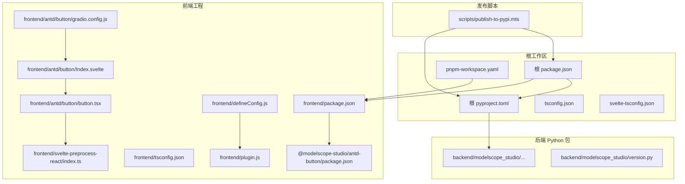
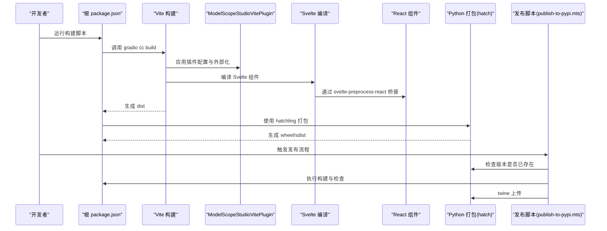
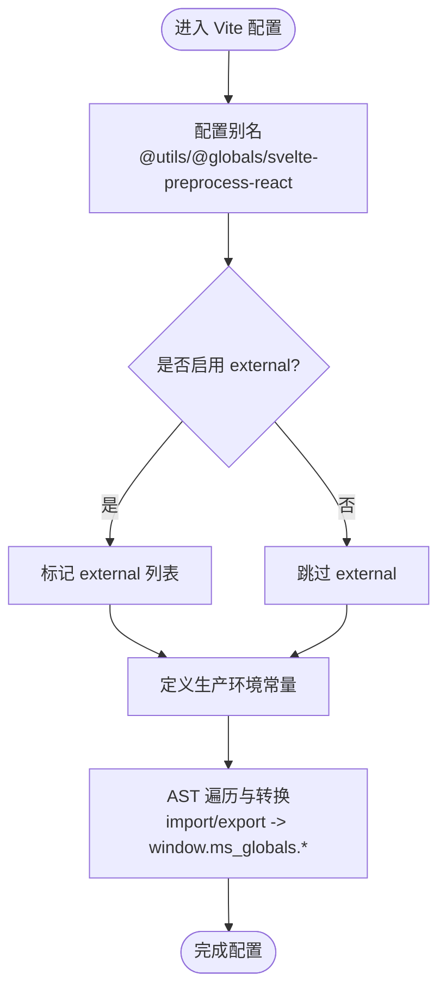
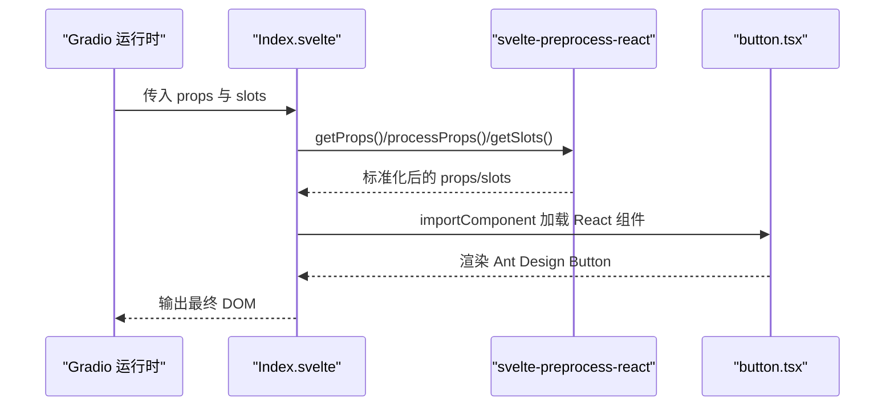
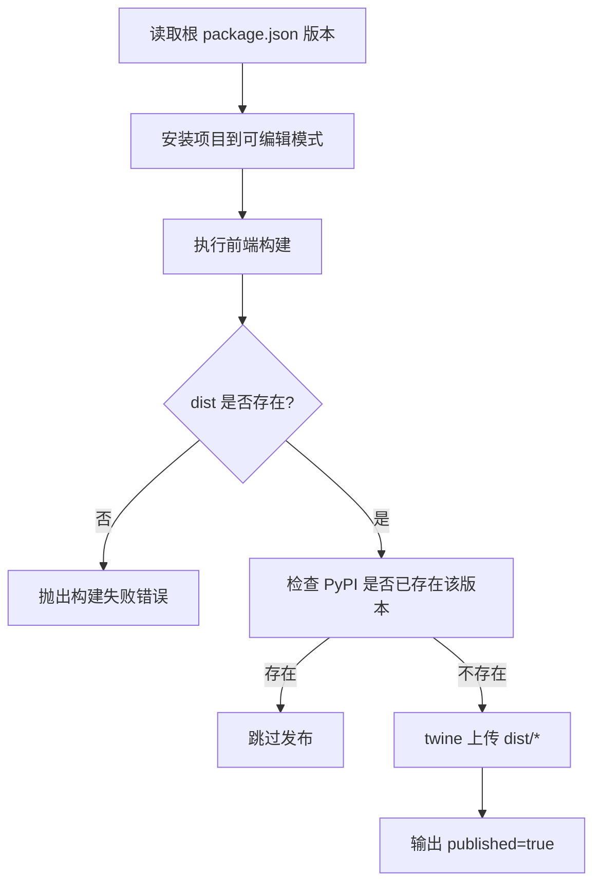
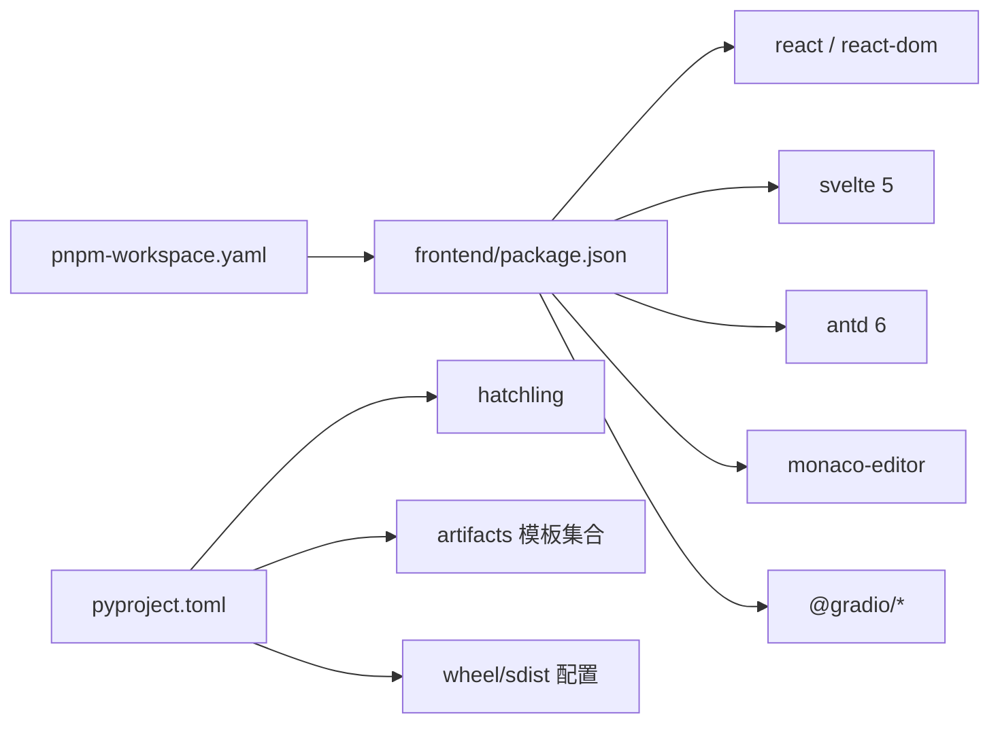

# 构建流程

<cite>
**本文引用的文件**
- [package.json](file://package.json)
- [pyproject.toml](file://pyproject.toml)
- [frontend/package.json](file://frontend/package.json)
- [frontend/defineConfig.js](file://frontend/defineConfig.js)
- [frontend/plugin.js](file://frontend/plugin.js)
- [frontend/tsconfig.json](file://frontend/tsconfig.json)
- [svelte-tsconfig.json](file://svelte-tsconfig.json)
- [pnpm-workspace.yaml](file://pnpm-workspace.yaml)
- [backend/modelscope_studio/version.py](file://backend/modelscope_studio/version.py)
- [scripts/publish-to-pypi.mts](file://scripts/publish-to-pypi.mts)
- [frontend/antd/button/package.json](file://frontend/antd/button/package.json)
- [frontend/antd/button/gradio.config.js](file://frontend/antd/button/gradio.config.js)
- [frontend/antd/button/Index.svelte](file://frontend/antd/button/Index.svelte)
- [frontend/antd/button/button.tsx](file://frontend/antd/button/button.tsx)
- [frontend/svelte-preprocess-react/index.ts](file://frontend/svelte-preprocess-react/index.ts)
</cite>

## 目录

1. [简介](#简介)
2. [项目结构](#项目结构)
3. [核心组件](#核心组件)
4. [架构总览](#架构总览)
5. [详细组件分析](#详细组件分析)
6. [依赖关系分析](#依赖关系分析)
7. [性能考虑](#性能考虑)
8. [故障排查指南](#故障排查指南)
9. [结论](#结论)
10. [附录](#附录)

## 简介

本文件面向需要理解与维护 ModelScope Studio 构建机制的开发者与运维人员，系统性阐述以下内容：

- 前端组件的构建流程：Vite 配置、Svelte 组件编译、React 组件桥接（svelte-preprocess-react）。
- Python 包的构建流程：依赖安装、打包配置、版本管理与发布脚本。
- 本地构建环境设置：Node.js、Python、pnpm 的安装与配置要点。
- 构建优化技巧与性能调优建议。
- 常见构建失败原因与解决方案。

## 项目结构

该项目采用多包工作区（pnpm workspace）组织，核心目录与职责如下：

- 根级脚本与配置：package.json、pyproject.toml、pnpm-workspace.yaml、tsconfig.json、svelte-tsconfig.json。
- 前端工程：frontend 及其子包（antd、antdx、base、pro），以及 svelte-preprocess-react 桥接层。
- 后端 Python 包：backend/modelscope_studio，包含大量组件模板与版本信息。
- 发布脚本：scripts/publish-to-pypi.mts，用于 CI 中的构建与发布。

**图表来源**

- [package.json:1-55](file://package.json#L1-L55)
- [pyproject.toml:1-257](file://pyproject.toml#L1-L257)
- [pnpm-workspace.yaml:1-12](file://pnpm-workspace.yaml#L1-L12)
- [frontend/package.json:1-59](file://frontend/package.json#L1-L59)
- [frontend/defineConfig.js:1-19](file://frontend/defineConfig.js#L1-L19)
- [frontend/plugin.js:1-168](file://frontend/plugin.js#L1-L168)
- [frontend/tsconfig.json:1-8](file://frontend/tsconfig.json#L1-L8)
- [svelte-tsconfig.json:1-4](file://svelte-tsconfig.json#L1-L4)
- [frontend/antd/button/package.json:1-15](file://frontend/antd/button/package.json#L1-L15)
- [frontend/antd/button/gradio.config.js:1-4](file://frontend/antd/button/gradio.config.js#L1-L4)
- [frontend/antd/button/Index.svelte:1-74](file://frontend/antd/button/Index.svelte#L1-L74)
- [frontend/antd/button/button.tsx:1-39](file://frontend/antd/button/button.tsx#L1-L39)
- [frontend/svelte-preprocess-react/index.ts:1-8](file://frontend/svelte-preprocess-react/index.ts#L1-L8)
- [backend/modelscope_studio/version.py:1-2](file://backend/modelscope_studio/version.py#L1-L2)
- [scripts/publish-to-pypi.mts:1-60](file://scripts/publish-to-pypi.mts#L1-L60)

**章节来源**

- [package.json:1-55](file://package.json#L1-L55)
- [pyproject.toml:1-257](file://pyproject.toml#L1-L257)
- [pnpm-workspace.yaml:1-12](file://pnpm-workspace.yaml#L1-L12)
- [frontend/package.json:1-59](file://frontend/package.json#L1-L59)
- [frontend/defineConfig.js:1-19](file://frontend/defineConfig.js#L1-L19)
- [frontend/plugin.js:1-168](file://frontend/plugin.js#L1-L168)
- [frontend/tsconfig.json:1-8](file://frontend/tsconfig.json#L1-L8)
- [svelte-tsconfig.json:1-4](file://svelte-tsconfig.json#L1-L4)

## 核心组件

- 根构建脚本与命令：通过根 package.json 定义构建、开发、版本与发布相关脚本，统一入口。
- 前端 Vite 插件：ModelScopeStudioVitePlugin 负责别名、外部化（external）、全局变量映射与代码转换。
- Svelte 组件桥接：svelte-preprocess-react 将 React 组件以 Svelte 方式使用，并处理插槽与属性透传。
- Python 打包：pyproject.toml 使用 hatchling 作为构建后端，声明 artifacts 与 wheel 包含路径，确保模板资源被正确打包。
- 版本管理：Python 包版本与前端版本保持一致，由 backend/modelscope_studio/version.py 与根 package.json/version 共同体现。

**章节来源**

- [package.json:8-25](file://package.json#L8-L25)
- [frontend/plugin.js:41-168](file://frontend/plugin.js#L41-L168)
- [frontend/svelte-preprocess-react/index.ts:1-8](file://frontend/svelte-preprocess-react/index.ts#L1-L8)
- [pyproject.toml:45-257](file://pyproject.toml#L45-L257)
- [backend/modelscope_studio/version.py:1-2](file://backend/modelscope_studio/version.py#L1-L2)

## 架构总览

下图展示从“构建命令”到“产物产出”的整体流程，涵盖前端 Vite 构建、React 组件桥接、Python 打包与发布脚本。

**图表来源**

- [package.json:8-25](file://package.json#L8-L25)
- [frontend/defineConfig.js:5-18](file://frontend/defineConfig.js#L5-L18)
- [frontend/plugin.js:41-76](file://frontend/plugin.js#L41-L76)
- [frontend/antd/button/Index.svelte:10-55](file://frontend/antd/button/Index.svelte#L10-L55)
- [frontend/antd/button/button.tsx:1-39](file://frontend/antd/button/button.tsx#L1-L39)
- [pyproject.toml:45-257](file://pyproject.toml#L45-L257)
- [scripts/publish-to-pypi.mts:22-55](file://scripts/publish-to-pypi.mts#L22-L55)

## 详细组件分析

### 前端 Vite 构建与插件

- 配置入口：defineConfig.js 导出一个函数，返回 Vite 默认配置对象，集成 React 插件与自定义 ModelScopeStudioVitePlugin。
- 插件能力：
  - 别名解析：@utils、@globals、svelte-preprocess-react。
  - 外部化策略：在构建阶段将一组预定义模块标记为 external，并注入全局变量映射，减少打包体积。
  - 代码转换：遍历 AST，将 import/export 重写为对 window.ms_globals.\* 的访问，实现运行时共享依赖。
- 类型与检查：前端 tsconfig.json 扩展根 tsconfig 并启用 ESNext 模块类型；svelte-tsconfig.json 供 Svelte 检查使用。

**图表来源**

- [frontend/defineConfig.js:5-18](file://frontend/defineConfig.js#L5-L18)
- [frontend/plugin.js:41-76](file://frontend/plugin.js#L41-L76)
- [frontend/plugin.js:77-167](file://frontend/plugin.js#L77-L167)
- [frontend/tsconfig.json:1-8](file://frontend/tsconfig.json#L1-L8)
- [svelte-tsconfig.json:1-4](file://svelte-tsconfig.json#L1-L4)

**章节来源**

- [frontend/defineConfig.js:1-19](file://frontend/defineConfig.js#L1-L19)
- [frontend/plugin.js:1-168](file://frontend/plugin.js#L1-L168)
- [frontend/tsconfig.json:1-8](file://frontend/tsconfig.json#L1-L8)
- [svelte-tsconfig.json:1-4](file://svelte-tsconfig.json#L1-L4)

### Svelte 组件编译与 React 桥接

- 组件导出：每个前端组件包通过 package.json 的 exports 字段声明 Gradio 入口（Index.svelte）。
- 配置继承：组件级 gradio.config.js 通过 defineConfig 生成统一配置。
- 组件实现：
  - Svelte 层：Index.svelte 使用 svelte-preprocess-react 的 getProps/processProps/getSlots 等 API，将 Gradio 传入的 props 与 slots 转换为 React 组件可用形态。
  - React 层：button.tsx 使用 sveltify 将 Ant Design Button 包装为可被 Svelte 使用的 React 组件，支持 slots 与 children 渲染。
- 槽位与属性：通过 ReactSlot 与 useTargets 实现复杂子节点与图标等插槽渲染。

**图表来源**

- [frontend/antd/button/package.json:1-15](file://frontend/antd/button/package.json#L1-L15)
- [frontend/antd/button/gradio.config.js:1-4](file://frontend/antd/button/gradio.config.js#L1-L4)
- [frontend/antd/button/Index.svelte:10-55](file://frontend/antd/button/Index.svelte#L10-L55)
- [frontend/antd/button/button.tsx:1-39](file://frontend/antd/button/button.tsx#L1-L39)
- [frontend/svelte-preprocess-react/index.ts:1-8](file://frontend/svelte-preprocess-react/index.ts#L1-L8)

**章节来源**

- [frontend/antd/button/package.json:1-15](file://frontend/antd/button/package.json#L1-L15)
- [frontend/antd/button/gradio.config.js:1-4](file://frontend/antd/button/gradio.config.js#L1-L4)
- [frontend/antd/button/Index.svelte:1-74](file://frontend/antd/button/Index.svelte#L1-L74)
- [frontend/antd/button/button.tsx:1-39](file://frontend/antd/button/button.tsx#L1-L39)
- [frontend/svelte-preprocess-react/index.ts:1-8](file://frontend/svelte-preprocess-react/index.ts#L1-L8)

### Python 包构建与发布

- 构建后端：pyproject.toml 使用 hatchling 作为构建后端，配合 hatch-requirements-txt、hatch-fancy-pypi-readme。
- 依赖与元数据：声明 Python 版本要求、许可证、关键字、分类器与核心依赖（如 Gradio）。
- 打包范围：tool.hatch.build.artifacts 明确列出大量模板目录，确保前端组件模板随包分发；wheel/sdist 的包含/排除规则清晰。
- 版本同步：Python 包 version 与前端版本保持一致，便于统一发布与追踪。
- 发布脚本：scripts/publish-to-pypi.mts 在 CI 中执行安装、构建、版本检查与 twine 上传，避免重复发布。

**图表来源**

- [pyproject.toml:1-44](file://pyproject.toml#L1-L44)
- [pyproject.toml:45-257](file://pyproject.toml#L45-L257)
- [backend/modelscope_studio/version.py:1-2](file://backend/modelscope_studio/version.py#L1-L2)
- [scripts/publish-to-pypi.mts:14-55](file://scripts/publish-to-pypi.mts#L14-L55)

**章节来源**

- [pyproject.toml:1-257](file://pyproject.toml#L1-L257)
- [backend/modelscope_studio/version.py:1-2](file://backend/modelscope_studio/version.py#L1-L2)
- [scripts/publish-to-pypi.mts:1-60](file://scripts/publish-to-pypi.mts#L1-L60)

## 依赖关系分析

- 工作区与包管理：pnpm-workspace.yaml 声明了根、config、frontend 及其子包，确保跨包引用与构建一致性。
- 前端依赖：frontend/package.json 指定 React 19、Svelte 5、Ant Design 6、Monaco Editor 等核心依赖。
- 外部化与别名：ModelScopeStudioVitePlugin 将 React、ReactDOM、antd、antdx 等映射为 window.ms_globals.\*，减少重复打包。
- Python 依赖：pyproject.toml 仅声明 Gradio 依赖，其他前端资源通过 artifacts 与模板目录打包。

**图表来源**

- [pnpm-workspace.yaml:1-12](file://pnpm-workspace.yaml#L1-L12)
- [frontend/package.json:8-40](file://frontend/package.json#L8-L40)
- [pyproject.toml:1-44](file://pyproject.toml#L1-L44)
- [pyproject.toml:45-257](file://pyproject.toml#L45-L257)

**章节来源**

- [pnpm-workspace.yaml:1-12](file://pnpm-workspace.yaml#L1-L12)
- [frontend/package.json:1-59](file://frontend/package.json#L1-L59)
- [pyproject.toml:1-257](file://pyproject.toml#L1-L257)

## 性能考虑

- 外部化与共享依赖：通过 ModelScopeStudioVitePlugin 的 external 与全局映射，避免 React、antd 等大包重复打包，显著降低产物体积与构建时间。
- AST 转换与按需加载：在构建阶段将 import/export 重写为全局访问，结合动态 import（如 importComponent）实现按需加载，提升首屏性能。
- 模块别名：合理使用 @utils、@globals、svelte-preprocess-react 别名，减少路径解析开销。
- 打包粒度：artifacts 精确列出模板目录，避免无关文件进入包体，缩短打包与发布时间。
- 类型检查：开启 svelte-check 与 TypeScript 检查，提前发现类型问题，减少运行时错误导致的回退成本。

[本节为通用性能建议，不直接分析具体文件，故无“章节来源”]

## 故障排查指南

- 构建失败（dist 不存在）
  - 现象：发布脚本报错“Build Failed”。
  - 排查：确认前端构建命令执行成功，检查 defineConfig 与插件配置是否正确应用。
  - 参考
    - [scripts/publish-to-pypi.mts:22-30](file://scripts/publish-to-pypi.mts#L22-L30)
    - [frontend/defineConfig.js:8-18](file://frontend/defineConfig.js#L8-L18)
- 版本重复发布
  - 现象：PyPI 已存在相同版本，脚本跳过发布。
  - 排查：确认版本号未变更或手动清理缓存。
  - 参考
    - [scripts/publish-to-pypi.mts:44-51](file://scripts/publish-to-pypi.mts#L44-L51)
- 外部化依赖缺失
  - 现象：运行时报 window.ms_globals 未定义。
  - 排查：检查 ModelScopeStudioVitePlugin 的 external/excludes 配置，确认全局映射是否覆盖所需依赖。
  - 参考
    - [frontend/plugin.js:41-76](file://frontend/plugin.js#L41-L76)
    - [frontend/plugin.js:5-20](file://frontend/plugin.js#L5-L20)
- Svelte/React 槽位渲染异常
  - 现象：插槽内容未显示或图标/加载态不生效。
  - 排查：确认 Index.svelte 的 getProps/processProps/getSlots 使用正确，button.tsx 的 ReactSlot 与 useTargets 实现符合预期。
  - 参考
    - [frontend/antd/button/Index.svelte:10-55](file://frontend/antd/button/Index.svelte#L10-L55)
    - [frontend/antd/button/button.tsx:11-36](file://frontend/antd/button/button.tsx#L11-L36)
- Python 打包遗漏模板
  - 现象：安装后组件模板缺失。
  - 排查：核对 pyproject.toml 的 artifacts 列表与 wheel/sdist 包含路径。
  - 参考
    - [pyproject.toml:45-257](file://pyproject.toml#L45-L257)

**章节来源**

- [scripts/publish-to-pypi.mts:22-51](file://scripts/publish-to-pypi.mts#L22-L51)
- [frontend/plugin.js:5-20](file://frontend/plugin.js#L5-L20)
- [frontend/antd/button/Index.svelte:10-55](file://frontend/antd/button/Index.svelte#L10-L55)
- [frontend/antd/button/button.tsx:11-36](file://frontend/antd/button/button.tsx#L11-L36)
- [pyproject.toml:45-257](file://pyproject.toml#L45-L257)

## 结论

本项目的构建体系围绕“前端 Vite + Svelte + React 桥接 + Python 打包”的组合展开。通过外部化共享依赖、AST 转换与精确的模板打包策略，实现了高效的构建与稳定的运行时行为。遵循本文档的配置与排障建议，可有效提升本地与 CI 的构建稳定性与性能。

[本节为总结性内容，不直接分析具体文件，故无“章节来源”]

## 附录

### 本地构建环境设置

- Node.js
  - 版本要求：满足前端依赖（React 19、Svelte 5、Ant Design 6）需求。
  - 包管理：使用 pnpm，确保与 workspace 配置一致。
  - 参考
    - [pnpm-workspace.yaml:1-12](file://pnpm-workspace.yaml#L1-L12)
    - [frontend/package.json:8-40](file://frontend/package.json#L8-L40)
- Python
  - 版本要求：满足 pyproject.toml 中 requires-python。
  - 构建工具：安装 hatchling 与 twine，确保可执行。
  - 参考
    - [pyproject.toml:1-7](file://pyproject.toml#L1-L7)
    - [pyproject.toml:42-43](file://pyproject.toml#L42-L43)
- 前端构建
  - 执行根脚本进行构建与开发，确保 defineConfig 与插件正常加载。
  - 参考
    - [package.json:8-25](file://package.json#L8-L25)
    - [frontend/defineConfig.js:5-18](file://frontend/defineConfig.js#L5-L18)
    - [frontend/plugin.js:41-76](file://frontend/plugin.js#L41-L76)

**章节来源**

- [pnpm-workspace.yaml:1-12](file://pnpm-workspace.yaml#L1-L12)
- [frontend/package.json:1-59](file://frontend/package.json#L1-L59)
- [pyproject.toml:1-44](file://pyproject.toml#L1-L44)
- [package.json:8-25](file://package.json#L8-L25)
- [frontend/defineConfig.js:1-19](file://frontend/defineConfig.js#L1-L19)
- [frontend/plugin.js:1-168](file://frontend/plugin.js#L1-L168)
