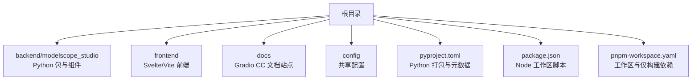
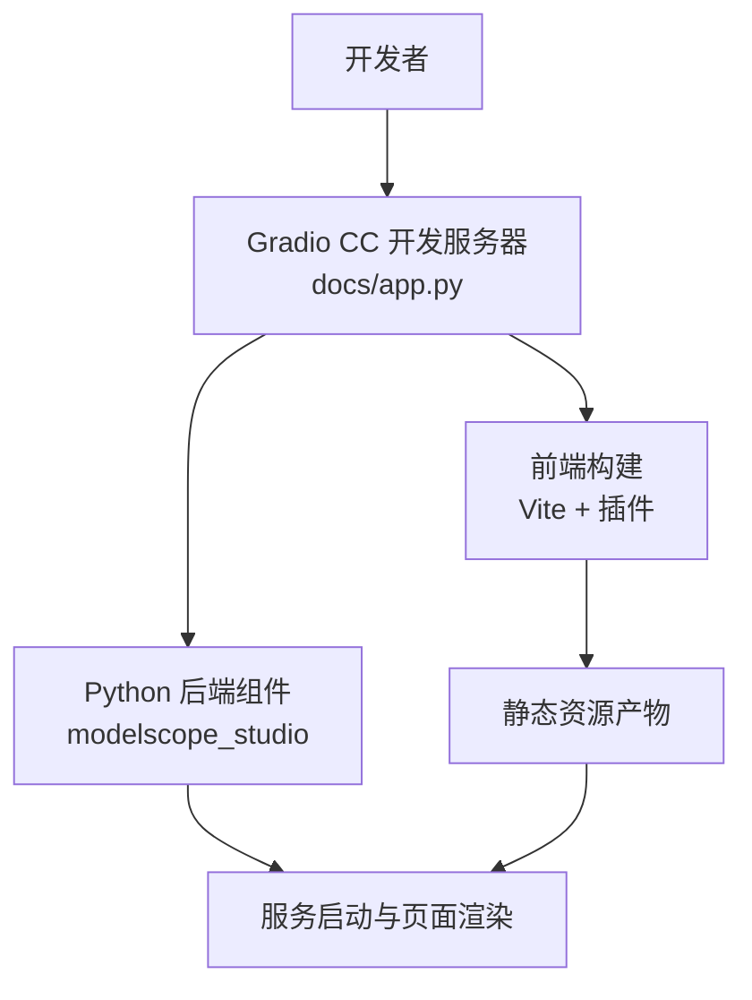
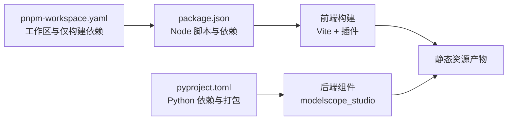
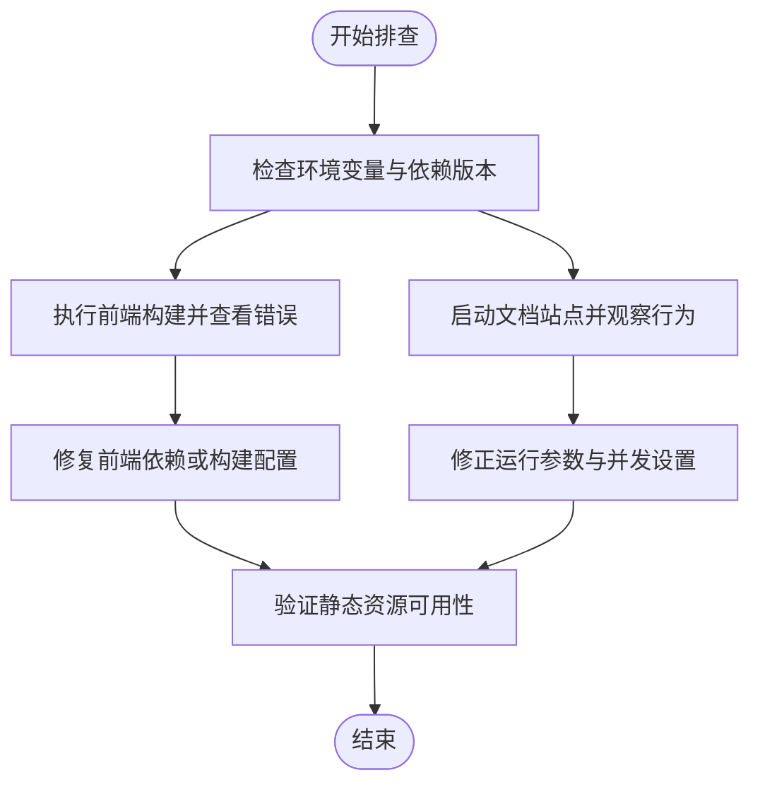

# 环境配置

<cite>
**本文引用的文件**   
- [README.md](file://README.md)
- [pyproject.toml](file://pyproject.toml)
- [package.json](file://package.json)
- [pnpm-workspace.yaml](file://pnpm-workspace.yaml)
- [docs/app.py](file://docs/app.py)
- [frontend/package.json](file://frontend/package.json)
- [frontend/defineConfig.js](file://frontend/defineConfig.js)
- [backend/modelscope_studio/utils/dev/app_context.py](file://backend/modelscope_studio/utils/dev/app_context.py)
- [backend/modelscope_studio/utils/dev/process_links.py](file://backend/modelscope_studio/utils/dev/process_links.py)
- [backend/modelscope_studio/utils/dev/resolve_frontend_dir.py](file://backend/modelscope_studio/utils/dev/resolve_frontend_dir.py)
</cite>

## 目录

1. [简介](#简介)
2. [项目结构](#项目结构)
3. [核心组件](#核心组件)
4. [架构总览](#架构总览)
5. [详细组件分析](#详细组件分析)
6. [依赖分析](#依赖分析)
7. [性能考虑](#性能考虑)
8. [故障排查指南](#故障排查指南)
9. [结论](#结论)
10. [附录](#附录)

## 简介

本文件面向运维与开发者，提供 ModelScope Studio 的环境配置与部署最佳实践，覆盖本地开发、测试与生产环境的配置要点，包括环境变量、依赖管理、容器化（Docker/Kubernetes）与性能监控、日志配置、环境迁移与升级策略，以及不同平台的部署差异与注意事项。

## 项目结构

仓库采用多包工作区组织方式，后端以 Python 包形式发布，前端以 Svelte + Vite 构建，文档站点通过 Gradio CC 启动。关键目录与职责如下：

- backend/modelscope_studio：Python 后端组件与工具
- frontend：前端组件与构建配置
- docs：文档站点与示例应用
- config：共享的 Lint 与变更日志配置
- 根级配置：pyproject.toml（Python 打包）、package.json（Node 工作区脚本）、pnpm-workspace.yaml（工作区定义）

**图表来源**

- [pyproject.toml](file://pyproject.toml)
- [package.json](file://package.json)
- [pnpm-workspace.yaml](file://pnpm-workspace.yaml)

**章节来源**

- [README.md](file://README.md)
- [pyproject.toml](file://pyproject.toml)
- [package.json](file://package.json)
- [pnpm-workspace.yaml](file://pnpm-workspace.yaml)

## 核心组件

- Python 打包与分发：使用 Hatchling 构建，包含后端组件模板清单与打包目标
- Node 工作区：统一脚本与依赖管理，支持多子包并行开发
- 文档站点：基于 Gradio CC 的 docs/app.py，提供组件与布局模板的可视化文档
- 前端构建：Vite + React SWC 插件，配合自定义插件与 Svelte 预处理

**章节来源**

- [pyproject.toml](file://pyproject.toml)
- [package.json](file://package.json)
- [docs/app.py](file://docs/app.py)
- [frontend/package.json](file://frontend/package.json)
- [frontend/defineConfig.js](file://frontend/defineConfig.js)

## 架构总览

下图展示了从开发到运行的关键路径：本地开发通过 Gradio CC 启动 docs/app.py；构建阶段由前端 Vite 与后端打包共同完成；运行时由 Python 后端与前端静态资源协同提供服务。

**图表来源**

- [docs/app.py](file://docs/app.py)
- [frontend/defineConfig.js](file://frontend/defineConfig.js)
- [frontend/package.json](file://frontend/package.json)
- [pyproject.toml](file://pyproject.toml)

## 详细组件分析

### 环境变量与运行参数

- 文档站点默认并发与线程数在入口处设置，可按需调整以适配不同环境的吞吐与资源限制
- 开发模式通过环境变量触发 Gradio Watch Module，便于热更新与调试

建议的环境变量与用途（示例，非固定值）：

- GRADIO_WATCH_MODULE_NAME：用于启用开发监听
- PYTHONPATH 或工作区路径：确保 Python 可导入后端包
- NODE_ENV：控制前端构建模式（开发/生产）
- PORT/APP_HOST：服务监听地址与端口（如需自定义）

**章节来源**

- [docs/app.py](file://docs/app.py)
- [package.json](file://package.json)

### 依赖管理策略

- Python 依赖
  - 核心依赖：Gradio 版本范围约束
  - 打包与分发：Hatchling + hatch-requirements-txt
  - 模板清单：构建阶段包含大量前端模板目录，确保产物完整
- Node.js 依赖
  - 工作区：pnpm workspace + 仅构建依赖声明
  - 脚本：统一的构建、开发、格式化、检查等命令
  - 前端依赖：React、Svelte、Ant Design、Monaco Editor 等
- 工作空间配置
  - pnpm-workspace.yaml 定义了 packages 与 onlyBuiltDependencies，减少不必要的构建开销

**章节来源**

- [pyproject.toml](file://pyproject.toml)
- [package.json](file://package.json)
- [pnpm-workspace.yaml](file://pnpm-workspace.yaml)
- [frontend/package.json](file://frontend/package.json)

### 容器化部署（Docker 与 Kubernetes）

以下为通用实践步骤，具体镜像与编排需结合实际环境定制：

- Docker 构建流程
  - 基础镜像：选择包含 Python 与 Node 的基础镜像
  - 安装依赖：先安装系统依赖，再安装 Python 与 Node 依赖
  - 构建后端：pip 安装后端包或以可编辑模式安装
  - 构建前端：执行前端构建脚本生成静态资源
  - 运行：启动 Python 服务并提供静态资源
- Kubernetes 部署
  - 使用 Deployment 管理 Pod 副本
  - 使用 Service 暴露服务
  - 使用 ConfigMap/Secret 管理环境变量与敏感信息
  - 使用 PersistentVolume/ PVC 存储日志与临时文件（如需）
  - 健康检查：配置 liveness/readiness 探针
  - 资源限制：根据并发与线程配置设置 CPU/内存请求与限制

[本节为通用实践说明，不直接分析具体文件，故无“章节来源”]

### 性能监控与日志配置

- 性能监控
  - 在 Python 层面：记录请求耗时、队列长度、并发限制等指标
  - 在前端层面：监控首屏时间、资源加载耗时、错误率
  - 在容器层面：采集 CPU/内存/网络等指标，结合日志进行关联分析
- 日志配置
  - Python：使用标准日志模块，按环境输出到 stdout/stderr，并结合容器日志收集
  - 前端：避免在生产环境输出过量调试日志，必要时使用条件日志
  - 文档站点：注意并发与线程配置对资源占用的影响

[本节为通用实践说明，不直接分析具体文件，故无“章节来源”]

### 环境迁移与升级

- Python 升级
  - 更新 Python 版本要求与依赖版本范围，确保兼容性
  - 重新打包并验证构建产物完整性
- Node 升级
  - 更新 Node 版本与依赖，执行 lint 与类型检查
  - 重新构建前端并验证静态资源可用性
- 文档站点升级
  - 更新 Gradio CC 版本与相关依赖
  - 验证各组件与布局模板的渲染一致性
- 迁移策略
  - 小步快跑：逐步替换旧组件与模板
  - 回滚预案：保留上一版本镜像与配置，确保快速回退
  - 数据与配置：确保环境变量与配置文件的向后兼容

[本节为通用实践说明，不直接分析具体文件，故无“章节来源”]

### 不同平台的部署差异与注意事项

- 本地开发
  - 使用 Gradio CC 的开发服务器，启用热更新
  - 注意跨平台路径与权限问题
- 测试环境
  - 与生产隔离的独立服务与存储
  - 严格控制并发与线程数，模拟真实负载
- 生产环境
  - 使用稳定版本与长期支持的基础镜像
  - 配置健康检查与自动扩缩容
  - 严格的日志与监控策略

[本节为通用实践说明，不直接分析具体文件，故无“章节来源”]

## 依赖分析

- Python 侧
  - 依赖：Gradio 版本范围约束
  - 打包：Hatchling 构建，artifacts 列表包含大量前端模板目录
- Node 侧
  - 工作区：packages 与 onlyBuiltDependencies
  - 脚本：统一的构建、开发、格式化、检查命令
  - 前端依赖：React、Svelte、Ant Design、Monaco Editor 等

**图表来源**

- [pyproject.toml](file://pyproject.toml)
- [package.json](file://package.json)
- [pnpm-workspace.yaml](file://pnpm-workspace.yaml)
- [frontend/defineConfig.js](file://frontend/defineConfig.js)

**章节来源**

- [pyproject.toml](file://pyproject.toml)
- [package.json](file://package.json)
- [pnpm-workspace.yaml](file://pnpm-workspace.yaml)
- [frontend/package.json](file://frontend/package.json)

## 性能考虑

- 并发与线程
  - 文档站点入口设置了默认并发与最大线程数，应根据硬件与业务负载调优
- 构建优化
  - 使用 pnpm 与 onlyBuiltDependencies 减少无关依赖的构建
  - 前端构建目标设为 modules，提升兼容性与加载效率
- 资源与缓存
  - 将静态资源置于 CDN 或反向代理缓存
  - 控制模板与资源体积，避免冗余文件进入产物

**章节来源**

- [docs/app.py](file://docs/app.py)
- [frontend/defineConfig.js](file://frontend/defineConfig.js)
- [pnpm-workspace.yaml](file://pnpm-workspace.yaml)

## 故障排查指南

- 文档站点无法启动或页面空白
  - 检查 GRADIO_WATCH_MODULE_NAME 是否正确设置以启用开发监听
  - 确认后端包已正确安装且可导入
- 前端构建失败
  - 检查 Node 版本与依赖是否满足要求
  - 清理 node_modules 与构建缓存后重试
- 链接与资源 404
  - 确认静态资源路径与服务路由一致
  - 检查链接转换逻辑与资源缓存路径映射
- 开发上下文缺失警告
  - 确保在顶层使用 Application 组件，避免运行时上下文为空

**图表来源**

- [docs/app.py](file://docs/app.py)
- [package.json](file://package.json)
- [backend/modelscope_studio/utils/dev/process_links.py](file://backend/modelscope_studio/utils/dev/process_links.py)
- [backend/modelscope_studio/utils/dev/app_context.py](file://backend/modelscope_studio/utils/dev/app_context.py)

**章节来源**

- [docs/app.py](file://docs/app.py)
- [backend/modelscope_studio/utils/dev/process_links.py](file://backend/modelscope_studio/utils/dev/process_links.py)
- [backend/modelscope_studio/utils/dev/app_context.py](file://backend/modelscope_studio/utils/dev/app_context.py)

## 结论

通过明确的环境变量与运行参数、规范的依赖管理与工作区配置、可扩展的容器化与监控策略，以及严谨的迁移与升级流程，ModelScope Studio 可在不同环境中稳定运行。建议在生产环境优先采用受控版本与完善的可观测性体系，持续优化构建与运行时性能。

## 附录

- 快速启动与开发
  - 安装后端与前端依赖并执行构建
  - 使用 Gradio CC 启动文档站点进行开发与调试
- 参考命令
  - 后端安装与构建：参见根级 README 的安装与开发说明
  - 前端安装与构建：参见 package.json 中的脚本与 frontend/package.json 的依赖

**章节来源**

- [README.md](file://README.md)
- [package.json](file://package.json)
- [frontend/package.json](file://frontend/package.json)
