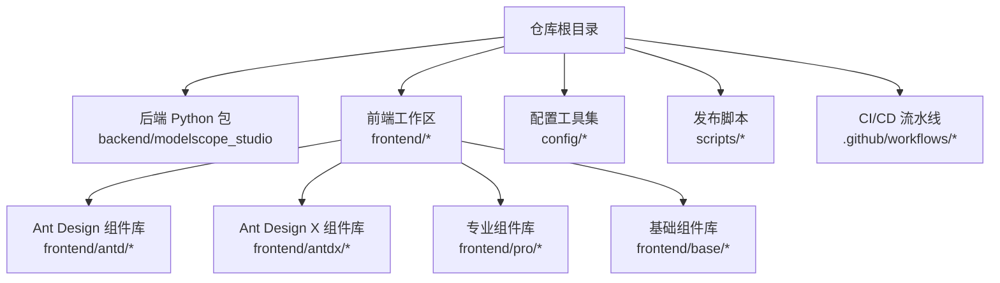
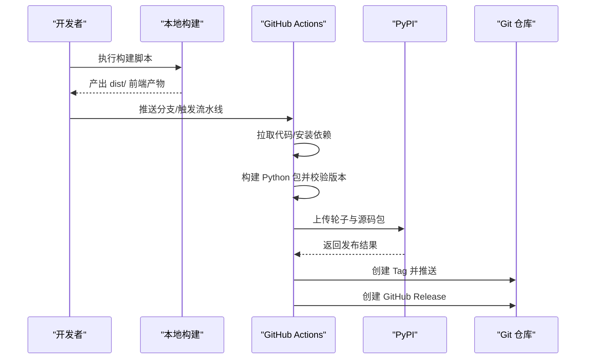
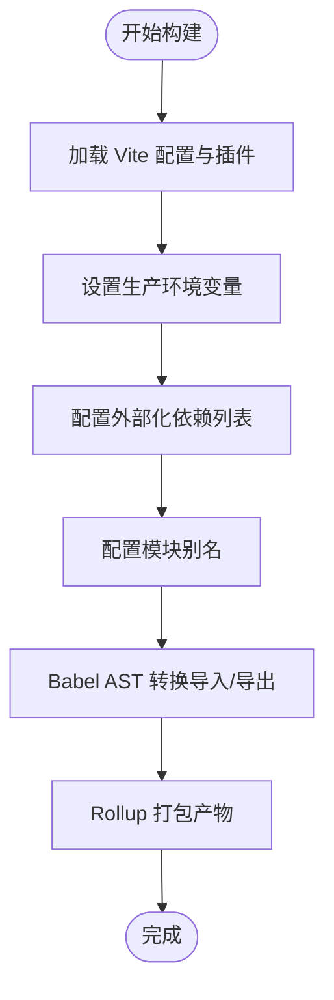
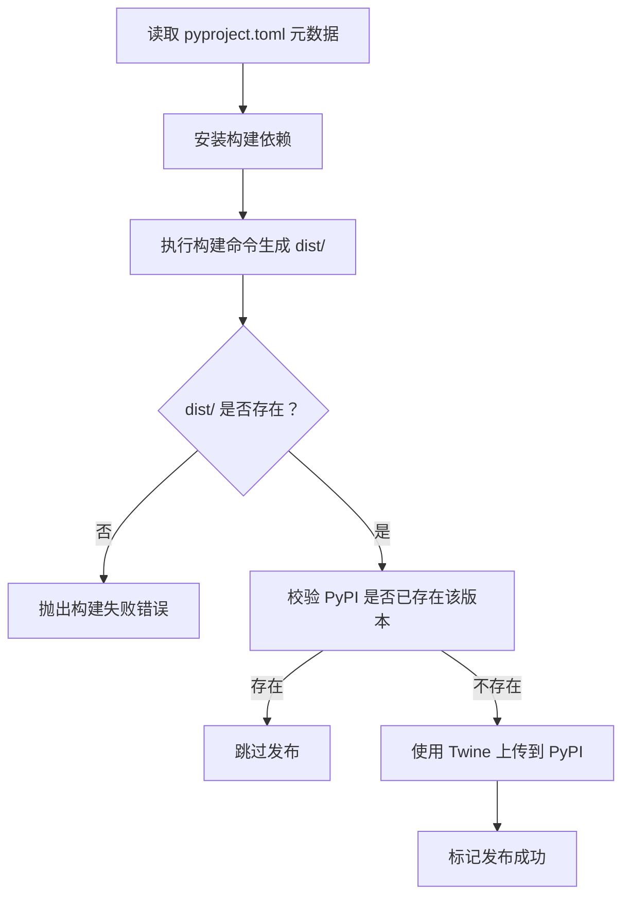
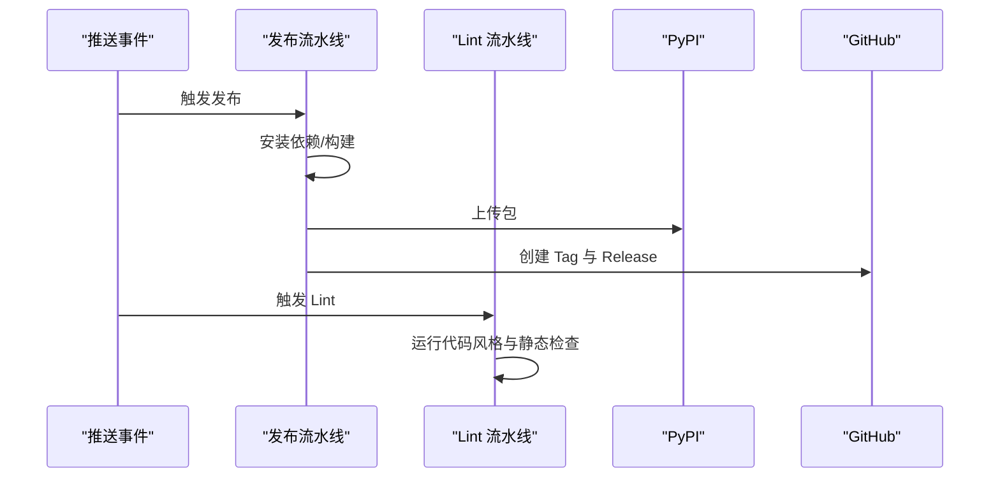
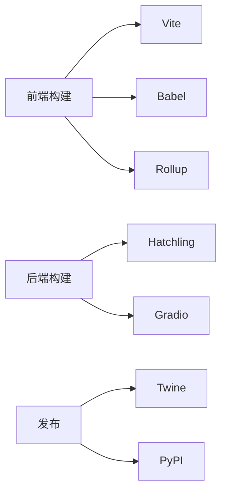

# 部署指南

<cite>
**本文引用的文件**
- [pyproject.toml](file://pyproject.toml)
- [package.json](file://package.json)
- [.github/workflows/publish.yaml](file://.github/workflows/publish.yaml)
- [.github/workflows/lint.yaml](file://.github/workflows/lint.yaml)
- [scripts/publish-to-pypi.mts](file://scripts/publish-to-pypi.mts)
- [scripts/create-tag-n-release.mts](file://scripts/create-tag-n-release.mts)
- [frontend/package.json](file://frontend/package.json)
- [frontend/defineConfig.js](file://frontend/defineConfig.js)
- [frontend/plugin.js](file://frontend/plugin.js)
- [pnpm-workspace.yaml](file://pnpm-workspace.yaml)
- [backend/modelscope_studio/version.py](file://backend/modelscope_studio/version.py)
- [README.md](file://README.md)
</cite>

## 目录

1. [简介](#简介)
2. [项目结构](#项目结构)
3. [核心组件](#核心组件)
4. [架构总览](#架构总览)
5. [详细组件分析](#详细组件分析)
6. [依赖分析](#依赖分析)
7. [性能考虑](#性能考虑)
8. [故障排除指南](#故障排除指南)
9. [结论](#结论)
10. [附录](#附录)

## 简介

本指南面向运维与开发者，系统化说明 ModelScope Studio 的构建流程、发布策略与部署实践，覆盖以下主题：

- 前端组件构建与打包策略
- Python 包构建与发布到 PyPI
- CI/CD 流水线配置与使用
- 不同部署环境（本地开发、生产、云平台）的配置方法
- 性能优化与监控建议
- 常见问题排查与解决方案

## 项目结构

该项目采用多包工作区组织方式，根目录通过 pnpm 工作区统一管理前端子包与配置模块，后端 Python 包位于 backend/modelscope_studio 目录中，并通过 pyproject.toml 定义构建与打包规则。

图表来源

- [pnpm-workspace.yaml](file://pnpm-workspace.yaml)
- [frontend/package.json](file://frontend/package.json)
- [pyproject.toml](file://pyproject.toml)

章节来源

- [pnpm-workspace.yaml](file://pnpm-workspace.yaml)
- [frontend/package.json](file://frontend/package.json)
- [pyproject.toml](file://pyproject.toml)

## 核心组件

- 构建与打包
  - 前端：基于 Vite 与自定义插件，实现 React/Svelte 混编与外部化策略，输出可被 Gradio 使用的组件资源。
  - 后端：使用 Hatchling 构建，通过工具链将模板与组件资源打包进 Python 包。
- 发布与版本管理
  - 使用 Changesets 进行版本与变更日志管理；CI 中执行构建、上传至 PyPI、创建 Git Tag 与 GitHub Release。
- 质量保障
  - Lint 流水线在 PR 与 Push 时运行，确保代码风格与静态检查一致。

章节来源

- [package.json](file://package.json)
- [frontend/defineConfig.js](file://frontend/defineConfig.js)
- [frontend/plugin.js](file://frontend/plugin.js)
- [pyproject.toml](file://pyproject.toml)
- [.github/workflows/lint.yaml](file://.github/workflows/lint.yaml)

## 架构总览

下图展示从本地到云端的完整部署路径：本地开发构建 → CI 触发 → PyPI 发布 → 生成 Tag 与 Release。

图表来源

- [.github/workflows/publish.yaml](file://.github/workflows/publish.yaml)
- [scripts/publish-to-pypi.mts](file://scripts/publish-to-pypi.mts)
- [scripts/create-tag-n-release.mts](file://scripts/create-tag-n-release.mts)

## 详细组件分析

### 前端构建与打包

- 构建入口与命令
  - 通过根 package.json 的构建脚本调用 Gradio 自定义组件 CLI 进行构建（使用 --no-generate-docs 参数禁用自动文档生成以加速构建）。
  - 完整命令：rimraf dist && gradio cc build --no-generate-docs
- Vite 插件与别名
  - 自定义 Vite 插件负责：
    - 在构建阶段设置环境变量为生产模式
    - 将指定依赖外部化，减少包体体积
    - 通过 Babel AST 转换导入/导出语句，将模块映射到全局对象，便于在浏览器环境中按需加载
  - 别名映射到工具与全局组件模块，提升开发体验与一致性。
- 外部化策略
  - 对 React、Ant Design 及其生态进行外部化处理，避免重复打包，降低体积并提升缓存命中率。

图表来源

- [frontend/defineConfig.js](file://frontend/defineConfig.js)
- [frontend/plugin.js](file://frontend/plugin.js)

章节来源

- [package.json](file://package.json)
- [frontend/defineConfig.js](file://frontend/defineConfig.js)
- [frontend/plugin.js](file://frontend/plugin.js)

### Python 包构建与发布

- 构建系统与元数据
  - 使用 Hatchling 作为构建后端，声明依赖与可选依赖，定义分类器与关键字。
- 资源打包
  - 通过工具链将大量组件模板与静态资源纳入打包范围，确保运行时可直接使用。
- 版本与元信息
  - 根 pyproject.toml 与后端版本文件保持一致，保证发布版本号统一。

图表来源

- [pyproject.toml](file://pyproject.toml)
- [scripts/publish-to-pypi.mts](file://scripts/publish-to-pypi.mts)

章节来源

- [pyproject.toml](file://pyproject.toml)
- [backend/modelscope_studio/version.py](file://backend/modelscope_studio/version.py)
- [scripts/publish-to-pypi.mts](file://scripts/publish-to-pypi.mts)

### CI/CD 流水线

- 发布流水线
  - 触发条件：推送到 main 或 next 分支
  - 步骤：安装 Python 与 Node.js、安装 pnpm、安装依赖、构建前端与后端、上传 PyPI、创建 Tag 与 Release
- Lint 流水线
  - 触发条件：Push 与 Pull Request
  - 步骤：安装 Python 与 Node.js、安装依赖、运行 Lint 任务

图表来源

- [.github/workflows/publish.yaml](file://.github/workflows/publish.yaml)
- [.github/workflows/lint.yaml](file://.github/workflows/lint.yaml)

章节来源

- [.github/workflows/publish.yaml](file://.github/workflows/publish.yaml)
- [.github/workflows/lint.yaml](file://.github/workflows/lint.yaml)

### 版本与变更日志管理

- Changesets
  - 使用 Changesets 进行版本推进与变更日志生成，配合脚本在 CI 中自动执行版本更新与修复。
- Tag 与 Release
  - 发布成功后，脚本根据根与各子包的变更日志生成统一 Release 内容，并创建 Git Tag 推送至远端。

章节来源

- [package.json](file://package.json)
- [scripts/create-tag-n-release.mts](file://scripts/create-tag-n-release.mts)

## 依赖分析

- 前端依赖
  - React 与 Svelte 生态、Ant Design 与 Ant Design X、Monaco Editor、Mermaid 等，构成组件库的核心能力。
- 构建工具
  - Vite、@vitejs/plugin-react-swc、Babel、Rollup（由 Vite 驱动）
- Python 依赖
  - Gradio 作为运行时框架，Hatchling 用于构建，Twine 用于上传

图表来源

- [frontend/package.json](file://frontend/package.json)
- [pyproject.toml](file://pyproject.toml)
- [scripts/publish-to-pypi.mts](file://scripts/publish-to-pypi.mts)

章节来源

- [frontend/package.json](file://frontend/package.json)
- [pyproject.toml](file://pyproject.toml)

## 性能考虑

- 前端体积优化
  - 外部化策略：将 React、Ant Design 等大依赖外部化，减少包体与重复打包。
  - AST 转换：通过插件在构建期将导入/导出转换为全局访问，避免运行时冗余逻辑。
  - 按需加载：结合 Gradio 加载机制，仅在需要时引入组件资源。
- 构建效率
  - 禁用文档生成的构建选项可显著缩短前端构建时间。
  - 使用 pnpm 工作区统一依赖，减少磁盘占用与安装时间。
- Python 包体积
  - 仅打包必要的模板与资源，避免不必要的文件进入分发包。

章节来源

- [frontend/plugin.js](file://frontend/plugin.js)
- [frontend/defineConfig.js](file://frontend/defineConfig.js)
- [package.json](file://package.json)
- [pyproject.toml](file://pyproject.toml)

## 故障排除指南

- 构建失败
  - 现象：dist/ 未生成或构建报错
  - 排查：确认前端构建脚本是否执行、Node.js 与 pnpm 版本是否满足要求、依赖安装是否成功
  - 参考：根 package.json 的构建脚本与前端 defineConfig 配置
- PyPI 上传失败
  - 现象：Twine 上传报错或版本已存在
  - 排查：检查 PYPI_TOKEN 是否正确配置、版本是否已在 PyPI 存在、网络连通性
  - 参考：发布脚本中的版本检查与上传逻辑
- CI 流水线中断
  - 现象：Lint 或发布步骤失败
  - 排查：查看对应工作流日志、确认环境变量与权限、核对触发条件
  - 参考：lint 与 publish 工作流配置
- 文档与示例
  - 参考：根 README 的安装与快速开始说明，确保本地开发环境与依赖版本一致

章节来源

- [package.json](file://package.json)
- [scripts/publish-to-pypi.mts](file://scripts/publish-to-pypi.mts)
- [.github/workflows/publish.yaml](file://.github/workflows/publish.yaml)
- [.github/workflows/lint.yaml](file://.github/workflows/lint.yaml)
- [README.md](file://README.md)

## 结论

本指南提供了从本地到云端的一体化部署方案：通过前端 Vite 插件与外部化策略优化体积，借助 Hatchling 与 Twine 实现 Python 包的稳定发布，配合 GitHub Actions 完成自动化流水线与版本管理。建议在生产与云平台部署时，结合外部化与缓存策略进一步优化加载性能，并在 CI 中持续运行 Lint 以保障质量。

## 附录

### 不同部署环境的配置方法

- 本地开发
  - 安装依赖：使用 pnpm 安装工作区依赖
  - 启动开发服务器：运行 Gradio 自定义组件开发命令
  - 参考：根 README 的开发说明与 package.json 脚本
- 生产环境
  - 构建产物：执行前端构建脚本生成 dist/，确保外部化依赖在运行时可用
  - Python 包：使用 Hatchling 构建，确保模板与资源被打包
- 云平台部署
  - 使用 CI 触发发布流水线，自动上传至 PyPI 并创建 Tag/Release
  - 在目标平台安装 Python 包并启动应用

章节来源

- [README.md](file://README.md)
- [package.json](file://package.json)
- [pyproject.toml](file://pyproject.toml)
- [.github/workflows/publish.yaml](file://.github/workflows/publish.yaml)
