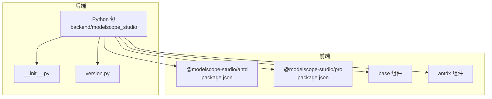
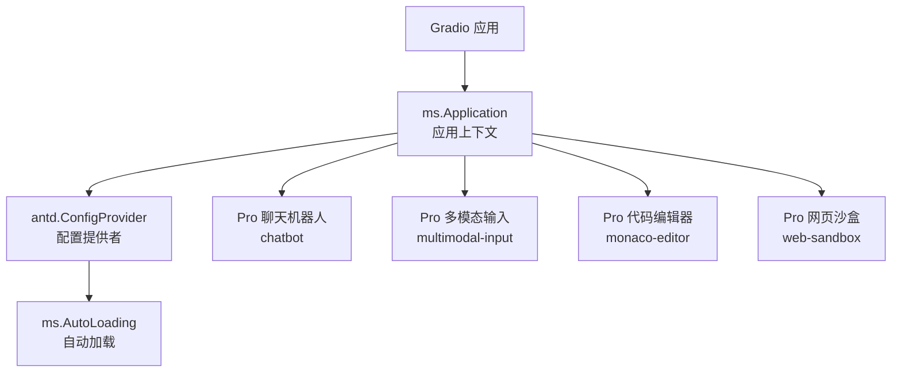
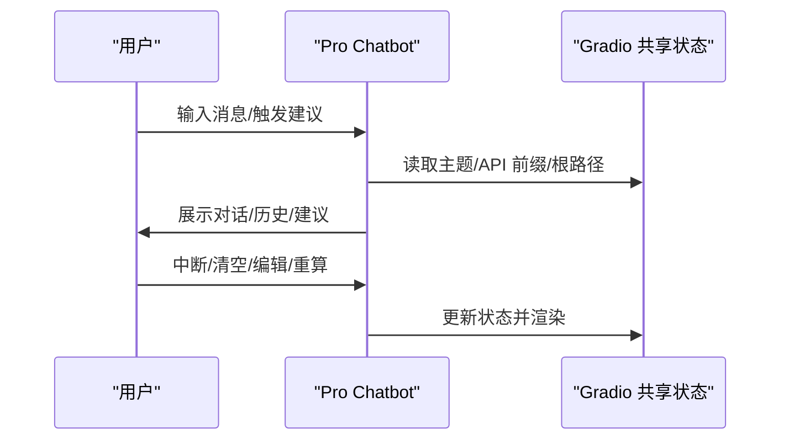
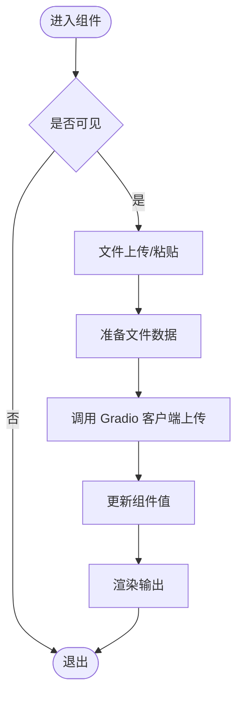
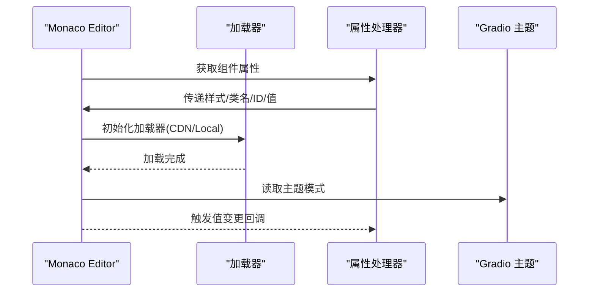
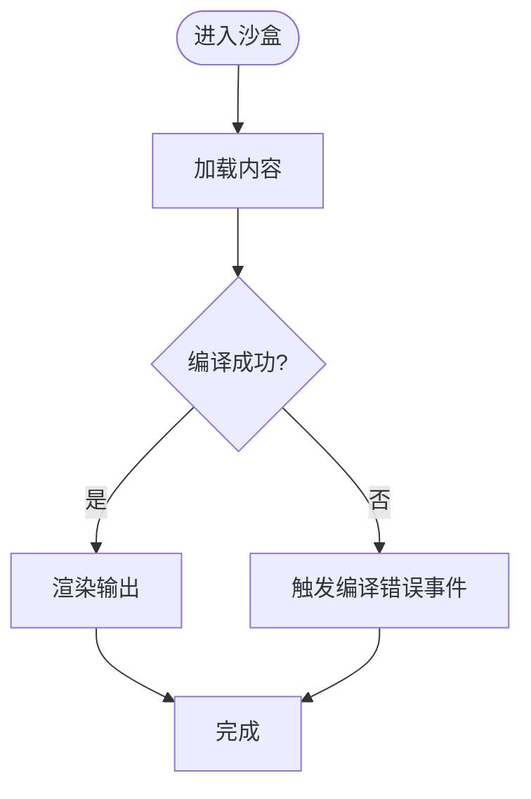
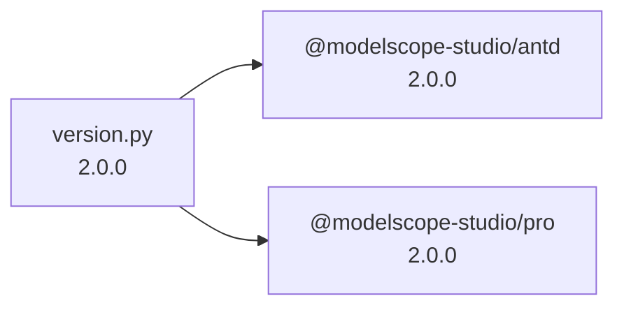

# 应用场景

<cite>
**本文引用的文件**
- [README-zh_CN.md](file://README-zh_CN.md)
- [README.md](file://README.md)
- [backend/modelscope_studio/__init__.py](file://backend/modelscope_studio/__init__.py)
- [backend/modelscope_studio/version.py](file://backend/modelscope_studio/version.py)
- [frontend/antd/package.json](file://frontend/antd/package.json)
- [frontend/pro/package.json](file://frontend/pro/package.json)
- [backend/modelscope_studio/components/antd/components.py](file://backend/modelscope_studio/components/antd/components.py)
- [backend/modelscope_studio/components/pro/components.py](file://backend/modelscope_studio/components/pro/components.py)
- [frontend/pro/chatbot/Index.svelte](file://frontend/pro/chatbot/Index.svelte)
- [frontend/pro/multimodal-input/Index.svelte](file://frontend/pro/multimodal-input/Index.svelte)
- [frontend/pro/web-sandbox/Index.svelte](file://frontend/pro/web-sandbox/Index.svelte)
- [frontend/pro/monaco-editor/Index.svelte](file://frontend/pro/monaco-editor/Index.svelte)
- [docs/layout_templates/chatbot/README-zh_CN.md](file://docs/layout_templates/chatbot/README-zh_CN.md)
- [docs/layout_templates/coder_artifacts/README-zh_CN.md](file://docs/layout_templates/coder_artifacts/README-zh_CN.md)
- [docs/demos/example.py](file://docs/demos/example.py)
- [docs/README-zh_CN.md](file://docs/README-zh_CN.md)
</cite>

## 目录

1. [简介](#简介)
2. [项目结构](#项目结构)
3. [核心组件](#核心组件)
4. [架构总览](#架构总览)
5. [详细组件分析](#详细组件分析)
6. [依赖关系分析](#依赖关系分析)
7. [性能考量](#性能考量)
8. [故障排查指南](#故障排查指南)
9. [结论](#结论)
10. [附录](#附录)

## 简介

ModelScope Studio 是一个基于 Gradio 的第三方组件库，为开发者提供更定制化的界面搭建能力与更丰富的组件使用形式。它支持 Ant Design 与 Ant Design X 两大 UI 生态，并提供了 Pro 场景化组件（如聊天机器人、多模态输入、代码编辑器、网页沙盒等），适合在机器学习与人工智能应用中快速构建专业级前端界面。

- 相比 Gradio 原生组件，ModelScope Studio 更强调页面布局与组件灵活性，适合追求视觉与交互体验的项目。
- 当应用需要在 Python 端进行大量内置数据处理时，可结合 Gradio 原生组件；ModelScope Studio 可作为优化层提升前端表现。
- 在 Hugging Face Space 中使用时，需在 demo.launch() 中设置 ssr_mode=False，以避免页面渲染异常。

章节来源

- [README-zh_CN.md:26-32](file://README-zh_CN.md#L26-L32)
- [README.md:26-32](file://README.md#L26-L32)

## 项目结构

该项目采用前后端分离与多包组织方式：

- 后端 Python 包：提供组件导出与版本信息，统一对外暴露组件集合。
- 前端 Svelte 包：按模块拆分为 antd、antdx、base、pro 等子包，分别对应 UI 组件、基础能力与 Pro 场景化组件。
- 文档与示例：包含组件文档、布局模板与演示脚本，便于开发者快速上手。

图表来源

- [backend/modelscope_studio/**init**.py:1-3](file://backend/modelscope_studio/__init__.py#L1-L3)
- [backend/modelscope_studio/version.py:1-2](file://backend/modelscope_studio/version.py#L1-L2)
- [frontend/antd/package.json:1-6](file://frontend/antd/package.json#L1-L6)
- [frontend/pro/package.json:1-6](file://frontend/pro/package.json#L1-L6)

章节来源

- [backend/modelscope_studio/**init**.py:1-3](file://backend/modelscope_studio/__init__.py#L1-L3)
- [backend/modelscope_studio/version.py:1-2](file://backend/modelscope_studio/version.py#L1-L2)
- [frontend/antd/package.json:1-6](file://frontend/antd/package.json#L1-L6)
- [frontend/pro/package.json:1-6](file://frontend/pro/package.json#L1-L6)

## 核心组件

- Ant Design 组件族：覆盖表单、布局、反馈、导航、数据录入、展示等全链路 UI 组件，满足常规业务界面需求。
- Pro 场景化组件：面向 AI/ML 应用的专用组件，包括聊天机器人、多模态输入、代码编辑器、网页沙盒等。
- 基础组件：提供应用上下文、自动加载、文本/段落/插槽等通用能力，支撑复杂布局与动态渲染。

章节来源

- [backend/modelscope_studio/components/antd/components.py:1-144](file://backend/modelscope_studio/components/antd/components.py#L1-L144)
- [backend/modelscope_studio/components/pro/components.py:1-8](file://backend/modelscope_studio/components/pro/components.py#L1-L8)
- [docs/README-zh_CN.md:14-26](file://docs/README-zh_CN.md#L14-L26)

## 架构总览

ModelScope Studio 的前端组件以 Svelte 实现，通过 @svelte-preprocess-react 将 React 组件桥接到 Svelte 上下文中，实现与 Gradio 的无缝对接。Pro 组件进一步封装了与 Gradio 共享状态（如主题、API 前缀、根路径）的逻辑，确保在不同部署环境下的稳定性。

图表来源

- [docs/demos/example.py:5-10](file://docs/demos/example.py#L5-L10)
- [frontend/pro/chatbot/Index.svelte:12-88](file://frontend/pro/chatbot/Index.svelte#L12-L88)
- [frontend/pro/multimodal-input/Index.svelte:13-96](file://frontend/pro/multimodal-input/Index.svelte#L13-L96)
- [frontend/pro/monaco-editor/Index.svelte:12-98](file://frontend/pro/monaco-editor/Index.svelte#L12-L98)
- [frontend/pro/web-sandbox/Index.svelte:12-74](file://frontend/pro/web-sandbox/Index.svelte#L12-L74)

## 详细组件分析

### 聊天机器人（Pro Chatbot）

- 适用场景：AI 聊天机器人界面、多轮对话管理、对话历史编辑/重算/删除、中断提示、输入建议、附件上传等。
- 关键特性：支持多会话并发、历史记录细粒度控制、输入建议触发、附件上传限制与格式控制。
- 使用建议：结合 Gradio 的共享状态与主题配置，确保在不同部署环境下一致的外观与行为。

图表来源

- [frontend/pro/chatbot/Index.svelte:67-88](file://frontend/pro/chatbot/Index.svelte#L67-L88)
- [docs/layout_templates/chatbot/README-zh_CN.md:7-11](file://docs/layout_templates/chatbot/README-zh_CN.md#L7-L11)

章节来源

- [frontend/pro/chatbot/Index.svelte:12-88](file://frontend/pro/chatbot/Index.svelte#L12-L88)
- [docs/layout_templates/chatbot/README-zh_CN.md:1-20](file://docs/layout_templates/chatbot/README-zh_CN.md#L1-L20)

### 多模态输入（Pro Multimodal Input）

- 适用场景：AI 应用中需要同时输入文本与多媒体（图片/文件）的界面，如图像描述、文档问答、代码生成等。
- 关键特性：支持文件上传、粘贴上传、值变更回调、与 Gradio 客户端集成。
- 使用建议：合理设置上传数量与格式限制，结合后端处理流程保证安全性与性能。

图表来源

- [frontend/pro/multimodal-input/Index.svelte:68-96](file://frontend/pro/multimodal-input/Index.svelte#L68-L96)

章节来源

- [frontend/pro/multimodal-input/Index.svelte:13-96](file://frontend/pro/multimodal-input/Index.svelte#L13-L96)

### 代码编辑器（Pro Monaco Editor）

- 适用场景：AI 助手/代码生成工具、在线 IDE 预览、代码对比与差异编辑。
- 关键特性：支持 CDN/本地加载器模式、主题适配、值变更回调、插槽扩展。
- 使用建议：根据部署环境选择合适的加载器模式，避免跨域与资源加载问题。

图表来源

- [frontend/pro/monaco-editor/Index.svelte:61-89](file://frontend/pro/monaco-editor/Index.svelte#L61-L89)

章节来源

- [frontend/pro/monaco-editor/Index.svelte:12-98](file://frontend/pro/monaco-editor/Index.svelte#L12-L98)

### 网页沙盒（Pro Web Sandbox）

- 适用场景：在线预览/调试 HTML/CSS/JS 片段，适合 AI 辅助开发与教学演示。
- 关键特性：编译错误/成功事件、渲染错误事件、主题模式适配、插槽扩展。
- 使用建议：严格控制沙盒内容与权限，避免执行不受信任代码。

图表来源

- [frontend/pro/web-sandbox/Index.svelte:60-74](file://frontend/pro/web-sandbox/Index.svelte#L60-L74)

章节来源

- [frontend/pro/web-sandbox/Index.svelte:12-74](file://frontend/pro/web-sandbox/Index.svelte#L12-L74)

### Ant Design 组件族

- 适用场景：通用业务界面构建，如表单填写、列表展示、分页导航、通知提醒等。
- 关键特性：覆盖 UI 设计体系的完整组件矩阵，支持国际化与主题切换。
- 使用建议：结合 ConfigProvider 进行全局配置，配合 AutoLoading 提升首屏体验。

章节来源

- [backend/modelscope_studio/components/antd/components.py:1-144](file://backend/modelscope_studio/components/antd/components.py#L1-L144)
- [docs/demos/example.py:5-10](file://docs/demos/example.py#L5-L10)

## 依赖关系分析

- 版本与命名：前端包 @modelscope-studio/antd 与 @modelscope-studio/pro 均标注为 2.0.0，后端包 version.py 亦指向相同语义版本，确保前后端一致性。
- 与 Gradio 的集成：组件通过 Gradio 共享状态（root、api_prefix、theme）进行渲染与交互，确保在不同部署环境（含 Hugging Face Space）下的一致性。
- 部署注意事项：在 Hugging Face Space 中使用时，需在 demo.launch() 设置 ssr_mode=False，避免 SSR 导致的页面渲染问题。

图表来源

- [backend/modelscope_studio/version.py:1-2](file://backend/modelscope_studio/version.py#L1-L2)
- [frontend/antd/package.json:1-6](file://frontend/antd/package.json#L1-L6)
- [frontend/pro/package.json:1-6](file://frontend/pro/package.json#L1-L6)

章节来源

- [backend/modelscope_studio/version.py:1-2](file://backend/modelscope_studio/version.py#L1-L2)
- [frontend/antd/package.json:1-6](file://frontend/antd/package.json#L1-L6)
- [frontend/pro/package.json:1-6](file://frontend/pro/package.json#L1-L6)
- [README-zh_CN.md:32](file://README-zh_CN.md#L32)
- [README.md:32](file://README.md#L32)

## 性能考量

- 按需加载与懒加载：Pro 组件普遍采用 importComponent 与 import 动态导入，减少初始包体与首屏阻塞。
- 主题与资源：Monaco Editor 支持 CDN/本地加载器，可根据网络与安全策略选择，避免不必要的资源下载。
- 文件上传：多模态输入组件通过 Gradio 客户端上传文件，建议在前端限制文件大小与类型，降低后端压力。
- SSR 注意：在 Hugging Face Space 中禁用 SSR，避免服务端渲染导致的兼容性问题。

章节来源

- [frontend/pro/monaco-editor/Index.svelte:61-70](file://frontend/pro/monaco-editor/Index.svelte#L61-L70)
- [frontend/pro/multimodal-input/Index.svelte:68-75](file://frontend/pro/multimodal-input/Index.svelte#L68-L75)
- [README-zh_CN.md:32](file://README-zh_CN.md#L32)
- [README.md:32](file://README.md#L32)

## 故障排查指南

- 页面不显示或渲染异常：在 demo.launch() 中添加 ssr_mode=False，尤其在 Hugging Face Space 环境。
- 组件不可见：检查组件的 visible 属性与父容器布局，确认 ms.Application 包裹层级正确。
- 编辑器加载失败：确认 \_loader 配置（cdn/local）与 cdn_url 是否有效，避免跨域与资源路径问题。
- 上传失败：检查文件类型与数量限制，确认 Gradio 客户端上传接口可用。

章节来源

- [README-zh_CN.md:32](file://README-zh_CN.md#L32)
- [README.md:32](file://README.md#L32)
- [frontend/pro/monaco-editor/Index.svelte:61-70](file://frontend/pro/monaco-editor/Index.svelte#L61-L70)
- [frontend/pro/multimodal-input/Index.svelte:68-75](file://frontend/pro/multimodal-input/Index.svelte#L68-L75)

## 结论

ModelScope Studio 通过 Ant Design 与 Pro 场景化组件，为机器学习与人工智能应用提供了高可定制、高性能的前端界面解决方案。它在以下方面具备显著优势：

- 与 Gradio 深度集成，简化 AI 应用的前端开发流程。
- 提供聊天机器人、多模态输入、代码编辑器、网页沙盒等面向 AI 的专用组件，覆盖常见业务场景。
- 支持灵活的主题与国际化配置，适配多种部署环境。

何时选择：

- 需要构建美观、交互丰富的 AI 应用界面。
- 需要多模态输入、对话管理、代码编辑与在线预览等场景化能力。
- 对部署环境有差异化要求（如 Hugging Face Space），需要 SSR 控制。

何时不适合：

- 应用需要在 Python 端进行大量内置数据处理与计算，优先使用 Gradio 原生组件。
- 对前端性能与资源占用极为敏感，且无需复杂 UI 与交互。

## 附录

- 快速开始示例：在 Blocks 中使用 ms.Application、antd.ConfigProvider 与 ms.AutoLoading 包裹组件，然后启动 demo。
- 布局模板：聊天机器人与代码产物（Coder Artifacts）模板提供了开箱即用的场景化界面。

章节来源

- [docs/demos/example.py:5-10](file://docs/demos/example.py#L5-L10)
- [docs/layout_templates/chatbot/README-zh_CN.md:1-20](file://docs/layout_templates/chatbot/README-zh_CN.md#L1-L20)
- [docs/layout_templates/coder_artifacts/README-zh_CN.md:1-8](file://docs/layout_templates/coder_artifacts/README-zh_CN.md#L1-L8)
