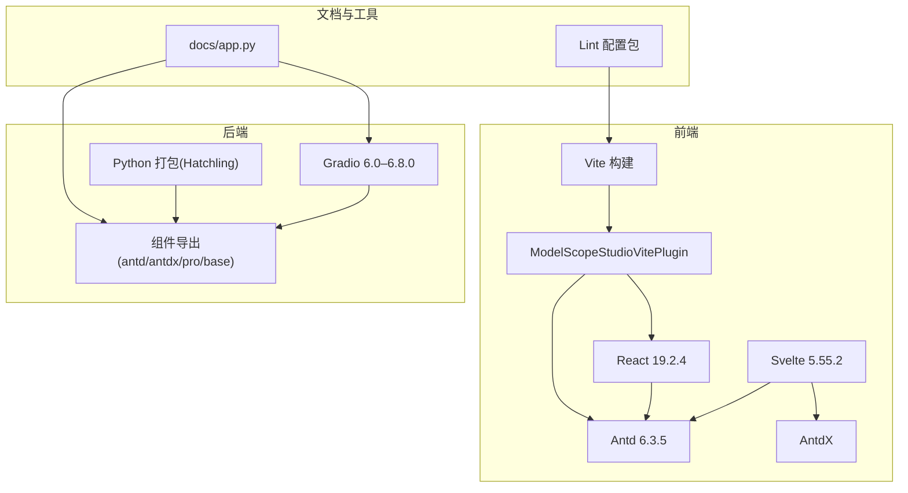
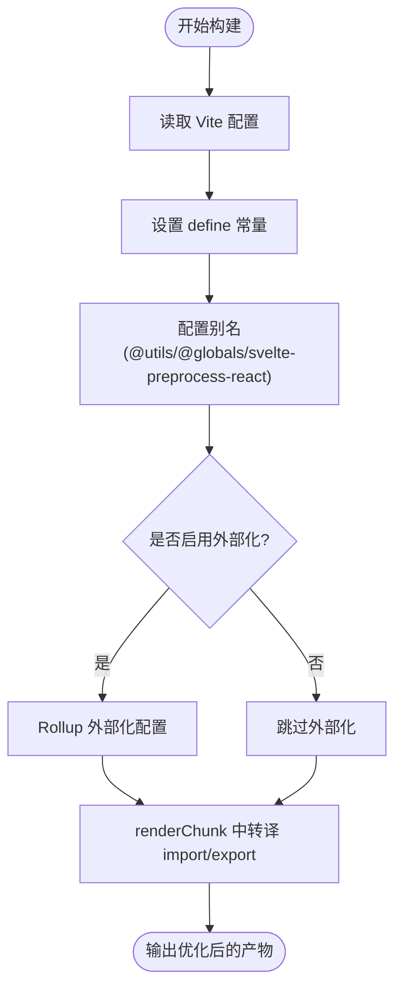
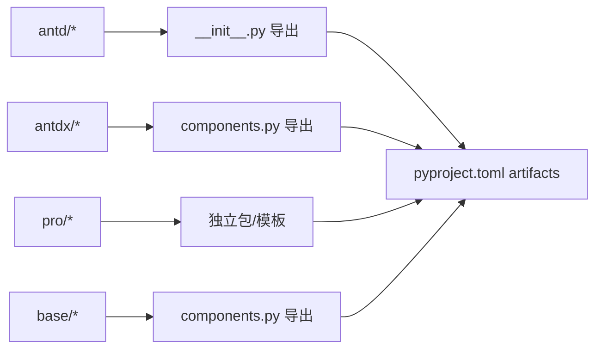
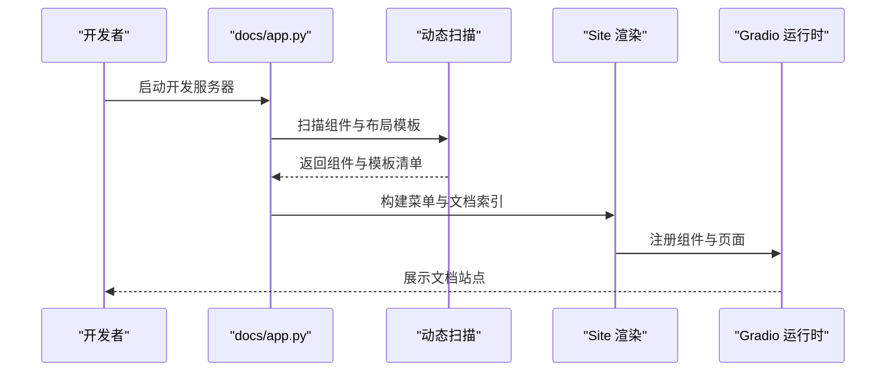
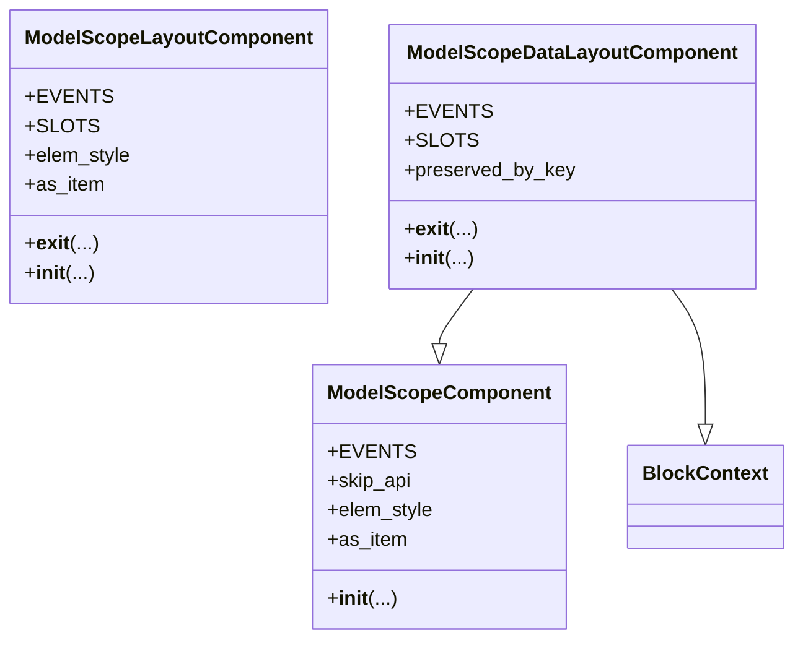
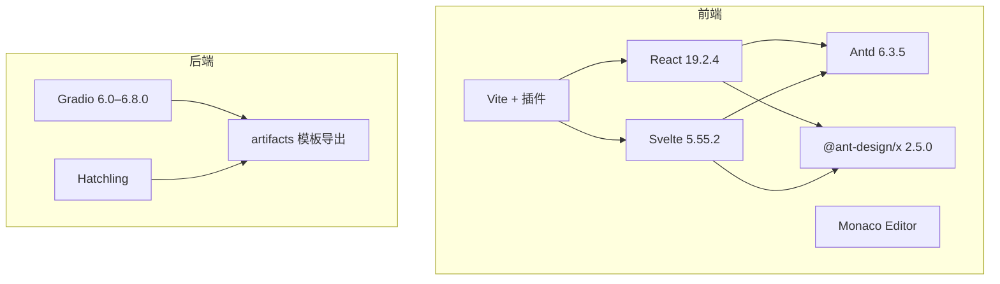

# 技术栈

<cite>
**本文引用的文件**
- [package.json](file://package.json)
- [pyproject.toml](file://pyproject.toml)
- [pnpm-workspace.yaml](file://pnpm-workspace.yaml)
- [frontend/package.json](file://frontend/package.json)
- [frontend/defineConfig.js](file://frontend/defineConfig.js)
- [frontend/plugin.js](file://frontend/plugin.js)
- [frontend/tsconfig.json](file://frontend/tsconfig.json)
- [svelte-tsconfig.json](file://svelte-tsconfig.json)
- [docs/app.py](file://docs/app.py)
- [backend/modelscope_studio/version.py](file://backend/modelscope_studio/version.py)
- [backend/modelscope_studio/components/antd/__init__.py](file://backend/modelscope_studio/components/antd/__init__.py)
- [backend/modelscope_studio/components/antd/components.py](file://backend/modelscope_studio/components/antd/components.py)
- [backend/modelscope_studio/components/antdx/components.py](file://backend/modelscope_studio/components/antdx/components.py)
- [backend/modelscope_studio/utils/dev/component.py](file://backend/modelscope_studio/utils/dev/component.py)
- [config/lint-config/package.json](file://config/lint-config/package.json)
</cite>

## 目录

1. [简介](#简介)
2. [项目结构](#项目结构)
3. [核心组件](#核心组件)
4. [架构总览](#架构总览)
5. [详细组件分析](#详细组件分析)
6. [依赖关系分析](#依赖关系分析)
7. [性能考量](#性能考量)
8. [故障排查指南](#故障排查指南)
9. [结论](#结论)
10. [附录](#附录)

## 简介

本文件面向 ModelScope Studio 项目的开发者与维护者，系统梳理并解释项目的技术栈与架构设计，重点覆盖：

- Python 后端技术栈：Gradio 6.0–6.8.0、组件库组织与打包策略
- 前端技术栈：Svelte 5.55.2、Ant Design 6.3.5、Ant Design X、React 19.2.4、Vite 构建与插件体系
- Monorepo 架构：工作区划分、包管理与构建流程
- 开发工具链：ESLint、Stylelint、Prettier、TypeScript、Svelte 检查
- 测试与发布：变更集版本管理、PyPI 发布脚本
- 最佳实践：组件化架构、插件系统、构建优化与错误处理

## 项目结构

ModelScope Studio 采用 Monorepo 架构，根目录通过 pnpm 工作区统一管理多个子包与配置模块。前端以 Svelte 为核心，结合 React 生态与 Ant Design/Ant Design X 组件体系；后端基于 Gradio 的自定义组件机制，提供丰富的 UI 组件与高级能力。

```mermaid
graph TB
Root["仓库根目录"] --> Frontend["前端包<br/>frontend/"]
Root --> Backend["Python 包<br/>backend/modelscope_studio/"]
Root --> Config["配置与工具链<br/>config/"]
Root --> Docs["文档站点<br/>docs/"]
Root --> Scripts["脚本与发布<br/>scripts/"]
Frontend --> Antd["Antd 组件集合<br/>frontend/antd/"]
Frontend --> Antdx["AntdX 组件集合<br/>frontend/antdx/"]
Frontend --> Pro["Pro 高级组件<br/>frontend/pro/"]
Frontend --> Base["基础组件<br/>frontend/base/"]
Frontend --> Utils["工具与别名<br/>frontend/utils/"]
Frontend --> Plugin["Vite 插件<br/>frontend/plugin.js"]
Frontend --> Define["Vite 配置工厂<br/>frontend/defineConfig.js"]
Backend --> PyPkg["Python 打包配置<br/>pyproject.toml"]
Backend --> Version["版本号<br/>backend/modelscope_studio/version.py"]
Backend --> Components["组件导出入口<br/>backend/modelscope_studio/components/antd/__init__.py"]
Backend --> DevUtil["开发工具与上下文<br/>backend/modelscope_studio/utils/dev/component.py"]
Docs --> AppPy["文档应用入口<br/>docs/app.py"]
Config --> Lint["Lint 配置包<br/>config/lint-config/package.json"]
```

图表来源

- [pnpm-workspace.yaml:1-12](file://pnpm-workspace.yaml#L1-L12)
- [frontend/package.json:1-59](file://frontend/package.json#L1-L59)
- [pyproject.toml:1-257](file://pyproject.toml#L1-L257)
- [docs/app.py:1-595](file://docs/app.py#L1-L595)

章节来源

- [pnpm-workspace.yaml:1-12](file://pnpm-workspace.yaml#L1-L12)
- [frontend/package.json:1-59](file://frontend/package.json#L1-L59)
- [pyproject.toml:1-257](file://pyproject.toml#L1-L257)
- [docs/app.py:1-595](file://docs/app.py#L1-L595)

## 核心组件

- Python 后端
  - Gradio 6.0–6.8.0：作为组件运行时与页面渲染的基础框架，负责组件生命周期、事件与状态管理。
  - 组件组织：按功能域拆分至 antd、antdx、pro、base 四大命名空间，便于按需引入与文档生成。
  - 打包与分发：使用 Hatchling 构建，artifacts 明确导出各组件模板资源，wheel 仅包含 backend 包路径。
- 前端
  - Svelte 5.55.2：组件编译与运行时，具备更小体积与更快的热更新体验。
  - Ant Design 6.3.5 与 Ant Design X：前者提供通用 UI 能力，后者聚焦对话与协作场景。
  - React 19.2.4：通过 Vite 插件桥接 React 生态，实现与 Svelte 的混编与共享全局对象。
  - Vite 构建：通过自定义插件进行外部化与别名映射，减少产物体积并提升加载效率。
- 文档与站点
  - docs/app.py：动态扫描组件与布局模板，生成多标签页文档站点，支持中英文切换与主题化。

章节来源

- [backend/modelscope_studio/components/antd/**init**.py:1-150](file://backend/modelscope_studio/components/antd/__init__.py#L1-L150)
- [backend/modelscope_studio/components/antd/components.py:1-144](file://backend/modelscope_studio/components/antd/components.py#L1-L144)
- [backend/modelscope_studio/components/antdx/components.py:1-40](file://backend/modelscope_studio/components/antdx/components.py#L1-L40)
- [pyproject.toml:45-257](file://pyproject.toml#L45-L257)
- [docs/app.py:1-595](file://docs/app.py#L1-L595)

## 架构总览

整体架构由“前端组件层 + 后端组件层 + 文档与工具链”构成。前端通过 Vite 插件将 React/AntD 等依赖外部化到宿主全局，Svelte 组件在浏览器侧直接消费；后端通过 Gradio 将 Python 组件注册为可复用模块，并在文档站点中统一渲染与演示。

图表来源

- [frontend/plugin.js:1-168](file://frontend/plugin.js#L1-L168)
- [frontend/package.json:1-59](file://frontend/package.json#L1-L59)
- [pyproject.toml:1-257](file://pyproject.toml#L1-L257)
- [docs/app.py:1-595](file://docs/app.py#L1-L595)
- [config/lint-config/package.json:1-48](file://config/lint-config/package.json#L1-L48)

## 详细组件分析

### 前端 Vite 插件与构建优化

该插件负责：

- 将 React、Ant Design、AntdX、dayjs、monaco-loader 等依赖外部化为 window.ms_globals.\*，避免重复打包
- 在构建阶段设置 define 常量，确保生产环境行为一致
- 通过别名映射 @utils、@globals、svelte-preprocess-react，简化导入路径
- 在 renderChunk 阶段对 import/export 声明进行转换，将模块引用重写为全局访问，减少运行时开销

图表来源

- [frontend/defineConfig.js:1-19](file://frontend/defineConfig.js#L1-L19)
- [frontend/plugin.js:41-168](file://frontend/plugin.js#L41-L168)

章节来源

- [frontend/defineConfig.js:1-19](file://frontend/defineConfig.js#L1-L19)
- [frontend/plugin.js:1-168](file://frontend/plugin.js#L1-L168)

### 组件导出与命名空间

- antd：覆盖 Ant Design 官方组件体系，按模块化拆分，提供完整类型与模板资源
- antdx：面向对话与协作场景的扩展组件集合，如 Bubble、Conversations、Sender 等
- pro：高级业务组件，如 Chatbot、Monaco Editor、Web Sandbox
- base：基础渲染与布局组件，如 Application、AutoLoading、Slot、Fragment、Each、Filter、Markdown 等

图表来源

- [backend/modelscope_studio/components/antd/**init**.py:1-150](file://backend/modelscope_studio/components/antd/__init__.py#L1-L150)
- [backend/modelscope_studio/components/antd/components.py:1-144](file://backend/modelscope_studio/components/antd/components.py#L1-L144)
- [backend/modelscope_studio/components/antdx/components.py:1-40](file://backend/modelscope_studio/components/antdx/components.py#L1-L40)
- [pyproject.toml:45-257](file://pyproject.toml#L45-L257)

章节来源

- [backend/modelscope_studio/components/antd/**init**.py:1-150](file://backend/modelscope_studio/components/antd/__init__.py#L1-L150)
- [backend/modelscope_studio/components/antd/components.py:1-144](file://backend/modelscope_studio/components/antd/components.py#L1-L144)
- [backend/modelscope_studio/components/antdx/components.py:1-40](file://backend/modelscope_studio/components/antdx/components.py#L1-L40)
- [pyproject.toml:45-257](file://pyproject.toml#L45-L257)

### 文档站点与动态路由

docs/app.py 动态扫描组件与布局模板，构建多标签页文档站点：

- 支持中英文文案切换
- 为每个组件生成菜单与文档索引
- 通过 Site 渲染统一入口，queue 与并发参数调优

图表来源

- [docs/app.py:1-595](file://docs/app.py#L1-L595)

章节来源

- [docs/app.py:1-595](file://docs/app.py#L1-L595)

### 组件基类与上下文

后端提供了三类组件基类，用于统一生命周期、插槽与渲染控制：

- ModelScopeComponent：标准组件基类，支持事件、可见性、样式等属性
- ModelScopeLayoutComponent：布局组件基类，支持 BlockContext 与内部布局标记
- ModelScopeDataLayoutComponent：数据与布局混合组件，继承组件与上下文能力

图表来源

- [backend/modelscope_studio/utils/dev/component.py:11-169](file://backend/modelscope_studio/utils/dev/component.py#L11-L169)

章节来源

- [backend/modelscope_studio/utils/dev/component.py:11-169](file://backend/modelscope_studio/utils/dev/component.py#L11-L169)

## 依赖关系分析

- 前端依赖
  - React 与 Ant Design：通过 Vite 插件外部化，减少打包体积
  - Svelte 5.55.2：作为核心编译器与运行时
  - Ant Design X：提供对话与协作相关组件生态
  - Monaco Editor 与 React 生态：用于代码编辑与高亮
- 后端依赖
  - Gradio 6.0–6.8.0：组件运行时与页面渲染
  - 打包工具：Hatchling、Hatch-requirements-txt、Fancy-PyPI-Readme
  - artifacts 明确导出各组件模板，wheel 仅包含 backend 路径
- 工具链
  - ESLint、Stylelint、Prettier、TypeScript、Svelte 检查
  - Changesets 用于版本管理与变更记录

图表来源

- [frontend/package.json:8-40](file://frontend/package.json#L8-L40)
- [pyproject.toml:45-257](file://pyproject.toml#L45-L257)
- [frontend/plugin.js:5-20](file://frontend/plugin.js#L5-L20)

章节来源

- [frontend/package.json:1-59](file://frontend/package.json#L1-L59)
- [pyproject.toml:1-257](file://pyproject.toml#L1-L257)
- [frontend/plugin.js:1-168](file://frontend/plugin.js#L1-L168)

## 性能考量

- 外部化策略：通过 Vite 插件将 React、Antd、AntdX 等依赖外部化，显著降低前端包体与首屏加载时间
- 构建目标：ESNext 模块化目标，配合现代浏览器特性，减少转译成本
- 组件模板：后端通过 artifacts 精准导出模板资源，避免冗余文件进入 wheel
- 并发与队列：文档站点启动时设置 queue 与并发上限，保障演示稳定性

章节来源

- [frontend/plugin.js:41-76](file://frontend/plugin.js#L41-L76)
- [frontend/tsconfig.json:1-8](file://frontend/tsconfig.json#L1-L8)
- [pyproject.toml:45-257](file://pyproject.toml#L45-L257)
- [docs/app.py:592-595](file://docs/app.py#L592-L595)

## 故障排查指南

- 构建失败或外部化异常
  - 检查 Vite 插件是否正确配置 external 与 alias
  - 确认全局变量 window.ms_globals 是否暴露所需模块
- 组件未显示或样式缺失
  - 核对 artifacts 路径与模板导出是否匹配
  - 确保 Gradio 版本在 6.0–6.8.0 范围内
- 文档站点无法启动
  - 查看 docs/app.py 的扫描逻辑与菜单构建
  - 确认组件 app.py 是否存在且包含 docs 字段
- Lint 或格式化报错
  - 使用统一的 lint 配置包，确保规则一致
  - 优先执行格式化与类型检查，再进行 ESLint/Stylelint

章节来源

- [frontend/plugin.js:41-76](file://frontend/plugin.js#L41-L76)
- [pyproject.toml:45-257](file://pyproject.toml#L45-L257)
- [docs/app.py:19-61](file://docs/app.py#L19-L61)
- [config/lint-config/package.json:1-48](file://config/lint-config/package.json#L1-L48)

## 结论

ModelScope Studio 以 Monorepo 为骨架，前端以 Svelte 与 React 双引擎协同，后端以 Gradio 为基础，形成“组件即服务”的可复用生态。通过 Vite 插件的外部化与别名映射、artifacts 精准导出、以及统一的 Lint/格式化工具链，项目在可维护性、性能与开发体验上取得平衡。建议在后续迭代中持续完善组件文档与自动化测试，进一步提升交付质量与团队协作效率。

## 附录

- 版本号与元信息
  - 仓库版本：2.0.0
  - Python 包版本：与仓库版本保持一致
- 关键配置参考
  - 前端工作区与依赖：[frontend/package.json:1-59](file://frontend/package.json#L1-L59)
  - Python 打包与导出：[pyproject.toml:45-257](file://pyproject.toml#L45-L257)
  - 工作区声明：[pnpm-workspace.yaml:1-12](file://pnpm-workspace.yaml#L1-L12)
  - TypeScript 与 Svelte 配置：[frontend/tsconfig.json:1-8](file://frontend/tsconfig.json#L1-L8)、[svelte-tsconfig.json:1-4](file://svelte-tsconfig.json#L1-L4)
  - 文档站点入口：[docs/app.py:1-595](file://docs/app.py#L1-L595)
  - Lint 配置包：[config/lint-config/package.json:1-48](file://config/lint-config/package.json#L1-L48)
