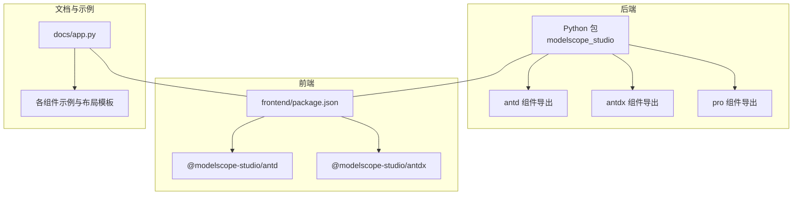
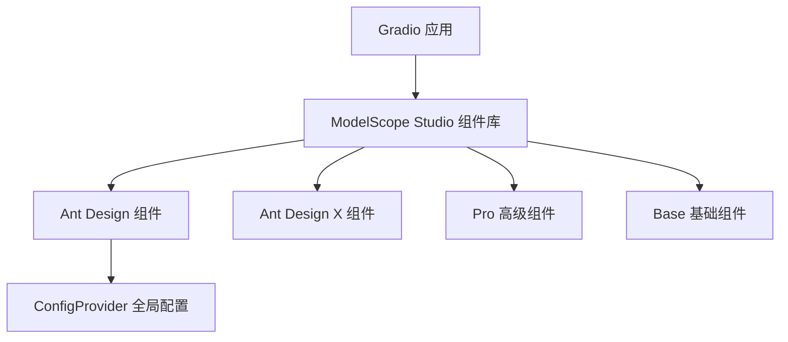
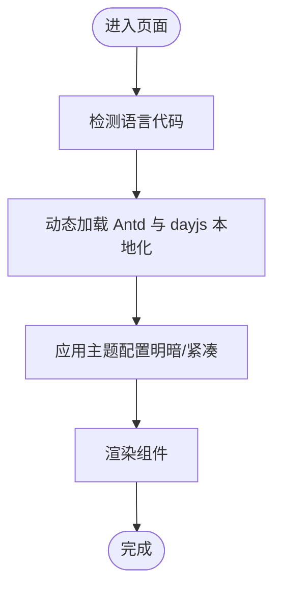
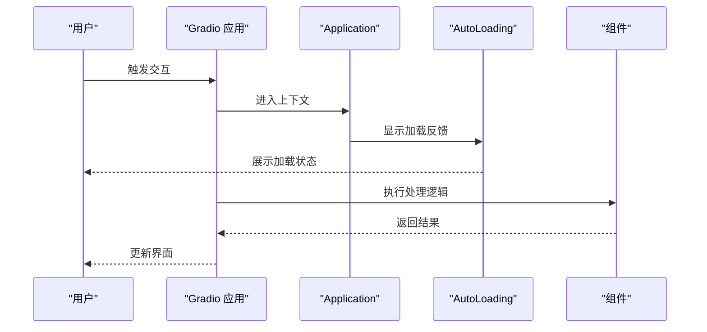
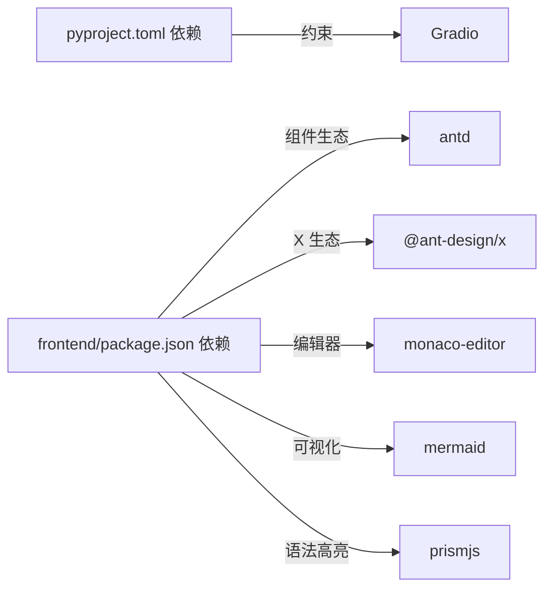

# 核心特性

<cite>
**本文引用的文件**
- [backend/modelscope_studio/__init__.py](file://backend/modelscope_studio/__init__.py)
- [backend/modelscope_studio/version.py](file://backend/modelscope_studio/version.py)
- [backend/modelscope_studio/components/__init__.py](file://backend/modelscope_studio/components/__init__.py)
- [backend/modelscope_studio/components/antd/components.py](file://backend/modelscope_studio/components/antd/components.py)
- [backend/modelscope_studio/components/antdx/components.py](file://backend/modelscope_studio/components/antdx/components.py)
- [backend/modelscope_studio/components/pro/components.py](file://backend/modelscope_studio/components/pro/components.py)
- [frontend/package.json](file://frontend/package.json)
- [frontend/antd/package.json](file://frontend/antd/package.json)
- [frontend/antdx/package.json](file://frontend/antdx/package.json)
- [pyproject.toml](file://pyproject.toml)
- [docs/README.md](file://docs/README.md)
- [docs/FAQ.md](file://docs/FAQ.md)
- [docs/app.py](file://docs/app.py)
- [frontend/antd/config-provider/locales.ts](file://frontend/antd/config-provider/locales.ts)
- [docs/components/antd/config_provider/demos/basic.py](file://docs/components/antd/config_provider/demos/basic.py)
- [docs/components/base/application/demos/theme_adaptation.py](file://docs/components/base/application/demos/theme_adaptation.py)
- [docs/components/pro/web_sandbox/demos/react.py](file://docs/components/pro/web_sandbox/demos/react.py)
</cite>

## 目录

1. [简介](#简介)
2. [项目结构](#项目结构)
3. [核心组件](#核心组件)
4. [架构总览](#架构总览)
5. [详细组件分析](#详细组件分析)
6. [依赖分析](#依赖分析)
7. [性能考虑](#性能考虑)
8. [故障排查指南](#故障排查指南)
9. [结论](#结论)
10. [附录](#附录)

## 简介

ModelScope Studio 是一个基于 Gradio 的第三方组件库，旨在为开发者提供更丰富的 UI 组件与更强的页面布局能力。它在保持与原生 Gradio 组件良好兼容的同时，引入了 Ant Design（Antd）与 Ant Design X（Antdx）两大 UI 生态，并扩展出 Pro 高级组件族，覆盖从通用交互到 AI 场景的多种需求。其核心特性包括：

- 支持的 UI 库：Ant Design、Ant Design X
- 组件数量统计：Antd 组件族包含大量常用 UI 组件；Antdx 专注于对话与提示场景；Pro 组件提供聊天机器人、多模态输入、代码编辑器与网页沙盒等高级能力
- Gradio 集成能力：与 Gradio 事件系统、状态管理、队列与并发控制无缝衔接
- 优势对比：相较原生 Gradio 组件，ModelScope Studio 更注重页面布局优化与组件灵活性，适合构建更美观、可维护的用户界面
- 开发场景：机器学习应用、AI 交互界面、多模态体验、可视化与演示空间
- 国际化与主题：内置多语言映射与主题定制能力，支持明暗模式与紧凑算法
- 性能优化：通过前端组件按需打包与模板缓存、Gradio 队列并发配置等手段提升响应速度

## 项目结构

该项目采用前后端分离与多包组织方式：

- 后端 Python 包：提供组件导出与打包元数据
- 前端 Svelte 包：按模块拆分 Antd/Antdx/Base/Pro，每个组件以独立目录与模板形式存在
- 文档与示例：通过 docs 应用聚合各组件示例与布局模板

图表来源

- [backend/modelscope_studio/components/**init**.py:1-5](file://backend/modelscope_studio/components/__init__.py#L1-L5)
- [frontend/package.json:1-59](file://frontend/package.json#L1-L59)
- [docs/app.py:577-590](file://docs/app.py#L577-L590)

章节来源

- [backend/modelscope_studio/components/**init**.py:1-5](file://backend/modelscope_studio/components/__init__.py#L1-L5)
- [frontend/package.json:1-59](file://frontend/package.json#L1-L59)
- [docs/app.py:577-590](file://docs/app.py#L577-L590)

## 核心组件

ModelScope Studio 的核心由三大组件族构成：

- Antd 组件族：覆盖通用、布局、导航、数据录入、数据展示、反馈与全局配置等类别，组件数量丰富，适配复杂业务场景
- Antdx 组件族：面向 AI 交互的专用组件，如对话气泡、提示集、发送器、思考链、欢迎语等
- Pro 组件族：提供高级能力，如聊天机器人、多模态输入、Monaco 编辑器、网页沙盒等

章节来源

- [backend/modelscope_studio/components/antd/components.py:1-144](file://backend/modelscope_studio/components/antd/components.py#L1-L144)
- [backend/modelscope_studio/components/antdx/components.py:1-40](file://backend/modelscope_studio/components/antdx/components.py#L1-L40)
- [backend/modelscope_studio/components/pro/components.py:1-8](file://backend/modelscope_studio/components/pro/components.py#L1-L8)

## 架构总览

下图展示了 ModelScope Studio 在 Gradio 生态中的位置与交互关系：

图表来源

- [docs/README.md:32-42](file://docs/README.md#L32-L42)
- [docs/app.py:577-590](file://docs/app.py#L577-L590)

章节来源

- [docs/README.md:32-42](file://docs/README.md#L32-L42)
- [docs/app.py:577-590](file://docs/app.py#L577-L590)

## 详细组件分析

### Antd 组件族

Antd 组件族是 ModelScope Studio 的主体，覆盖广泛的功能域，适合构建企业级或复杂交互的界面。典型组件包括：

- 布局类：Layout、Grid、Flex、Space、Splitter
- 导航类：Anchor、Breadcrumb、Dropdown、Menu、Pagination、Steps
- 数据录入类：AutoComplete、Cascader、Checkbox、ColorPicker、DatePicker、Form、Input、InputNumber、Mentions、Radio、Rate、Select、Slider、Switch、TimePicker、Transfer、TreeSelect、Upload
- 数据展示类：Avatar、Badge、Calendar、Card、Carousel、Collapse、Descriptions、Empty、Image、List、Popover、QRCode、Segmented、Statistic、Table、Tabs、Tag、Timeline、Tooltip、Tour、Tree
- 反馈类：Alert、Drawer、Message、Modal、Notification、Popconfirm、Progress、Result、Skeleton、Spin、Watermark
- 通用类：Button、FloatButton、Icon、Typography
- 全局配置：ConfigProvider（主题、语言、方向）

组件数量统计（依据后端导出清单）：

- Antd 主体组件：约 120+ 个具体组件（含子模块）
- Antdx 专用组件：约 30+ 个组件
- Pro 高级组件：约 4 个组件

章节来源

- [backend/modelscope_studio/components/antd/components.py:1-144](file://backend/modelscope_studio/components/antd/components.py#L1-L144)
- [backend/modelscope_studio/components/antdx/components.py:1-40](file://backend/modelscope_studio/components/antdx/components.py#L1-L40)
- [backend/modelscope_studio/components/pro/components.py:1-8](file://backend/modelscope_studio/components/pro/components.py#L1-L8)
- [pyproject.toml:48-244](file://pyproject.toml#L48-L244)

### Antdx 组件族

Antdx 专为 AI 交互设计，强调“唤醒—表达—确认—反馈—工具”的完整对话链路：

- 唤醒：Welcome、Prompts
- 表达：Attachments、Sender、Suggestion
- 确认：ThoughtChain
- 反馈：Actions
- 工具：XProvider
- 通用：Bubble、Conversations

这些组件与 ConfigProvider、主题与国际化配合，可快速搭建高质量的 AI 会话界面。

章节来源

- [backend/modelscope_studio/components/antdx/components.py:1-40](file://backend/modelscope_studio/components/antdx/components.py#L1-L40)

### Pro 组件族

Pro 组件聚焦高级交互与演示场景：

- Chatbot：对话型应用
- MultimodalInput：多模态输入
- MonacoEditor：代码编辑器
- WebSandbox：网页沙盒预览

章节来源

- [backend/modelscope_studio/components/pro/components.py:1-8](file://backend/modelscope_studio/components/pro/components.py#L1-L8)

### 国际化与主题定制

- 国际化：前端提供多语言映射，支持从语言代码到 Antd/dayjs 本地化的转换
- 主题定制：ConfigProvider 支持主题算法（明暗、紧凑）、主色与方向切换
- 示例：文档中提供了基础主题与颜色调整示例，以及应用级主题适配示例

图表来源

- [frontend/antd/config-provider/locales.ts:12-87](file://frontend/antd/config-provider/locales.ts#L12-L87)
- [docs/components/antd/config_provider/demos/basic.py:54-74](file://docs/components/antd/config_provider/demos/basic.py#L54-L74)
- [docs/components/base/application/demos/theme_adaptation.py:6-8](file://docs/components/base/application/demos/theme_adaptation.py#L6-L8)

章节来源

- [frontend/antd/config-provider/locales.ts:12-87](file://frontend/antd/config-provider/locales.ts#L12-L87)
- [docs/components/antd/config_provider/demos/basic.py:54-74](file://docs/components/antd/config_provider/demos/basic.py#L54-L74)
- [docs/components/base/application/demos/theme_adaptation.py:6-8](file://docs/components/base/application/demos/theme_adaptation.py#L6-L8)

### Gradio 集成与页面布局优化

- 事件与状态：通过 Application、AutoLoading 等基础组件与 Gradio 事件系统协同
- 布局优化：使用 Flex、Grid、Layout、Space、Splitter 等组件进行灵活布局
- 交互反馈：AutoLoading 组件用于在交互过程中显示加载反馈，避免 Gradio 默认加载状态缺失导致的空白等待

图表来源

- [docs/FAQ.md:7-19](file://docs/FAQ.md#L7-L19)
- [docs/app.py:577-590](file://docs/app.py#L577-L590)

章节来源

- [docs/FAQ.md:7-19](file://docs/FAQ.md#L7-L19)
- [docs/app.py:577-590](file://docs/app.py#L577-L590)

## 依赖分析

- Python 侧依赖：Gradio 版本范围约束，确保与不同版本的兼容性
- 前端依赖：Ant Design、Ant Design X、React、Svelte、Monaco Editor、Mermaid、KaTeX、Prism 等
- 打包与发布：通过 hatchling 构建，artifact 列表包含大量模板资源，便于前端按需加载

图表来源

- [pyproject.toml:26-26](file://pyproject.toml#L26-L26)
- [frontend/package.json:8-40](file://frontend/package.json#L8-L40)

章节来源

- [pyproject.toml:26-26](file://pyproject.toml#L26-L26)
- [frontend/package.json:8-40](file://frontend/package.json#L8-L40)

## 性能考虑

- 并发与队列：示例应用启用了 queue 与并发限制，有助于在高负载下稳定运行
- 模板与资源：artifact 列表包含大量模板资源，建议在生产环境按需加载，减少首屏体积
- SSR 注意：在 Hugging Face Space 中需禁用 SSR，以避免自定义组件渲染问题

章节来源

- [docs/app.py:592-594](file://docs/app.py#L592-L594)
- [docs/FAQ.md:3-5](file://docs/FAQ.md#L3-L5)
- [pyproject.toml:48-244](file://pyproject.toml#L48-L244)

## 故障排查指南

- Hugging Face Space 页面不显示：添加参数 ssr_mode=False
- 交互后等待时间较长：未使用 AutoLoading 组件时，Gradio 默认加载状态可能不显示，建议全局使用 AutoLoading
- 主题/语言未生效：检查 ConfigProvider 的 theme 与 locale 设置是否正确传递至组件树

章节来源

- [docs/FAQ.md:3-19](file://docs/FAQ.md#L3-L19)
- [docs/components/antd/config_provider/demos/basic.py:54-74](file://docs/components/antd/config_provider/demos/basic.py#L54-L74)

## 结论

ModelScope Studio 通过 Antd、Antdx 与 Pro 三大组件族，结合 Gradio 的事件与状态机制，在页面布局、组件灵活性与 AI 交互体验方面提供了显著增强。其国际化与主题定制能力、完善的示例与文档，使其成为构建机器学习与 AI 交互界面的理想选择。对于需要复杂布局与丰富交互的场景，ModelScope Studio 能够有效提升开发效率与用户体验。

## 附录

- 使用场景示例
  - 机器学习模型演示：使用 Layout、Grid、Form、Table、Modal 等组件组合展示数据与结果
  - AI 会话界面：使用 Antdx 的 Bubble、Sender、Prompts、ThoughtChain 等组件构建自然对话流程
  - 代码与可视化：使用 Pro 的 MonacoEditor 与 Mermaid 实现代码编辑与流程图展示
  - 多模态输入：使用 Pro 的 MultimodalInput 构建图文/音频输入场景
  - 网页预览：使用 Pro 的 WebSandbox 快速嵌入外部页面进行演示

章节来源

- [docs/components/pro/web_sandbox/demos/react.py:74-97](file://docs/components/pro/web_sandbox/demos/react.py#L74-L97)
- [docs/components/antd/config_provider/demos/basic.py:54-74](file://docs/components/antd/config_provider/demos/basic.py#L54-L74)
- [docs/components/base/application/demos/theme_adaptation.py:18-30](file://docs/components/base/application/demos/theme_adaptation.py#L18-L30)
