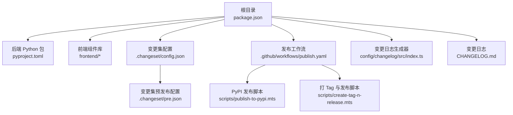
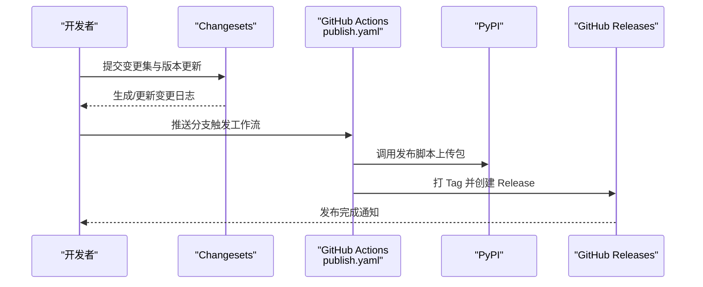
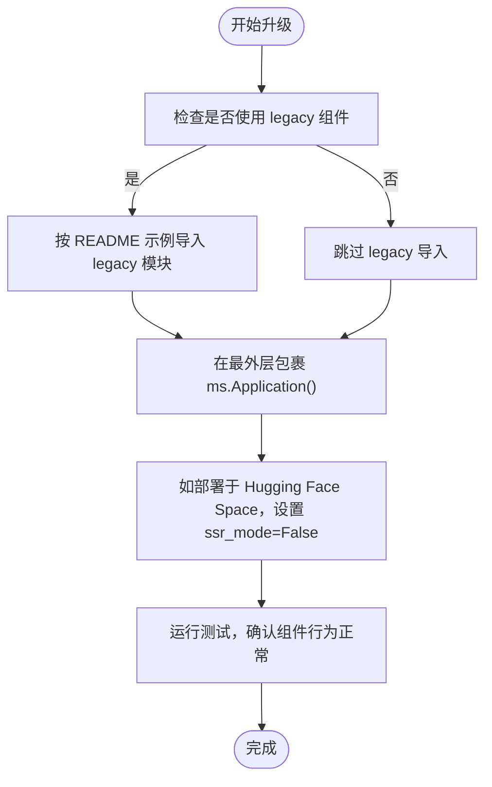
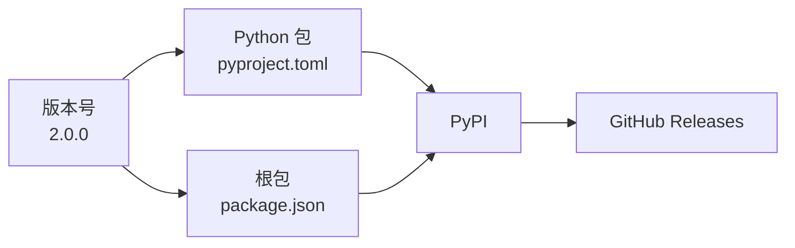

# 版本信息

<cite>
**本文引用的文件**
- [backend/modelscope_studio/version.py](file://backend/modelscope_studio/version.py)
- [package.json](file://package.json)
- [pyproject.toml](file://pyproject.toml)
- [CHANGELOG.md](file://CHANGELOG.md)
- [.changeset/config.json](file://.changeset/config.json)
- [.changeset/pre.json](file://.changeset/pre.json)
- [.github/workflows/publish.yaml](file://.github/workflows/publish.yaml)
- [scripts/create-tag-n-release.mts](file://scripts/create-tag-n-release.mts)
- [scripts/publish-to-pypi.mts](file://scripts/publish-to-pypi.mts)
- [config/changelog/src/index.ts](file://config/changelog/src/index.ts)
- [README.md](file://README.md)
- [docs/FAQ.md](file://docs/FAQ.md)
</cite>

## 更新摘要

**变更内容**

- 版本号从 2.0.0-beta.0 更新为 2.0.0
- Gradio 依赖版本要求更新为标准语法格式
- 更新变更日志以反映 2.0.0 版本的特性

## 目录

1. [简介](#简介)
2. [项目结构](#项目结构)
3. [核心组件](#核心组件)
4. [架构总览](#架构总览)
5. [详细组件分析](#详细组件分析)
6. [依赖分析](#依赖分析)
7. [性能考虑](#性能考虑)
8. [故障排查指南](#故障排查指南)
9. [结论](#结论)
10. [附录](#附录)

## 简介

本文件面向 ModelScope Studio 用户与维护者，系统化梳理项目版本信息，包括版本历史、当前版本状态、升级路径、兼容性策略、长期支持与支持周期、已知问题与安全更新、变更日志查看方式以及发布频率等。特别地，针对 1.0 版本的重大变更与迁移路径，提供可操作的升级步骤与最佳实践。

## 项目结构

ModelScope Studio 采用多包工作区（pnpm workspace）组织，核心后端以 Python 包形式发布，前端以 Svelte 组件库形式构建，同时通过 Changesets 工具链管理版本与变更日志生成。发布流程由 GitHub Actions 自动化执行，完成构建、上传 PyPI、打 Tag 并创建 GitHub Release。

**图表来源**

- [package.json:1-55](file://package.json#L1-L55)
- [pyproject.toml:1-258](file://pyproject.toml#L1-L258)
- [.changeset/config.json:1-15](file://.changeset/config.json#L1-L15)
- [.changeset/pre.json:1-16](file://.changeset/pre.json#L1-L16)
- [.github/workflows/publish.yaml:1-74](file://.github/workflows/publish.yaml#L1-L74)
- [scripts/publish-to-pypi.mts:1-60](file://scripts/publish-to-pypi.mts#L1-L60)
- [scripts/create-tag-n-release.mts:1-131](file://scripts/create-tag-n-release.mts#L1-L131)
- [config/changelog/src/index.ts:1-222](file://config/changelog/src/index.ts#L1-L222)
- [CHANGELOG.md:1-455](file://CHANGELOG.md#L1-L455)

**章节来源**

- [package.json:1-55](file://package.json#L1-L55)
- [pyproject.toml:1-258](file://pyproject.toml#L1-L258)

## 核心组件

- **当前版本状态**
  - 后端 Python 包版本：2.0.0
  - 前端与工作区根包版本：2.0.0
- **版本号来源**
  - 后端 Python 包版本号在 [backend/modelscope_studio/version.py:1-2](file://backend/modelscope_studio/version.py#L1-L2) 定义
  - 根包版本号在 [package.json:1-55](file://package.json#L1-L55) 中定义
  - Python 包版本号在 [pyproject.toml:1-258](file://pyproject.toml#L1-L258) 中定义
- **变更日志**
  - 根级变更日志在 [CHANGELOG.md:1-455](file://CHANGELOG.md#L1-L455)
  - 变更集工具链配置在 [.changeset/config.json:1-15](file://.changeset/config.json#L1-L15) 与 [.changeset/pre.json:1-16](file://.changeset/pre.json#L1-L16)
  - 变更日志生成器在 [config/changelog/src/index.ts:1-222](file://config/changelog/src/index.ts#L1-L222)

**章节来源**

- [backend/modelscope_studio/version.py:1-2](file://backend/modelscope_studio/version.py#L1-L2)
- [package.json:1-55](file://package.json#L1-L55)
- [pyproject.toml:1-258](file://pyproject.toml#L1-L258)
- [CHANGELOG.md:1-455](file://CHANGELOG.md#L1-L455)
- [.changeset/config.json:1-15](file://.changeset/config.json#L1-L15)
- [.changeset/pre.json:1-16](file://.changeset/pre.json#L1-L16)
- [config/changelog/src/index.ts:1-222](file://config/changelog/src/index.ts#L1-L222)

## 架构总览

发布与版本管理的端到端流程如下：

**图表来源**

- [.github/workflows/publish.yaml:1-74](file://.github/workflows/publish.yaml#L1-L74)
- [scripts/publish-to-pypi.mts:1-60](file://scripts/publish-to-pypi.mts#L1-L60)
- [scripts/create-tag-n-release.mts:1-131](file://scripts/create-tag-n-release.mts#L1-L131)

**章节来源**

- [.github/workflows/publish.yaml:1-74](file://.github/workflows/publish.yaml#L1-L74)
- [scripts/publish-to-pypi.mts:1-60](file://scripts/publish-to-pypi.mts#L1-L60)
- [scripts/create-tag-n-release.mts:1-131](file://scripts/create-tag-n-release.mts#L1-L131)

## 详细组件分析

### 版本历史与当前状态

- **最新稳定版本**
  - 当前后端版本：2.0.0
  - 前端与根包版本：2.0.0
- **历史版本与重大里程碑**
  - 2.0.0：新增 Ant Design 和 Ant Design X 的完整新功能
  - 2.0.0-beta.0：Gradio 6.0、Ant Design 6.0、Ant Design X 2.0 的整体迁移
  - 1.x 系列：包含大量组件增强、Pro 组件引入、i18n 支持、表单动作等
  - 1.0.0：Gradio 迁移至 5，集成 Ant Design
  - 0.x 系列：早期版本，逐步引入自定义组件与 Gradio 5 迁移准备

**章节来源**

- [CHANGELOG.md:1-455](file://CHANGELOG.md#L1-L455)
- [backend/modelscope_studio/version.py:1-2](file://backend/modelscope_studio/version.py#L1-L2)
- [package.json:1-55](file://package.json#L1-L55)
- [pyproject.toml:1-258](file://pyproject.toml#L1-L258)

### 升级路径与 1.0 重大变更

- **1.0 版本重大变更**
  - Gradio 从 4.x 迁移到 5.x
  - 组件参数与生命周期调整，确保事件绑定正确
  - 新增 AutoLoading 组件，优化加载反馈
- **从旧版本到 1.0 的升级步骤**
  - 在应用最外层包裹 Application 组件，保持现有组件导入与使用不变
  - 如需继续使用 legacy 模块中的组件，可按 README 示例进行导入
  - 若在 Hugging Face Space 部署，需在 demo.launch() 中添加 ssr_mode=False 参数

**图表来源**

- [README.md:64-78](file://README.md#L64-L78)
- [docs/FAQ.md:1-20](file://docs/FAQ.md#L1-L20)

**章节来源**

- [README.md:64-78](file://README.md#L64-L78)
- [docs/FAQ.md:1-20](file://docs/FAQ.md#L1-L20)

### 版本兼容性政策

- **Python 兼容性**
  - Python 版本要求：>=3.8
  - Gradio 依赖范围：gradio>=6.0,<=6.8.0（当前 2.0.0）
- **前后端版本对齐**
  - 根包与后端 Python 包版本均声明为 2.0.0，建议保持一致
- **浏览器与运行环境**
  - 建议在主流浏览器中进行开发与测试
  - 在 Hugging Face Space 部署时需禁用 SSR

**章节来源**

- [pyproject.toml:15-26](file://pyproject.toml#L15-L26)
- [package.json:1-55](file://package.json#L1-L55)
- [README.md:34-37](file://README.md#L34-L37)
- [docs/FAQ.md:1-20](file://docs/FAQ.md#L1-L20)

### 长期支持版本与支持周期

- **当前未公开明确的 LTS 计划与支持周期声明**
- **建议关注根级 CHANGELOG.md 与发布工作流，以获取最新版本动态与发布节奏**

**章节来源**

- [CHANGELOG.md:1-455](file://CHANGELOG.md#L1-L455)
- [.github/workflows/publish.yaml:1-74](file://.github/workflows/publish.yaml#L1-L74)

### 已知问题、安全更新与 Bug 修复

- **已知问题**
  - Hugging Face Space 默认启用 SSR，可能导致自定义组件显示异常；需手动禁用
  - 早期版本存在编码与事件绑定问题，已在后续版本修复
- **安全更新与 Bug 修复**
  - 变更日志中包含大量修复项（Fixes），涵盖上传逻辑、样式、渲染、事件绑定等方面
  - 建议优先升级至包含对应修复的版本

**章节来源**

- [docs/FAQ.md:1-20](file://docs/FAQ.md#L1-L20)
- [CHANGELOG.md:1-455](file://CHANGELOG.md#L1-L455)

### 版本选择建议

- **生产环境**
  - 优先选择稳定版本（非 beta）；若必须使用预发布，请结合变更日志评估风险
- **开发与实验**
  - 可选择 beta 版本体验新特性，但需关注潜在的 API 变更与兼容性问题
- **与 Gradio 生态集成**
  - 确保 Gradio 版本满足依赖范围（gradio>=6.0,<=6.8.0）

**章节来源**

- [pyproject.toml:26-26](file://pyproject.toml#L26-L26)
- [package.json:1-55](file://package.json#L1-L55)

### 变更日志查看方式与发布频率

- **查看变更日志**
  - 根级 CHANGELOG.md 记录了所有版本的变更摘要
  - 变更集工具链会基于提交信息生成条目，便于追踪 PR、提交与贡献者
- **发布频率**
  - 发布工作流在主分支推送时触发，具体频率取决于提交频率与变更集策略
  - 变更集预发布配置支持以 beta 标签进行预发布管理

**章节来源**

- [CHANGELOG.md:1-455](file://CHANGELOG.md#L1-L455)
- [.changeset/config.json:1-15](file://.changeset/config.json#L1-L15)
- [.changeset/pre.json:1-16](file://.changeset/pre.json#L1-L16)
- [.github/workflows/publish.yaml:1-74](file://.github/workflows/publish.yaml#L1-L74)

## 依赖分析

- **版本号一致性**
  - 后端 Python 包版本与根包版本保持一致（2.0.0），有利于发布与回溯
- **依赖范围**
  - Gradio 依赖范围严格限定，避免与高版本不兼容
- **发布链路**
  - Changesets 生成变更日志 → GitHub Actions 触发构建与发布 → PyPI 上传 → 打 Tag 与创建 Release

**图表来源**

- [backend/modelscope_studio/version.py:1-2](file://backend/modelscope_studio/version.py#L1-L2)
- [package.json:1-55](file://package.json#L1-L55)
- [pyproject.toml:1-258](file://pyproject.toml#L1-L258)

**章节来源**

- [backend/modelscope_studio/version.py:1-2](file://backend/modelscope_studio/version.py#L1-L2)
- [package.json:1-55](file://package.json#L1-L55)
- [pyproject.toml:1-258](file://pyproject.toml#L1-L258)

## 性能考虑

- **加载反馈**
  - 建议全局使用 AutoLoading 组件，以减少前端与后端交互等待时的空白或闪烁
- **渲染与事件绑定**
  - 1.0 版本优化了事件绑定逻辑，升级后可减少不必要的重渲染
- **上传与文件处理**
  - 多个版本修复了上传逻辑与文件保留问题，建议升级至包含相应修复的版本

**章节来源**

- [docs/FAQ.md:1-20](file://docs/FAQ.md#L1-L20)
- [CHANGELOG.md:1-455](file://CHANGELOG.md#L1-L455)

## 故障排查指南

- **Hugging Face Space 显示异常**
  - 解决方案：在 demo.launch() 中添加 ssr_mode=False
- **上传组件行为异常**
  - 建议升级至包含上传逻辑修复的版本
- **事件绑定与渲染问题**
  - 1.0 版本已修复相关问题，建议升级至 1.0 或更高版本

**章节来源**

- [docs/FAQ.md:1-20](file://docs/FAQ.md#L1-L20)
- [CHANGELOG.md:1-455](file://CHANGELOG.md#L1-L455)

## 结论

ModelScope Studio 当前正式版本为 2.0.0，围绕 Gradio 6 与 Ant Design 6 的全面迁移带来显著的功能增强与稳定性提升。该版本新增了 Ant Design 和 Ant Design X 的完整新功能，进一步完善了组件生态。升级至 1.0 的关键在于在应用最外层包裹 Application 组件，并在必要时禁用 SSR 以适配 Hugging Face Space。

## 附录

- **快速参考**
  - 当前版本：2.0.0
  - Python 兼容性：>=3.8
  - Gradio 依赖：gradio>=6.0,<=6.8.0
  - 变更日志：根级 CHANGELOG.md
  - 发布工作流：.github/workflows/publish.yaml

**章节来源**

- [CHANGELOG.md:1-455](file://CHANGELOG.md#L1-L455)
- [pyproject.toml:15-26](file://pyproject.toml#L15-L26)
- [package.json:1-55](file://package.json#L1-L55)
- [.github/workflows/publish.yaml:1-74](file://.github/workflows/publish.yaml#L1-L74)
