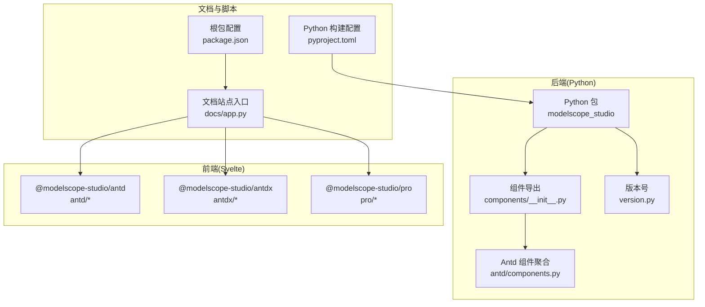
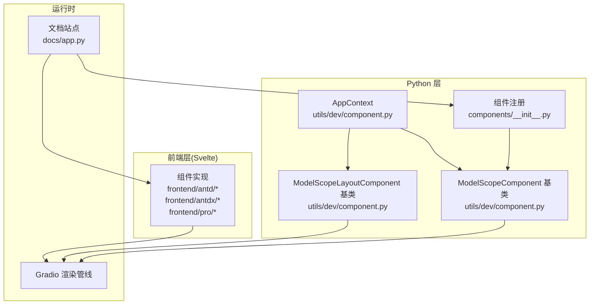
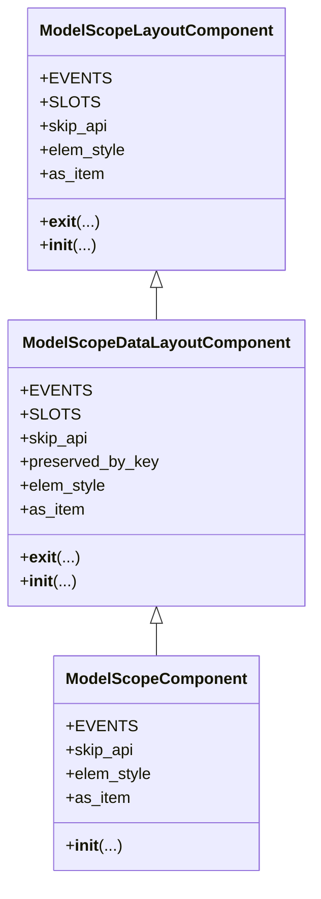
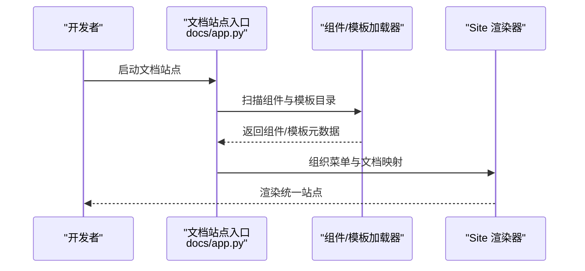
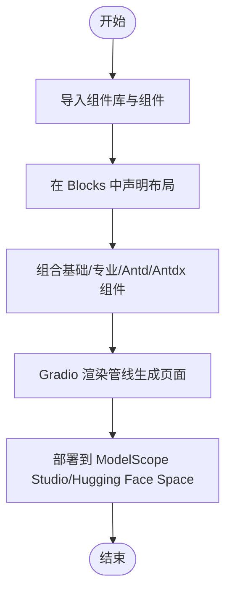
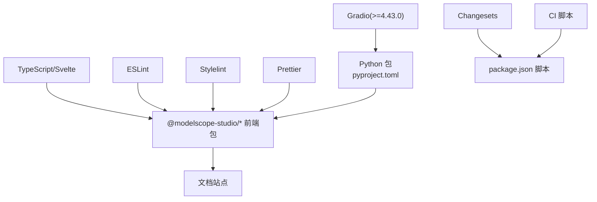

# 项目介绍

<cite>
**本文引用的文件**   
- [README.md](file://README.md)
- [README-zh_CN.md](file://README-zh_CN.md)
- [backend/modelscope_studio/__init__.py](file://backend/modelscope_studio/__init__.py)
- [backend/modelscope_studio/version.py](file://backend/modelscope_studio/version.py)
- [package.json](file://package.json)
- [pyproject.toml](file://pyproject.toml)
- [backend/modelscope_studio/components/__init__.py](file://backend/modelscope_studio/components/__init__.py)
- [backend/modelscope_studio/components/antd/components.py](file://backend/modelscope_studio/components/antd/components.py)
- [backend/modelscope_studio/utils/dev/component.py](file://backend/modelscope_studio/utils/dev/component.py)
- [docs/app.py](file://docs/app.py)
- [frontend/antd/package.json](file://frontend/antd/package.json)
- [frontend/antdx/package.json](file://frontend/antdx/package.json)
- [frontend/pro/package.json](file://frontend/pro/package.json)
</cite>

## 目录

1. [引言](#引言)
2. [项目结构](#项目结构)
3. [核心组件](#核心组件)
4. [架构总览](#架构总览)
5. [详细组件分析](#详细组件分析)
6. [依赖分析](#依赖分析)
7. [性能考虑](#性能考虑)
8. [故障排查指南](#故障排查指南)
9. [结论](#结论)
10. [附录](#附录)

## 引言

ModelScope Studio 是一个基于 Gradio 的第三方组件库，旨在为开发者提供更丰富、更灵活的界面构建能力。它通过整合 Ant Design 与 Ant Design X（Antd/Antdx）生态，以及自研的基础与专业组件体系，帮助用户在保持 Gradio 易用性的前提下，快速搭建美观、可维护的交互界面。

- 核心价值主张
  - 更强的页面布局与组件灵活性：相比 Gradio 原生组件，ModelScope Studio 更专注于页面布局与组件组合能力，适合追求视觉与交互体验的应用场景。
  - 与 Gradio 生态无缝衔接：既可独立使用，也可与现有 Gradio 组件混合使用，满足不同复杂度的界面需求。
  - 适配多平台部署：支持 ModelScope Studio、Hugging Face Space 等平台，提供一致的开发与发布体验。

- 设计理念
  - 以“组件即服务”为核心，提供可复用、可组合的 UI 组件。
  - 通过上下文与插槽机制，简化复杂布局与数据流管理。
  - 保持与 Gradio 的深度兼容，降低迁移成本与学习成本。

- 与 ModelScope 和 Gradio 生态的关系
  - 依托 Gradio 的 Blocks/Interface 渲染与事件系统，ModelScope Studio 将 Antd/Antdx 组件与专业组件以 Gradio 组件的形式暴露出来，使 Python 端可以直接声明式地组合前端组件。
  - 在 ModelScope Studio 平台与 Hugging Face Space 上，用户可直接运行示例与模板，快速验证界面效果。

- 发展背景与目标
  - 背景：Gradio 为模型应用提供了极简的界面入口，但在复杂布局与专业交互方面仍有提升空间；Ant Design 生态成熟但与 Gradio 的直接结合不够顺畅。
  - 目标：打造“轻量接入、强大组合”的组件库，覆盖从基础布局到专业交互的全栈 UI 需求，推动模型应用的界面工程化与标准化。

- 解决的核心问题
  - 页面布局复杂度高：通过布局组件与插槽机制，降低嵌套层级与逻辑复杂度。
  - 组件复用与一致性：统一的 Antd/Antdx 组件体系，保证跨模块的一致性与可维护性。
  - 多端部署一致性：提供稳定的 SSR/CSR 配置建议，避免在不同平台出现显示异常。

- 开源理念与社区贡献
  - 开源协议：采用 Apache-2.0，鼓励企业与个人在合规前提下使用与贡献。
  - 贡献方式：欢迎通过 Issues/PR 反馈问题、补充文档、完善组件或修复缺陷；遵循代码规范与变更流程。
  - 发布与版本：通过 Changesets 管理版本与变更日志，CI 流水线负责构建与发布。

- 未来规划
  - 扩展组件矩阵：持续完善 Antd/Antdx 与专业组件，覆盖更多业务场景。
  - 优化开发体验：改进文档站点、示例模板与调试工具链。
  - 平台适配：增强对 ModelScope Studio、Hugging Face Space 等平台的适配与最佳实践。

**章节来源**

- [README.md:17-32](file://README.md#L17-L32)
- [README-zh_CN.md:17-32](file://README-zh_CN.md#L17-L32)

## 项目结构

该项目采用前后端分离的多包工作区结构，后端 Python 包提供组件注册与版本信息，前端以 Svelte 实现各组件并与 Gradio 构建工具链集成；文档站点通过 Python 动态加载各组件示例与模板。

**图表来源**

- [backend/modelscope_studio/components/**init**.py:1-5](file://backend/modelscope_studio/components/__init__.py#L1-L5)
- [backend/modelscope_studio/components/antd/components.py:1-144](file://backend/modelscope_studio/components/antd/components.py#L1-L144)
- [backend/modelscope_studio/version.py:1-2](file://backend/modelscope_studio/version.py#L1-L2)
- [docs/app.py:1-595](file://docs/app.py#L1-L595)
- [package.json:1-55](file://package.json#L1-L55)
- [pyproject.toml:1-257](file://pyproject.toml#L1-L257)

**章节来源**

- [backend/modelscope_studio/components/**init**.py:1-5](file://backend/modelscope_studio/components/__init__.py#L1-L5)
- [backend/modelscope_studio/components/antd/components.py:1-144](file://backend/modelscope_studio/components/antd/components.py#L1-L144)
- [docs/app.py:1-595](file://docs/app.py#L1-L595)
- [package.json:1-55](file://package.json#L1-L55)
- [pyproject.toml:1-257](file://pyproject.toml#L1-L257)

## 核心组件

ModelScope Studio 的组件体系分为三大类：

- 基础组件（base）：提供布局、渲染控制与上下文能力，如 Application、AutoLoading、Slot、Fragment、Each、Filter、Div、Span、Text、Markdown 等。
- Ant Design 组件（antd）：覆盖 Antd 的通用、布局、导航、数据录入、数据展示、反馈等类别，包含大量子组件与组合形态。
- Ant Design X 组件（antdx）：面向对话与协作场景的专业组件集合，如 Bubble、Conversations、Sender、ThoughtChain、Actions 等。
- 专业组件（pro）：面向特定业务的高级组件，如 Chatbot、Monaco Editor、Multimodal Input、Web Sandbox 等。

这些组件通过统一的注册与导出机制在 Python 端暴露，便于在 Blocks 中按需组合使用。

**章节来源**

- [backend/modelscope_studio/components/**init**.py:1-5](file://backend/modelscope_studio/components/__init__.py#L1-L5)
- [backend/modelscope_studio/components/antd/components.py:1-144](file://backend/modelscope_studio/components/antd/components.py#L1-L144)
- [docs/app.py:189-509](file://docs/app.py#L189-L509)

## 架构总览

ModelScope Studio 的整体架构围绕“Python 组件定义 + Svelte 前端实现 + Gradio 渲染管线”展开。Python 端通过组件基类与上下文机制，将前端组件以 Gradio 组件的形式注入 Blocks；前端使用 Svelte 实现组件 UI，并通过 Gradio 的构建工具链进行打包与分发；文档站点动态加载各组件示例与模板，形成“开发—演示—发布”的闭环。

**图表来源**

- [backend/modelscope_studio/utils/dev/component.py:11-169](file://backend/modelscope_studio/utils/dev/component.py#L11-L169)
- [backend/modelscope_studio/components/**init**.py:1-5](file://backend/modelscope_studio/components/__init__.py#L1-L5)
- [docs/app.py:1-595](file://docs/app.py#L1-L595)
- [frontend/antd/package.json:1-6](file://frontend/antd/package.json#L1-L6)
- [frontend/antdx/package.json:1-6](file://frontend/antdx/package.json#L1-L6)
- [frontend/pro/package.json:1-6](file://frontend/pro/package.json#L1-L6)

## 详细组件分析

### 组件基类与上下文机制

ModelScope Studio 通过三类基类支撑组件体系：

- ModelScopeComponent：面向数据型组件，具备值传递、事件绑定、渲染控制等能力。
- ModelScopeLayoutComponent：面向布局型组件，支持布局标记与上下文切换。
- ModelScopeDataLayoutComponent：兼具数据与布局特性，用于复杂容器组件。

这些基类统一了组件生命周期、属性注入与上下文关联，确保组件在 Blocks 中的行为一致。

**图表来源**

- [backend/modelscope_studio/utils/dev/component.py:11-169](file://backend/modelscope_studio/utils/dev/component.py#L11-L169)

**章节来源**

- [backend/modelscope_studio/utils/dev/component.py:11-169](file://backend/modelscope_studio/utils/dev/component.py#L11-L169)

### Ant Design 组件聚合

Antd 组件通过集中导出文件统一暴露，涵盖通用、布局、导航、数据录入、数据展示、反馈等类别，便于在 Python 端按需导入与使用。

```mermaid
graph LR
ANTD_ALL["antd/components.py"] --> BUTTON["Button"]
ANTD_ALL --> INPUT["Input"]
ANTD_ALL --> FORM["Form"]
ANTD_ALL --> TABLE["Table"]
ANTD_ALL --> MODAL["Modal"]
ANTD_ALL --> LAYOUT["Layout"]
ANTD_ALL --> MENU["Menu"]
ANTD_ALL --> TREE["Tree"]
ANTD_ALL --> UPLOAD["Upload"]
ANTD_ALL --> PROGRESS["Progress"]
ANTD_ALL --> ALERT["Alert"]
ANTD_ALL --> DRAWER["Drawer"]
ANTD_ALL --> PAGINATION["Pagination"]
ANTD_ALL --> SPIN["Spin"]
ANTD_ALL --> MESSAGE["Message"]
ANTD_ALL --> NOTIFICATION["Notification"]
ANTD_ALL --> TYPGRAPHY["Typography"]
ANTD_ALL --> GRID["Grid"]
ANTD_ALL --> SPACE["Space"]
ANTD_ALL --> SPLITTER["Splitter"]
ANTD_ALL --> STATISTIC["Statistic"]
ANTD_ALL --> TOUR["Tour"]
ANTD_ALL --> WATERMARK["Watermark"]
ANTD_ALL --> QR_CODE["QRCode"]
ANTD_ALL --> CALENDAR["Calendar"]
ANTD_ALL --> CAROUSEL["Carousel"]
ANTD_ALL --> COLLAPSE["Collapse"]
ANTD_ALL --> DESCRIPTIONS["Descriptions"]
ANTD_ALL --> EMPTY["Empty"]
ANTD_ALL --> IMAGE["Image"]
ANTD_ALL --> LIST["List"]
ANTD_ALL --> POPOVER["Popover"]
ANTD_ALL --> SEGMENTED["Segmented"]
ANTD_ALL --> TIME_PICKER["TimePicker"]
ANTD_ALL --> TIMELINE["Timeline"]
ANTD_ALL --> TOOLTIP["Tooltip"]
ANTD_ALL --> TRANSFER["Transfer"]
ANTD_ALL --> TREE_SELECT["TreeSelect"]
ANTD_ALL --> SKELETON["Skeleton"]
ANTD_ALL --> SWITCH["Switch"]
ANTD_ALL --> SLIDER["Slider"]
ANTD_ALL --> SELECT["Select"]
ANTD_ALL --> RADIO["Radio"]
ANTD_ALL --> RATE["Rate"]
ANTD_ALL --> CHECKBOX["Checkbox"]
ANTD_ALL --> COLOR_PICKER["ColorPicker"]
ANTD_ALL --> DATE_PICKER["DatePicker"]
ANTD_ALL --> AUTO_COMPLETE["AutoComplete"]
ANTD_ALL --> CASCADER["Cascader"]
ANTD_ALL --> MENTIONS["Mentions"]
ANTD_ALL --> FLOAT_BUTTON["FloatButton"]
ANTD_ALL --> ICON["Icon"]
ANTD_ALL --> DIVIDER["Divider"]
ANTD_ALL --> DROPDOWN["Dropdown"]
ANTD_ALL --> BADGE["Badge"]
ANTD_ALL --> AVATAR["Avatar"]
ANTD_ALL --> RESULT["Result"]
ANTD_ALL --> POPCONFIRM["Popconfirm"]
```

**图表来源**

- [backend/modelscope_studio/components/antd/components.py:1-144](file://backend/modelscope_studio/components/antd/components.py#L1-L144)

**章节来源**

- [backend/modelscope_studio/components/antd/components.py:1-144](file://backend/modelscope_studio/components/antd/components.py#L1-L144)

### 文档站点与示例加载

文档站点通过动态导入各组件目录下的 app.py，聚合组件示例与说明，形成统一的导航与展示界面；同时支持布局模板与多语言环境切换。

**图表来源**

- [docs/app.py:19-61](file://docs/app.py#L19-L61)
- [docs/app.py:577-595](file://docs/app.py#L577-L595)

**章节来源**

- [docs/app.py:19-61](file://docs/app.py#L19-L61)
- [docs/app.py:577-595](file://docs/app.py#L577-L595)

### 概念性概览

以下为概念性流程图，展示从组件声明到页面渲染的关键步骤，帮助初学者理解整体工作流。

[此图为概念性流程图，不对应具体源码文件，故无图表来源]

## 依赖分析

- 运行时依赖
  - Gradio：作为核心渲染与事件系统，ModelScope Studio 在其之上扩展组件能力。
- 构建与开发依赖
  - Gradio CLI：提供组件构建与开发服务器功能。
  - TypeScript/Svelte：前端组件实现与类型检查。
  - Prettier/ESLint/Stylelint：代码风格与质量保障。
- 发布与版本管理
  - Changesets：版本与变更日志管理。
  - CI 脚本：自动化构建、校验与发布。

**图表来源**

- [pyproject.toml:26](file://pyproject.toml#L26)
- [package.json:8-25](file://package.json#L8-L25)

**章节来源**

- [pyproject.toml:26](file://pyproject.toml#L26)
- [package.json:8-25](file://package.json#L8-L25)

## 性能考虑

- 组件懒加载与按需导入：优先按需导入所需组件，减少初始包体积。
- 前端构建优化：利用 Gradio CLI 的构建能力与缓存策略，缩短二次构建时间。
- 渲染并发与队列：在文档站点与示例中合理设置并发与队列大小，避免阻塞。
- 平台差异：在 Hugging Face Space 使用时，注意 ssr_mode 参数配置，避免页面渲染异常。

[本节为通用指导，不涉及具体文件分析]

## 故障排查指南

- Hugging Face Space 页面显示异常
  - 现象：页面空白或组件未正确渲染。
  - 处理：在 demo.launch() 中添加 ssr_mode=False 参数。
  - 参考：[README.md:32](file://README.md#L32)、[README-zh_CN.md:32](file://README-zh_CN.md#L32)、[docs/app.py:594](file://docs/app.py#L594)

- 组件导入路径错误
  - 现象：找不到模块或组件。
  - 处理：确认组件命名空间与导入路径是否匹配，例如 modelscope_studio.components.antd、modelscope_studio.components.base 等。
  - 参考：[backend/modelscope_studio/components/**init**.py:1-5](file://backend/modelscope_studio/components/__init__.py#L1-L5)

- 文档站点开发模式
  - 现象：本地开发无法热更新或示例不显示。
  - 处理：使用 gradio cc dev docs/app.py 启动开发服务器，并确保 docs 目录存在对应 app.py。
  - 参考：[README.md:96-100](file://README.md#L96-L100)、[docs/app.py:10](file://docs/app.py#L10)

**章节来源**

- [README.md:32](file://README.md#L32)
- [README-zh_CN.md:32](file://README-zh_CN.md#L32)
- [docs/app.py:594](file://docs/app.py#L594)
- [backend/modelscope_studio/components/**init**.py:1-5](file://backend/modelscope_studio/components/__init__.py#L1-L5)
- [README.md:96-100](file://README.md#L96-L100)
- [docs/app.py:10](file://docs/app.py#L10)

## 结论

ModelScope Studio 以 Gradio 为基础，融合 Ant Design 与 Ant Design X 生态，构建了覆盖基础、专业与 Antd/Antdx 的完整组件体系。它在保持 Gradio 易用性的同时，显著提升了页面布局与组件组合能力，适用于从原型到生产的各类模型应用界面开发。通过完善的文档站点、版本管理与平台适配，项目为初学者与资深开发者都提供了清晰的上手路径与稳定的技术支撑。

[本节为总结性内容，不涉及具体文件分析]

## 附录

- 快速开始
  - 安装：pip install modelscope_studio
  - 示例：在 Blocks 中组合 ms.Application、antd.ConfigProvider、antd.DatePicker 等组件。
  - 参考：[README.md:38-57](file://README.md#L38-L57)、[README-zh_CN.md:38-57](file://README-zh_CN.md#L38-L57)

- 版本与发布
  - 当前版本：2.0.0
  - 发布脚本：build、dev、version、ci:\* 等
  - 参考：[backend/modelscope_studio/version.py:1-2](file://backend/modelscope_studio/version.py#L1-L2)、[package.json:8-25](file://package.json#L8-L25)

**章节来源**

- [README.md:38-57](file://README.md#L38-L57)
- [README-zh_CN.md:38-57](file://README-zh_CN.md#L38-L57)
- [backend/modelscope_studio/version.py:1-2](file://backend/modelscope_studio/version.py#L1-L2)
- [package.json:8-25](file://package.json#L8-L25)
