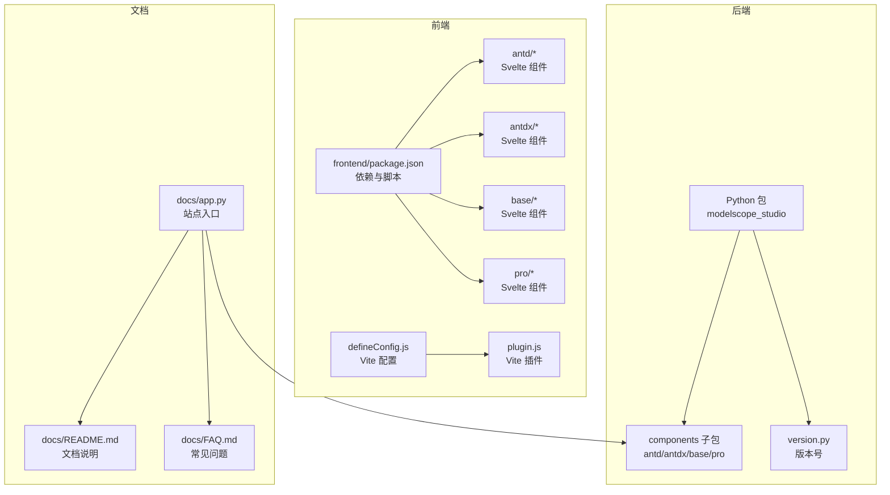
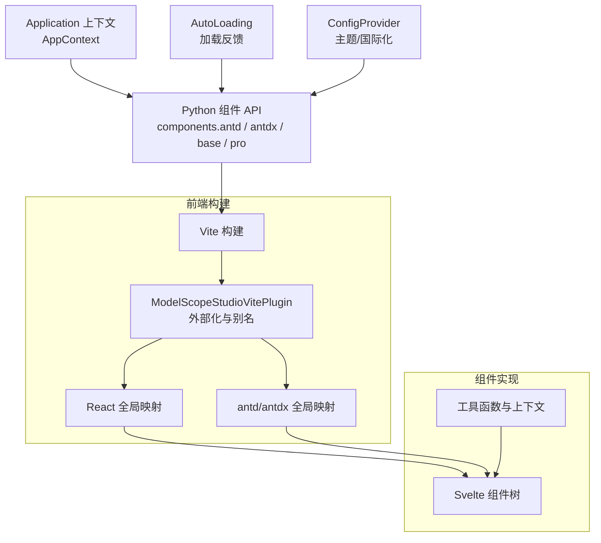
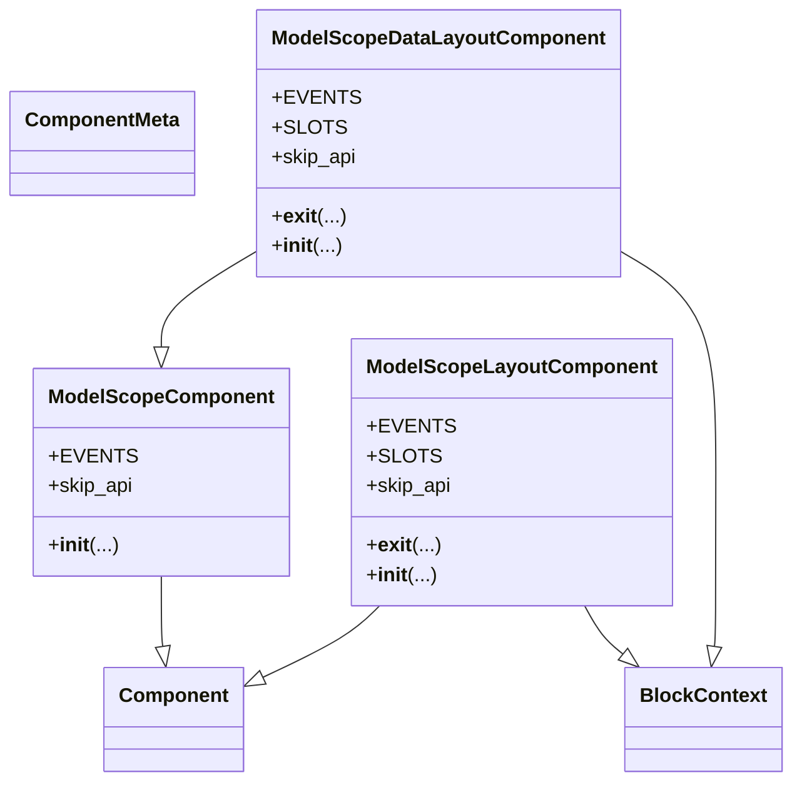
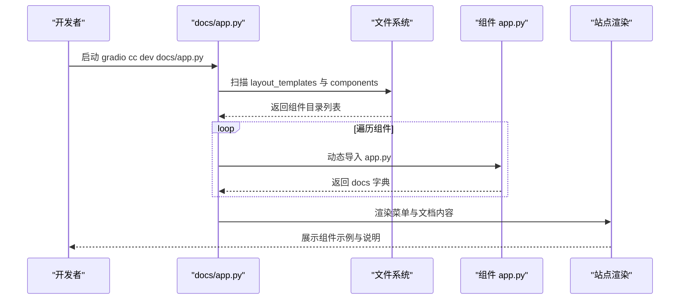
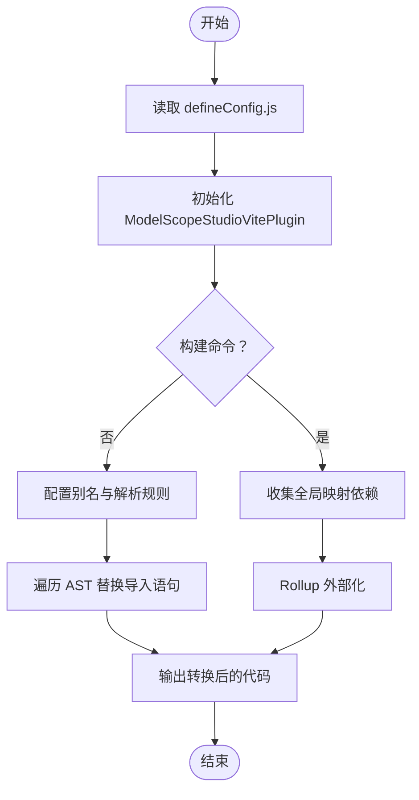
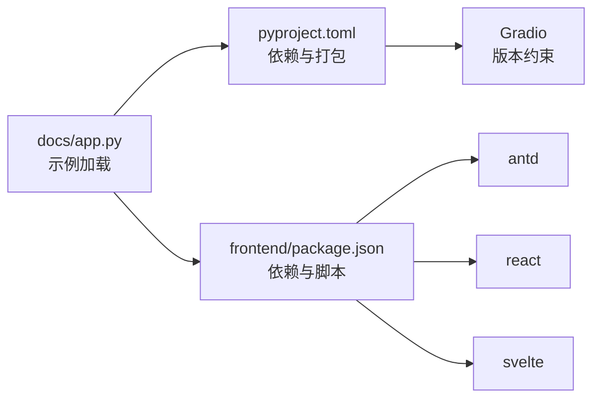

# 项目概述

<cite>
**本文引用的文件**
- [README.md](file://README.md)
- [README-zh_CN.md](file://README-zh_CN.md)
- [package.json](file://package.json)
- [pyproject.toml](file://pyproject.toml)
- [backend/modelscope_studio/version.py](file://backend/modelscope_studio/version.py)
- [backend/modelscope_studio/__init__.py](file://backend/modelscope_studio/__init__.py)
- [backend/modelscope_studio/components/__init__.py](file://backend/modelscope_studio/components/__init__.py)
- [backend/modelscope_studio/components/antd/components.py](file://backend/modelscope_studio/components/antd/components.py)
- [backend/modelscope_studio/components/antdx/components.py](file://backend/modelscope_studio/components/antdx/components.py)
- [backend/modelscope_studio/utils/dev/component.py](file://backend/modelscope_studio/utils/dev/component.py)
- [backend/modelscope_studio/utils/dev/app_context.py](file://backend/modelscope_studio/utils/dev/app_context.py)
- [frontend/package.json](file://frontend/package.json)
- [frontend/defineConfig.js](file://frontend/defineConfig.js)
- [frontend/plugin.js](file://frontend/plugin.js)
- [docs/README.md](file://docs/README.md)
- [docs/app.py](file://docs/app.py)
- [docs/FAQ.md](file://docs/FAQ.md)
</cite>

## 目录

1. [引言](#引言)
2. [项目结构](#项目结构)
3. [核心组件](#核心组件)
4. [架构总览](#架构总览)
5. [详细组件分析](#详细组件分析)
6. [依赖分析](#依赖分析)
7. [性能考虑](#性能考虑)
8. [故障排查指南](#故障排查指南)
9. [结论](#结论)
10. [附录](#附录)

## 引言

ModelScope Studio 是一个基于 Gradio 的第三方组件库，旨在为开发者提供更定制化的界面搭建能力与更丰富的组件使用形态。项目同时支持 Ant Design 与 Ant Design X 两大 UI 生态，并通过统一的 Python 组件接口与前端 Svelte/React 技术栈实现跨框架的组件桥接与渲染。

- 核心目标
  - 提升页面布局与组件灵活性，帮助构建更美观的用户界面
  - 与 Gradio 原生组件良好兼容，满足从简单到复杂的多种交互需求
  - 通过 Application 上下文与 AutoLoading 加载反馈机制，提升开发体验与用户体验

- 主要特性
  - 三层组件体系：基础组件（base）、Ant Design 组件（antd）、Ant Design X 组件（antdx）、专业组件（pro）
  - 前端采用 Vite + Svelte + React 预处理桥接，配合自定义 Vite 插件进行模块别名与外部化处理
  - 支持多语言站点与文档系统，覆盖中文、英文、日文

- 应用场景
  - 快速搭建数据可视化与交互式演示页面
  - 在 Hugging Face Space 或 ModelScope Studio 平台部署交互式应用
  - 需要复杂表单、表格、图表与对话式交互的工作流

- 设计理念
  - 以 Gradio Blocks 为宿主，通过 Python 组件封装前端 Svelte 组件，实现“Python 逻辑 + 可定制 UI”的一体化开发
  - 通过 ConfigProvider、Application、AutoLoading 等上下文组件，统一主题、生命周期与加载状态管理

- 与 Ant Design/Ant Design X 的关系
  - antd 组件直接映射至 Ant Design 的组件生态，提供更丰富的布局与交互能力
  - antdx 组件聚焦对话式体验与知识工作流，如 Bubble、Sender、ThoughtChain 等
  - pro 组件提供专业级交互能力，如 Chatbot、Monaco Editor、Web Sandbox 等

- 技术架构
  - 后端：Python 包含组件导出与版本信息，组件注册集中在 components 子包
  - 前端：Svelte 组件树 + React 预处理桥接，Vite 构建与插件注入全局变量
  - 文档：基于 docs 站点与动态加载各组件示例，支持多语言与布局模板

- 发展历程与版本
  - 当前版本：2.0.0
  - 许可证：Apache-2.0
  - 依赖范围：Gradio >= 4.43.0 且 <= 6.8.0

- 使用建议
  - 在 Hugging Face Space 部署时需设置 ssr_mode=False
  - 全局引入 AutoLoading 以获得一致的加载反馈
  - 如需迁移旧版组件，可在外层包裹 ms.Application 即可继续使用

**章节来源**

- [README.md:17-101](file://README.md#L17-L101)
- [README-zh_CN.md:17-101](file://README-zh_CN.md#L17-L101)
- [docs/README.md:32-75](file://docs/README.md#L32-L75)
- [docs/FAQ.md:1-20](file://docs/FAQ.md#L1-L20)

## 项目结构

项目采用前后端分离与多包协作的组织方式：

- backend/modelscope_studio：Python 后端组件与打包配置
- frontend：前端组件（Svelte/React）与构建配置
- docs：文档站点与示例应用
- config/scripts：变更集、发布脚本与 Lint 配置

**图示来源**

- [backend/modelscope_studio/**init**.py:1-3](file://backend/modelscope_studio/__init__.py#L1-L3)
- [backend/modelscope_studio/components/**init**.py:1-5](file://backend/modelscope_studio/components/__init__.py#L1-L5)
- [frontend/package.json:1-59](file://frontend/package.json#L1-L59)
- [frontend/defineConfig.js:1-19](file://frontend/defineConfig.js#L1-L19)
- [frontend/plugin.js:1-168](file://frontend/plugin.js#L1-L168)
- [docs/app.py:1-200](file://docs/app.py#L1-L200)
- [docs/README.md:1-75](file://docs/README.md#L1-L75)
- [docs/FAQ.md:1-20](file://docs/FAQ.md#L1-L20)

**章节来源**

- [backend/modelscope_studio/**init**.py:1-3](file://backend/modelscope_studio/__init__.py#L1-L3)
- [backend/modelscope_studio/components/**init**.py:1-5](file://backend/modelscope_studio/components/__init__.py#L1-L5)
- [frontend/package.json:1-59](file://frontend/package.json#L1-L59)
- [docs/app.py:1-200](file://docs/app.py#L1-L200)

## 核心组件

- 组件分类
  - antd：覆盖 Ant Design 的通用、布局、导航、数据录入、数据展示、反馈等全量组件族
  - antdx：面向对话式体验的组件族，如 Bubble、Sender、ThoughtChain、Prompts 等
  - base：基础布局与渲染辅助组件，如 Application、AutoLoading、Slot、Fragment、Each、Filter、Markdown 等
  - pro：专业交互组件，如 Chatbot、Monaco Editor、Web Sandbox、Multimodal Input 等

- 导出与聚合
  - 后端 components/**init**.py 将 antd、antdx、base、pro 的组件集中导出，便于按命名空间导入使用
  - antd/components.py 与 antdx/components.py 分别列出各子模块组件类，形成统一的 Python API

- 关键上下文组件
  - Application：应用级上下文，用于建立组件树与生命周期管理
  - AutoLoading：自动加载反馈组件，确保交互操作具备一致的加载提示
  - ConfigProvider：主题与国际化配置提供者，贯穿 antd 组件树

- 开发期组件基类
  - ModelScopeComponent/ModelScopeLayoutComponent/ModelScopeDataLayoutComponent：为组件提供统一的生命周期、插槽与渲染控制

**章节来源**

- [backend/modelscope_studio/components/**init**.py:1-5](file://backend/modelscope_studio/components/__init__.py#L1-L5)
- [backend/modelscope_studio/components/antd/components.py:1-144](file://backend/modelscope_studio/components/antd/components.py#L1-L144)
- [backend/modelscope_studio/components/antdx/components.py:1-40](file://backend/modelscope_studio/components/antdx/components.py#L1-L40)
- [backend/modelscope_studio/utils/dev/component.py:11-169](file://backend/modelscope_studio/utils/dev/component.py#L11-L169)

## 架构总览

整体架构围绕“Python 组件 → 前端 Svelte 组件 → Gradio 渲染”展开，前端通过 Vite 插件将 React/antd/antdx 等依赖映射为全局变量，减少打包体积并提升加载效率。

**图示来源**

- [backend/modelscope_studio/utils/dev/app_context.py:1-25](file://backend/modelscope_studio/utils/dev/app_context.py#L1-L25)
- [frontend/defineConfig.js:1-19](file://frontend/defineConfig.js#L1-L19)
- [frontend/plugin.js:1-168](file://frontend/plugin.js#L1-L168)
- [frontend/package.json:1-59](file://frontend/package.json#L1-L59)

## 详细组件分析

### 组件类层次结构

以下类图展示了后端组件基类与其典型派生组件的关系，体现统一的生命周期与渲染策略。

**图示来源**

- [backend/modelscope_studio/utils/dev/component.py:11-169](file://backend/modelscope_studio/utils/dev/component.py#L11-L169)

**章节来源**

- [backend/modelscope_studio/utils/dev/component.py:11-169](file://backend/modelscope_studio/utils/dev/component.py#L11-L169)

### 文档站点与示例加载流程

文档站点通过动态扫描 docs/components 下的各组件 app.py，聚合生成侧边栏与文档内容；同时支持布局模板与多语言切换。

**图示来源**

- [docs/app.py:19-61](file://docs/app.py#L19-L61)

**章节来源**

- [docs/app.py:19-61](file://docs/app.py#L19-L61)

### 前端构建与模块外部化

前端通过自定义 Vite 插件将 React、antd、antdx 等依赖映射为全局变量，避免重复打包，同时在构建阶段进行外部化处理，减少产物体积。

**图示来源**

- [frontend/defineConfig.js:1-19](file://frontend/defineConfig.js#L1-L19)
- [frontend/plugin.js:41-168](file://frontend/plugin.js#L41-L168)

**章节来源**

- [frontend/defineConfig.js:1-19](file://frontend/defineConfig.js#L1-L19)
- [frontend/plugin.js:1-168](file://frontend/plugin.js#L1-L168)

### 组件命名空间与导入约定

- Python 端通过 modelscope_studio.components.antd、antdx、base、pro 导入对应组件
- 建议在应用最外层包裹 ms.Application，以启用上下文与生命周期管理
- 若使用旧版 legacy 组件，同样可通过 ms.Application 包裹继续使用

**章节来源**

- [README.md:49-78](file://README.md#L49-L78)
- [docs/README.md:64-75](file://docs/README.md#L64-L75)

## 依赖分析

- Python 侧
  - 依赖：Gradio（版本范围约束）
  - 可选依赖：构建与发布相关工具
  - 打包：通过 hatchling 构建，artifact 列表包含大量组件模板资源

- 前端侧
  - 依赖：antd、@ant-design/x、@gradio/\*、monaco-editor、svelte、react 等
  - 构建：Vite + React-SWC + Less，插件负责外部化与别名替换

- 文档与站点
  - 基于 docs/app.py 动态加载组件示例，支持多语言与布局模板

**图示来源**

- [pyproject.toml:26](file://pyproject.toml#L26)
- [frontend/package.json:8-40](file://frontend/package.json#L8-L40)
- [docs/app.py:19-61](file://docs/app.py#L19-L61)

**章节来源**

- [pyproject.toml:9-43](file://pyproject.toml#L9-L43)
- [frontend/package.json:1-59](file://frontend/package.json#L1-L59)
- [docs/app.py:19-61](file://docs/app.py#L19-L61)

## 性能考虑

- 前端外部化与别名
  - 通过 Vite 插件将 React、antd、antdx 等映射为全局变量，减少重复打包与体积
  - 构建阶段 Rollup 外部化，进一步降低产物大小

- 组件加载反馈
  - AutoLoading 提供统一的加载占位，改善交互延迟带来的感知性能
  - 建议在全局至少引入一次 AutoLoading，避免 Gradio 默认加载状态缺失

- 文档与示例
  - docs/app.py 采用按需动态导入组件 app.py，减少初始加载压力

**章节来源**

- [frontend/plugin.js:41-168](file://frontend/plugin.js#L41-L168)
- [docs/FAQ.md:7-20](file://docs/FAQ.md#L7-L20)
- [docs/app.py:19-61](file://docs/app.py#L19-L61)

## 故障排查指南

- Hugging Face Space 页面不显示或样式异常
  - 解决方案：在 demo.launch() 中添加 ssr_mode=False 参数

- 操作响应慢或无反馈
  - 原因：组件独立的加载反馈机制与 Gradio 前后端通信导致的等待时间
  - 解决方案：全局引入 AutoLoading 组件，确保加载状态可见

- 缺少 Application 上下文警告
  - 现象：未在最外层包裹 ms.Application 时会触发警告
  - 解决方案：在外层包裹 ms.Application

**章节来源**

- [docs/FAQ.md:1-20](file://docs/FAQ.md#L1-L20)
- [backend/modelscope_studio/utils/dev/app_context.py:16-21](file://backend/modelscope_studio/utils/dev/app_context.py#L16-L21)
- [README.md:32](file://README.md#L32)

## 结论

ModelScope Studio 以 Gradio 为核心，结合 Ant Design 与 Ant Design X 的丰富组件生态，提供了从基础布局到专业交互的一体化解决方案。通过统一的 Python 组件 API、前端 Svelte/React 桥接与 Vite 插件优化，项目在易用性与性能之间取得平衡。对于初学者，建议从基础组件与 Application/AutoLoading 入手；对于有经验的开发者，可深入 antdx 与 pro 组件，快速构建对话式与专业级交互应用。

## 附录

- 版本与许可证
  - 版本：2.0.0
  - 许可证：Apache-2.0
  - 作者：ModelScope team

- 安装与快速开始
  - pip 安装 modelscope_studio
  - 在 Blocks 中使用 modelscope_studio.components.antd 与 modelscope_studio.components.base

- 开发与贡献
  - 后端安装：pip install -e '.'
  - 前端安装：pnpm install
  - 构建：pnpm build
  - 启动文档：gradio cc dev docs/app.py

**章节来源**

- [backend/modelscope_studio/version.py:1-2](file://backend/modelscope_studio/version.py#L1-L2)
- [package.json:1-55](file://package.json#L1-L55)
- [pyproject.toml:9-43](file://pyproject.toml#L9-L43)
- [README.md:38-101](file://README.md#L38-L101)
- [README-zh_CN.md:38-101](file://README-zh_CN.md#L38-L101)
