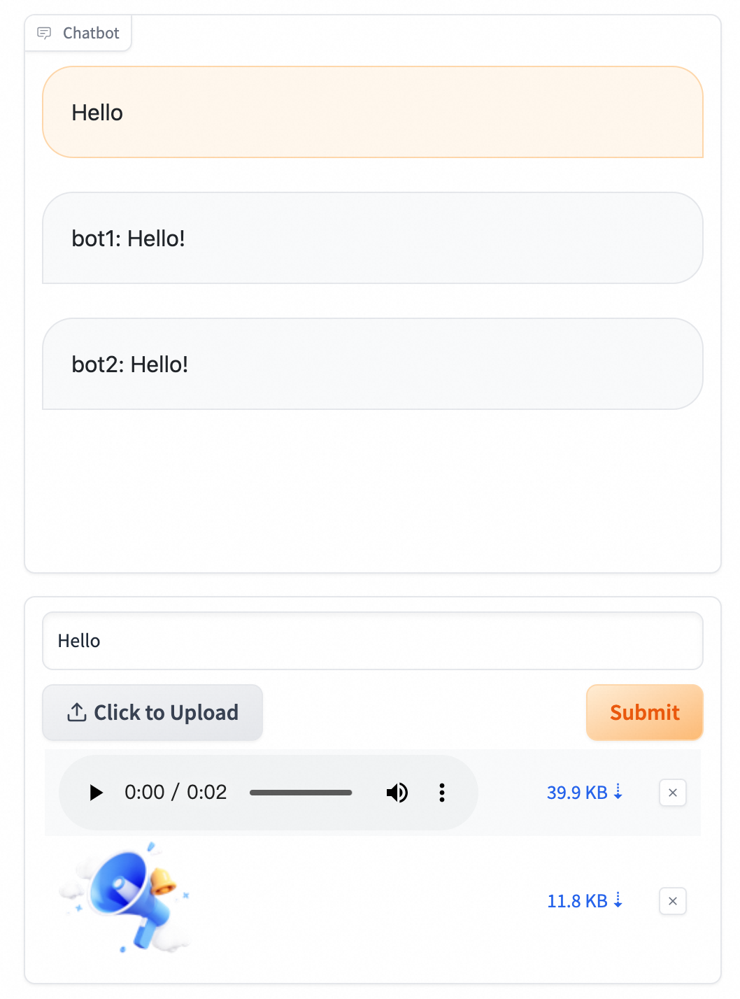

<h1>ModelScope Studio</h1>

<p align="center">
    
    <span style="font-size: 30px; vertical-align: middle;">
    ✖️
    </span>
    
<p>

<p align="center">
<a href="https://github.com/modelscope/modelscope-studio">GitHub</a> | 🤖 <a href="https://modelscope.cn/studios/modelscope/modelscope-studio/summary">ModelScope Studio</a> ｜ 🤗 <a href="https://huggingface.co/spaces/modelscope/modelscope-studio">Hugging Face Space</a>
<br>
  <a href="README-zh_CN.md">中文</a>&nbsp ｜ &nbspEnglish&nbsp ｜ &nbsp<a href="README-ja_JP.md">日本語</a>
</p>

`modelscope_studio` is a set of extension component libraries based on gradio 4.x, dedicated to serving the various extension needs of gradio applications within the ModelScope Studio. It mainly focuses on enhancing conversational scenarios, supporting multimodal contexts, and providing assistance for various other specialized scenarios.

## Install

```sh
pip install modelscope_studio
```

## Quickstart

```python
import time
import gradio as gr
import modelscope_studio as mgr

def submit(_input, _chatbot):
    print('text：', _input.text)
    print('files: ', _input.files)
    _chatbot.append([_input, None])
    yield _chatbot
    time.sleep(1)
    _chatbot[-1][1] = [{
        "flushing": False,
        "text": 'bot1: ' + _input.text + '!'
    }, {
        "text": 'bot2: ' + _input.text + '!'
    }]
    yield {
        chatbot: _chatbot,
    }

with gr.Blocks() as demo:
    chatbot = mgr.Chatbot(height=400)

    input = mgr.MultimodalInput()
    input.submit(fn=submit, inputs=[input, chatbot], outputs=[chatbot])

demo.queue().launch()
```



## Component Docs

The currently supported components include:

- Chatbot: Gradio Chatbot extension component, supports multi-modal content output, multi-bot scenarios, and custom rendering components and event interactions within the conversation content.
- MultimodalInput: A multi-modal input box, supporting functions such as file upload, recording, and photography.
- Markdown: Gradio Markdown extension component, supports the output of multi-modal content (audio, video, voice, files, text).
- Lifecycle: A Lifecycle component for getting the current user's environment information.
- WaterfallGallery: Gradio Gallery extension component, supports waterfall-style image display.
- Flow: A Flow component implemented based on [reactflow](https://reactflow.dev/), supports customization of node rendering through a schema.
- More components...

For detailed usage, see [Documentation and Examples](https://modelscope.cn/studios/modelscope/modelscope-studio/summary)

## Development

Clone this repo locally:

```sh
git clone git@github.com:modelscope/modelscope-studio.git
cd modelscope-studio
# for backend
pip install -e '.'
# for frontend
npm install pnpm -g

pnpm install
pnpm build
```

Run demo!

```sh
gradio docs/app.py
```

or run a single demo like this:

```sh
gradio docs/components/Chatbot/demos/basic.py
```
