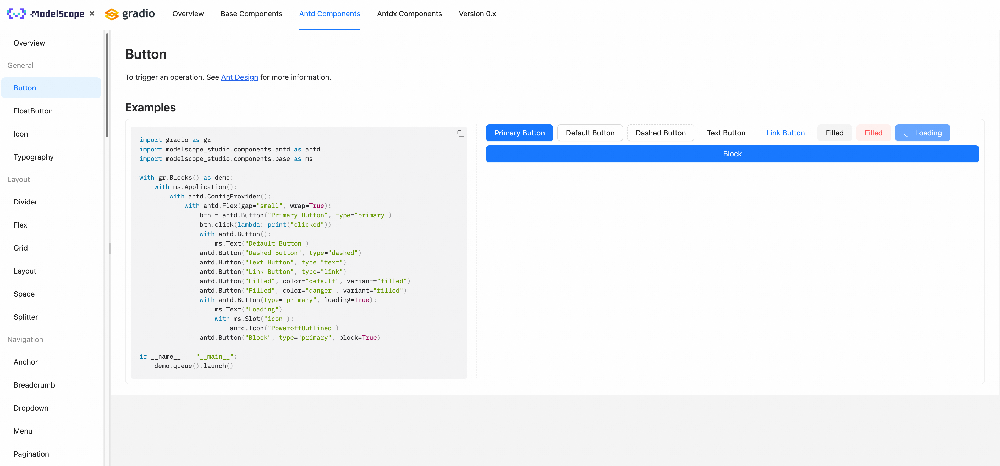

# ModelScope Studio

<p align="center">
    
    <span style="font-size: 30px; vertical-align: middle;">
    ✖️
    </span>
    
<p>

<p align="center">
<a href="https://github.com/modelscope/modelscope-studio">GitHub</a> | 🤖 <a href="https://modelscope.cn/studios/modelscope/modelscope-studio">ModelScope Studio</a> ｜ 🤗 <a href="https://huggingface.co/spaces/modelscope/modelscope-studio">Hugging Face Space</a>
<br>
    <a href="README-zh_CN.md">中文</a>&nbsp ｜ &nbspEnglish&nbsp ｜ &nbsp<a href="README-ja_JP.md">日本語</a>
</p>

`modelscope_studio` is a third-party component library based on Gradio, offers developers more customized interface building capabilities and a richer variety of component usage forms.

Currently supported UI libraries:

- [Ant Design](https://ant.design/)
- [Ant Design X](https://x.ant.design/)



## When to Use

Compared to the original components of Gradio, `modelscope_studio` focuses more on page layout and component flexibility. If you want to build a more beautiful user interface, we highly recommend using `modelscope_studio`.

However, when your application needs Gradio to handle more built-in data on the Python side, the components of `modelscope_studio` may not be the best choice, but don't worry, it integrates well with existing Gradio components, you can still use `modelscope_studio` to optimize your application.

> If you are using `modelscope_studio` in Hugging Face Space, please add the `ssr_mode=False` parameter to the `demo.launch()`: `demo.launch(ssr_mode=False)`, otherwise the page may not display properly.

## Dependencies

- Gradio >= 6.0.0

> Note: Your Gradio version must`<=6.8.0`, [why?](https://github.com/gradio-app/gradio/issues/13131)

## Installation

```sh
pip install modelscope_studio
```

If you need to use `4.43.0 <= Gradio < 6.0.0`, please use 1.x version:

```sh
pip install modelscope_studio~=1.0
```

## Quick Start

```python
import gradio as gr

import modelscope_studio.components.antd as antd
import modelscope_studio.components.base as ms

with gr.Blocks() as demo:
    with ms.Application(), antd.ConfigProvider(), ms.AutoLoading():
        antd.DatePicker()

demo.queue().launch()
```

## Documentation and Examples

- ModelScope: [中文](https://modelscope.cn/studios/modelscope/modelscope-studio)
- Hugging Face: [English](https://huggingface.co/spaces/modelscope/modelscope-studio)

## Wiki

[Link](./.wiki/en)

## Development

Clone this repo locally:

```sh
git clone git@github.com:modelscope/modelscope-studio.git
cd modelscope-studio
# for backend
pip install -e '.'
# for frontend
npm install pnpm -g

pnpm install
pnpm build
```

Run `gradio cc dev` to start demo:

```sh
gradio cc dev docs/app.py
```
